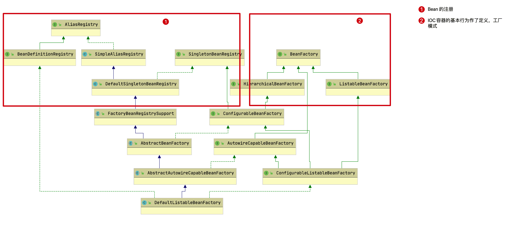

# Spring 


## Spring框架的各个模块


## IOC 

> **IOC(*Inversion of Control*：控制反转)**，是一种设计思想。对象在被创建的时候，由一个调控系统内所有对象的外界实体将其所依赖的对象的引用传递给它。
>
> 在 Spring 中，**IOC容器是 Spring 用来实现 IOC 的载体**。将对象之间的依赖关系交给 IOC 容器来管理，并由 IOC 容器完成对象的注入。这样可以很大程度上简化应用的开发，把应用从复杂的依赖关系中解放出来。IOC 容器就像是一个工厂一样，当需要创建一个对象的时候，只需要配置好配置文件、注解即可，完全不用考虑对象是如何被创建出来的。  

代码示例：           

```java
public interface Engine {
     void turnOn();
}
```

```java
public class ElectricEngine implements Engine {
    @Override
    public void turnOn() {
        System.out.println("电动引擎启动");
    }
}

public class CombustionEngine implements Engine {
    @Override
    public void turnOn() {
        System.out.println("燃油引擎启动");
    }
}
```

```java
public class Car {

    private Engine engine;

    public Car(Engine engine) {
        this.engine = engine;
    }

    public void start() {
        engine.turnOn();
    }
}
```

```java
public class CombustionCar {
    
    private Engine engine;
    
    public CombustionCar() {
        this.engine = new CombustionEngine();
    }
    
    public void start() {
        engine.turnOn();
    }

}

public class ElectricCar {
    private Engine engine;

    public ElectricCar() {
        this.engine = new ElectricEngine();
    }
    
    public void start() {
        engine.turnOn();
    }
    
}
```

```java
/**
 * 老方法
 * 为每一类型发送机的车创建类，然后实现父类car，然后在构造函数传入自己的引擎，然后调用start()
 */
CombustionCar combustionCar1 = new CombustionCar();
combustionCar1.start();
ElectricCar electricCar1 = new ElectricCar();
electricCar1.start();

/**
 * 控制反转思想
 * 把自己看作实例化car的客户端，需要什么引擎，直接传入相关对象
 */
CombustionEngine combustionEngine = new CombustionEngine();
Car combustionCar = new Car(combustionEngine);
combustionCar.start();
ElectricEngine electricEngine = new ElectricEngine();
Car electricCar = new Car(electricEngine);
electricCar.start();
```

从上面的例子我们可以看到，实例化 `Car` 类的客户端可以控制所使用的 `Engine` 实现，并且取决于将哪个 `Engine` 实现传递给 `Car` 构造函数，`Car` 对象的行为发生变化。

### 依赖注入(Dependency Injection)

> 应用程序代码从 IOC 容器中获取依赖的 Bean，注入到应用程序中，这个过程叫**依赖注入(Dependency Injection，DI)** 。 所以说控制反转是通过依赖注入实现的，其实它们是同一个概念的不同角度描述。通俗来说就是 IOC 是设计思想，DI 是实现方式。

在上面控制反转的例子，已经解决了由谁决定使用哪种 `Engine` 实现的问题，但是不可避免的，也更改了实例化一个`Car`对象的步骤。

使用老方法实例化 `Car` 不需要参数，因为在它的构造函数里面已经 `new` 了 `Engine` 对象。使用 `IoC` 方法之后，要求在实例化一个 `Car` 之前，需要先创建一个 `Engine` 对象，并作为参数传递给 `Car` 构造对象。换句话说，老方法首先实例化 `Car` 对象，然后实例化`Engine` 对象。但是使用 `IoC` 之后，首先实例化 `Engine` 对象，然后实例化 `Car` 对象。

因此，在上面的过程中创建了一个依赖关系。不过这种依赖关系不是指编译时候 `Car` 类对 `Engine` 接口的依赖关系，相反，引入了一个运行时依赖关系。在运行时，实例化 `Car` 对象之前，必须首先实例化 `Engine` 对象。

#### 依赖关系树

某一个具体的依赖对象可以理解为 Spring 中的 Bean，对于两个有依赖关系的 Bean，其中被依赖的那个 Bean，称为依赖对象。

用图形化的方式来看看它们之间的依赖关系，其中图形的节点代表对象，箭头代表依赖关系（箭头指向依赖对象）。对于我们我的`Car`类,依赖关系树非常简单：


如果依赖关系树的终端结点还有自己的附加依赖关系，那么这个依赖关系树将变得更加复杂。现在再看上面的例子，如果`CombustionEngine`  还有其他依赖对象，首先需要创建 `CombustionEngine` 的依赖对象，然后才能实例化一个 `CombustionEngine` 对象。这样在创建 `Car` 对象时候，才能将 `CombustionEngine` 传递给 `Car` 的构造函数。

```java
//凸轮轴		
public class Camshaft {}
//机轴
public class Crankshaft {}

public class CombustionEngine implements Engine {

  //凸轮轴
  private Camshaft camshaft
  //机轴
  private Crankshaft crankshaft;

  public CombustionEngine(Camshaft camshaft, Crankshaft crankshaft) {
      this.camshaft = camshaft;
      this.crankshaft = crankshaft;
  }

  @Override
  public void turnOn() {
      System.out.println("燃油引擎启动");
  }
    
}
```

经过改造后，现在的依赖关系树变为下面的样子：


#### 依赖注入框架

随着不断引入更多的依赖关系，这种复杂性将继续增长。为了解决这个复杂问题，需要基于依赖关系树抽取对象的创建过程。这就是依赖注入框架。

一般来说，可以把这个过程分为三个部分:

1. 声明需要创建的对象需要哪些依赖对象
2. 注册创建这些依赖对象所需要的类
3. 提供一种使用1和2两点思想创建对象的机制

通过反射，我们可以查看  `Car`  类的构造函数，并且知道它需要一个  `Engine`  参数。因此为了创建 `Car` 对象，必须创建至少一个`Engine` 接口的实现类用作依赖项来使用。在这里，创建一个 `CombustionEngine`  对象(为了方便，暂时当做只有一个实现类，Bean 冲突问题待会再说)来声明它作为依赖项来使用，就满足`Car`对象创建时的需求。

其实，这个过程是递归的，因为 `CombustionEngine` 依赖于其他对象，我们需要不断重复第一个过程，直到把所有依赖对象声明完毕，然后注册创建这些依赖对象所需要的类。

第三点其实就是将前面两点思想付诸实施，从而形成一种创建对象的机制。

举个例子：比如需要一个 `Car` 对象，必须遍历依赖关系树并检查是否存在至少一个符合条件的类来满足所有依赖关系。 例如，声明`CombustionEngine` 类可满足 `Engine` 节点要求。 如果存在这种依赖关系，将实例化该依赖关系，然后移至下一个节点。

如果有一个以上的类满足所需的依赖关系，那么必须显式声明应该选择哪一种依赖关系。 稍后将讨论 Spring 是如何做到这一点的。

一旦确定所有的依赖关系都准备好了，就可以从终端节点开始创建依赖对象。 对于  `Car`  对象，首先实例化  `Camshaft`  和 `Crankshaft` ーー因为这些对象没有依赖关系ーー然后将这些对象传递给 `CombustionEngine` 构造函数，以实例化 `CombunstionEngine` 对象。 最后，将 `CombunstionEngine` 对象传递给 `Car` 构造函数，以实例化所需的 `Car` 对象。

了解了 `DI` 的基本原理之后，现在可以继续讨论 `Spring`  如何执行 `DI`。

#### ApplicationContext

在 `Spring` 中，框架围绕 `ApplicationContext` 接口实现上一节中概述的三个 DI 职责。通常这个接口代表了一个上下文。 因此，我们通过基于 `Java` 或基于 `XML` 的配置向 `ApplicationContext` 注册合适的类，并从 `ApplicationContext` 请求创建 `Bean` 对象。 然后 `ApplicationContext` 构建一个依赖关系树并遍历它以创建所需的 `Bean` 对象

`Applicationcontext` 中包含的逻辑通常被称为 IOC 容器。 通常，一个 `Spring` 应用程序可以有多个 `ApplicationContext`，每个 `ApplicationContext` 可以有单独的配置。 例如，一个 `ApplicationContext` 可能被配置为使用 `CombustionEngine` 作为其引擎实现，而另一个容器可能被配置为使用 `ElectricEngine` 作为其实现。

在本章中，将重点讨论每个应用程序的单个 `ApplicationContext`，但是下面描述的概念即使在一个应用程序有多个 `ApplicationContext` 实例时也适用。

#### 依赖注入配置

##### 基于Java配置

将 Bean 的创建交给配置类来完成，Spring 只负责维护和管理，采用纯 Java 创建方式。

基于 Java 配置的核心，其实是下面两个注解:

1. `@Configuration`: 定义配置类；
2. `@Bean`: 创建一个 `Bean`。

例如，给出之前定义的 `Car`, `CombustionEngine`, `Camshaft`, 和`Crankshaft` 类，可以创建一个下面的配置类:

```java
@Configuration
public class AnnotationConfig {
    
    @Bean
    public Car car(Engine engine) {
        return new Car(engine);
    }

    @Bean
    public Engine engine(Camshaft camshaft, Crankshaft crankshaft) {
        return new CombustionEngine(camshaft, crankshaft);
    }

    @Bean
    public Camshaft camshaft() {
        return new Camshaft();
    }

    @Bean
    public Crankshaft crankshaft() {
        return new Crankshaft();
    }
}
```

接下来，创建一个 `ApplicationContext` 对象，从 `ApplicationContext` 对象获取一个 `Car` 对象，然后在创建的 `Car` 对象上调用 `start` 方法：

```java
ApplicationContext context = new AnnotationConfigApplicationContext(AnnotationConfig.class);
Car car = context.getBean(Car.class);
car.start(); // Started combustion engine
```

虽然 `@Configuration` 和 `@Bean` 注解的组合为 `Spring`  提供了足够的信息来执行依赖注入，但我们仍然需要手动手动定义每个将被注入的 `Bean`，并显式地声明它们的依赖关系。 为了减少配置 `DI` 框架所需的开销，Spring 提供了基于`Java`的自动配置。

##### 注解配置

通过在类上加注解的方式，来声明一个类作为 Bean 交给 Spring 管理，Spring 会自动扫描带有 `@Component`，`@Controller`，`@Service`，`@Repository` 这四个注解的类，然后自动创建并管理，前提是需要先配置 Spring 的注解扫描器。

以下是三个最基本的注解：

1. `@Component`: 注册为由 Spring 管理的类；
2. `@Autowired`: 指示 Spring 注入一个依赖对象；
3. `@ComponentScan`: 指示 Spring 在何处查找带有 `@Component` 注解的类。

#### 依赖注入方式

##### 构造函数注入

> 如果类仅有一个构造函数，可以不使用 `@Autowired` 来标记构造函数，但是如果类中有多个构造函数，则默认会优先选择无参构造函数。

`@Autowired` 注解用来指导 Spring ，在使用注解的位置注入一个依赖对象。 例如，在 `Car` 构造函数中，期望注入一个 `Engine` 对象，因此，给 `Car` 构造函数添加 `@Autowired` 注解。 通过使用 `@Component` 和 `@Autowired` 注解改造 `Car`类，如下所示：

```java
@Component
public class Car {
      private Engine engine;

      @Autowired
      public Car(Engine engine) {
          this.engine = engine;
      }

      public void start() {
          engine.turnOn();
      }
}
```

可以在其他类中重复这个过程：

```java
@Component
public class Camshaft {}

@Component
public class Crankshaft {}

@Component
public class CombustionEngine implements Engine {
    private Camshaft camshaft;
    private Crankshaft crankshaft;

    @Autowired
    public CombustionEngine(Camshaft camshaft, Crankshaft crankshaft) {
        this.camshaft = camshaft;
        this.crankshaft = crankshaft;
    }

    @Override
    public void turnOn() {
     System.out.println("Started combustion engine");
    }
}
```

改造完成相关类之后，需要创建一个 `@Configuration` 类来指导 Spring 如何自动配置应用程序。 对于基于 Java 的基本配置，明确指示 Spring 如何使用 `@Bean` 注解创建每个 Bean，但在自动配置中，已经通过 `@Component` 和 `@Autowired` 注解提供了足够的信息，说明如何创建所需的所有 Bean。 唯一缺少的信息是 Spring 应该在哪里寻找带有 `@Component` 注解的类，并把它注册为对应的 Bean。

`@Componentscan` 注释包含一个参数 `basePackages`，它允许将包名称指定为一个 `String`，Spring 将通过递归搜索来查找 `@Component` 类。 在示例中，包是 `com.xiao.demo.domain`，因此，得到的配置类是:

```java
@Configuration
@ComponentScan(basePackages = "com.xiao.demo.domain")
public class AutomatedAnnotationConfig {}
```

```java
ApplicationContext context = new AnnotationConfigApplicationContext(AutomatedAnnotationConfig.class);
Car car = context.getBean(Car.class);   
car.start();
```

通过和基于 `Java` 的基础配置比较，发现基于 `Java` 的自动配置方法有两个主要优点:

1. 所需的配置要简洁得多
2. 注解直接应用于类，而不是在配置类

所以无特殊情况时，自动配置是首选。

##### 字段注入

除了构造函数注入，还可以通过字段直接注入。可以将 `@Autowired` 注解应用到所需的字段来实现这一点：

```java
@Component
public class Car {

    @Autowired
    private Engine engine;

    public void start() {
    	engine.turnOn();
    }
}
```

这种方法极大地减少了编码压力，但是它也有一个缺点，就是在使用字段之前，无法检查自动注入的对象是否为空。

##### Setter注入

构造函数注入的最后一种替代方法是 `setter` 注入，其中 `@Autowired` 注解应用于与字段关联的 `setter`。 例如，可以改变 `Car` 类，通过 `setter` 注入获得 `Engine` 对象，方法是用 `@Autowired` 注解 `setEngine` 方法：

```java
@Component
public class Car {
    private Engine engine;

    public void start() {
    	engine.turnOn();
    }

    public Engine getEngine() {
    	return engine;
    }

    @Autowired
    public void setEngine(Engine engine) {
    	this.engine = engine;
    }
}
```

Setter 注入类似于字段注入，但它允许与注入对象交互。 在有些情况下，`setter` 注入可能特别有用，例如具有循环依赖关系，但 Setter 注入可能是三种注入技术中最不常见的，尽可能优先使用构造函数注入。

#### 常见问题

现在已经摸清了 Spring 框架如何进行 `DI`，并正确地将所有依赖关系注入到应用程序中，但是必须处理两个棘手的问题：

1. 依赖对象冲突
2. 依赖对象间存在循环依赖

##### 具有多个符合条件的依赖对象

在基于 `Java` 的方法中，已经指示 `Spring` 只使用 `CombustionEngine` 作为 `Engine` 实现。 如果将 `ElectricEngine` 注册为符合 DI 标准的部件会发生什么？ 为了测试结果，将修改基于 `Java` 的自动配置示例，并用 `@Component` 注解 `ElectricEngine` 类：

```java
@Component
public class ElectricEngine implements Engine {

    @Override
    public void turnOn() {
    	System.out.println("Started electric engine");
    }
}
```

如果重新运行基于 Java 的自动配置应用程序，会看到以下错误：

```shell
No qualifying bean of type 'com.xiao.demo.domain.Engine' available: expected single matching bean but found 2: combustionEngine,electricEngine
```

由于已经注释了用 `@Component` 实现 `Engine` 接口的两个类ーー即 `CombustionEngine` 和 `ElectricEngine` ーー Spring 现在无法确定在实例化 `Car` 对象时应该使用这两个类中的哪一个来满足 `Engine` 依赖性。 为了解决这个问题，必须明确地指示 Spring 使用这两个 Bean 中的哪一个。

###### @ Qualifier 

一种方法是给依赖对象命名，并在应用 `@Autowired` 注解的地方使用 `@Qualifier` 注解来确定注入哪一个依赖对象。所以，`@Qualifier` 注解限定了自动注入的 Bean，从而将满足需求的 Bean 数量减少到一个。 例如，可以命名 `CombustionEngine` 依赖对象：

```java
@Component("defaultEngine")
public class CombustionEngine implements Engine {
    // ...existing implementation unchanged...
}
```

然后可以添加 `@Qualifier` 注解，其名称和想要注入的依赖对象的名称保持一致，这样 `Engine` 对象在 `Car` 构造函数中被自动注入。

```java
@Component
public class Car {

  @Autowired
  public Car(@Qualifier("defaultEngine") Engine engine) {
      this.engine = engine;
  }

  // ...existing implementation unchanged...
}
```

再次运行应用程序，发现不再报之前的错误，成功运行：

```java
Started combustion engine
```

注意，如果没有显式声明 Bean 名称的类都有一个默认名称，该默认名称就是类名首字母小写。 例如， `Combusttionengine` 类的默认名称是 `combusttionengine`。

###### @ Primary

如果确定了默认情况下优先使用实现，那么可以放弃 `@Qualifier` 注释，直接将 `@Primary` 注释添加到类中。例如，可以将`Combusttionengine`、 `ElectricEngine` 和 `Car` 类更改为：

```java
@Component
@Primary
public class CombustionEngine implements Engine {
   	// ...existing implementation unchanged...
}

@Component
public class ElectricEngine implements Engine {
    // ...existing implementation unchanged...
}

@Component
public class Car {

    @Autowired
    public Car(Engine engine) {
    	this.engine = engine;
    }
 	// ...existing implementation unchanged...
}
```

再次运行应用程序，也不再报之前的错误，成功运行：

```shell
Started combustion engine
```

这证明，虽然有两种可能性满足 `Engine` 依赖性，即 `CombustionEngine` 和 `Electricengine`，但 Spring 能够根据 `@Primary` 注释决定两种实现中哪一种应该优先使用。

##### 循环依赖

虽然已经深入讨论了 `Spring DI` 的基础知识，但是还有一个主要问题没有解决：如果依赖关系树有一个循环引用会发生什么？例如，假设创建了一个 `Foo` 类，它的构造函数需要一个 `Bar` 对象，但是 `Bar` 构造函数需要一个 `Foo` 对象。


使用代码实现上面问题：

```java
@Component
public class Foo {
    private Bar bar;

    @Autowired
    public Foo(Bar bar) {
		this.bar = bar;
    }
}

@Component
public class Bar {
    private Foo foo;

    @Autowired
    public Bar(Foo foo) {
    	this.foo = foo;
    }
}
```

然后定义以下配置：

```java
@Configuration
@ComponentScan(basePackageClasses = Foo.class)
public class Config {}
```

最后创建 `ApplicationContext`：

```java
ApplicationContext context = new AnnotationConfigApplicationContext(Config.class);
Foo foo = context.getBean(Foo.class);
```

当执行这个代码片段时，出现以下错误：

```shell
Unsatisfied dependency expressed through constructor parameter 0; nested exception is org.springframework.beans.factory.BeanCurrentlyInCreationException: Error creating bean with name 'bar': Requested bean is currently in creation: Is there an unresolvable circular reference?
```

首先，`Spring` 尝试创建 `Foo` 对象。 在这个过程中，`Spring` 认识到需要一个 `Bar` 对象。 为了构造 `Bar` 对象，需要一个 `Foo` 对象。 由于 `Foo` 对象目前正在构建中(这也是创建 Bar 对象的原因) ，`spring` 认识到可能发生了循环引用。

这个问题最简单的解决方案之一是在一个类和注入点上使用 `@Lazy` 注解。 这指示 Spring 推迟带注解的 Bean 和带注释的 `@Autowired` 位置的初始化。 这允许成功地初始化其中一个 Bean，从而打破循环依赖链。 理解了这一点，我们可以改变 `Foo` 和 `Bar` 类：

```java
@Component
public class Foo {
	private Bar bar;

    @Autowired
    public Foo(@Lazy Bar bar) {
    	this.bar = bar;
    }
}

@Component
@Lazy
public class Bar {

  @Autowired
  public Bar(Foo foo) {}
}
```

如果使用 `@Lazy` 注解后重新运行应用程序，没有发现报告任何错误。

### BeanFactory

BeanFactory，以 Factory 结尾，表示它是一个工厂(接口)， 它负责生产和管理 Bean 的一个工厂。在 Spring 中，BeanFactory 是工厂的顶层接口，也是 IOC 容器的核心接口，因此 BeanFactory 中定义了管理Bean的通用方法，如 `getBean` 和 `containsBean` 等，它的职责包括：实例化、定位、配置应用程序中的对象及建立这些对象间的依赖。BeanFactory 只是个接口，并不是 IOC容器的具体实现，所以Spring 容器给出了很多种实现，如 `DefaultListableBeanFactory`、`XMLBeanFactory`、`ApplicationContext` 等，其中 `XMLBeanFactory`就是常用的一个，该实现将以 XML 方式描述组成应用的对象及对象间的依赖关系。

#### BeanFactory 源码

```java
public interface BeanFactory {
	//对FactoryBean的转义定义，因为如果使用bean的名字检索FactoryBean得到的对象是工厂生成的对象，
	//如果需要得到工厂本身，需要转义
	String FACTORY_BEAN_PREFIX = "&";
	//根据Bean的名字，获取在IOC容器中得到Bean实例
	Object getBean(String name) throws BeansException;
	//根据Bean的名字和Class类型来得到Bean实例，增加了类型安全验证机制。
	<T> T getBean(String name, @Nullable Class<T> requiredType) throws BeansException;
	Object getBean(String name, Object... args) throws BeansException;
	<T> T getBean(Class<T> requiredType) throws BeansException;
	<T> T getBean(Class<T> requiredType, Object... args) throws BeansException;
	//提供对Bean的检索，看看是否在IOC容器有这个名字的Bean
	boolean containsBean(String name);
	//根据Bean名字得到Bean实例，并同时判断这个Bean是不是单例
	boolean isSingleton(String name) throws NoSuchBeanDefinitionException;
	boolean isPrototype(String name) throws NoSuchBeanDefinitionException;
	boolean isTypeMatch(String name, ResolvableType typeToMatch) throws NoSuchBeanDefinitionException;
	boolean isTypeMatch(String name, @Nullable Class<?> typeToMatch) throws NoSuchBeanDefinitionException;
	//得到Bean实例的Class类型
	@Nullable
	Class<?> getType(String name) throws NoSuchBeanDefinitionException;
	//得到Bean的别名，如果根据别名检索，那么其原名也会被检索出来
	String[] getAliases(String name);
}
```

#### BeanFactory 与ApplicationContext的关系

日常工作中我们常常将 BeanFactory 称为容器，而将 ApplicationContext 称为上下文。BeanFactory 提供了配置框架和基本功能，ApplicationContext 增加了更多针对企业的功能。ApplicationContext 是 BeanFactory 的一个完整的超集，二者是一个包含与被包含的关系。

```java
@Component
public class SpringIoc implements BeanFactoryAware, ApplicationContextAware {

    private BeanFactory beanFactory;

    @Override
    public void setBeanFactory(BeanFactory beanFactory) throws BeansException {
        this.beanFactory = beanFactory;
    }

    @Override
    public void setApplicationContext(ApplicationContext applicationContext)
            throws BeansException {
        // 获取ApplicationContext中的BeanFactory对象
        AutowireCapableBeanFactory factory = applicationContext.getAutowireCapableBeanFactory();  				
        System.out.println(factory.getClass().getName());
        // org.springframework.beans.factory.support.DefaultListableBeanFactory
        System.out.println(beanFactory.getClass().getName());
        // org.springframework.beans.factory.support.DefaultListableBeanFactory
        System.out.println(factory == beanFactory);// true
    }
}
```

**DefaultListableBeanFactory对象的生成**

```java
public class AnnotationConfigApplicationContext extends GenericApplicationContext implements AnnotationConfigRegistry {
    public AnnotationConfigApplicationContext(Class<?>... annotatedClasses) {
        this();
        register(annotatedClasses);
        refresh();
    }
}
```

```java
public class GenericApplicationContext extends AbstractApplicationContext implements BeanDefinitionRegistry {
    private final DefaultListableBeanFactory beanFactory;
    public GenericApplicationContext() {
        this.beanFactory = new DefaultListableBeanFactory();
    }
}
```

因为 `AnnotationConfigApplicationContext` 继承了 `GenericApplicationContext`，所以父类的的构造方法也会同时调用，容器对象就在此时诞生。

然后 `refresh()` 调用 `obtainFreshBeanFactory`：

```java
protected ConfigurableListableBeanFactory obtainFreshBeanFactory() {
    refreshBeanFactory();
    return getBeanFactory();
}
```

`getBeanFactory()` 是 `AbstractApplicationContext` 定义的抽象方法，又由 `GenericApplicationContext` 实现。

```java
public final ConfigurableListableBeanFactory getBeanFactory() {
    return this.beanFactory;
}
```

这里其实就是将自己构造方法产生的对象返回给 `AnnotationConfigApplicationContext`。`ApplicationContext` 之所以有 Beanfactory 能力就是因为有关容器的操作他都委托给自己内部的容器对象了。例如：

```java
public <T> T getBean(String name, Class<T> requiredType) throws BeansException {
    assertBeanFactoryActive();
    return getBeanFactory().getBean(name, requiredType);
}
```

这里实际上并没有对此方法有详细的实现，而是通过 `getBeanFactory()` 获取自身内部的容器对象，然后交由其实现，这里使用了组合模式。

### IOC 加载过程

IOC 的整个加载过程如下图：


1、首先，通过 `BeanDefinitionReader` 读取指定的配置文件生成 Bean 的定义信息，然后得到完整的 Bean 定义信息(`BeanDefinition` 对象)，注意这里只是存储 Bean 的定义信息，还没有实例化 Bean 对象；就像工厂里面一样，原材料已经准备好了，但是还没有进行生产，原材料就是 `BeanDefinition`，生产就是实例化。

2、在 `BeanDefinition` 和完整 `BeanDefinition` 中间通过一个后置增强器，可以对 Bean 的定义信息进行统一修改，只需要实现 `BeanFactoryPostProcessor` 接口即可，这个后置增强器是可以有多个的，只要在不同的类实现多个 `BeanFactoryPostProcessor` 接口就会执行多次，就像这样：

```java
@Component
public class ExtBeanFactoryPostProcessor implements BeanFactoryPostProcessor {
    @Override
    public void postProcessBeanFactory(ConfigurableListableBeanFactory beanFactory) throws BeansException {
//        BeanDefinition studentService = beanFactory.getBeanDefinition("studentService");
        System.out.println("扩展方法--可进行修改beanDefinition的定义信息");
    }
}
```

3、得到完整 `BeanDefinition` 之后就可以进行创建对象了，这整个过程被称为 Bean 的生命周期，也就是从实例化到销毁的过程。

#### Bean的生命周期

在传统的 Java 应用中，Bean的生命周期很简单，使用 Java 关键字 `new` 进行 Bean 的实例化，然后该 Bean 就能够使用了。一旦 Bean不再被使用，则由 Java 自动进行垃圾回收。

相比之下，Spring 管理 Bean 的生命周期就复杂多了，正确理解 Bean 的生命周期非常重要，因为 Spring 对 Bean 的管理可扩展性非常强，下面展示了一个 Bean 的构造过程：


但其实，它的内部蕴含了很多东西，细化后的流程图为：


其中 1、3、4 在同一个接口里面的，实现 `InstantiationAwareBeanPostProcessor` 接口即可：

```java
@Component
public class MyInstantiationAwareBeanPostProcessor implements InstantiationAwareBeanPostProcessor {
 
    // 实例化前置
    @Override
    public Object postProcessBeforeInstantiation(Class<?> beanClass, String beanName) throws BeansException {
        System.out.println("postProcessBeforeInstantiation被调用了----在对象实例化之前调用-----beanName:" + beanName);
        // 默认什么都不做，返回null
        return null;
    }
 
    // 实例化后置
    @Override
    public boolean postProcessAfterInstantiation(Object bean, String beanName) throws BeansException {
        System.out.println("postProcessAfterInstantiation被调用了---------beanName:" + beanName);
        //默认返回true，什么也不做，继续下一步
        return true;
    }
    
    // 属性修改
    @Override
    public PropertyValues postProcessPropertyValues(PropertyValues pvs, PropertyDescriptor[] pds, Object bean, String beanName) throws BeansException {
        System.out.println("postProcessPropertyValues被调用了---------beanName:"+beanName);
        // 此方法可对bean中的属性值进行、添加、修改、删除操作；
        // 对属性值进行修改，如果postProcessAfterInstantiation方法返回false，该方法可能不会被调用，
        return pvs;
    }
}
```

##### 1、实例化前置

实例化前置使用的是 `postProcessBeforeInstantiation` 方法，方法里有2个参数，分别是`beanClass` 和 `beanName`，顾名思义，就是对在对象实例化之前对 Bean 对象的 class 信息进行修改或者扩展，以达到想要的功能，它的底层是动态代理 AOP 技术实现的，且是  Bean 生命周期中最先执行的方法。

返回非空：返回值是 `Object` 类型，这意味着可以返回任何类型的值，由于这个时候目标对象还未实例化，所以这个返回值可以用来代替原本该生成对象的目标对象的实例，也就是说，如果返回了非空的值，那么以后需要用到这个 Bean 的时候，拿到的就现在返回的对象了，也就不会去走第二步去实例化对象了。

返回空（null）值：默认也是返回 `null` 值的，那么就直接返回，接下来会调用 `doCreateBean` 方法来实例化对象。

##### 2、实例化对象

`doCreateBean` 方法创建实例，用反射创建，这个没什么好说的，只是相当于 `new` 了一个对象出来而已，但需要注意的是，这个时候只是将对象实例化了，对象内的属性还未设置。

##### 3、实例化后置

方法名称：`postProcessAfterInstantiation`

在目标对象实例化之后调用，这个时候对象已经被实例化，但是该实例的属性还未被设置，都是 `null`。因为他的返回值是决定要不要调用 `postProcessPropertyValues` 方法中的一个因素(还有一个因素是 `mbd.getDependencyCheck()`)。

返回 `false` ：如果该方法返回 `false`，并且不需要 check，那么 `postProcessPropertyValues` 就会被忽略不执行。

返回 `true` ： 如果返回 `true`，`postProcessPropertyValues` 就会被执行。

##### 4、属性修改

方法名称 ：`postProcessPropertyValues`

此方法可对属性值进行修改，修改范围包括添加、修改、删除操作。如果实例化后置 `postProcessAfterInstantiation` 方法返回`false`，那么该方法不会被调用。

##### 5、给用户属性赋值

用户属性指的是用 Spring 的自定义的 Bean 对象属性，第5步主要给这类属性进行赋值操作，使用的是 `AbstractAutowireCapableBeanFactory.populateBean` 方法进行赋值。

##### 6、给容器属性赋值

容器属性其实就是容器自带的属性，这些属性都是 Spring本来就有的。可以肯定的是，它们都是 `Aware` 接口的实现类，主要有以下实现类，以下是它们的执行顺序：


> **Bean Aware**
>
> 在 Spring 中提供了一些以 `Aware` 结尾的接口，实现了 `Aware` 接口的 Bean 在被初始化之后，可以获取相应资源。Spring 容器会在 Bean 被加载时，根据类实现的 `Aware` 接口，调用类中实现的对应感知方法。

```java
@Component
public class AllAwareInterface  implements BeanNameAware, BeanClassLoaderAware,
        BeanFactoryAware, EnvironmentAware, EmbeddedValueResolverAware,
        ResourceLoaderAware, ApplicationEventPublisherAware, MessageSourceAware,
        ApplicationContextAware, ServletContextAware, LoadTimeWeaverAware, ImportAware {
 
    @Override
    public void setBeanName(String name) {
        // 这个方法只是简单的返回当前的beanName，官方的意思是这个接口更多的使用在spring的框架代码中，实际开发环境不建议使用
        System.out.println("1 我是 BeanNameAware 的 setBeanName 方法  ---参数：name，内容："+ name);
    }
    @Override
    public void setBeanClassLoader(ClassLoader classLoader) {
        // 获取Bean的类装载器
        System.out.println("2 我是 BeanClassLoaderAware 的 setBeanClassLoader 方法");
    }
    @Override
    public void setBeanFactory(BeanFactory beanFactory) throws BeansException {
        // 获取bean工厂，beanFactory可以不依赖注入方式，随意的读取IOC容器里面的对象，不过beanFactory本身还是要注入的
        // 需要注意的是，一般情况下都用@Component注解，如果使用@Configuration注解的话，setBeanFactory方法会执行2次
        System.out.println("3 我是 BeanFactoryAware 的 setBeanFactory 方法");
    }
    @Override
    public void setEnvironment(Environment environment) {
        // 在工程启动时可以获得application.properties 、XML、yml 的配置文件配置的属性值
        System.out.println("4 我是 EnvironmentAware 的 setEnvironment 方法");
    }
    @Override
    public void setEmbeddedValueResolver(StringValueResolver stringValueResolver) {
        // 通常使用@Value注解来获取properties和yml文件中的值，每个类中都要使用@Value也很繁琐，实现EmbeddedValueResolverAware接口后就方便多了。用法也跟@Value一样，需要用${}包裹住
        // System.out.println(stringValueResolver.resolveStringValue("${logging.file}"));
        System.out.println("5 我是 EmbeddedValueResolverAware 的 setEmbeddedValueResolver 方法");
    }
    @Override
    public void setResourceLoader(ResourceLoader resourceLoader) {
        System.out.println("6 我是 ResourceLoaderAware 的 setResourceLoader 方法");
    }
    @Override
    public void setApplicationEventPublisher(ApplicationEventPublisher applicationEventPublisher) {
        System.out.println("7 我是 ApplicationEventPublisherAware 的 setApplicationEventPublisher 方法");
    }
    @Override
    public void setMessageSource(MessageSource messageSource) {
        // 国际化消息通知操作
        System.out.println("8 我是 MessageSourceAware 的 setMessageSource 方法");
    }
    @Override
    public void setApplicationContext(ApplicationContext applicationContext) throws BeansException {
        System.out.println("9 我是 ApplicationContextAware 的 setApplicationContext 方法");
    }
    @Override
    public void setServletContext(ServletContext servletContext) {
        System.out.println("10 我是 ServletContextAware 的 setServletContext 方法");
    }
    @Override
    public void setLoadTimeWeaver(LoadTimeWeaver loadTimeWeaver) {
        System.out.println("11 我是 LoadTimeWeaverAware 的 setLoadTimeWeaver 方法");
    }
    @Override
    public void setImportMetadata(AnnotationMetadata annotationMetadata) {
        //只有被其他配置类 @Import(XX.class) 时才会调用，这个调用对XX.class中的所有@Bean来说顺序是第1位的
        System.out.println("12 我是 ImportAware 的 setImportMetadata 方法");
    }
}
```

###### ResourceLoaderAware.setResourceLoader()

Spring ResourceLoader 提供了一个统一的 `getResource()` 方法来通过资源路径检索外部资源。从而将资源或文件(例如文本文件、XML文件、属性文件或图像文件)加载到 Spring 应用程序上下文中的不同实现，简单说就是用来加载外部资源的。方法中有个参数：`ResourceLoader `，这个参数其实就是 `ApplicationContext`(spring 的上下文对象)，可直接强转。并且可以指定不同的前缀来创建路径以从不同位置加载资源：

|    前缀    |              示例              |              说明              |
| :--------: | :----------------------------: | :----------------------------: |
| classpath: | classpath:com/myapp/config.XML |          从类路径加载          |
|   file:    |    file:///data/config.XML     |     从文件系统作为URL加载      |
|   http:    |  https://myserver/config.XML   |           从URL加载            |
|   (none)   |        /data/config.XML        | 取决于底层的ApplicationContext |

###### ApplicationEventPublisherAware.setApplicationEventPublisher()

`ApplicationEventPublisherAware` 是一个事件发布器的接口，使用这个接口，自己的 Service 就拥有了发布事件的能力。用户注册后，不再是显示调用其他的业务 Service，而是发布一个用户注册事件。那么在这里是发布事件，那就肯定有监听事件的接口，这个接口叫做 `ApplicationListener`，只要实现 `ApplicationListener` 接口就可以接受发布的事件了。接下来写一个示例来模拟发布事件和监听事件。

先创建一个实体类，用来存储发布的事件内容 ：

```java
public class StringEvent extends ApplicationEvent {
 
    private String str;
    // 构造函数
    public StringEvent(Object source) {
        super(source);
        str = source.toString();
    }
    // 获取字符串
    public String getStr(){
        return str;
    }
}
```

创建一个发布事件的类：`ExtApplicationEventPublisherAware`，实现 `ApplicationEventPublisherAware` 接口增加发布事件的功能：

```java
@Component
public class ExtApplicationEventPublisherAware implements ApplicationEventPublisherAware {
    @Override
    public void setApplicationEventPublisher(ApplicationEventPublisher applicationEventPublisher) {
        System.out.println("发布事件，事件对象为 StringEvent ，内容为 ：1234");
        StringEvent stringEvent = new StringEvent("1234");
        // 发布事件，发布后会在 ApplicationListener.onApplicationEvent()方法进行捕获；
        applicationEventPublisher.publishEvent(stringEvent); 
    }
}
```

再创建一个事件监听器：`EventListener` ，用来监听所有发布的事件：

```java
@Component
public class EventListener implements ApplicationListener<StringEvent> {
 
    @Override
    public void onApplicationEvent(StringEvent o) {
        System.out.println("监听到事件，内容："+o.getStr());
    }
}
```

运行 Spring 项目，输出内容如下，此时事件的发布和监听完成：

```shell
监听到事件，内容：1234
```

###### ApplicationContextAware.setApplicationContext()

`ApplicationContextAware` 主要用来全局获取 `ApplicationContext` 上下文，`ApplicationContext` 其实就是容器，为此可以实现 `ApplicationContextAware` 接口来获取 `ApplicationContext` 容器对象，可以把它做成一个公共的静态类，这样就可以在任意地方随时获取了：

```java
@Component
public class ExtApplicationContextAware implements ApplicationContextAware {
 
    /**
     * Spring容器会在加载完Spring容器后调用ApplicationContextAware.setApplicationContext方法
     * ApplicationContextAware主要用来全局获取ApplicationContext上下文
     */
    private static ApplicationContext applicationContext;
 
    @Override
    public void setApplicationContext(ApplicationContext applicationContext) throws BeansException {
        if (ExtApplicationContextAware.applicationContext == null) {
            ExtApplicationContextAware.applicationContext = applicationContext;
        }
        System.out.println("========ApplicationContext配置成功========");
        System.out.println("========在普通类可以通过调用SpringBootBeanUtil.getApplicationContext()获取applicationContext对象========");
        System.out.println("========applicationContext="+ ExtApplicationContextAware.applicationContext +"========");
    }
 
    /**
     * 获取applicationContext
     * @return
     */
    public static ApplicationContext getApplicationContext() {
        return applicationContext;
    }
 
    /**
     * 通过name获取Bean.
     * @param name
     * @return
     */
    public static Object getBean(String name) {
        return getApplicationContext().getBean(name);
    }
 
    /**
     * 通过class获取Bean.
     * @param clazz
     * @return
     */
    public static <T> T getBean(Class<T> clazz) {
        return getApplicationContext().getBean(clazz);
    }
 
    /**
     * 通过name,以及Clazz返回指定的Bean
     * @param name
     * @param clazz
     * @return
     */
    public static <T> T getBean(String name, Class<T> clazz) {
        return getApplicationContext().getBean(name, clazz);
    }
}
```

当然，也可以直接注入，就像这样：

```java
@Autowired
private ApplicationContext applicationContext;
```

###### ServletContextAware.setServletContext()

什么是 `ServletContext` ：WEB容器在启动时，它会为每个WEB应用程序都创建一个对应的 `ServletContext` 对象，它代表当前 WEB 应用。`ServletConfig` 对象中维护了 `ServletContext` 对象的引用，开发人员在编写 Servlet 时，可以通过 `ServletConfig.getServletContext()` 方法获得 ServletContext 对象。

由于一个 WEB 应用中的所有 Servlet 共享同一个 `ServletContext` 对象，因此 Servlet 对象之间可以通过 `ServletContext` 对象来实现通讯。`ServletContext` 对象通常也被称之为 `context` 域对象。

###### LoadTimeWeaverAware.setLoadTimeWeaver()

`LoadTimeWeaver`， 简称 LTW，LTW 是 AOP 的一种实现方式，此方法是为了获取 AOP 织入的对象，使用的织入方式是：类加载期织入，一般的 AOP 都是运行期织入，就是在运行的时候才进行织入切面方法，但是 LTW 是在类加载前就被织入了，也就是 class 文件在JVM 加载之前进行织入切面方法只有在使用 `@EnableLoadTimeWeaving` 或者存在 `LoadTimeWeaver` 实现的 Bean 时才会调用，顺序也很靠后。

##### 7、初始化前置、初始化后置

方法名称：`BeanPostProcessor.postProcessAfterInitialization()、postProcessAfterInitialization()`

在每一个 Bean 初始化之后执行的方法（有多少 Bean 调用多少次）。

初始化前置和初始化后置的实现代码如下：

```java
@Component
public class ExtBeanPostProcessor implements BeanPostProcessor {
    @Override
    public Object postProcessBeforeInitialization(Object bean, String beanName) throws BeansException {
        System.out.println("初始化前置方法");
        return null;
    }
    @Override
    public Object postProcessAfterInitialization(Object bean, String beanName) throws BeansException {
        System.out.println("初始化后置方法");
        return null;
    }
}
```

##### 8、执行初始化方法

初始化方法有三个，分别是添加了 `@PostConstruct` 注解的方法、实现 `InitializingBean` 接口、在 `@Bean` 注解上添加 `initMethod` 属性。

###### 初始化方法一：@PostConstruct

在 Bean 对象内添加 `@PostConstruct` 注解后即可实现初始化的功能，被 `@PostConstruct` 修饰的方法会在构造函数之后，`init()` 方法之前运行，有多个则会执行多次。

代码示例：

```java
@Component
public class ExtPostConstruct {
    @PostConstruct
    public void init1() {
    	System.out.println("第一个init...");
    }
    // 有多个会执行多次
    @PostConstruct
    public void init2() {
    	System.out.println("第二个init...");
    }
}
```

###### 初始化方法二：InitializingBean.afterPropertiesSet()

Spring 初始化方法之一，作用是在 `BeanFactory` 完成属性设置之后，执行自定义的初始化行为。

执行顺序：在 `initMethod` 之前执行，在 `@PostConstruct` 之后执行。

代码示例：

```java
@Component
public class ExtInitializingBean implements InitializingBean {
    @Override
    public void afterPropertiesSet() throws Exception {
        System.out.println("InitializingBean");
    }
}
```

###### 初始化方法三：init-method

`@Bean` 注解属性 `initMethod` 用于在 Bean 初始化时指定执行方法，用来替代 `InitializingBean` 接口。

> 注意：只有一个完整的实例被创建出来后，才能运行初始化方法。

示例代码：

```java
public class User {
    // 将要执行的初始化方法
    public void userInitMethod(){
        System.out.println("我是BeanTest的init方法");
    }
}
```

```java
@Configuration
public class MainConfig  {
    // 在@Bean注解上添加initMethod属性，指向类中的userInitMethod执行初始化方法
    @Bean(initMethod = "userInitMethod")
    public User getUser(){
        return new User();
    }
}
```

##### 9、使用中

此时，Bean 已经准备就绪，可以被应用程序使用了。它们将一直驻留在应用上下文中，直到应用上下文被销毁。

##### 10、销毁

在这里需要先说明一下，被 IOC 容器管理的 Bean 默认是单例的。

如果需要设置成多例，只需为 `@Bean` 注释的类添加 `@Scope(ConfigurableBeanFactory.SCOPE_PROTOTYPE)` 即可，多例模式也叫原型模式，它底层不是重新创建一个 Bean 对象，而是使用深拷贝技术实现的。

为什么要介绍单例和多例呢？ 因为销毁流程的走向就与是单例还是多例有关。

如果是单例模式，会先执行 `DisposableBean.destroy()` 方法，然后再执行 `destroy-Method` 方法。多例模式下，Spring 无法进行管理，所以将生命周期交给用户控制，用户用完 Bean 对象后，Java 垃圾处理器会自动将无用的对象进行回收操作。  

###### DisposableBean.destroy()

单例模式的销毁方式，示例代码：

```java
@Component
public class ExtDisposableBean implements DisposableBean {
    @Override
    public void destroy() throws Exception {
        System.out.println("我被销毁了");
    }
}
```

`main` 方法结束时，控制台打印的结果如下：

```shell
我被销毁了
```

###### destory-method

与 `init-method` 初始化方法类似，在 `@Bean` 注解里加上 `destroyMethod` 属性，指向销毁方法：

```java
public class User {
    // 将要执行的销毁方法
    public void userDestroyMethod(){
        System.out.println("我是beanTest的destroy方法");
    }
}
```

```java
@Configuration
public class MainConfig  {
    // 在@Bean注解上添加initMethod属性，指向类中的userInitMethod执行初始化方法
    @Bean(destroyMethod = "userDestroyMethod")
    public User getUser(){
        return new User();
    }
}
```

#### 测试Bean生命周期demo

```java
public class Book implements BeanNameAware,BeanFactoryAware,
        ApplicationContextAware,InitializingBean,DisposableBean {

    private String bookName;
    public Book(){
        System.out.println("Book Initializing ");
    }

    public void setBeanFactory(BeanFactory beanFactory) throws BeansException {
        System.out.println("Book.setBeanFactory invoke");
    }

    public void setBeanName(String name) {
        System.out.println("Book.setBeanName invoke");
    }

    public void destroy() throws Exception {
        System.out.println("Book.destory invoke");
    }

    public void afterPropertiesSet() throws Exception {
        System.out.println("Book.afterPropertiesSet invoke");
    }

    public void setApplicationContext(ApplicationContext applicationContext) throws BeansException {
        System.out.println("Book.setApplicationContext invoke");
    }

    public String getBookName() {
        return bookName;
    }

    public void setBookName(String bookName) {
        this.bookName = bookName;
        System.out.println("setBookName: Book name has set.");
    }

    public void myPostConstruct(){
        System.out.println("Book.myPostConstruct invoke");
    }

     // 自定义初始化方法
    @PostConstruct
    public void springPostConstruct(){
        System.out.println("@PostConstruct");
    }

    public void myPreDestory(){
        System.out.println("Book.myPreDestory invoke");
        System.out.println("---------------destroy-----------------");
    }

    // 自定义销毁方法
    @PreDestroy
    public void springPreDestory(){
        System.out.println("@PreDestory");
    }

    @Override
    protected void finalize() throws Throwable {
        System.out.println("------inside finalize-----");
    }
}
```

自定义实现 `BeanPostProcessor` 的 `MyBeanPostProcessor`：

```java
public class MyBeanPostProcessor implements BeanPostProcessor {

    // 容器加载的时候会加载一些其他的bean，会调用初始化前和初始化后方法
    // 这次只关注book(bean)的生命周期
    public Object postProcessBeforeInitialization(Object bean, String beanName) throws BeansException {
        if(bean instanceof Book){
            System.out.println("MyBeanPostProcessor.postProcessBeforeInitialization");
        }
        return bean;
    }

    public Object postProcessAfterInitialization(Object bean, String beanName) throws BeansException {
        if(bean instanceof Book){
            System.out.println("MyBeanPostProcessor.postProcessAfterInitialization");
        }
        return bean;
    }
}
```

在 resources 目录下新建 `Bean-Lifecycle.XML`：

```xml
<beans XMLns="http://www.springframework.org/schema/beans"
       XMLns:xsi="http://www.w3.org/2001/XMLSchema-instance"
       XMLns:context="http://www.springframework.org/schema/context"
       xsi:schemaLocation="http://www.springframework.org/schema/beans
http://www.springframework.org/schema/beans/spring-beans-2.5.xsd http://www.springframework.org/schema/context http://www.springframework.org/schema/context/spring-context.xsd">

  	<!-- 扫描bean -->
    <context:component-scan base-package="com.bean.lifecycle"/>
  
    <!-- 实现了用户自定义初始化和销毁方法 -->
    <bean id="book" class="com.bean.lifecycle.Book" init-method="myPostConstruct" destroy-method="myPreDestory">
      	<!-- 注入bean 属性名称 -->
        <property name="bookName" value="thingking in java" />
    </bean>

  	<!--引入自定义的BeanPostProcessor-->
    <bean class="com.bean.lifecycle.MyBeanPostProcessor"/>

</beans>
```

做一个启动类的测试，新建 `SpringBeanLifecycleApplication`：

```java
public class SpringBeanLifecycleApplication {

    public static void main(String[] args) throws InterruptedException {
        // 为面试而准备的Bean生命周期加载过程
        ApplicationContext context = new ClassPathXMLApplicationContext("Bean-Lifecycle.XML");
        Book book = (Book)context.getBean("book");
        System.out.println("Book name = " + book.getBookName());
        ((ClassPathXMLApplicationContext) context).destroy();
    }
}
```

启动测试，输出结果如下：

```shell
Book Initializing
setBookName: Book name has set.
Book.setBeanName invoke
Book.setBeanFactory invoke
Book.setApplicationContext invoke
MyBeanPostProcessor.postProcessBeforeInitialization
@PostConstruct
Book.afterPropertiesSet invoke
Book.myPostConstruct invoke
MyBeanPostProcessor.postProcessAfterInitialization
Book name = thingking in java
@PreDestory
Book.destory invoke
Book.myPreDestory invoke
---------------destroy-----------------
```

### Spring IOC的体系结构设计


作为一个IOC容器，主体上应该包含以下几个部分：

- 加载 Bean 的配置(比如XML配置)。比如不同类型资源的加载，解析成生成统一 Bean 的定义；
- 根据 Bean 的定义加载生成 Bean 的实例，并放置在 Bean 容器中。比如 Bean 的依赖注入，Bean 的嵌套，Bean 存放(缓存)等；
- 除了基础 Bean 外，还有常规针对企业级业务的特别 Bean。比如国际化 Message，事件 Event 等生成特殊的类结构去支撑；
- 对容器中的 Bean 提供统一的管理和调用。比如用工厂模式管理，提供方法根据名字/类的类型等从容器中获取 Bean。

#### BeanFactory和BeanRegistry：IOC容器功能规范和Bean的注册

> Spring Bean 的创建是典型的工厂模式，这一系列的 Bean 工厂，也即 IOC 容器为开发者管理对象间的依赖关系提供了很多便利和基础服务，在 Spring 中有许多的 IOC 容器的实现供用户选择和使用，这是 IOC 容器的基础；在顶层的结构设计主要围绕着BeanFactory 和 xxxRegistry 进行：
>
> - **BeanFactory： 工厂模式定义了IOC容器的基本功能规范**
> - **BeanRegistry： 向IOC容器手工注册 BeanDefinition 对象的方法**



##### BeanFactory 定义了 IOC 容器基本功能规范？

**BeanFactory 作为最顶层的一个接口类，它定义了 IOC 容器的基本功能规范**，BeanFactory 有三个子类：`ListableBeanFactory`、`HierarchicalBeanFactory` 和 `AutowireCapableBeanFactory`。看下 BeanFactory 接口源码：

```java
public interface BeanFactory {    
      
    // 用于取消引用实例并将其与FactoryBean创建的Bean区分开来。例如，如果命名的Bean是FactoryBean，则获取将返回Factory，而不是Factory返回的实例。
    String FACTORY_BEAN_PREFIX = "&"; 
        
    //根据Bean的名字和Class类型等来得到Bean实例    
    Object getBean(String name) throws BeansException;    
    Object getBean(String name, Class requiredType) throws BeansException;    
    Object getBean(String name, Object... args) throws BeansException;
    <T> T getBean(Class<T> requiredType) throws BeansException;
    <T> T getBean(Class<T> requiredType, Object... args) throws BeansException;

    //返回指定Bean的Provider
    <T> ObjectProvider<T> getBeanProvider(Class<T> requiredType);
    <T> ObjectProvider<T> getBeanProvider(ResolvableType requiredType);

    //检查工厂中是否包含给定name的Bean，或者外部注册的Bean
    boolean containsBean(String name);

    //检查所给定name的Bean是否为单例/原型
    boolean isSingleton(String name) throws NoSuchBeanDefinitionException;
    boolean isPrototype(String name) throws NoSuchBeanDefinitionException;

    //判断所给name的类型与type是否匹配
    boolean isTypeMatch(String name, ResolvableType typeToMatch) throws NoSuchBeanDefinitionException;
    boolean isTypeMatch(String name, Class<?> typeToMatch) throws NoSuchBeanDefinitionException;

    //获取给定name的Bean的类型
    @Nullable
    Class<?> getType(String name) throws NoSuchBeanDefinitionException;

    //返回给定name的Bean的别名
    String[] getAliases(String name);
     
}
```

##### BeanFactory为何要定义这么多层次的接口？定义了哪些接口？

主要是为了**区分在 Spring 内部在操作过程中对象的传递和转化过程中，对对象的数据访问所做的限制**。

有哪些接口呢？

- **ListableBeanFactory**：该接口定义了访问容器中 Bean 基本信息的若干方法，如查看 Bean 的个数、获取某一类型 Bean 的配置名、查看容器中是否包括某一 Bean 等方法；
- **HierarchicalBeanFactory**：父子级联 IOC 容器的接口，子容器可以通过接口方法访问父容器； 通过 HierarchicalBeanFactory 接口， Spring 的 IOC 容器可以建立父子层级关联的容器体系，子容器可以访问父容器中的 Bean，但父容器不能访问子容器的 Bean。Spring 使用父子容器实现了很多功能，比如在 Spring MVC 中，展现层 Bean 位于一个子容器中，而业务层和持久层的 Bean 位于父容器中。这样，展现层 Bean 就可以引用业务层和持久层的 Bean，而业务层和持久层的 Bean 则看不到展现层的 Bean。
- **ConfigurableBeanFactory**：是一个重要的接口，增强了 IOC 容器的可定制性，它定义了设置类装载器、属性编辑器、容器初始化后置处理器等方法；
- **ConfigurableListableBeanFactory**: `ListableBeanFactory` 和 `ConfigurableBeanFactory` 的融合；
- **AutowireCapableBeanFactory**：定义了将容器中的 Bean 按某种规则（如按名字匹配、按类型匹配等）进行自动装配的方法。

##### 如何将Bean注册到BeanFactory中？BeanRegistry

Spring 配置文件中每一个`<bean>`节点元素在 Spring 容器里都通过一个 BeanDefinition 对象表示，它描述了 Bean 的配置信息。而 BeanDefinitionRegistry 接口提供了向容器手工注册 BeanDefinition 对象的方法。

#### BeanDefinition：各种Bean对象及其相互的关系

> Bean 对象存在依赖嵌套等关系，所以设计者设计了 BeanDefinition，它用来对 Bean 对象及关系定义；在理解时只需要抓住如下三个要点：
>
> - BeanDefinition 定义了各种 Bean 对象及其相互的关系；
> - BeanDefinitionReader 是 BeanDefinition 的解析器；
> - BeanDefinitionHolder 是 BeanDefination 的包装类，用来存储 BeanDefinition，name 以及 aliases等。

##### BeanDefinition

SpringIOC 容器管理了定义的各种 Bean 对象及其相互的关系，Bean 对象在 Spring 实现中是以 BeanDefinition 来描述的，其继承体系如下：


##### BeanDefinitionReader

Bean 的解析过程非常复杂，功能被分的很细，因为这里需要被扩展的地方很多，必须保证有足够的灵活性，以应对可能的变化。Bean 的解析主要就是对 Spring 配置文件的解析。这个解析过程主要通过下图中的类完成：


##### BeanDefinitionHolder

`BeanDefinitionHolder` 是 BeanDefination 的包装类，用来存储 BeanDefinition，name 以及 aliases 等。


#### ApplicationContext：IOC接口设计和实现

> IOC 容器的接口类是 ApplicationContext，很显然它必然继承 BeanFactory 对 Bean规范(最基本的 IOC 容器的实现)进行定义。而 ApplicationContext 表示的是应用的上下文，除了对 Bean 的管理外，还至少应该包含了：
>
> - **访问资源**： 对不同方式的 Bean 配置(即资源)进行加载。(实现 `ResourcePatternResolver` 接口)
> - **国际化**: 支持信息源，可以实现国际化。(实现 `MessageSource` 接口)
> - **应用事件**: 支持应用事件。(实现 `ApplicationEventPublisher` 接口)

##### ApplicationContext接口的设计

以下是 ApplicationContext 整体结构：


**HierarchicalBeanFactory 和 ListableBeanFactory**： ApplicationContext 继承了 `HierarchicalBeanFactory` 和 `ListableBeanFactory` 接口，在此基础上，还通过多个其他的接口扩展了 BeanFactory 的功能；

**ApplicationEventPublisher**：让容器拥有发布应用上下文事件的功能，包括容器启动事件、关闭事件等。实现了 `ApplicationListener` 事件监听接口的 Bean 可以接收到容器事件 ， 并对事件进行响应处理 。 在 ApplicationContext 抽象实现类 `AbstractApplicationContext` 中，可以发现存在一个 `ApplicationEventMulticaster`，它负责保存所有监听器，以便在容器产生上下文事件时通知这些事件监听者；

**MessageSource**：为应用提供 i18n 国际化消息访问的功能；

**ResourcePatternResolver** ： 所有 ApplicationContext 实现类都实现了类似于 `PathMatchingResourcePatternResolver` 的功能，可以通过带前缀的 Ant 风格的资源文件路径装载 Spring 的配置文件。

**LifeCycle**：该接口是 Spring 2.0 加入的，该接口提供了 `start()` 和 `stop()` 两个方法，主要用于控制异步处理过程。在具体使用时，该接口同时被 ApplicationContext 实现及具体 Bean 实现， ApplicationContext 会将 start/stop 的信息传递给容器中所有实现了该接口的 Bean，以达到管理和控制 JMX、任务调度等目的。

**ConfigurableApplicationContext**： 扩展于 ApplicationContext，它新增加了两个主要的方法： `refresh()` 和 `close()`，让 ApplicationContext 具有启动、刷新和关闭应用上下文的能力。在应用上下文关闭的情况下调用 `refresh()` 即可启动应用上下文，在已经启动的状态下，调用 `refresh()` 则清除缓存并重新装载配置信息，而调用 `close()` 则可关闭应用上下文。这些接口方法为容器的控制管理带来了便利，但作为开发者，并不需要过多关心这些方法。

##### ApplicationContext接口的实现

在考虑 ApplicationContext 接口的实现时，关键的点在于，不同 Bean 的配置方式(比如 XML,groovy,annotation 等)有着不同的资源加载方式，这便衍生除了众多 ApplicationContext 的实现类。


**从类结构设计上看， 围绕着是否需要Refresh容器衍生出两个抽象类：**

- **GenericApplicationContext**： 是初始化的时候就创建容器，往后的每次 refresh 都不会更改；
- **AbstractRefreshableApplicationContext**： `AbstractRefreshableApplicationContext` 及子类的每次 refresh 都是先清除已有(如果不存在就创建)的容器，然后再重新创建；`AbstractRefreshableApplicationContext `及子类无法做到 `GenericApplicationContext`**混合搭配从不同源头获取 Bean 的定义信息**。

**从加载的源来看(比如 XML,groovy,annotation 等)， 衍生出众多类型的 ApplicationContext, 典型比如：**

- **FileSystemXMLApplicationContext**： 从文件系统下的一个或多个 XML 配置文件中加载上下文定义，也就是说系统盘符中加载 XML 配置文件；
- **ClassPathXMLApplicationContext**： 从类路径下的一个或多个 XML 配置文件中加载上下文定义，适用于 XML 配置的方式；
- **AnnotationConfigApplicationContext**： 从一个或多个基于 Java 的配置类中加载上下文定义，适用于 Java 注解的方式。

**设计者在设计时AnnotationConfigApplicationContext为什么是继承GenericApplicationContext**？ 

因为基于注解的配置，是不太会被运行时修改的，这意味着不需要进行动态 Bean 配置和刷新容器，所以只需要`GenericApplicationContext`。而基于 XML 这种配置文件，这种文件是容易修改的，需要动态性刷新 Bean 的支持，所以 XML 相关的配置必然继承 `AbstractRefreshableApplicationContext`； 且存在多种 XML 的加载方式(位置不同的设计)，所以必然会设计出`AbstractXMLApplicationContext`，其中包含对 XML 配置解析成 BeanDefination 的过程。

从上图可以发现 `AnnotationWebConfigApplicationContext` 却是继承了 `AbstractRefreshableApplicationContext` 而不是`GenericApplicationContext`， **为什么 AnnotationWebConfigApplicationContext 继承自 AbstractRefreshableApplicationContext呢** ？ 因为用户可以通过 `ApplicationContextInitializer` 来设置 `contextInitializerClasses(context-param / init-param)`， 在这种情况下用户倾向于刷新 Bean 的，所以设计者选择让 `AnnotationWebConfigApplicationContext` 继承了 `AbstractRefreshableApplicationContext`。

结合之前的设计要点和设计结构来看：


### IOC初始化流程

#### **如何将Bean从XML配置中解析后放到IOC容器中的？**

>  本章的目标就是分析 Spring 如何实现将资源配置(以 XML 配置为例)通过加载，解析，生成 BeanDefination 并注册到 IOC 容器中的。

##### 初始化的入口

对于 XML 配置的 Spring 应用，在 `main()` 方法中实例化 `ClasspathXmlApplicationContext` 即可创建一个IOC容器。可以从这个构造方法开始，探究一下 IOC 容器的初始化过程。

```java
 // create and configure Beans
ApplicationContext context = new ClassPathXmlApplicationContext("aspects.xml", "daos.xml", "services.xml");
```

```java
public ClassPathXmlApplicationContext(String... configLocations) throws BeansException {
    this(configLocations, true, (ApplicationContext)null);
}

public ClassPathXmlApplicationContext(String[] configLocations, boolean refresh, @Nullable ApplicationContext parent) throws BeansException {
    // 设置Bean资源加载器
    super(parent);
    // 设置配置路径
    this.setConfigLocations(configLocations);
    // 初始化容器
    if (refresh) {
        this.refresh();
    }
}
```

##### 设置资源解析器和环境

调用父类容器 `AbstractApplicationContext` 的构造方法(`super(parent)` 方法)为容器设置好 Bean 资源加载器：

```java
public AbstractApplicationContext(@Nullable ApplicationContext parent) {
    // 默认构造函数初始化容器id, name, 状态以及资源解析器
    this();
    // 将父容器的Environment合并到当前容器
    this.setParent(parent);
}
```

通过 `AbstractApplicationContext` 默认构造函数初始化容器 id，name，状态以及资源解析器：

```java
public AbstractApplicationContext() {
    this.logger = LogFactory.getLog(this.getClass());
    this.id = ObjectUtils.identityToString(this);
    this.displayName = ObjectUtils.identityToString(this);
    this.beanFactoryPostProcessors = new ArrayList();
    this.active = new AtomicBoolean();
    this.closed = new AtomicBoolean();
    this.startupShutdownMonitor = new Object();
    this.applicationStartup = ApplicationStartup.DEFAULT;
    this.applicationListeners = new LinkedHashSet();
    this.resourcePatternResolver = this.getResourcePatternResolver();
}
// Spring资源解析器
protected ResourcePatternResolver getResourcePatternResolver() {
    return new PathMatchingResourcePatternResolver(this);
}
```

通过 `AbstractApplicationContext` 的 `setParent(parent)` 方法将父容器的 Environment 合并到当前容器：

```java
public void setParent(@Nullable ApplicationContext parent) {
    this.parent = parent;
    if (parent != null) {
        Environment parentEnvironment = parent.getEnvironment();
        if (parentEnvironment instanceof ConfigurableEnvironment) {
            this.getEnvironment().merge((ConfigurableEnvironment)parentEnvironment);
        }
    }
}
```

##### 设置配置路径

在设置容器的资源加载器之后，接下来 `ClassPathXmlApplicationContext` 执行 `setConfigLocations` 方法通过调用其父类`AbstractRefreshableConfigApplicationContext` 的方法进行对 Bean 定义资源文件的定位。

```java
public void setConfigLocations(@Nullable String... locations) {
    if (locations != null) {
        Assert.noNullElements(locations, "Config locations must not be null");
        this.configLocations = new String[locations.length];
        for(int i = 0; i < locations.length; ++i) {
            // 解析配置路径
            this.configLocations[i] = this.resolvePath(locations[i]).trim();
        }
    } else {
        this.configLocations = null;
    }
}
protected String resolvePath(String path) {
    // 从上一步Environment中解析
    return this.getEnvironment().resolveRequiredPlaceholders(path);
}
```

##### 初始化的主体流程

Spring IOC 容器对 Bean 定义资源的载入是从 `refresh()` 函数开始的，`refresh()` 是一个模板方法，`refresh()` 方法的作用是：在创建IOC 容器前，如果已经有容器存在，则需要把已有的容器销毁和关闭，以保证在 `refresh` 之后使用的是新建立起来的 IOC 容器。`refresh` 的作用类似于对 IOC 容器的重启，在新建立好的容器中对容器进行初始化，对 Bean 定义资源进行载入。

```java
@Override
public void refresh() throws BeansException, IllegalStateException {
    synchronized (this.startupShutdownMonitor) {
        StartupStep contextRefresh = this.applicationStartup.start("spring.context.refresh");

        // Prepare this context for refreshing.
        prepareRefresh();

        // Tell the subclass to refresh the internal Bean factory.
        ConfigurableListableBeanFactory beanFactory = obtainFreshBeanFactory();

        // Prepare the Bean factory for use in this context.
        prepareBeanFactory(beanFactory);

        try {
            // Allows post-processing of the Bean factory in context subclasses.
            postProcessBeanFactory(beanFactory);

            StartupStep beanPostProcess = this.applicationStartup.start("spring.context.beans.post-process");
            // Invoke factory processors registered as Beans in the context.
            invokeBeanFactoryPostProcessors(beanFactory);

            // Register bean processors that intercept Bean creation.
            registerBeanPostProcessors(beanFactory);
            beanPostProcess.end();

            // Initialize message source for this context.
            initMessageSource();

            // Initialize event multicaster for this context.
            initApplicationEventMulticaster();

            // Initialize other special Beans in specific context subclasses.
            onRefresh();

            // Check for listener Beans and register them.
            registerListeners();

            // Instantiate all remaining (non-lazy-init) singletons.
            finishBeanFactoryInitialization(beanFactory);

            // Last step: publish corresponding event.
            finishRefresh();
        }

        catch (BeansException ex) {
            if (logger.isWarnEnabled()) {
                logger.warn("Exception encountered during context initialization - " +
                        "cancelling refresh attempt: " + ex);
            }

            // Destroy already created singletons to avoid dangling resources.
            destroyBeans();

            // Reset 'active' flag.
            cancelRefresh(ex);

            // Propagate exception to caller.
            throw ex;
        }

        finally {
            // Reset common introspection caches in Spring's core, since we
            // might not ever need metadata for singleton beans anymore...
            resetCommonCaches();
            contextRefresh.end();
        }
    }
}
```

这里的设计上是一个非常典型的资源类加载处理型的思路：

* **模板方法设计模式**，模板方法中使用典型的**钩子方法**；

* 将**具体的初始化加载方法**插入到钩子方法之间；

* 将初始化的阶段封装，用来记录当前初始化到什么阶段；常见的设计是 `xxxPhase/xxxStage`；

* 资源加载初始化有失败等处理，必然是 **try/catch/finally**...


##### 初始化BeanFactory之obtainFreshBeanFactory

`AbstractApplicationContext` 的 `obtainFreshBeanFactory()` 方法调用子类容器的 `refreshBeanFactory()` 方法，启动容器载入 Bean 定义资源文件的过程，代码如下：

```java
protected ConfigurableListableBeanFactory obtainFreshBeanFactory() {
    // 这里使用了委派设计模式，父类定义了抽象的refreshBeanFactory()方法，具体实现调用子类容器的refreshBeanFactory()方法
    refreshBeanFactory();
    return getBeanFactory();
}
```

`AbstractApplicationContext` 类中只抽象定义了 `refreshBeanFactory()` 方法，容器真正调用的是其子类`AbstractRefreshableApplicationContext` 实现的 `refreshBeanFactory()` 方法。在创建 IOC 容器前，如果已经有容器存在，则需要把已有的容器销毁和关闭，以保证在 `refresh` 之后使用的是新建立起来的 IOC 容器。方法的源码如下：

```java
protected final void refreshBeanFactory() throws BeansException {
    // 如果已经有容器存在，则需要把已有的容器销毁和关闭，以保证在refresh之后使用的是新建立起来的IOC容器
    if (hasBeanFactory()) {
        destroyBeans();
        closeBeanFactory();
    }
    try {
        // 创建DefaultListableBeanFactory，并调用loadBeanDefinitions(beanFactory)装载Bean定义
        DefaultListableBeanFactory beanFactory = createBeanFactory();
        beanFactory.setSerializationId(getId());
        customizeBeanFactory(beanFactory); // 对IOC容器进行定制化，如设置启动参数，开启注解的自动装配等 
        loadBeanDefinitions(beanFactory); // 调用载入Bean定义的方法，主要这里又使用了一个委派模式，在当前类中只定义了抽象的loadBeanDefinitions方法，具体的实现调用子类容器  
        this.beanFactory = beanFactory;
    }
    catch (IOException ex) {
        throw new ApplicationContextException("I/O error parsing bean definition source for " + getDisplayName(), ex);
    }
}
```

##### 初始化BeanFactory之loadBeanDefinitions

`AbstractRefreshableApplicationContext` 中只定义了抽象的 `loadBeanDefinitions` 方法，容器真正调用的是其子类`AbstractXmlApplicationContext` 对该方法的实现，`AbstractXmlApplicationContext` 的主要源码如下：

```java
protected void loadBeanDefinitions(DefaultListableBeanFactory beanFactory) throws BeansException, IOException {
    // 创建XmlBeanDefinitionReader，即创建Bean读取器，并通过回调设置到容器中去，容器使用该读取器读取Bean定义资源  
    XmlBeanDefinitionReader beanDefinitionReader = new XmlBeanDefinitionReader(beanFactory);

    // 配置上下文的环境，资源加载器、解析器
    beanDefinitionReader.setEnvironment(this.getEnvironment());
    beanDefinitionReader.setResourceLoader(this);
    beanDefinitionReader.setEntityResolver(new ResourceEntityResolver(this)); // 为Bean读取器设置SAX XML解析器

    // 允许子类自行初始化（比如校验机制），并提供真正的加载方法
    initBeanDefinitionReader(beanDefinitionReader); // 当Bean读取器读取Bean定义的XML资源文件时，启用XML的校验机制  
    loadBeanDefinitions(beanDefinitionReader);
}

protected void loadBeanDefinitions(XmlBeanDefinitionReader reader) throws BeansException, IOException {
    // 加载XML配置方式里的Bean定义的资源
    Resource[] configResources = getConfigResources();
    if (configResources != null) {
        reader.loadBeanDefinitions(configResources);
    }
    // 加载构造函数里配置的Bean配置文件，即{"aspects.xml", "daos.xml", "services.xml"}
    String[] configLocations = getConfigLocations();
    if (configLocations != null) {
        reader.loadBeanDefinitions(configLocations);
    }
}
```

XML Bean 读取器(`XmlBeanDefinitionReader`)调用其父类 `AbstractBeanDefinitionReader` 的 `reader.loadBeanDefinitions` 方法读取Bean 定义资源。

由于使用 `ClassPathXmlApplicationContext` 作为例子分析，因此 `getConfigResources` 的返回值为 `null`，因此程序执行`reader.loadBeanDefinitions(configLocations)` 分支。

##### AbstractBeanDefinitionReader读取Bean定义资源

`AbstractBeanDefinitionReader` 的 `loadBeanDefinitions` 方法源码如下：

```java
@Override
public int loadBeanDefinitions(String location) throws BeanDefinitionStoreException {
    return loadBeanDefinitions(location, null);
}

public int loadBeanDefinitions(String location, @Nullable Set<Resource> actualResources) throws BeanDefinitionStoreException {
    ResourceLoader resourceLoader = getResourceLoader();
    if (resourceLoader == null) {
        throw new BeanDefinitionStoreException(
                "Cannot load bean definitions from location [" + location + "]: no ResourceLoader available");
    }

    // 模式匹配类型的解析器，这种方式是加载多个满足匹配条件的资源
    if (resourceLoader instanceof ResourcePatternResolver) {
        try {
            // 获取到要加载的资源
            Resource[] resources = ((ResourcePatternResolver) resourceLoader).getResources(location);
            int count = loadBeanDefinitions(resources); // 委派调用其子类XmlBeanDefinitionReader的方法，实现加载功能  
            if (actualResources != null) {
                Collections.addAll(actualResources, resources);
            }
            if (logger.isTraceEnabled()) {
                logger.trace("Loaded " + count + " bean definitions from location pattern [" + location + "]");
            }
            return count;
        }
        catch (IOException ex) {
            throw new BeanDefinitionStoreException(
                    "Could not resolve bean definition resource pattern [" + location + "]", ex);
        }
    }
    else {
        // 只能通过绝对路径URL加载单个资源.
        Resource resource = resourceLoader.getResource(location);
        int count = loadBeanDefinitions(resource);
        if (actualResources != null) {
            actualResources.add(resource);
        }
        if (logger.isTraceEnabled()) {
            logger.trace("Loaded " + count + " bean definitions from location [" + location + "]");
        }
        return count;
    }
}
```

从对 `AbstractBeanDefinitionReader` 的 `loadBeanDefinitions` 方法源码分析可以看出该方法做了以下两件事：

- 首先，调用资源加载器的获取资源方法 `resourceLoader.getResource(location)`，获取到要加载的资源；
- 其次，真正执行加载功能是其子类 `XmlBeanDefinitionReader` 的 `loadBeanDefinitions` 方法。

##### XmlBeanDefinitionReader加载Bean定义资源

继续看子类 `XmlBeanDefinitionReader` 的 `loadBeanDefinitions(Resource …)` 方法看到代表 Bean 文件的资源定义以后的载入过程。

```java
/**
    * 本质上是加载XML配置的Bean。
    * @param inputSource the SAX InputSource to read from
    * @param resource the resource descriptor for the XML file
    */
protected int doLoadBeanDefinitions(InputSource inputSource, Resource resource)
        throws BeanDefinitionStoreException {

    try {
        Document doc = doLoadDocument(inputSource, resource); // 将Bean定义资源转换成Document对象
        int count = registerBeanDefinitions(doc, resource);
        if (logger.isDebugEnabled()) {
            logger.debug("Loaded " + count + " bean definitions from " + resource);
        }
        return count;
    }
    catch (BeanDefinitionStoreException ex) {
        throw ex;
    }
    catch (SAXParseException ex) {
        throw new XmlBeanDefinitionStoreException(resource.getDescription(),
                "Line " + ex.getLineNumber() + " in XML document from " + resource + " is invalid", ex);
    }
    catch (SAXException ex) {
        throw new XmlBeanDefinitionStoreException(resource.getDescription(),
                "XML document from " + resource + " is invalid", ex);
    }
    catch (ParserConfigurationException ex) {
        throw new BeanDefinitionStoreException(resource.getDescription(),
                "Parser configuration exception parsing XML from " + resource, ex);
    }
    catch (IOException ex) {
        throw new BeanDefinitionStoreException(resource.getDescription(),
                "IOException parsing XML document from " + resource, ex);
    }
    catch (Throwable ex) {
        throw new BeanDefinitionStoreException(resource.getDescription(),
                "Unexpected exception parsing XML document from " + resource, ex);
    }
}

// 使用配置的DocumentLoader加载XML定义文件为Document.
protected Document doLoadDocument(InputSource inputSource, Resource resource) throws Exception {
    return this.documentLoader.loadDocument(inputSource, getEntityResolver(), this.errorHandler,
            getValidationModeForResource(resource), isNamespaceAware());
}
```

通过源码分析，载入 Bean 定义资源文件的最后一步是将 Bean 定义资源转换为 Document 对象，该过程由 `documentLoader` 实现。

##### DocumentLoader将Bean定义资源转换为Document对象

`DocumentLoader` 将 Bean 定义资源转换成 Document 对象的源码如下：

```java
// 使用标准的JAXP将载入的Bean定义资源转换成document对象
@Override
public Document loadDocument(InputSource inputSource, EntityResolver entityResolver,
        ErrorHandler errorHandler, int validationMode, boolean namespaceAware) throws Exception {

    // 创建文件解析器工厂
    DocumentBuilderFactory factory = createDocumentBuilderFactory(validationMode, namespaceAware);
    if (logger.isTraceEnabled()) {
        logger.trace("Using JAXP provider [" + factory.getClass().getName() + "]");
    }
    // 创建文档解析器
    DocumentBuilder builder = createDocumentBuilder(factory, entityResolver, errorHandler);
    return builder.parse(inputSource); // 解析
}

protected DocumentBuilderFactory createDocumentBuilderFactory(int validationMode, boolean namespaceAware)
        throws ParserConfigurationException {

    DocumentBuilderFactory factory = DocumentBuilderFactory.newInstance();
    factory.setNamespaceAware(namespaceAware);

    // 设置解析XML的校验
    if (validationMode != XmlValidationModeDetector.VALIDATION_NONE) {
        factory.setValidating(true);
        if (validationMode == XmlValidationModeDetector.VALIDATION_XSD) {
            // Enforce namespace aware for XSD...
            factory.setNamespaceAware(true);
            try {
                factory.setAttribute(SCHEMA_LANGUAGE_ATTRIBUTE, XSD_SCHEMA_LANGUAGE);
            }
            catch (IllegalArgumentException ex) {
                ParserConfigurationException pcex = new ParserConfigurationException(
                        "Unable to validate using XSD: Your JAXP provider [" + factory +
                        "] does not support XML Schema. Are you running on Java 1.4 with Apache Crimson? " +
                        "Upgrade to Apache Xerces (or Java 1.5) for full XSD support.");
                pcex.initCause(ex);
                throw pcex;
            }
        }
    }
    return factory;
}
```

该解析过程调用 JavaEE 标准的 JAXP 标准进行处理。

至此 Spring IOC 容器根据定位的 Bean 定义资源文件，将其加载读入并转换成为 Document 对象过程完成。

接下来要继续分析 Spring IOC 容器将载入的 Bean 定义资源文件转换为 Document 对象之后，是如何将其解析为 Spring IOC 管理的Bean 对象并将其注册到容器中的。

##### XmlBeanDefinitionReader解析载入的Bean定义资源文件

`XmlBeanDefinitionReader` 类中的 `doLoadBeanDefinitions` 方法是从特定 XML 文件中实际载入 Bean 定义资源的方法，该方法在载入Bean 定义资源之后将其转换为 Document 对象，接下来调用 `registerBeanDefinitions` 启动 Spring IOC 容器对 Bean 定义的解析过程，`registerBeanDefinitions` 方法源码如下：

```java
// 按照Spring的Bean语义要求将Bean定义资源解析并转换为容器内部数据结构 
public int registerBeanDefinitions(Document doc, Resource resource) throws BeanDefinitionStoreException {
    BeanDefinitionDocumentReader documentReader = createBeanDefinitionDocumentReader();
    int countBefore = getRegistry().getBeanDefinitionCount();
    // 解析过程入口，这里使用了委派模式，具体的解析实现过程有实现类DefaultBeanDefinitionDocumentReader完成  
    documentReader.registerBeanDefinitions(doc, createReaderContext(resource));
    return getRegistry().getBeanDefinitionCount() - countBefore;  // 返回此次解析了多少个对象
}

// 创建BeanDefinitionDocumentReader对象，解析Document对象  
protected BeanDefinitionDocumentReader createBeanDefinitionDocumentReader() {
    return BeanUtils.instantiateClass(this.documentReaderClass);
}

/**
    * Create the {@link XmlReaderContext} to pass over to the document reader.
    */
public XmlReaderContext createReaderContext(Resource resource) {
    return new XmlReaderContext(resource, this.problemReporter, this.eventListener,
            this.sourceExtractor, this, getNamespaceHandlerResolver());
}
```

Bean 定义资源的载入解析分为以下两个过程：

- 首先，通过调用 XML 解析器将 Bean 定义资源文件转换得到 Document 对象，但是这些 Document 对象并没有按照 Spring 的 Bean规则进行解析，这一步是载入的过程；
- 其次，在完成通用的 XML 解析之后，按照 Spring 的 Bean 规则对 Document 对象进行解析。

按照 Spring 的 Bean 规则对 Document 对象解析的过程是在接口 `BeanDefinitionDocumentReader` 的实现类`DefaultBeanDefinitionDocumentReader` 中实现的。

##### DefaultBeanDefinitionDocumentReader对Bean定义的Document对象解析

`BeanDefinitionDocumentReader` 接口通过 `registerBeanDefinitions` 方法调用其实现类 `DefaultBeanDefinitionDocumentReader` 对Document 对象进行解析，解析的代码如下：

```java
@Override
public void registerBeanDefinitions(Document doc, XmlReaderContext readerContext) {
    this.readerContext = readerContext;
    doRegisterBeanDefinitions(doc.getDocumentElement());
}

// 注册<beans/>配置的Beans
@SuppressWarnings("deprecation")  // for Environment.acceptsProfiles(String...)
protected void doRegisterBeanDefinitions(Element root) {
    // Any nested <beans> elements will cause recursion in this method. In
    // order to propagate and preserve <beans> default-* attributes correctly,
    // keep track of the current (parent) delegate, which may be null. Create
    // the new (child) delegate with a reference to the parent for fallback purposes,
    // then ultimately reset this.delegate back to its original (parent) reference.
    // this behavior emulates a stack of delegates without actually necessitating one.
    BeanDefinitionParserDelegate parent = this.delegate;
    this.delegate = createDelegate(getReaderContext(), root, parent);

    if (this.delegate.isDefaultNamespace(root)) {
        String profileSpec = root.getAttribute(PROFILE_ATTRIBUTE);
        if (StringUtils.hasText(profileSpec)) {
            String[] specifiedProfiles = StringUtils.tokenizeToStringArray(
                    profileSpec, BeanDefinitionParserDelegate.MULTI_VALUE_ATTRIBUTE_DELIMITERS);
            // We cannot use Profiles.of(...) since profile expressions are not supported
            // in XML config. See SPR-12458 for details.
            if (!getReaderContext().getEnvironment().acceptsProfiles(specifiedProfiles)) {
                if (logger.isDebugEnabled()) {
                    logger.debug("Skipped XML bean definition file due to specified profiles [" + profileSpec +
                            "] not matching: " + getReaderContext().getResource());
                }
                return;
            }
        }
    }

    preProcessXml(root);
    parseBeanDefinitions(root, this.delegate); // 从Document的根元素开始进行Bean定义的Document对象  
    postProcessXml(root);

    this.delegate = parent;
}
```

##### BeanDefinitionParserDelegate解析Bean定义资源文件生成BeanDefinition

```java
/**
    * Parse the elements at the root level in the document:
    * "import", "alias", "bean".
    * @param root the DOM root element of the document
    */
protected void parseBeanDefinitions(Element root, BeanDefinitionParserDelegate delegate) {
    if (delegate.isDefaultNamespace(root)) {
        NodeList nl = root.getChildNodes();
        for (int i = 0; i < nl.getLength(); i++) {
            Node node = nl.item(i);
            if (node instanceof Element) {
                Element ele = (Element) node;
                if (delegate.isDefaultNamespace(ele)) {
                    parseDefaultElement(ele, delegate);
                }
                else {
                    delegate.parseCustomElement(ele);
                }
            }
        }
    }
    else {
        delegate.parseCustomElement(root);
    }
}

private void parseDefaultElement(Element ele, BeanDefinitionParserDelegate delegate) {
      
    // 如果元素节点是<Import>导入元素，进行导入解析
    if (delegate.nodeNameEquals(ele, IMPORT_ELEMENT)) {
        importBeanDefinitionResource(ele);
    }
    // 如果元素节点是<Alias>别名元素，进行别名解析 
    else if (delegate.nodeNameEquals(ele, ALIAS_ELEMENT)) {
        processAliasRegistration(ele);
    }
    // 如果元素节点<Bean>元素, 按照Spring的Bean规则解析元素  
    else if (delegate.nodeNameEquals(ele, BEAN_ELEMENT)) {
        processBeanDefinition(ele, delegate);
    }
    // 如果元素节点<Beans>元素，即它是嵌套类型的
    else if (delegate.nodeNameEquals(ele, NESTED_BEANS_ELEMENT)) {
        // 递归解析
        doRegisterBeanDefinitions(ele);
    }
}
```

解析 Bean 生成 `BeanDefinitionHolder` 的方法：

```java
/**
    * Process the given bean element, parsing the bean definition
    * and registering it with the registry.
    */
protected void processBeanDefinition(Element ele, BeanDefinitionParserDelegate delegate) {
    BeanDefinitionHolder bdHolder = delegate.parseBeanDefinitionElement(ele);
    if (bdHolder != null) {
        bdHolder = delegate.decorateBeanDefinitionIfRequired(ele, bdHolder);
        try {
            // 注册最终的装饰实例
            BeanDefinitionReaderUtils.registerBeanDefinition(bdHolder, getReaderContext().getRegistry());
        }
        catch (BeanDefinitionStoreException ex) {
            getReaderContext().error("Failed to register bean definition with name '" +
                    bdHolder.getBeanName() + "'", ele, ex);
        }
        // Send registration event.
        getReaderContext().fireComponentRegistered(new BeanComponentDefinition(bdHolder));
    }
}
```

（这里就不展开了，无非就是解析XML各种元素，来生成 `BeanDefinition`）

##### 解析过后的BeanDefinition在IoC容器中的注册

Document 对象的解析后得到封装 `BeanDefinition` 的 `BeanDefinitionHold` 对象，然后调用 `BeanDefinitionReaderUtils` 的`registerBeanDefinition` 方法向 IOC 容器注册解析的 Bean，`BeanDefinitionReaderUtils` 的注册的源码如下：

```java
// 通过BeanDefinitionRegistry将BeanDefinitionHolder注册到BeanFactory
public static void registerBeanDefinition(
        BeanDefinitionHolder definitionHolder, BeanDefinitionRegistry registry)
        throws BeanDefinitionStoreException {

    // Register bean definition under primary name.
    String beanName = definitionHolder.getBeanName();
    registry.registerBeanDefinition(beanName, definitionHolder.getBeanDefinition());

    // Register aliases for bean name, if any.
    String[] aliases = definitionHolder.getAliases();
    if (aliases != null) {
        for (String alias : aliases) {
            registry.registerAlias(beanName, alias);
        }
    }
}
```

当调用 `BeanDefinitionReaderUtils` 向 IOC 容器注册解析的 `BeanDefinition` 时，真正完成注册功能的是 `DefaultListableBeanFactory`。

##### DefaultListableBeanFactory向IOC容器注册解析后的BeanDefinition

IOC 容器本质上就是一个 `beanDefinitionMap`， 注册即将 BeanDefinition put 到 map 中：

```java
/** Map of bean definition objects, keyed by bean name. */
private final Map<String, BeanDefinition> beanDefinitionMap = new ConcurrentHashMap<>(256);

/** Map from bean name to merged BeanDefinitionHolder. */
private final Map<String, BeanDefinitionHolder> mergedBeanDefinitionHolders = new ConcurrentHashMap<>(256);


@Override
public void registerBeanDefinition(String beanName, BeanDefinition beanDefinition)
        throws BeanDefinitionStoreException {

    Assert.hasText(beanName, "Bean name must not be empty");
    Assert.notNull(beanDefinition, "BeanDefinition must not be null");

    if (beanDefinition instanceof AbstractBeanDefinition) {
        try {
            ((AbstractBeanDefinition) beanDefinition).validate();
        }
        catch (BeanDefinitionValidationException ex) {
            throw new BeanDefinitionStoreException(beanDefinition.getResourceDescription(), beanName,
                    "Validation of bean definition failed", ex);
        }
    }

    BeanDefinition existingDefinition = this.beanDefinitionMap.get(beanName);
    // 如果已经注册
    if (existingDefinition != null) {
        // 检查是否可以覆盖
        if (!isAllowBeanDefinitionOverriding()) {
            throw new BeanDefinitionOverrideException(beanName, beanDefinition, existingDefinition);
        }
        else if (existingDefinition.getRole() < beanDefinition.getRole()) {
            // e.g. was ROLE_APPLICATION, now overriding with ROLE_SUPPORT or ROLE_INFRASTRUCTURE
            if (logger.isInfoEnabled()) {
                logger.info("Overriding user-defined bean definition for bean '" + beanName +
                        "' with a framework-generated bean definition: replacing [" +
                        existingDefinition + "] with [" + beanDefinition + "]");
            }
        }
        else if (!beanDefinition.equals(existingDefinition)) {
            if (logger.isDebugEnabled()) {
                logger.debug("Overriding bean definition for bean '" + beanName +
                        "' with a different definition: replacing [" + existingDefinition +
                        "] with [" + beanDefinition + "]");
            }
        }
        else {
            if (logger.isTraceEnabled()) {
                logger.trace("Overriding bean definition for bean '" + beanName +
                        "' with an equivalent definition: replacing [" + existingDefinition +
                        "] with [" + beanDefinition + "]");
            }
        }
        // 覆盖
        this.beanDefinitionMap.put(beanName, beanDefinition);
    }
    else {
        if (hasBeanCreationStarted()) {
            // Cannot modify startup-time collection elements anymore (for stable iteration)
            synchronized (this.beanDefinitionMap) {
                this.beanDefinitionMap.put(beanName, beanDefinition);
                List<String> updatedDefinitions = new ArrayList<>(this.beanDefinitionNames.size() + 1);
                updatedDefinitions.addAll(this.beanDefinitionNames);
                updatedDefinitions.add(beanName);
                this.beanDefinitionNames = updatedDefinitions;
                removeManualSingletonName(beanName);
            }
        }
        else {
            // Still in startup registration phase
            this.beanDefinitionMap.put(beanName, beanDefinition);
            this.beanDefinitionNames.add(beanName);
            removeManualSingletonName(beanName);
        }
        //重置所有已经注册过的BeanDefinition的缓存  
        this.frozenBeanDefinitionNames = null;
    }

    if (existingDefinition != null || containsSingleton(beanName)) {
        resetBeanDefinition(beanName);
    }
    else if (isConfigurationFrozen()) {
        clearByTypeCache();
    }
}
```

至此，Bean 定义资源文件中配置的 Bean 被解析过后，已经注册到 IOC 容器中，被容器管理起来，真正完成了 IOC 容器初始化所做的全部工作。现在 IOC 容器中已经建立了整个 Bean 的配置信息，这些 BeanDefinition 信息已经可以使用，并且可以被检索，IOC 容器的作用就是对这些注册的 Bean 定义信息进行处理和维护。这些的注册的 Bean 定义信息是 IOC 容器控制反转的基础，正是有了这些注册的数据，容器才可以进行依赖注入。

##### 总结

现在通过上面的代码，总结一下IOC容器初始化的基本步骤：


- 初始化的入口在容器实现中的 `refresh()` 调用来完成；

- 对 Bean 定义载入 IOC 容器使用的方法是 `loadBeanDefinition`，其中的大致过程如下：

  * 通过 `ResourceLoader` 来完成资源文件位置的定位，`DefaultResourceLoader` 是默认的实现，同时上下文本身就给出了 `ResourceLoader` 的实现，可以从类路径，文件系统，URL 等方式来定为资源位置。如果是 XmlBeanFactory作为 IOC 容器，那么需要为它指定 Bean 定义的资源，也就是说 Bean 定义文件时通过抽象成 Resource 来被 IOC 容器处理的；

  - 通过 BeanDefinitionReader 来完成定义信息的解析和 Bean 信息的注册, 往往使用的是 XmlBeanDefinitionReader 来解析 Bean 的 xml 定义文件 - 实际的处理过程是委托给 BeanDefinitionParserDelegate 来完成的，从而得到 bean 的定义信息，这些信息在 Spring 中使用 BeanDefinition 对象来表示 - 这个名字可以让我们想到loadBeanDefinition,RegisterBeanDefinition 这些相关的方法 - 他们都是为处理 BeanDefinitin 服务的
  - 容器解析得到 BeanDefinition 以后，需要把它在 IOC 容器中注册，这由 IOC 实现 BeanDefinitionRegistry 接口来实现。注册过程就是在 IOC 容器内部维护的一个HashMap 来保存得到的 BeanDefinition 的过程。这个 HashMap 是 IoC 容器持有 bean 信息的场所，以后对 bean 的操作都是围绕这个HashMap 来实现的.

- 然后我们就可以通过 BeanFactory 和 ApplicationContext 来享受到 Spring IOC 的服务了,在使用 IOC 容器的时候，我们注意到除了少量粘合代码，绝大多数以正确 IoC 风格编写的应用程序代码完全不用关心如何到达工厂，因为容器将把这些对象与容器管理的其他对象钩在一起。基本的策略是把工厂放到已知的地方，最好是放在对预期使用的上下文有意义的地方，以及代码将实际需要访问工厂的地方。 Spring 本身提供了对声明式载入 web 应用程序用法的应用程序上下文,并将其存储在ServletContext 中的框架实现。

## AOP

> **AOP(*Aspect-Oriented Programming*：面向切面编程)**能够将那些与业务无关，却为业务模块所共同调用的逻辑或责任（例如事务处理、日志管理、权限控制等）封装起来，便于减少系统的重复代码，降低模块间的耦合度，提高可拓展性和可维护性。

### AOP术语

* **连接点（Jointpoint）**：表示需要在程序中插入横切关注点的扩展点，**连接点可能是类初始化、方法执行、方法调用、字段调用或处理异常等等**，Spring 只支持方法执行连接点，在 AOP 中表示为**在哪里干**；

* **切入点（Pointcut）**： 选择一组相关连接点的模式，即可以认为连接点的集合，Spring 支持 perl5 正则表达式和 AspectJ 切入点模式，Spring 默认使用 AspectJ 语法，在 AOP 中表示为**在哪里干的集合**；

* **通知（Advice）**：在连接点上执行的行为，通知提供了在 AOP 中需要在切入点所选择的连接点处进行扩展现有行为的手段；包括前置通知(before advice)、后置通知(after advice)、环绕通知(around advice)，在 Spring 中通过代理模式实现 AOP，并通过拦截器模式以环绕连接点的拦截器链织入通知；在 AOP 中表示为**干什么**；

* **方面/切面（Aspect）**：横切关注点的模块化，比如上边提到的日志组件。可以认为是通知、引入和切入点的组合；在 Spring 中可以使用 Schema 和 @AspectJ 方式进行组织实现；在 AOP 中表示为**在哪干和干什么集合**；

* **引入（inter-type declaration）**：也称为内部类型声明，为已有的类添加额外新的字段或方法，Spring 允许引入新的接口（必须对应一个实现）到所有被代理对象（目标对象）, 在 AOP 中表示为**干什么（引入什么）**；

* **目标对象（Target Object）**：需要被织入横切关注点的对象，即该对象是切入点选择的对象，需要被通知的对象，从而也可称为被通知对象；由于 Spring AOP 通过代理模式实现，从而这个对象永远是被代理对象，在 AOP 中表示为**对谁干**；

* **织入（Weaving）**：把切面连接到其它的应用程序类型或者对象上，并创建一个被通知的对象。这些可以在编译时（例如使用AspectJ 编译器），类加载时和运行时完成。Spring 和其他纯 Java AOP 框架一样，在运行时完成织入。在 AOP 中表示为**怎么实现的**；

* **AOP代理（AOP Proxy）**：AOP 框架使用代理模式创建的对象，从而实现在连接点处插入通知（即应用切面），就是通过代理来对目标对象应用切面。在 Spring 中，AOP 代理可以用 JDK 动态代理或 CGLib 代理实现，而通过拦截器模型应用切面。在 AOP 中表示为**怎么实现的一种典型方式**。


#### 通知类型

**前置通知(Before advice)**：在某连接点之前执行的通知，但这个通知不能阻止连接点之前的执行流程（除非它抛出一个异常）。

**后置通知(After returning advice)**：在某连接点正常完成后执行的通知：例如，一个方法没有抛出任何异常，正常返回。

**异常通知(After throwing advice)**：在方法抛出异常退出时执行的通知。

**最终通知(After (finally) advice)**：当某连接点退出的时候执行的通知（不论是正常返回还是异常退出）。

**环绕通知(Around Advice)**：包围一个连接点的通知，如方法调用。这是最强大的一种通知类型。环绕通知可以在方法调用前后完成自定义的行为。它也会选择是否继续执行连接点或直接返回它自己的返回值或抛出异常来结束执行。

### Spring AOP

#### Spring AOP和AspectJ的关系

>  AspectJ 是什么？
>
> AspectJ 是一个 Java 实现的 AOP 框架，它能够对 Java 代码进行 AOP 编译（一般在编译期进行），让 Java 代码具有 AspectJ 的 AOP功能（当然需要特殊的编译器）。
>
> AspectJ 应用到 Java 代码的过程（这个过程称为织入），对于织入这个概念，可以简单理解为 aspect (切面)应用到目标函数(类)的过程。
>
> 对于这个过程，一般分为**动态织入**和**静态织入**：
>
> 1. 动态织入的方式是在运行时动态将要增强的代码织入到目标类中，这样往往是通过动态代理技术完成的，如 Java JDK 的动态代理(Proxy，底层通过反射实现)或者 CGLIB 的动态代理(底层通过继承实现)，Spring AOP 采用的就是基于运行时增强的代理技术。
> 2. ApectJ 采用的就是静态织入的方式。ApectJ 主要采用的是编译期织入，在这个期间使用 AspectJ 的 acj 编译器(类似javac)把 aspect 类编译成 class 字节码后，在 Java 目标类编译时织入，即先编译 aspect 类再编译目标类。

AspectJ 是更强的 AOP 框架，是实际意义的 AOP 标准；Spring 小组喜欢 `@AspectJ` 注解风格，在 Spring 2.0 使用了和 AspectJ5 一样的注解，并使用 AspectJ 来做切入点解析和匹配。但是，AOP 在运行时仍旧是纯的 Spring AOP，并不依赖于 AspectJ 的编译器或者织入器（weaver）。


#### AspectJ注解方式

Spring 使用了AspectJ 框架为 AOP 的实现提供了一套注解：

|    注解名称     |                             解释                             |
| :-------------: | :----------------------------------------------------------: |
|     @Aspect     |                      用来定义一个切面。                      |
|    @Pointcut    | 用于定义切入点表达式。在使用时还需要定义一个包含名字和任意参数的方法签名来表示切入点名称，这个方法签名就是一个返回值为 `void`，且方法体为空的普通方法。 |
|     @Before     | 用于定义前置通知，相当于 `BeforeAdvice`。在使用时，通常需要指定一个 `value` 属性值，该属性值用于指定一个切入点表达式(可以是已有的切入点，也可以直接定义切入点表达式)。 |
| @AfterReturning | 用于定义后置通知，相当于 `AfterReturningAdvice`。在使用时可以指定 `pointcut/value` 和 `returning` 属性，其中 `pointcut/value` 这两个属性的作用一样，都用于指定切入点表达式。 |
|     @Around     | 用于定义环绕通知，相当于 `MethodInterceptor`。在使用时需要指定一个 `value` 属性，该属性用于指定该通知被植入的切入点。 |
| @AfterThrowing  | 用于定义异常通知来处理程序中未处理的异常，相当于 `ThrowAdvice`。在使用时可指定 `pointcut/value` 和`throwing` 属性。其中 `pointcut/value` 用于指定切入点表达式，而 `throwing` 属性值用于指定一个形参名来表示`Advice` 方法中可定义与此同名的形参，该形参可用于访问目标方法抛出的异常。 |
|     @After      | 用于定义最终 `final` 通知，不管是否异常，该通知都会执行。使用时需要指定一个 `value` 属性，该属性用于指定该通知被植入的切入点。 |
| @DeclareParents | 用于定义引介通知，相当于 `IntroductionInterceptor` (不要求掌握)。 |

#### 切入点（pointcut）的申明规则

Spring AOP 用户可能会经常使用 `execution` 切入点指示符。执行表达式的格式如下：

```
execution（modifiers-pattern? ret-type-pattern declaring-type-pattern? name-pattern（param-pattern） throws-pattern?）
```


* `ret-type-pattern` 返回类型模式， `name-pattern` 名字模式和 `param-pattern` 参数模式是必选的， 其它部分都是可选的。返回类型模式决定了方法的返回类型必须依次匹配一个连接点。 使用的最频繁的返回类型模式是 `*`，它代表了匹配任意的返回类型。

* `declaring-type-pattern`， 一个全限定的类型名将只会匹配返回给定类型的方法。

* `name-pattern` 名字模式匹配的是方法名。 可以使用 `*` 通配符作为所有或者部分命名模式。

* `param-pattern` 参数模式稍微有点复杂：`()` 匹配了一个不接受任何参数的方法， 而 `(..)` 匹配了一个接受任意数量参数的方法（零或者更多）。 模式 `(*)` 匹配了一个接受一个任何类型的参数的方法。 模式 `(*,String)`匹配了一个接受两个参数的方法，第一个可以是任意类型， 第二个则必须是 `String` 类型。

下面给出一些通用切入点表达式的例子：

```java
// 任意公共方法的执行：
execution（public * *（..））

// 任何一个名字以“set”开始的方法的执行：
execution（* set*（..））

// AccountService接口定义的任意方法的执行：
execution（* com.xyz.service.AccountService.*（..））

// 在service包中定义的任意方法的执行：
execution（* com.xyz.service.*.*（..））

// 在service包或其子包中定义的任意方法的执行：
execution（* com.xyz.service..*.*（..））

// 在service包中的任意连接点（在Spring AOP中只是方法执行）：
within（com.xyz.service.*）

// 在service包或其子包中的任意连接点（在Spring AOP中只是方法执行）：
within（com.xyz.service..*）

// 实现了AccountService接口的代理对象的任意连接点 （在Spring AOP中只是方法执行）：
this（com.xyz.service.AccountService）// 'this'在绑定表单中更加常用

// 实现AccountService接口的目标对象的任意连接点 （在Spring AOP中只是方法执行）：
target（com.xyz.service.AccountService） // 'target'在绑定表单中更加常用

// 任何一个只接受一个参数，并且运行时所传入的参数是Serializable 接口的连接点（在Spring AOP中只是方法执行）
args（java.io.Serializable） // 'args'在绑定表单中更加常用; 请注意在例子中给出的切入点不同于 execution(* *(java.io.Serializable))： args版本只有在动态运行时候传入参数是Serializable时才匹配，而execution版本在方法签名中声明只有一个 Serializable类型的参数时候匹配。

// 目标对象中有一个 @Transactional 注解的任意连接点 （在Spring AOP中只是方法执行）
@target（org.springframework.transaction.annotation.Transactional）// '@target'在绑定表单中更加常用

// 任何一个目标对象声明的类型有一个 @Transactional 注解的连接点 （在Spring AOP中只是方法执行）：
@within（org.springframework.transaction.annotation.Transactional） // '@within'在绑定表单中更加常用

// 任何一个执行的方法有一个 @Transactional 注解的连接点 （在Spring AOP中只是方法执行）
@annotation（org.springframework.transaction.annotation.Transactional） // '@annotation'在绑定表单中更加常用

// 任何一个只接受一个参数，并且运行时所传入的参数类型具有@Classified 注解的连接点（在Spring AOP中只是方法执行）
@args（com.xyz.security.Classified） // '@args'在绑定表单中更加常用

// 任何一个在名为'tradeService'的Spring bean之上的连接点 （在Spring AOP中只是方法执行）
bean（tradeService）

// 任何一个在名字匹配通配符表达式'*Service'的Spring bean之上的连接点 （在Spring AOP中只是方法执行）
bean（*Service）
```

此外 Spring 支持如下三个逻辑运算符来组合切入点表达式：

```
&&：要求连接点同时匹配两个切入点表达式
||：要求连接点匹配任意个切入点表达式
!:：要求连接点不匹配指定的切入点表达式
```


#### SpringAOP配置方式

> **Spring AOP 是基于动态代理的**，如果要代理的对象，实现了某个接口，那么 Spring 会使用  JDK 去创建代理对象，而对于没有实现接口的对象，就无法使用 JDK 去进行代理了，这时候 Spring AOP 会使用 CGLib 生成一个被代理对象的子类来作为代理。Spring AOP 需要依赖 IOC 容器来管理，并且只能作用于 IOC 容器。
>
> 

##### 接口使用JDK代理

```java
// 定义接口
public interface IJdkProxyService {

    void doMethod1();

    String doMethod2();

    String doMethod3() throws Exception;
}
```

```java
// 实现类
@Service
public class JdkProxyServiceImpl implements IJdkProxyService {

    @Override
    public void doMethod1() {
        System.out.println("JdkProxyServiceImpl.doMethod1()");
    }

    @Override
    public String doMethod2() {
        System.out.println("JdkProxyServiceImpl.doMethod2()");
        return "hello world";
    }

    @Override
    public String doMethod3() throws Exception {
        System.out.println("JdkProxyServiceImpl.doMethod3()");
        throw new Exception("some exception");
    }
}
```

```java
// 定义切面
@EnableAspectJAutoProxy
@Component
@Aspect
public class LogAspect {

    // 定义一个切点
    @Pointcut("execution(* com.xiao.springtest.service..*.*(..))")
    private void pointCutMethod() {
    }

    // 环绕通知
    @Around("pointCutMethod()")
    public Object doAround(ProceedingJoinPoint pjp) throws Throwable {
        System.out.println("-----------------------");
        System.out.println("环绕通知: 进入方法");
        Object o = pjp.proceed();
        System.out.println("环绕通知: 退出方法");
        return o;
    }

    // 前置通知
    @Before("pointCutMethod()")
    public void doBefore() {
        System.out.println("前置通知");
    }

    // 后置通知
    @AfterReturning(pointcut = "pointCutMethod()", returning = "result")
    public void doAfterReturning(String result) {
        System.out.println("后置通知, 返回值: " + result);
    }

    // 异常通知
    @AfterThrowing(pointcut = "pointCutMethod()", throwing = "e")
    public void doAfterThrowing(Exception e) {
        System.out.println("异常通知, 异常: " + e.getMessage());
    }

    // 最终通知
    @After("pointCutMethod()")
    public void doAfter() {
        System.out.println("最终通知");
    }

}
```

输出结果：

```shell
-----------------------
环绕通知: 进入方法
前置通知
JdkProxyServiceImpl.doMethod1()
最终通知
环绕通知: 退出方法
-----------------------
环绕通知: 进入方法
前置通知
JdkProxyServiceImpl.doMethod2()
后置通知, 返回值: hello world
最终通知
环绕通知: 退出方法
-----------------------
环绕通知: 进入方法
前置通知
JdkProxyServiceImpl.doMethod3()
异常通知, 异常: some exception
最终通知
```

##### 非接口使用CGLib代理

```java
// 类定义
@Service
public class CglibProxyDemoServiceImpl {

    public void doMethod1() {
        System.out.println("CglibProxyDemoServiceImpl.doMethod1()");
    }

    public String doMethod2() {
        System.out.println("CglibProxyDemoServiceImpl.doMethod2()");
        return "hello world";
    }

    public String doMethod3() throws Exception {
        System.out.println("CglibProxyDemoServiceImpl.doMethod3()");
        throw new Exception("some exception");
    }
}
```

切面定义和 JDK 代理相同。

输出结果：

```shell
-----------------------
环绕通知: 进入方法
前置通知
CglibProxyDemoServiceImpl.doMethod1()
最终通知
环绕通知: 退出方法
-----------------------
环绕通知: 进入方法
前置通知
CglibProxyDemoServiceImpl.doMethod2()
后置通知, 返回值: hello world
最终通知
环绕通知: 退出方法
-----------------------
环绕通知: 进入方法
前置通知
CglibProxyDemoServiceImpl.doMethod3()
异常通知, 异常: some exception
最终通知
```

#### Spring AOP 执行顺序

正常流程：

.png)

异常流程：

.png)

#### SpringAOP多种增强通知的顺序

如果有多个通知想要在同一连接点运行会发生什么？Spring AOP 遵循跟 AspectJ 一样的优先规则来确定通知执行的顺序。 在“进入”连接点的情况下，最高优先级的通知会先执行（所以给定的两个前置通知中，优先级高的那个会先执行）。 在“退出”连接点的情况下，最高优先级的通知会最后执行（所以给定的两个后置通知中， 优先级高的那个会第二个执行）。

当定义在不同的切面里的两个通知都需要在一个相同的连接点中运行， 那么除非指定，否则执行的顺序是未知的。可以通过指定优先级来控制执行顺序。 在标准的 Spring 方法中可以在切面类中实现 `org.springframework.core.Ordered` 接口，`Ordered.getValue()` 方法返回值较低的那个有更高的优先级。

```java
// 实现接口的方式
@Aspect
@Component
public class MyAspect implements Ordered {

    @Override
    public int getOrder() {
        return 1; // 设置通知执行顺序为1
    }
}
```

也可以使用 `@Order` 注解，`value` 属性越小的优先级越高：

```java
@Service
public class UserService {

    public void addUser(String username) {
        System.out.println("User added: " + username);
    }

    public void deleteUser(String username) {
        System.out.println("User deleted: " + username);
    }
}
```

```java
@Aspect
@Component
@Order(2)
public class FirstAspect {

    @Before("execution(* com.xiao.springboottest.service.UserService.addUser(..)) && args(username)")
    public void logBeforeAddUser(String username) {
        System.out.println("FirstAspect：Before adding user: " + username);
    }

    @After("execution(* com.xiao.springboottest.service.UserService.deleteUser(..)) && args(username)")
    public void logAfterDeleteUser(String username) {
        System.out.println("FirstAspect：After deleting user: " + username);
    }
}
```

```java
@Aspect
@Component
@Order(2)
public class SecondAspect {

    @Before("execution(* com.xiao.springboottest.service.UserService.addUser(..)) && args(username)")
    public void logBeforeAddUser(String username) {
        System.out.println("SecondAspect：Before adding user: " + username);
    }

    @After("execution(* com.xiao.springboottest.service.UserService.deleteUser(..)) && args(username)")
    public void logAfterDeleteUser(String username) {
        System.out.println("SecondAspect：After deleting user: " + username);
    }
}
```

输出结果：

```java
SecondAspect：Before adding user: xiao
FirstAspect：Before adding user: xiao
User added: xiao
User deleted: xiao
FirstAspect：After deleting user: xiao
SecondAspect：After deleting user: xiao
```

当定义在相同的切面里的两个通知都需要在一个相同的连接点中运行， 执行的顺序是未知的（因为这里没有方法通过反射 javac 编译的类来获取声明顺序）。考虑在每个切面类中按连接点压缩这些通知方法到一个通知方法，或者重构通知的片段到各自的切面类中 - 它能在切面级别进行排序。

#### Advisor

Advisor 的作用是将切入点和通知组合在一起，告诉 Spring 在何处以及何时应用通知。Spring 提供了多种类型的 Advisor，其中最常见的包括：

* **Before Advisor**：在目标方法执行前执行通知；

* **After Advisor**：在目标方法执行后执行通知，无论方法是否抛出异常；

* **AfterReturning Advisor**：在目标方法成功返回后执行通知；

* **AfterThrowing Advisor**：在目标方法抛出异常后执行通知；

* **Around Advisor**：在目标方法之前和之后执行通知，可完全控制方法的执行。

以下是一个更具体的示例，演示了如何在 Spring 中创建一个 Before Advisor，并将其应用于一个简单的目标对象上，以在目标方法执行前执行通知。

```java
@Service
public class MyService {

    public void doSomething() {
        System.out.println("MyService: Doing something...");
    }
}
```

现在，创建一个 Before Advisor，并定义一个通知：

```java
public class MyBeforeAdvice implements MethodBeforeAdvice {

    @Override
    public void before(Method method, Object[] args, Object target) throws Throwable {
        System.out.println("Before Advice: Logging before method execution");
    }
}
```

在上述示例中，`MyBeforeAdvice` 实现了 `MethodBeforeAdvice` 接口，它的 `before` 方法将在目标方法执行前被调用。现在，创建一个代理工厂，并将目标对象和 Before Advisor 添加到代理工厂中：

```java
 // 创建一个目标对象
MyService target = new MyService();
// 创建一个 Before Advisor
MyBeforeAdvice beforeAdvice = new MyBeforeAdvice();
// 创建一个代理工厂
ProxyFactory proxyFactory = new ProxyFactory();
proxyFactory.setTarget(target);
proxyFactory.addAdvice(beforeAdvice);
// 获取代理对象
MyService proxy = (MyService) proxyFactory.getProxy();
// 调用代理方法，将触发通知
proxy.doSomething();
```

可以根据需要实现不同类型的 Advisor，并定义不同类型的通知来实现各种横切关注点。

## FactoryBean

首先 FactoryBean 是一个 Bean，但又不仅仅是一个 Bean，这样听起来矛盾，但为啥又这样说呢？其实在 Spring 中，所有的 Bean 都是由 BeanFactory（也就是IOC容器）来进行管理的。但对 FactoryBean 而言，这个 FactoryBean 不是简单的 Bean，而是一个能生产或者修饰对象生成的工厂 Bean,它的实现与设计模式中的工厂模式和修饰器模式类似。

### 为什么会有FactoryBean？

一般情况下，Spring 通过反射机制利用的 `class` 属性指定实现类实例化 Bean。至于为什么会有 FactoryBean？原因有两个：

1、 在某些情况下，实例化 Bean 过程比较复杂，如果按照传统的方式，则需要在中提供大量的配置信息。配置方式的灵活性是受限的，这时采用编码的方式可能会得到一个简单的方案。Spring 为此提供了一个 `org.springframework.bean.factory.FactoryBean` 的工厂类接口，用户可以通过实现该接口定制实例化 Bean 的逻辑。FactoryBean 接口对于 Spring 框架来说占用重要的地位，Spring 自身就提供了70多个 FactoryBean 的实现。它们隐藏了实例化一些复杂 Bean 的细节，给上层应用带来了便利。

2、 由于第三方库不能直接注册到 Spring 容器，于是可以实现 `org.springframework.bean.factory.FactoryBean` 接口，然后给出自己对象的实例化代码即可。

### FactoryBean源码

```java
public interface FactoryBean<T> {
	// 从工厂中获取Bean(这个方法是FactoryBean的核心)
	@Nullable
	T getObject() throws Exception;
	
	// 获取Bean工厂创建的对象的类型(注意这个方法主要作用是：该方法返回的类型是在IOC容器中getBean所匹配的类型)
	@Nullable
	Class<?> getObjectType();
	
	// Bean工厂创建的对象是否是单例模式
	default boolean isSingleton() {
		return true;
	}
}
```

* `getObject()` 方法会返回该 `FactoryBean`  “生产” 的对象实例，我们需要实现该方法以给出自己的对象实例化逻辑。

* `getObjectType()`方法仅返回 `getObject()` 方法所返回的对象的类型，如果预先无法确定，则返回 `null`。特别注意这个方法主要作用是：该方法返回的类型是在 IOC 容器中 `getBean()` 所匹配的类型，也就是说 IOC 中有很多类型的 Bean，要找到这个 Bean 就是通过 `getobjectType()` 方法的返回值类型。举个例子：

```java
@Component
public class CherryFactoryBean implements FactoryBean {
    @Override
    public Object getObject() throws Exception {
        return new Apple();
    }       
    @Override
    public Class<?> getObjectType() {  
        return Apple.class;
    }
}
```

```java
// 要想在IOC容器中找到Cherry这个类的Bean(实际上是Apple)，在getBean的时候写法如下
ApplicationContext context = new AnnotationConfigApplicationContext(MainConfig.class);
Apple a1 = (Apple)annotationConfigApplicationContext.getBean("CherryFactoryBean"); 
Apple a2 = (Apple)annotationConfigApplicationContext.getBean(Apple.class); 
CherryFactoryBean cfb1 = (CherryFactoryBean)annotationConfigApplicationContext.getBean("&CherryFactoryBean"); 
CherryFactoryBean cfb2 = (CherryFactoryBean)annotationConfigApplicationContext.getBean(CherryFactoryBean.class);
```

* `isSingleton()` 方法返回结果用于表明，工厂方法(`getobject ()`)所 “生产” 的对象是否要以 `singleton` 形式存在于容器中。如果以`singleton` 形式存在，则返回 `true`，否则返回 `false`。

FactoryBean 表现的是一个工厂的职责。 即一个 Bean A 如果实现了 FactoryBean 接口，那么 A 就变成了一个工厂，根据 A 的名称获取到的实际上是工厂调用 `getObject()` 返回的对象，而不是 A 本身，如果要获取工厂 A 自身的 Bean，那么需要在名称前面加上 `&` 。

通常情况下，Bean 无须自己实现工厂模式，Spring 容器担任了工厂的角色。但少数情况下，容器中的 Bean 本身就是工厂，作用是产生其他 Bean 实例。由工厂 Bean 产生的其他 Bean 实例，不再由 Spring 容器产生，因此与普通 Bean 的配置不同，不再需要提供 Class 元素。

### 使用场景

FactoryBean 在 Spring 中最为典型的一个应用就是用来创建 AOP 的代理对象。AOP 实际上是 Spring 在运行时创建了一个代理对象，也就是说这个对象，是我们在运行时创建的，而不是一开始就定义好的，这很符合工厂方法模式。更形象地说，AOP 代理对象通过 Java 的反射机制，在运行时创建了一个代理对象，在代理对象的目标方法中根据业务要求织入了相应的方法。这个对象在 Spring 中就是——`ProxyFactoryBean`。

FactoryBean 为实例化 Bean 提供了一个更为灵活的方式，我们可以通过 FactoryBean 创建出更为复杂的 Bean 实例。Spring 容器内部许多地方了使用 FactoryBean。

```java
@Component
public class SpringIoc implements BeanFactoryAware, ApplicationContextAware {
	// 获取当前运行环境中的BeanFactory、ApplicationContext
    @Override
    public void setBeanFactory(BeanFactory beanFactory) throws BeansException {
        System.out.println(beanFactory.getClass().getName());
    }
    @Override
    public void setApplicationContext(ApplicationContext applicationContext)
            throws BeansException {
        System.out.println(applicationContext.getClass().getName());
    }
}
```

## 任务调度

为了执行某些任务，可能需要一些非常规的操作，比如希望使用多线程来处理我们的结果或是执行一些定时任务，到达指定时间再去执行。这时首先想到的就是创建一个新的线程来处理，或是使用 TimerTask 来完成定时任务。Spring 框架提供了更加便捷的方式进行任务调度。

### 异步任务

异步任务执行需要使用 Spring 异步任务支持，需要在配置类上添加 `@EnableAsync` 注解。

```java
@EnableAsync
@Configuration
@ComponentScan("com.xiao.demo")
public class MainConfiguration {
}
```

接着只需要在需要异步执行的方法上，添加 `@Async` 注解即可将此方法标记为异步，当此方法被调用时，会异步执行，也就是新开一个线程执行，而不是在当前线程执行。需要注意，添加此注解要求方法的返回值只能是 `void` 或是 `Future` 类型。

```java
@Component
public class Student {
    public void syncTest() throws InterruptedException {
        System.out.println(Thread.currentThread().getName()+"我是同步执行的方法，开始...");
        Thread.sleep(3000);
        System.out.println("我是同步执行的方法，结束！");
    }

    @Async
    public void asyncTest() throws InterruptedException {
        System.out.println(Thread.currentThread().getName()+"我是异步执行的方法，开始...");
        Thread.sleep(3000);
        System.out.println("我是异步执行的方法，结束！");
    }
}
```

在使用时，控制台可能会出现以下信息：

```java
9月 23, 2023 3:38:29 下午 org.springframework.aop.interceptor.AsyncExecutionAspectSupport getDefaultExecutor
信息: No task executor bean found for async processing: no bean of type TaskExecutor and no bean named 'taskExecutor' either
```

虽然出现了这样的信息，但是我们的程序依然可以正常运行，这是因为 Spring 默认会从容器中选择一个 `Executor` 类型的实例，并使用它来创建线程执行任务，这是 Spring 推荐的方式，当然，如果没有找到，那么会使用自带的 `SimpleAsyncTaskExecutor` 处理异步方法调用。

### 定时任务

定时任务就是指定某个时间执行任务，在 JavaSE 阶段可以使用 TimerTask 来执行定时任务。Spring 中的定时任务是全局性质的，当 Spring 程序启动后，那么定时任务也就跟着启动了。

1、在配置类上添加 `@EnableScheduling` 注解：

```java
@EnableScheduling
@Configuration
@ComponentScan("com.xiao.demo")
public class MainConfiguration {
}
```

2、在定时任务方法上添加 `@Scheduled` 注解：

```java
@Component
public class SchedulerTask {

    private static final SimpleDateFormat dateFormat = new SimpleDateFormat("HH:mm:ss");

    @Scheduled(fixedRate = 6000)
    public void reportCurrentTime() {
        System.out.println("现在时间：" + dateFormat.format(new Date()));
    }
}
```

**@Schedule 的参数**

* `fixedDelay`：在上一次任务执行完毕后，间隔多久再次执行
* `fixedRate`：在上一次任务开始执行后，间隔多久再次执行
* `initialDelay`：延迟多少时间执行首次任务
* `cron`：使用 cron 表达式执行任务计划

## Spring Expression Language(SpEL)

创建一个 SpEL 表达式：

```java
ExpressionParser parser = new SpelExpressionParser();
Expression exp = parser.parseExpression("'Hello World'");  //使用parseExpression方法来创建一个表达式
System.out.println(exp.getValue());   //表达式最终的运算结果可以通过getValue()获取
```

这里得到的是一个很简单的 `Hello World` 字符串，字符串使用单引号包括，SpEL 是具有运算能力的。可以像 Java 代码一样，对这个字符串进行各种操作：

### 调用方法

```java
Expression exp = parser.parseExpression("'Hello World'.toUpperCase()");   //调用String的toUpperCase方法
```

对于那些需要导入才能使用的类，需要使用一个特殊的语法：

```java
Expression exp = parser.parseExpression("T(org.springframework.util.StringUtils).hasLength('Hello')");   //由T()囊括，包含完整包名+类名
// Expression exp = parser.parseExpression("T(Math).random()");   //默认导入的类可以省略包名
```

### 使用构造方法

```java
Expression exp = parser.parseExpression("new String('hello world').toUpperCase()");
```

### 访问属性

```java
//比如 String.getBytes() 方法，就是一个Getter，那么可以写成 bytes
Expression exp = parser.parseExpression("'Hello World'.bytes");
```

### 多级调用

```java
Expression exp = parser.parseExpression("'Hello World'.bytes.length");   //继续访问数组的length属性
```

### 从对象中获取属性

```java
Student student = context.getBean(Student.class);
ExpressionParser parser = new SpelExpressionParser();
Expression exp = parser.parseExpression("name");
// Expression exp = parser.parseExpression("name.bytes.length");   //拿到name之后getBytes然后length
System.out.println(exp.getValue(student));    //直接读取对象的name属性
```

当有对对象的引用时，可能需要在访问对象的方法或属性之前验证它是否为空。为了避免这种情况，安全导航运算符返回 `null` 而不是抛出异常。

```java
Expression exp = parser.parseExpression("name?.toUpperCase()");
System.out.println(exp.getValue(student)); // student中的name为null，输出null
```

### 设定属性的值

```java
Expression exp = parser.parseExpression("name");
exp.setValue(student, "keqing");   //需要提供该属性的setter方法，否则会报错
```

### 进行高级运算

```java
Expression exp = parser.parseExpression("514 > 114");   //比较运算
```

```java
Expression exp = parser.parseExpression("11 + 45 * 14");   //算数运算
```

### 集合操作

```java
@Component
public class Student {
    public Map<String, String> map = Map.of("stu1", "xiao");
    public List<String> list = List.of("AAA", "BBB", "CCC");
}
```

```java
Expression exp = parser.parseExpression("map['stu1']"); // 对于Map这里映射型，可以直接使用map[key]来取出value
System.out.println(exp.getValue(student)); // xiao
```

```java
Expression exp = parser.parseExpression("list[2]"); // 对于List、数组这类，可以直接使用[index]
System.out.println(exp.getValue(student)); // CCC
```

```java
Expression exp = parser.parseExpression("{1, 1, 4, 5, 1, 4}"); // 使用{}来快速创建List集合
List value = (List) exp.getValue();
```

```java
Expression exp = parser.parseExpression("{{1, 2}, {3, 4}}"); // 支持嵌套使用
```

```java
Expression exp = parser.parseExpression("{name: 'xiao', info: {address: '北京市朝阳区', tel: 10086}}"); // 创建Map
Map<?,?> value = (Map<?,?>) exp.getValue();
```

```java
public class Course {
    private String name;
    private Integer score;
}
```

```java
@Component
public class Student {
     private List<Course> courseList = new ArrayList<>(){{
        add(new Course("math",80));
        add(new Course("english",95));
    }};
}
```

```java
// 可以使用.?运算符从list中获取那些满足我们条件的元素，并组成一个新的集合
Expression exp = parser.parseExpression("courseList.?[name=='math']");
```

```java
Expression exp = parser.parseExpression("courseList.?[score > 90]"); //选择学分大于3分的科目
```

```java
Expression exp = parser.parseExpression("courseList.![name]"); //使用.!创建投影集合，这里创建的是课程名称组成的新集合
```

### 配合@Value

```java
public class FieldValueTestBean {
    @Value("#{systemProperties['user.region']}")
    private String defaultLocale;
}
```

## Spring MVC

### 什么是 MVC

> MVC 英文是 Model View Controller，是模型(model)－视图(view)－控制器(controller)的缩写，一种软件设计规范。本质上也是一种解耦。


用一种业务逻辑、数据、界面显示分离的方法，将业务逻辑聚集到一个部件里面，在改进和个性化定制界面及用户交互的同时，不需要重新编写业务逻辑。MVC 被独特的发展起来用于映射传统的输入、处理和输出功能在一个逻辑的图形化用户界面的结构中。

* **Model**（模型）是应用程序中用于处理应用程序数据逻辑的部分。通常模型对象负责在数据库中存取数据。

* **View**（视图）是应用程序中处理数据显示的部分。通常视图是依据模型数据创建的。

* **Controller**（控制器）是应用程序中处理用户交互的部分。通常控制器负责从视图读取数据，控制用户输入，并向模型发送数据。

### 什么是Spring MVC

简单而言，Spring MVC 是 Spring 在 Spring Core Container  和 AOP 等技术基础上，遵循上述 Web MVC 的规范推出的 Web 开发框架，目的是为了简化 Java Web 开发。

### Spring MVC 的请求流程


**核心架构的具体流程步骤**如下：

1. **首先用户发送请求——>DispatcherServlet**，前端控制器收到请求后自己不进行处理，而是委托给其他的解析器进行处理，作为统一访问点，进行全局的流程控制；
2. **DispatcherServlet——>HandlerMapping**， HandlerMapping（处理器映射器）将会把请求映射为 HandlerExecutionChain 对象（包含一 个Handler 处理器（页面控制器）对象、多个 HandlerInterceptor 拦截器）对象，通过这种策略模式，很容易添加新的映射策略；
3. **DispatcherServlet——>HandlerAdapter**，HandlerAdapter 将会把处理器包装为适配器，从而支持多种类型的处理器， 即适配器设计模式的应用，从而很容易支持很多类型的处理器；
4. **HandlerAdapter——>处理器功能处理方法的调用**，HandlerAdapter 将会根据适配的结果调用真正的处理器的功能处理方法，完成功能处理；并返回一个 ModelAndView 对象（包含模型数据、逻辑视图名）；
5. **ModelAndView 的逻辑视图名——> ViewResolver**，ViewResolver 将把逻辑视图名解析为具体的 View，通过这种策略模式，很容易更换其他视图技术；
6. **View——>渲染**，View 会根据传进来的 Model 模型数据进行渲染，此处的 Model 实际是一个Map 数据结构，因此很容易支持其他视图技术；
7. **返回控制权给 DispatcherServlet**，由 DispatcherServlet 返回响应给用户，到此一个流程结束。

## Spring常见注解

### 1、Bean相关

> Spring 中的 Bean 就类似是定义的一个组件，而这个组件的作用就是实现某个功能的，这里所定义的 Bean 就相当于给了一个更为简便的方法来调用这个组件去实现要完成的功能。
>
> Spring 中的 Bean 将 `name` 作为 唯一识别标志，不可重名。 

#### @Bean

标注方法，告诉 Spring 当前方法将会返回一个对象，这个对象作为 Bean  在 Spring 容器中注册。当没有显式命名时，默认 Bean 的名称为方法名。

> `@Component` 和 `@Bean` 的区别
>
> 1. 作用对象不同: `@Component` 注解作用于类，而 `@Bean` 注解作用于方法。
> 2. `@Component` 通常是通过类路径扫描来自动侦测以及自动装配到 Spring 容器中（可以使用 `@ComponentScan` 注解定义要扫描的路径从中找出标识了需要装配的类自动装配到 Spring 容器中）。`@Bean` 注解通常是在标有该注解的方法中定义产生这个 Bean，`@Bean` 告诉 Spring 当前方法将会返回一个 Bean 实例。
> 3. `@Bean` 注解比 `@Component` 注解的自定义性更强，而且很多地方我们只能通过 `@Bean` 注解来注册 Bean。比如当我们引用第三方库中的类需要装配到 Spring 容器时，则只能通过 `@Bean` 来实现。

通常，`@Bean` 方法在 `@Configuration` 类中声明。

```java
@Configuration
public class MainConfig {
    @Bean
	public User userPrototype() {
    	return new User();
	}
}
```

`@Bean` 注解的几个属性：

* `name` Bean 的名称；
* `initMethod` Bean 的初始化方法；
* `destroyMethod` Bean 的销毁方法；
* `autowireCandidate` 设置当前 Bean 在被其他对象作为自动注入对象的时候，是否作为候选 Bean，默认值是 `true`。


#### @PostConstruct，@PreDestroy

由 `jakarta.annotation` 包提供，在 Bean 的方法上使用，将该方法设为该 Bean 的初始化、销毁方法。

#### @Scope

配置 Bean 的作用域。

```java
@Bean
@Scope(ConfigurableBeanFactory.SCOPE_PROTOTYPE)
public User userPrototype() {
    return new User();
}
```

##### Bean 的作用域

* **singleton**：唯一 Bean 实例，Spring 中的 Bean 默认都是单例的。当希望每次 Spring 容器返回的 Bean 是同一个实例时，可以设置 `scope` 为 `singleton`；

* **prototype**：每次请求 Bean 时都会创建一个新的 Bean 实例。当希望每次 Spring 容器返回的 Bean 实例是一个新的实例时，可以设置 `scope` 为 `prototype`；

* **request**：一次请求对应一个实例；

* **session**：同一个 `session` 对应一个实例。

对有状态的 Bean 应该使用 `prototype` 作用域，而对无状态的 Bean 则应该使用`singleton` 作用域。

##### 单例Bean的线程安全问题

单例 Bean 存在线程问题，主要是因为当多个线程操作同一个对象的时候是存在资源竞争的。

常见的有两种解决办法：

1. 在 Bean 中尽量避免定义可变的成员变量。
2. 在类中定义一个 `ThreadLocal` 成员变量，将需要的可变成员变量保存在 `ThreadLocal` 中（推荐）。

不过，大部分 Bean 实际都是无状态（没有实例变量）的（比如 Dao、Service），这种情况下， Bean 是线程安全的。

#### @Primary

当有多个相同类型的 Bean 时，使用 `@Primary` 注解的 Bean 会优先加载。

```java
@Primary
@Repository
public class ARepository implements BasicRepository{
    ...
}
```

#### @Lazy

将 Bean 设为懒加载模式。懒加载的功能是，在单例模式中，IOC 容器创建的时候不会马上去调用方法创建对象并注册，只有当组件第一次被使用的时候才会调用方法创建对象并加入到容器中。

```java
@Bean
@Lazy
public User userPrototype() {
    return new User();
}
```

#### @DependsOn

会在创建此 Bean 前创建特定的其他 Bean，以及该 Bean 通过直接引用表示的任何依赖关系。

#### @Order

用于控制同一类型的 Bean 被属性注入到一个集合中的顺序。

```java
@Retention(RetentionPolicy.RUNTIME)
@Target({ElementType.TYPE, ElementType.METHOD, ElementType.FIELD})
@Documented
public @interface Order {
   int value() default Ordered.LOWEST_PRECEDENCE;
}
```

测试代码：

```java
@Component
public class UserService {
    @Autowired
    public OrderService orderService1;

    @Autowired
    public List<OrderService> orderServiceList;
}
```

```java
@Configuration
@ComponentScan("com.xiao.demo")
public class MainConfig {

    @Bean
    @Order(3)
    public OrderService orderService1(){
        OrderService orderService = new OrderService();
        System.out.println("orderService1:" + orderService);
        return orderService;
    }

    @Bean
    @Order(2)
    public OrderService orderService2(){
        OrderService orderService = new OrderService();
        System.out.println("orderService2:" + orderService);
        return orderService;
    }

    @Bean
    @Order(1)
    public OrderService orderService3(){
        OrderService orderService = new OrderService();
        System.out.println("orderService3:" + orderService);
        return orderService;
    }
}
```

```java
ApplicationContext context = new AnnotationConfigApplicationContext(MainConfig.class);
UserService userService = context.getBean(UserService.class);
System.out.println(userService.orderService1);
System.out.println(userService.orderServiceList);
```

输出结果：

```shell
orderService1:com.xiao.demo.service.OrderService@a38c7fe
orderService2:com.xiao.demo.service.OrderService@368247b9
orderService3:com.xiao.demo.service.OrderService@55a147cc
com.xiao.demo.service.OrderService@a38c7fe
[com.xiao.demo.service.OrderService@55a147cc, com.xiao.demo.service.OrderService@368247b9, com.xiao.demo.service.OrderService@a38c7fe]
```

`@Order` 注解中的值越小，Bean 在属性注入到同一类型的集合中就排在越前面。

#### @Profile

在开发项目的时候，一个项目可能存在多种环境。比如：生产环境、开发环境、测试环境。其中，每种环境所对应不同的配置，为了提高开发效率，不一直进行配置的修改，还有就是在不同的环境下想要执行的方法不一致，Spring 提供了一个可以动态指定配置文件的注解，这个注解就是用来动态指定配置。

该注解的作用就是指定某个类或者某个方法在特定的配置环境下生效，只要是被 `@Component` 或 `@Configuration` 注解的类都可以使用 `@Profile` 注解。在依赖注入时，能够根据 `@profile` 标明的环境，将注入符合当前运行环境的相应的 Bean。该注解有一个 `String[]` 类型的属性 `value`，用于指定该 Bean 的生效环境，该属性的元素必须和配置文件中的环境名保持一致。

没有使用该注解说明此时的类和方法在任何的环境下都可以生效。

```java
//此时该类只能在dev环境下才可以生效，该类的所有方法也只能在该环境下生效
@Configuration
@Profile("dev")
public class Test{
  ...
}
```

### 2、组件扫描

#### **@ComponentScan**

组件扫描，Spring 会扫描该注解指定包下的组件。如果没有指定包，那么默认会扫描注解类所在的包。

在使用 `@ComponentScan` 扫描之前，先创建一个 Controller，一个 Service，一个 Dao，并标注上相应的注解。

然后修改配置类：

```java
@Configuration
@ComponentScan("com.xiao.demo")
public class WebConfig {
}
```

在配置类中，我们通过 `@ComponentScan("com.xiao.demo")` 配置了扫描路径，并且将 `User` 组件注册删去了，取而代之的是在 `User` 类上加上 `@Component` 注解：

```java
@Component
@Data
public class User {
    private String name;
    private Integer age;
}
```

> 值得注意的是，我们不能将 Spring Boot 的入口类纳入扫描范围中，否则项目启动将出错。

接下来我们看下在基于注解的 IOC 容器中是否包含了这些组件：

启动项目，观察控制台：

```
webConfig
userController
userMapper
user
userService
```

可见，组件已经成功被扫描进去了，并且名称默认为类名首字母小写。

这里，配置类 `WebConfig` 也被扫描并注册了，查看 `@Configuration` 源码就会发现原因：

```java
@Target(ElementType.TYPE)
@Retention(RetentionPolicy.RUNTIME)
@Documented@Target(ElementType.TYPE)
@Retention(RetentionPolicy.RUNTIME)
@Documented
@Component
public @interface Configuration {

	@AliasFor(annotation = Component.class)
	String value() default ""
        
	boolean proxyBeanMethods() default true;
}
```

##### 指定扫描策略

`@ComponentScan` 注解允许我们指定扫描策略，即指定哪些被扫描，哪些不被扫描，查看其源码可发现这两个属性：

```java
Filter[] includeFilters() default {};
Filter[] excludeFilters() default {};
```

其中 `Filter` 也是一个注解：

```java
@Retention(RetentionPolicy.RUNTIME)
@Target({})
@interface Filter {
    
	FilterType type() default FilterType.ANNOTATION;

    @AliasFor("classes")
    Class<?>[] value() default {};

    @AliasFor("value")
    Class<?>[] classes() default {};

    String[] pattern() default {};
}
```

接下来我们使用 `excludeFilters` 来排除一些组件的扫描：

```java
@Configuration
@ComponentScan(value = "com.xiao.demo",
        excludeFilters = {
                @Filter(type = FilterType.ANNOTATION,
                        classes = {Controller.class, Repository.class}),
                @Filter(type = FilterType.ASSIGNABLE_TYPE, classes = User.class)
        })
public class WebConfig {
}
```

上面我们指定了两种排除扫描的规则：

1. 根据注解来排除(`type = FilterType.ANNOTATION`),这些注解的类型为 `classes = {Controller.class, Repository.class}`。即 `Controller` 和 `Repository` 注解标注的类不再被纳入到 IOC 容器中。
2. 根据指定类型类排除(`type = FilterType.ASSIGNABLE_TYPE`)，排除类型为 `User.class`，其子类，实现类都会被排除。

启动项目，观察控制台：

```
webConfig
userService
```

排除成功。

`includeFilters` 的作用和 `excludeFilters` 相反，其指定的是哪些组件需要被扫描：

```java
@Configuration
@ComponentScan(value = "com.xiao.demo",
        includeFilters = {
                @Filter(type = FilterType.ANNOTATION, classes = Service.class)
        }, useDefaultFilters = false)
public class WebConfig {
}
```

上面配置了只将 `Service` 纳入 IOC 容器，并且需要用 `useDefaultFilters = false` 来关闭 Spring 默认的扫描策略才能让我们的配置生效（Spring Boot 入口类的 `@SpringBootApplication` 注解包含了一些默认的扫描策略）。

启动项目，观察控制台：

```
webConfig
userService
```

可看到，IOC 容器中将不再包含 Controller，Dao。

##### 多扫描策略配置

在 Java 8 之前，我们可以使用 `@ComponentScans` 来配置多个 `@ComponentScan` 以实现多扫描规则配置：

```java
@Retention(RetentionPolicy.RUNTIME)
@Target(ElementType.TYPE)
@Documented
public @interface ComponentScans {
	ComponentScan[] value();
}
```

而在 Java 8 中，新增了 `@Repeatable` 注解，使用该注解修饰的注解可以重复使用，查看 `@ComponentScan` 源码会发现其已经被该注解标注：

```java
@Retention(RetentionPolicy.RUNTIME)
@Target(ElementType.TYPE)
@Documented
@Repeatable(ComponentScans.class)
public @interface ComponentScan {
	...
}
```

所以除了使用 `@ComponentScans` 来配置多扫描规则外，我们还可以通过多次使用 `@ComponentScan` 来指定多个不同的扫描规则。

##### 自定义扫描策略

自定义扫描策略需要实现 `org.springframework.core.type.filter.TypeFilter` 接口，创建 `MyTypeFilter` 实现该接口：

```java
public class MyTypeFilter implements TypeFilter {
    @Override
    public boolean match(MetadataReader metadataReader, MetadataReaderFactory metadataReaderFactory) throws IOException {
        return false;
    }
}
```

该接口包含 `match` 方法，其两个入参 `MetadataReader` 和 `MetadataReaderFactory` 含义如下：

1. `MetadataReader`：当前正在扫描的类的信息
2. `MetadataReaderFactory`：可以通过它来获取其他类的信息

当 `match` 方法返回 `true` 时说明匹配成功，`false` 则说明匹配失败。继续完善这个过滤规则：

```java
public class MyTypeFilter implements TypeFilter {
    @Override
    public boolean match(MetadataReader metadataReader, MetadataReaderFactory metadataReaderFactory) {
        // 获取当前正在扫描的类的注解信息
        AnnotationMetadata annotationMetadata = metadataReader.getAnnotationMetadata();
        // 获取当前正在扫描的类的类信息
        ClassMetadata classMetadata = metadataReader.getClassMetadata();
        // 获取当前正在扫描的类的路径等信息
        Resource resource = metadataReader.getResource();
        String className = classMetadata.getClassName();
        return className.contains("er");
    }
}
```

在 `@ComponentScan` 中使用这个自定义的过滤策略：

```java
@Configuration
@ComponentScan(value = "com.xiao.demo",
        excludeFilters = {
            @Filter(type = FilterType.CUSTOM, classes = MyTypeFilter.class)
        })
public class WebConfig {
}
```

上面指定了当被扫描的类名包含 `er` 时候，匹配成功，配合 `excludeFilters` 使用意指当被扫描的类名包含 `er` 时，该类不被纳入 IOC 容器中，因为 `User`，`UserMapper`，`UserService` 和 `UserController` 等类的类名都包含 `er`，所以它们都没有被纳入到 IOC 容器中。

#### @Conditional

使用 `@Conditional` 注解可以指定组件注册的条件，即满足特定条件才将组件纳入到 IOC 容器中。

```java
public class MyCondition implements Condition {
    @Override
    public boolean matches(ConditionContext context, AnnotatedTypeMetadata metadata) {
        return false;
    }
}
```

该接口包含一个 `matches` 方法，包含两个入参:

1. `ConditionContext`：上下文信息
2. `AnnotatedTypeMetadata`：注解信息

简单完善一下这个实现类:

```java
public class MyCondition implements Condition {
    @Override
    public boolean matches(ConditionContext context, AnnotatedTypeMetadata metadata) {
        String osName = context.getEnvironment().getProperty("os.name");
        return osName != null && osName.contains("Windows");
    }
}
```

接着将这个条件添加到 `User Bean` 注册的地方：

```java
@Bean
@Conditional(MyCondition.class)
public User user() {
    return new User("xiao", 24);
}
```

在 Windows 环境下，`User` 这个组件将被成功注册，如果是别的操作系统，这个组件将不会被注册到 IOC 容器中。

#### @Import

导入组件。

创建一个新的类 

```java
public class Book {
}
```

然后在配置类中导入这个组件：

```java
@Configuration
@Import({Book.class})
public class WebConfig {
}
```

可以看到，通过 `@Import` 我们可以快速地往 IOC 容器中添加组件，添加的组件名默认为全类名。

##### ImportSelector

通过 `@Import` 我们已经实现了组件的导入，如果需要一次性导入较多组件，我们可以使用 `ImportSelector` 来实现。

新增三个类 `Apple`，`Banana` 和 `Watermelon`，代码略。

查看 `ImportSelector` 源码：

```java
public interface ImportSelector {
     String[] selectImports(AnnotationMetadata importingClassMetadata);
}
```

`ImportSelector` 是一个接口，包含一个 `selectImports`方法，方法返回需要导入到 IOC 容器中组件的全类名数组，包含一个 `AnnotationMetadata` 类型入参，通过这个参数我们可以获取到使用 `ImportSelector` 的类的全部注解信息。

我们新建一个 `ImportSelector` 实现类 `MyImportSelector`：

```java
public class MyImportSelector implements ImportSelector {
    @Override
    public String[] selectImports(AnnotationMetadata importingClassMetadata) {
        return new String[]{
                "com.xiao.demo.domain.Apple",
                "com.xiao.demo.domain.Banana",
                "com.xiao.demo.domain.Watermelon"
        };
    }
}
```

上面方法返回了新增的三个类的全类名数组，接着我们在配置类的 `@Import` 注解上使用 `MyImportSelector` 来把这三个组件快速地导入到 IOC 容器中：

```java
@Import({MyImportSelector.class})
public class WebConfig {
    ...
}
```

##### ImportBeanDefinitionRegistrar

还可以使用 `ImportBeanDefinitionRegistrar` 来手动往 IOC 容器导入组件。

查看其源码：

```java
public interface ImportBeanDefinitionRegistrar {
    public void registerBeanDefinitions(AnnotationMetadata importingClassMetadata, BeanDefinitionRegistry registry);
}
```

`ImportBeanDefinitionRegistrar` 是一个接口，包含一个 `registerBeanDefinitions` 方法，该方法包含两个入参：

1. `AnnotationMetadata`：可以通过它获取到类的注解信息
2. `BeanDefinitionRegistry`：Bean 定义注册器，包含了一些和 Bean 有关的方法

```java
 public interface BeanDefinitionRegistry extends AliasRegistry {
    void registerBeanDefinition(String var1, BeanDefinition var2) throws BeanDefinitionStoreException;

    void removeBeanDefinition(String var1) throws NoSuchBeanDefinitionException;

    BeanDefinition getBeanDefinition(String var1) throws NoSuchBeanDefinitionException;

    boolean containsBeanDefinition(String var1);

    String[] getBeanDefinitionNames();

    int getBeanDefinitionCount();

    boolean isBeanNameInUse(String var1);
}
```

这里我们需要借助 `BeanDefinitionRegistry` 的 `registerBeanDefinition` 方法来往 IOC 容器中注册 Bean。该方法包含两个入参，第一个为需要注册的 Bean 名称，第二个参数为 Bean 的定义信息，它是一个接口，我们可以使用其实现类 `RootBeanDefinition` 来完成。

为了演示 `ImportBeanDefinitionRegistrar` 的使用，我们先新增一个类，名称为 `Strawberry`，代码略。

然后新增一个 `ImportBeanDefinitionRegistrar` 实现类 `MyImportBeanDefinitionRegistrar`：

```java
public class MyImportBeanDefinitionRegistrar implements ImportBeanDefinitionRegistrar {
    @Override
    public void registerBeanDefinitions(AnnotationMetadata importingClassMetadata, BeanDefinitionRegistry registry) {
        final String beanName = "strawberry";
        boolean contain = registry.containsBeanDefinition(beanName);
        if (!contain) {
            RootBeanDefinition rootBeanDefinition = new RootBeanDefinition(Strawberry.class);
            registry.registerBeanDefinition(beanName, rootBeanDefinition);
        }
    }
}
```

在上面的实现类中，我们先通过 `BeanDefinitionRegistry` 的 `containsBeanDefinition` 方法判断 IOC 容器中是否包含了名称为 `strawberry` 的组件，如果没有，则手动通过 `BeanDefinitionRegistry` 的 `registerBeanDefinition` 方法注册一个。

定义好 `MyImportBeanDefinitionRegistrar` 后，我们同样地在配置类的 `@Import` 中使用它：

```java
@Configuration
@Import({MyImportBeanDefinitionRegistrar.class})
public class WebConfig {
    ...
}
```

组件已经注册成功。

### 3、自动装配

当 Spring 装配  `Bean` 属性时，有时候非常明确，就是需要将某个 Bean 的引用装配给指定属性。比如，如果我们的应用上下文中只有一个 `org.mybatis.spring.SqlSessionFactoryBean` 类型的 Bean，那么任意一个依赖`SqlSessionFactoryBean` 的其他 Bean 就是需要这个 Bean。毕竟这里只有一个 `SqlSessionFactoryBean` 的 Bean。

为了应对这种明确的装配场景，Spring 提供了自动装配(*autowiring*)。与其显式的装配 Bean 属性，为何不让 Spring 识别出可以自动装配的场景。

从 Spring2.5 开始，开始支持使用注解来自动装配 Bean 的属性。它允许更细粒度的自动装配，我们可以选择性的标注某一个属性来对其应用自动装配。

Spring 支持几种不同的应用于自动装配的注解。

- Spring 自带的 `@Autowired` 注解
- JSR-330 的 `@Inject` 注解
- JSR-250 的 `@Resource` 注解

#### @Autowired

自动注入 Bean，注入的 Bean 需要在 Spring 容器中注册。

* 默认使用 byType 来注入属性，如果匹配到同类型的多个实例，再通过 byName 来确定 Bean；
* 默认情况下其所标注的属性必须是可装配的。如果没有 Bean 可以装配到 `@Autowired` 所标注的属性或参数中，会抛出 `NoSuchBeanDefinitionException` 异常。如果不确定属性是否可以装配，可以将 `required` 属性设为 `false`。

```java
// 以Set形式注入所有实现BasicRepository接口的Bean
@Autowired 
private Set<BasicRepository> repositorySet;
// 以数组形式注入所有实现了BasicRepository接口的Bean
@Autowired 
private BasicRepository[] repositoryArray;
// 以Map形式注入所有实现了BasicRepository接口的Bean，key为Bean的名称，value为Bean的引用
@Autowired 
private Map<String, BasicRepository> repositoryMap;
// 注入Spring上下文
@Autowired 
private ApplicationContext applicationContext;
```

#### @Resource

`@Resource` 是默认根据属性名称进行自动装配的，如果有多个类型一样的 Bean 候选者，则可以通过 `name` 进行指定进行注入。

随着 Java 版本的更新迭代，某些 `javax` 包下的包，会被逐渐弃用并移除。在 JDK11 版本以后，`javax.annotation` 这个包被移除并且更名为 `jakarta.annotation` ，其中有一个非常重要的注解，叫做 `@Resource`，它也可以实现自动装配。如果需要使用这个注解，还需要额外导入包：

```xml
<dependency>
    <groupId>jakarta.annotation</groupId>
    <artifactId>jakarta.annotation-api</artifactId>
</dependency>
```

使用方法与 `@Autowired` 类似：

```java
public class Student {
    @Resource
    private Teacher teacher;
}
```

### **4、前后端传值**

#### **@PathVariable，@RequestParam**

`@PathVariable` 用于获取路径参数，`@RequestParam` 用于获取查询参数。

```java
@GetMapping("/class/{classId}/teacher")
public List<Teacher> getClassRelatedTeachers(@PathVariable("classId")Long classId,@RequestParam("type")String type){
	...
}
```

如果请求的 URL 为：`/class/114514/teacher?type=web`

那么服务端获取到的数据为：`classId = 114514`，`type = web`。

#### **@RequestBody**

此注解用在请求 `handler` 方法的参数上，用于读取 Request（可能是 POST，PUT，DELETE，GET 请求）的请求体部分并且 `Content-Type` 为 `application/json` 格式的数据，接收到数据之后会自动将数据绑定到 Java 对象上去。系统会使用 `HttpMessageConverter` 或者自定义的 `HttpMessageConverter` 将请求体中的 JSON 字符串转换为 Java 对象。

需要注意的是：一个请求方法只可以有一个 `@RequestBody`，但是可以有多个`@RequestParam` 和 `@PathVariable`。 如果有方法必须要用两个 `@RequestBody` 来接受数据的话，大概率是数据库设计或者系统设计出问题了！

#### @RequestHeader

此注解用在请求 `handler` 方法的参数上，用于将 HTTP 请求头部的值绑定到参数上。

#### @CookieValue

此注解用在请求 `handler` 方法的参数上，可以把 HTTP Cookie 中相应名称的 Cookie 绑定上去。

#### **@ResponseBody**

此注解用在请求 `handler` 方法上。和 `@RequestBody` 作用类似，用于将方法的返回对象序列化为 JSON ，直接输出到 HTTP 响应中。

#### **@ResponseStatus**

此注解一般用于请求 `handler` 方法或 `exception` 类上，声明此方法或者异常类返回的 HTTP 状态码。可以在 Controller 上使用此注解，这样所有的 `@RequestMapping` 都会继承。

#### **@RestController**

标注方法，`@RestController` 是 `@Controller` 和 `@ResponseBody` 的组合。

`@RestController` 只返回对象，对象数据直接以 JSON 或 XML 形式写入 HTTP 响应中，这种情况属于 RESTful Web 服务。


单独使用 `@Controller` 一般在要返回一个视图的情况，属于比较传统的 Spring MVC 的应用，对应于前后端不分离的情况。


#### @ControllerAdvice

`@ControllerAdvice` 用于标识一个类，是 Controller 的增强，作用是给 Controller 添加统一的操作或处理。这个类中被以下三种注解标识的方法：`@ExceptionHandler`，`@InitBinder`，`@ModelAttribute`，将作用于所有的 `@Controller ` 类的接口上。

#### **@RestControllerAdvice**

用于标识一个类，是 `@ControllerAdvice` 和 `@ResponseBody` 两个注解的组合。

#### **@InitBinder**

> Spring 中请求参数绑定：Spring 可以自动将 Request 中的请求参数数据绑定到对象的属性上，但只会绑定一些简单数据类型（如 String、int等）。可是如果面对复杂的对象，那就要借助 `PropertyEditor` 接口来帮助完成复杂对象的绑定。

> `@InitBinder` 应用于单个  `@Controller` 类的方法上时，仅对该类里的接口有效。与 `@ControllerAdvice` 组合使用可全局生效。

> `WebDataBinder` 类能将请求参数，包括字符串的查询参数和表单字段等，通过名称匹配到 `model` 的属性上。成功匹配的字段在需要的时候会进行一次类型转换（从 `String` 类型到目标字段的类型），然后被填充到 `model` 对应的属性中。

```java
@InitBinder
public void initWebBinder(WebDataBinder binder){
    //对日期的统一处理,前端传入的时间格式需为"yyyy-MM-dd"格式
    binder.addCustomFormatter(new DateFormatter("yyyy-MM-dd"));
}
```

#### @ModelAttribute

##### **方法使用 `@ModelAttribute` 标注**

标注在方法上的 `@ModelAttribute` 说明方法是用于添加一个或多个属性到 `Model` 上。这样的方法能接受与 `@RequestMapping` 标注相同的参数类型，只不过不能直接被映射到具体的请求上。

在同一个 Controller 中，标注了 `@ModelAttribute` 的方法实际上会在 `@RequestMapping` 方法之前被调用。一个控制器可以拥有多个 `@ModelAttribute` 方法。

> `@ModelAttribute` 应用于单个  `@Controller` 类的方法上时，仅对该类里的接口有效。与 `@ControllerAdvice` 组合使用可全局生效。

`@ModelAttribute` 方法通常被用来填充一些公共需要的属性或数据。

`@ModelAttribute` 标注方法有两种风格：

1、方法通过返回值的方式默认地添加一个属性。

2、方法接收一个 `Model` 对象，然后可以向其中添加属性。

```java
@ModelAttribute
public Account addAccount(@RequestParam String number) {
    return accountManager.findAccount(number);
}
// Add multiple attributes
@ModelAttribute
public void populateModel(@RequestParam String number, Model model) {
    model.addAttribute(accountManager.findAccount(number));
    // add more ...
}
```

> 属性名没有被显式指定的情况：Spring 将根据属性的类型给予一个默认名称。举个例子，若方法返回一个 `Account` 类型的对象，则默认的属性名为 `account`。可以通过设置 `@ModelAttribute` 的 `value` 属性来改变默认值。当向 `Model` 中直接添加属性时，使用合适的重载方法 `addAttribute`（带或不带属性名）。

##### **方法参数使用 `@ModelAttribute` 标注**

标注在方法参数上的 `@ModelAttribute` 说明了该方法参数的值将由 `Model` 中取得。如果`Model` 中找不到，那么该参数会先被实例化，然后被添加到 `Model` 中。在 `Model` 中存在以后，请求中所有名称匹配的参数都会填充到该参数中。

```java
@RequestMapping("/index")
public String index(ModelMap modelMap) {
    System.out.println(modelMap.get("words"));
}
// 也可以通过@ModelAttribute获取
@RequestMapping("/index")
public String index(@ModelAttribute("words") String words) {
    System.out.println(words);
}
```

### **5、处理常见的 HTTP 请求类型**

- **GET** ：请求从服务器获取特定资源，使用 `@GetMapping` 处理。
- **POST** ：在服务器上创建一个新的资源，使用 `@PostMapping` 处理。
- **PUT** ：更新服务器上的资源（客户端提供更新后的整个资源）,使用 `@PutMapping` 处理。
- **DELETE** ：从服务器删除特定的资源，使用 `@DeleteMapping` 处理。

`@RequestMapping` 默认可以处理上述所有请求，也可以通过 `method` 属性指定具体请求类型。

#### **@CrossOrigin**

此注解用在类或方法上以支持跨域请求，是 Spring 4.2 后引入的。

### 6、读取配置信息

数据源 `application.yml` 内容如下：

```yaml
user:
  name: xiao
  password: 123456
```

##### @Value

使用 `@Value("${property}")` 读取比较简单的配置信息：

```java
@Value("${user.name}")
String userName;
```

```java
@Component
public class User {
    private final String name;

  	//构造方法中的参数除了被自动注入外，也可以选择使用@Value进行注入
    public User(@Value("${user.name}") String name){
        this.name = name;
    }
}
```

##### @ConfigurationProperties

通过 `@ConfigurationProperties` 读取配置信息并与 Bean 绑定。

```java
@ConfigurationProperties(prefix="user")
class UserProperties{
    private userName;
    private password;
}
```

可以像使用普通的 Spring Bean 一样，将其注入到类中使用。

##### @EnableConfigurationProperties

使 `@ConfigurationProperties` 注解的类生效。

```java
@EnableConfigurationProperties({UserProperties.class})
@Config
public class UserConfig(){
}
```

##### @PropertySource

指明使用的配置文件。

可以自定义一个 `.properties` 配置文件。在 `src/main/resource` 目录下新建一个 `test.yml` 文件：

```properties
test.username=peng
test.password=114514
```

定义一个对应该配置文件的 Bean：

```java
@Configuration
@ConfigurationProperties(prefix="test")
@PropertySource(value="classpath:test.properties",encoding="UTF-8")
public class TestProperties {
    private String name;
    private int age;
}
```

注解 `@PropertySource("classpath:test.properties")` 指明了使用哪个配置文件。要使用该配置 Bean，同样也需要在入口类里使用注解 `@EnableConfigurationProperties({TestProperties.class})` 来启用该配置。

### 7、事务

在要开启事务的方法上使用`@Transactional`注解。

Exception 分为运行时异常(*RuntimeException*)和非运行时异常。在 `@Transactional` 注解中如果不配置 `rollbackFor` 属性，那么事务只会在遇到 `RuntimeException` 的时候才会回滚，加上 `rollbackFor = Exception.class`，可以让事物在遇到非运行时异常时也回滚。

`@Transactional` 注解一般用在可以作用在类或者方法上。

- **作用于类**：当把 `@Transactional` 注解放在类上时，表示所有该类的 `public` 方法都配置相同的事务属性信息。
- **作用于方法**：当类配置了 `@Transactional`，方法也配置了 `@Transactional`，方法的事务会覆盖类的事务配置信息。

#### **@Transactional 注解的属性**

**propagation**

事务的传播行为，默认值为 `Propagation.REQUIRED`。

- `Propagation.REQUIRED` ：如果当前存在事务，则加入该事务，如果当前不存在事务，则创建一个新的事务。(也就是说如果 A 方法和 B 方法都添加了注解，在默认传播模式下，A 方法内部调用 B 方法，会把两个方法的事务合并为一个事务）。
- `Propagation.REQUIRES_NEW` ：重新创建一个新的事务，如果当前存在事务，暂停当前的事务。( 当类 A 中的 a 方法用默认`Propagation.REQUIRED`模式，类 B 中的 b 方法加上采用 `Propagation.REQUIRES_NEW`模式，然后在 a 方法中调用 b 方法操作数据库，然而 a 方法抛出异常后，b 方法并没有进行回滚，因为`Propagation.REQUIRES_NEW`会暂停 a 方法的事务）。

##### isolation

事务的隔离级别，默认值为 `Isolation.DEFAULT`。

- `ISOLATION.DEFAULT` ：使用后端数据库默认的隔离级别，MySQL 默认采用 `REPEATABLE_READ` 隔离级别 。
- `ISOLATION.READ_UNCOMMITTED` ：最低的隔离级别，允许读取尚未提交的数据变更，**可能会导致脏读、幻读或不可重复读**
- `ISOLATION.READ_COMMITTED` ：允许读取并发事务已经提交的数据，**可以阻止脏读，但是幻读或不可重复读仍有可能发生**
- `ISOLATION.REPEATABLE_READ` ：对同一字段的多次读取结果都是一致的，除非数据是被本身事务自己所修改，**可以阻止脏读和不可重复读，但幻读仍有可能发生。**
- `ISOLATION.SERIALIZABLE` ：最高的隔离级别，完全服从ACID的隔离级别。所有的事务依次逐个执行，这样事务之间就完全不可能产生干扰，也就是说，**该级别可以防止脏读、不可重复读以及幻读**。但是这将严重影响程序的性能。通常情况下也不会用到该级别。

##### timeout

事务的超时时间，默认值为 `-1`，表示永不超时。如果超过该时间限制但事务还没有完成，则自动回滚事务。

##### readOnly 

`readOnly` ：指定事务是否为只读事务，默认值为 `false`；为了忽略那些不需要事务的方法，比如读取数据，可以设置 `readonly` 为 `true`。

##### rollbackFor 

`rollbackFor` ：用于指定能够触发事务回滚的异常类型，可以指定多个异常类型。

在 `@Transactional` 注解中如果不配置 `rollbackFor` 属性,那么事物只会在遇到`RuntimeException` 的时候才会回滚，加上 `rollbackFor=Exception.class`，可以让事务在遇到非运行时异常时也回滚。

##### **noRollbackFor**

`noRollbackFor` ：抛出指定的异常类型，不回滚事务，也可以指定多个异常类型。

#### @Transactional失效场景

##### 1、`@Transactional` 应用在非 `public` 修饰的方法上

如果 `@Transactional` 注解应用在非 `public` 修饰的方法上，`@Transactional` 将会失效。

之所以会失效是因为在 Spring AOP 代理时， `TransactionInterceptor` （事务拦截器）在目标方法执行前后进行拦截，`DynamicAdvisedInterceptor`（`CglibAopProxy` 的内部类）的 `intercept` 方法或 `JdkDynamicAopProxy` 的 `invoke` 方法会间接调用 `AbstractFallbackTransactionAttributeSource`的 `computeTransactionAttribute` 方法，获取 `@Transactional` 注解的事务配置信息。

```java
protected TransactionAttribute computeTransactionAttribute(Method method, Class<?> targetClass){
    if(this.allowPublicMethodsOnly() && !Modifier.isPublic(method.getModifiers())){
    	return null;
    }
    	...
}
```

此方法会检查目标方法的修饰符是否为 `public`，不是 `public` 则不会获取`@Transactional` 的属性配置信息。

**注意：protected、private 修饰的方法上使用 @Transactional 注解，虽然事务无效，但不会有任何报错。**

##### 2、`@Transactional` 注解属性 `propagation` 设置错误

这种失效是由于配置错误，若是错误的配置以下三种 `propagation`，事务将不会发生回滚。

`TransactionDefinition.PROPAGATION_SUPPORTS`：如果当前存在事务，则加入该事务；如果当前没有事务，则以非事务的方式继续运行。

`TransactionDefinition.PROPAGATION_NOT_SUPPORTED`：以非事务方式运行，如果当前存在事务，则把当前事务挂起。

`TransactionDefinition.PROPAGATION_NEVER`：以非事务方式运行，如果当前存在事务，则抛出异常。

##### 3、`@Transactional` 注解属性 `rollbackFor` 设置错误

`rollbackFor` 可以指定能够触发事务回滚的异常类型。Spring 默认抛出了未检查`unchecked` 异常（继承自 `RuntimeException` 的异常）或者 `Error` 才回滚事务；其他异常不会触发回滚事务。如果在事务中抛出其他类型的异常，但却期望 Spring 能够回滚事务，就需要指定 `rollbackFor` 属性。

若在目标方法中抛出的异常是 `rollbackFor` 指定的异常的子类，事务同样会回滚。

##### 4、同一个类中方法调用，导致 `@Transactional` 失效

开发中避免不了会对同一个类里面的方法调用，比如有一个类 `Test`，它的一个方法 A，A 再调用本类的方法 B（不论方法 B 是用 `public` 还是 `private` 修饰），但方法 A 没有声明注解事务，而方法 B 有。则外部调用方法 A 之后，方法 B 的事务是不会起作用的。

为什么会出现这种情况？其实这还是由于使用 `Spring AOP` 代理造成的，因为只有当事务方法被当前类以外的代码调用时，才会由 `Spring` 生成的代理对象来管理。

##### 5、异常被 `catch` 捕获导致 `@Transactional` 失效

如果方法 B 内部抛了异常，而方法 A 此时 try catch 了方法 B 的异常，那这个事务还能正常回滚吗？

不能！会抛出`org.springframework.transaction.UnexpectedRollbackException`异常。

因为当 `ServiceB` 中抛出了一个异常以后，`ServiceB` 标识当前事务需要 rollback。但是`ServiceA` 中由于你手动的捕获这个异常并进行处理，`ServiceA` 认为当前事务应该正常commit。此时就出现了前后不一致，也就是因为这样，抛出了前面的`UnexpectedRollbackException` 异常。

`spring` 的事务是在调用业务方法之前开始的，业务方法执行完毕之后才执行 `commit` or `rollback`，事务是否执行取决于是否抛出 `runtime exception`。如果抛出 `runtime exception` 并在业务方法中没有被 catch 捕获的话，事务会回滚。

在业务方法中一般不需要catch异常，如果非要catch一定要抛出`throw new RuntimeException()`，或者注解中指定抛异常类型`@Transactional(rollbackFor=Exception.class)`，否则会导致事务失效。

##### 6、数据库引擎不支持事务

这种情况出现的概率并不高，事务能否生效数据库引擎是否支持事务是关键。常用的MySQL数据库默认使用支持事务的`innodb`引擎。一旦数据库引擎切换成不支持事务的`myisam`，那事务就从根本上失效了。

### 8、异常处理

#### 使用 `@ControllerAdvice` 和 `@ExceptionHandler` 处理全局异常

##### **1、新建异常信息实体类**

非必要的类，主要用于包装异常信息。

```java
@Data
public class ErrorResponse {
    private String message;
    private String errorTypeName;

    public ErrorResponse(Exception e) {
        this(e.getClass().getName(), e.getMessage());
    }
    public ErrorResponse(String errorTypeName, String message) {
        this.errorTypeName = errorTypeName;
        this.message = message;
    }
}
```

##### **2、 创建异常处理类**

```java
/**
 * 全局异常处理，默认捕获所有Controller中抛出的异常，可以通过assignableTypes参数指定Controller
 */
@ControllerAdvice(assignableTypes = {ExceptionController.class})
@ResponseBody
public class GlobalExceptionHandler {
    
   ErrorResponse illegalArgumentResponse = new ErrorResponse(new IllegalArgumentException("参数错误!"));
    ErrorResponse resourseNotFoundResponse = new ErrorResponse(new ResourceNotFoundException("Sorry, the resourse not found!"));
   //捕获所有异常
    @ExceptionHandler(value = Exception.class)
    public ResponseEntity<ErrorResponse> exceptionHandler(Exception e) {
        if (e instanceof IllegalArgumentException) {
            return ResponseEntity.status(400).body(illegalArgumentResponse);
        } else if (e instanceof ResourceNotFoundException) {
            return ResponseEntity.status(404).body(resourseNotFoundResponse);
        }
        return null;
    }
}
```

#### **使用 `ResponseStatusException` 异常**

在研究 `ResponseStatusException` 之前先来看看，通过 `ResponseStatus` 注解简单处理异常的方法（将异常映射为状态码）。

```java
@ResponseStatus(code = HttpStatus.NOT_FOUND)
public class ResourseNotFoundException extends RuntimeException {
    public ResourseNotFoundException() {
    }
    public ResourseNotFoundException(String message) {
        super(message);
    }
}
```

```java
@RestController
@RequestMapping("/api")
public class ResponseStatusExceptionController {
    @GetMapping("/resourceNotFoundException")
    public void throwException() {
        throw new ResourseNotFoundException("Sorry, the resourse not found!");
    }
}
```

发送请求，服务端返回的数据如下：

```json
{
    "timestamp": "2019-08-21T07:11:43.744+0000",
    "status": 404,
    "error": "Not Found",
    "message": "Sorry, the resourse not found!",
    "path": "/api/resourceNotFoundException"
}
```

通过 `@ResponseStatus` 注解简单处理异常的方法是的好处是比较简单，但是一般不会这样做，通过 `ResponseStatusException` 会更加方便，可以避免创建额外的异常类。

```java
@GetMapping("/resourceNotFoundException")
public void throwException() {
        throw new ResponseStatusException(HttpStatus.NOT_FOUND, "Sorry, the resourse not found!", new ResourceNotFoundException());
}
```

发送请求，服务端返回的数据如下，和使用 `@ResponseStatus` 的效果一样：

```json
{
    "timestamp": "2019-08-21T07:28:12.017+0000",
    "status": 404,
    "error": "Not Found",
    "message": "Sorry, the resourse not found!",
    "path": "/api/resourceNotFoundException"
}
```

`ResponseStatusException` 提供了三个构造方法：

```java
/** 
 * status：http status
 * reason：response 的消息内容
 * cause：抛出的异常
 */
public ResponseStatusException(HttpStatus status) {
    this(status, null, null);
}
public ResponseStatusException(HttpStatus status, @Nullable String reason) {
	this(status, reason, null);
}
public ResponseStatusException(HttpStatus status, @Nullable String reason, @Nullable Throwable cause) {
    super(null, cause);
    Assert.notNull(status, "HttpStatus is required");
    this.status = status;
    this.reason = reason;
}
```

### 9、测试

`@ActiveProfiles` 一般作用于测试类上， 用于声明生效的 Spring 配置文件。

`@Test` 声明一个方法为测试方法

`@Transactional` 被声明的测试方法的数据会回滚，避免污染测试数据。

## Q&A

### 库和框架的区别

库只是类定义的集合。背后的原因仅仅是代码重用，即获取其他开发人员已经编写的代码。这些类和方法通常在域特定区域中定义特定操作。例如，有一些数学库可让开发人员仅调用函数而无需重做算法工作原理的实现。

框架通常被认为是一个骨架，在其中插入代码以创建应用程序。许多框架保留了特定于应用程序的部分，并要求开发人员提供适合框架的代码。 在实践中，这意味着编写接口的实现，然后在框架中注册实现。


### 为什么推荐构造器注入方式？

> Spring 官方文档里的说明：
>
> 构造器注入的方式能够保证注入的组件不可变，并且确保需要的依赖不为空。此外，构造器注入的依赖总是能够在返回客户端（组件）代码的时候保证完全初始化的状态。

简单的解释一下：

- **依赖不可变**：通过构造器注入，可以将依赖项声明为 `final`，从而确保一旦设置就不能再更改。不可变对象更容易测试和理解，并且在多线程环境中更加安全。
- **依赖不为空**（省去了对其检查）：当要实例化 `UserServiceImpl` 的时候，由于自己实现了有参数的构造函数，那么就需要 Spring 容器传入所需要的参数，所以就两种情况：1、有该类型的参数->传入，OK 。2：无该类型的参数 -> 报错。有助于及早发现问题，因为在运行时之前就会发生错误。这比使用属性注入方式更安全，后者可能会导致依赖项为空的情况。
- **完全初始化的状态**：这个可以跟上面的依赖不为空结合起来，向构造器传参之前，要确保注入的内容不为空，那么肯定要调用依赖组件的构造方法完成实例化。而在 Java 类加载实例化的过程中，构造方法是最后一步（之前如果有父类先初始化父类，然后自己的成员变量，最后才是构造方法），所以返回来的都是初始化之后的状态。
- **易于理解**：构造器注入将依赖项的初始化放在构造函数中，使得类的依赖关系在创建对象时就变得明确和清晰。

```java
 @Service
public class UserServiceImpl {

    /**
     * user dao impl.
     */
    private final UserDaoImpl userDao;

    /**
     * init.
     * @param userDaoImpl user dao impl
     */
    public UserServiceImpl(final UserDaoImpl userDaoImpl) {
        this.userDao = userDaoImpl;
    }

}
```

如果使用 `setter` 注入，缺点显而易见，对于 IOC 容器以外的环境，除了使用反射来提供它需要的依赖之外，无法复用该实现类。而且将一直是个潜在的隐患，因为不调用将一直无法发现 NPE 的存在。

### 属性注入导致依赖为空的情况

当依赖项的作用域是 `prototype`（原型）而被注入到 `singleton`（单例）作用域的 Bean 中时可能会出现该问题。下面是一个具体的例子：

假设有一个 `PrototypeBean` 类，它被定义为原型作用域的 Bean，这意味着每次请求它时，Spring 都会创建一个新的实例：

```java
@Component
@Scope("prototype")
public class PrototypeBean {
}
```

然后，有一个 `SingletonBean` 类，它被定义为单例作用域的 Bean，这意味着 Spring 只会创建一个实例并在整个应用程序中共享它：

```java
@Component
public class SingletonBean {
    @Autowired
    private PrototypeBean prototypeBean;
}
```

在上述示例中，`SingletonBean` 类的属性 `prototypeBean` 是一个原型作用域的 Bean。这可能会导致问题，因为单例 Bean 在创建时注入了原型 Bean，但原型 Bean 在整个应用程序中可以被多次使用。这可能导致以下情况之一：

1. **早期注入**：当单例 Bean 在应用程序启动时被创建时，它的原型 Bean 也会被注入。然后，在应用程序的其他地方，原型 Bean 可能已经被销毁，因此依赖项为空。
2. **延迟注入**：当单例 Bean 在应用程序运行过程中首次访问时才被创建时，原型 Bean 可能已经被多次使用，因此每个新创建的原型 Bean 与单例 Bean 的状态可能不一致。

为了避免这个问题，可以采用以下方式之一：

- 避免在单例 Bean 中注入原型 Bean，尤其是在构造函数中注入。
- 考虑将原型 Bean 的创建移动到方法调用中，以便在需要时创建新实例。

如果你确实需要在单例 Bean 中使用原型 Bean，并且需要确保每次访问时都是一个新的实例，可以通过 Spring 应用程序上下文手动获取原型 Bean 的实例：

```java
@Component
public class SingletonBean {

    @Autowired
    private ObjectFactory<PrototypeBean> prototypeBeanFactory;

    public String getPrototypeBeanMessage() {
        // 手动获取原型 Bean 的实例
        PrototypeBean prototypeBean = prototypeBeanFactory.getObject();
        prototypeBean.setMessage("This is a new instance");
        return prototypeBean.getMessage();
    }
}
```

在上述示例中，`SingletonBean` 类使用了 `ObjectFactory<PrototypeBean>` 类型的成员变量 `prototypeBeanFactory`。`ObjectFactory` 是 Spring 提供的一种方式，用于获取原型 Bean 的新实例。在 `getPrototypeBeanMessage` 方法中，我们通过 `prototypeBeanFactory.getObject()` 来获取原型 Bean 的实例，并在需要时对其进行配置和使用。

这样，每次调用 `getPrototypeBeanMessage` 方法时，都会获取一个新的原型 Bean 实例，从而确保每个实例都是独立的。这是一种解决单例与原型依赖问题的方法，确保了单例 Bean 中原型 Bean 的正确使用。

### Spring AOP 和 AspectJ 之间的区别

AspectJ 可以做 Spring AOP 干不了的事情，它是 AOP 编程的完全解决方案，Spring AOP 则致力于解决企业级开发中最普遍的 AOP（方法织入）。

下表总结了 Spring AOP 和 AspectJ 之间的区别：

|                    Spring AOP                    |                           AspectJ                            |
| :----------------------------------------------: | :----------------------------------------------------------: |
|                 在纯 Java 中实现                 |                 使用 Java 编程语言的扩展实现                 |
|               不需要单独的编译过程               |         除非设置 LTW，否则需要 AspectJ 编译器 (ajc)          |
|                只能使用运行时织入                |       运行时织入不可用，支持编译时、编译后和加载时织入       |
|            功能不强-仅支持方法级编织             | 更强大 - 可以编织字段、方法、构造函数、静态初始值设定项、最终类/方法等 |
|      只能在由 Spring 容器管理的 Bean 上实现      |                    可以在所有域对象上实现                    |
|               仅支持方法执行切入点               |                        支持所有切入点                        |
| 代理是由目标对象创建的, 并且切面应用在这些代理上 | 在执行应用程序之前 (在运行时) 前, 各方面直接在代码中进行织入 |
|                比 AspectJ 慢多了                 |                          更好的性能                          |
|                  易于学习和应用                  |                 相对于 Spring AOP 来说更复杂                 |

以下 Spring 官方的回答：（总结来说就是 Spring AOP 更易用，AspectJ 更强大）。

- Spring AOP 比完全使用 AspectJ 更加简单， 因为它不需要引入 AspectJ 的编译器／织入器到你开发和构建过程中。 如果仅仅需要在 Spring Bean 上通知执行操作，那么 Spring AOP 是合适的选择；
- 如果需要通知 domain 对象或其它没有在 Spring 容器中管理的任意对象，那么需要使用 AspectJ；
- 如果想通知除了简单的方法执行之外的连接点（如：调用连接点、字段 `get` 或 `set` 的连接点等等）， 也需要使用 AspectJ。

当使用 AspectJ 时，可以选择使用 AspectJ 语言（也称为“代码风格”）或 `@AspectJ` 注解风格。 如果切面在设计中扮演一个很大的角色，并且能在 Eclipse 等 IDE 中使用 AspectJ Development Tools (AJDT)， 那么首选 AspectJ 语言：因为该语言专门被设计用来编写切面，所以会更清晰、更简单。如果没有使用 Eclipse 等 IDE，或者在应用中只有很少的切面并没有作为一个主要的角色，或许应该考虑使用`@AspectJ` 风格 并在 IDE 中附加一个普通的 Java 编辑器，并且在构建脚本中增加切面织入（链接）的段落。

# Spring Boot


## Web 开发

### 过滤器和拦截器

#### 一、过滤器和拦截器的区别

1、**过滤器和拦截器触发时机不一样**，过滤器是在请求进入 Spring 容器后，但请求进入Servlet 之前进行预处理的。请求结束返回也是，是在 Servlet 处理完后，返回给前端之前。

2、拦截器可以获取 Spring 容器中的各个 Bean，而过滤器不行，因为拦截器是 Spring 提供并管理的，Spring 的功能可以被拦截器使用，在拦截器里注入一个 Service，可以调用业务逻辑。而过滤器是 JavaEE 标准，只需依赖 Servlet API ，不需要依赖 Spring。

3、过滤器的实现基于回调函数，而拦截器（代理模式）的实现基于反射。

4、过滤器依赖于 Servlet 容器，属于 Servlet 规范的一部分，而拦截器则是独立存在的，可以在任何情况下使用。

5、过滤器的执行由 Servlet 容器回调完成，而拦截器通常通过动态代理（反射）的方式来执行。

6、过滤器的生命周期由 Servlet 容器管理，而拦截器则可以通过 Spring 容器来管理，因此可以通过注入等方式来获取其他 Bean 的实例，因此使用会更方便。

#### 二、过滤器的配置

##### 方法一、使用 SpringBoot 提供的 `FilterRegistrationBean` 注册 Filter

**1、定义 Filter**

```java
public class MyFilter implements Filter {
    @Override
    public void doFilter(ServletRequest servletRequest, ServletResponse servletResponse, FilterChain filterChain) throws IOException, ServletException {
        ...
    }
}
```

**2、注册自定义 Filter**

```java
@Configuration
public class FilterConfig {
    @Bean
    public FilterRegistrationBean registrationBean() {
    	FilterRegistrationBean filterRegistrationBean = new FilterRegistrationBean(new MyFilter());
        filterRegistrationBean.addUrlPatterns("/*");
        return filterRegistrationBean;
    }
}
```

##### 方法二、使用原生 Servlet 注解定义 Filter

```java
@Component 
@WebFilter(filterName = "myFilter" ,urlPatterns = "/*") public class MyFilter implements Filter {
    @Override public void doFilter(ServletRequest servletRequest, ServletResponse servletResponse, FilterChain filterChain) throws IOException, ServletException {
        ...
    }
}
```

需要注意：`@WebFilter` 这个注解是 Servlet3.0 的规范，并不是 Spring Boot 提供的。除了这个注解以外，还需在启动类中添加 `@ServletComponetScan` 注解指定扫描的包。

##### 两种方式的本质都是一样的，都是去 `FilterRegistrationBean` 注册自定义过滤器。

**过滤器应用场景**

* 过滤敏感词汇（防止SQL注入）
* 设置字符编码
* URL级别的权限访问控制
* 压缩响应信息

#### 三、拦截器的配置

**1、定义拦截器**

实现 `HandlerInterceptor` 接口。

```java
class LoginInterceptor implements HandlerInterceptor{
    @Override
    public boolean preHandle(HttpServletRequest request, HttpServletResponse response, Object handler) throws Exception {
        return true;
    }
    @Override
    public void postHandle(HttpServletRequest request, HttpServletResponse response, Object handler, ModelAndView modelAndView) throws Exception {
    }
    @Override
    public void afterCompletion(HttpServletRequest request, HttpServletResponse response, Object handler, Exception ex) throws Exception {
    }
}
```

`preHandle()`：当某个 URL 已经匹配到对应的 `Controller` 中的某个方法，且在这个方法执行之前去执行。返回 `true` 则放行，返回 `false` 则不会向后执行。

`postHandle()`：当某个 URL 已经匹配到对应的 `Controller` 中的某个方法，且执行完了该方法，但是在 `DispatcherServlet` 视图渲染之前。所以在这个方法中有个 `ModelAndView` 参数，可以在此做一些修改动作。

`afterCompletion()`：在整个请求处理完成后（包括视图渲染）执行，这时可以做一些资源的清理工作。

**2、配置拦截器**

实现 `WebMvcConfigurer` 接口，重写 `addInterceptors()` 方法，指定拦截器和指定拦截的 URL。

```java
@Configuration 
public class MyWebMvcConfig implements WebMvcConfigurer {
    @Override
    public void addInterceptors(InterceptorRegistry registry) {
        registry.addInterceptor(loginInterceptor())
            .addPathPatterns("/page/**")
            .excludePathPatterns("/page/login.html");
    }
    @Bean
    public LoginInterceptor loginInterceptor() {
        return new loginInterceptor();
    }
}
```

**应用场景**

拦截器本质上是面向切面编程，符合横切关注点的功能都可以放在拦截器中来实现，主要的应用场景包括：

- 登录验证，判断用户是否登录。
- 权限验证，判断用户是否有权限访问资源，如校验 token。
- 日志记录，记录请求操作日志（用户ip，访问时间等），以便统计请求访问量。
- 处理 Cookie、本地化、国际化、主题等。
- 性能监控，监控请求处理时长等。
- 通用行为：读取cookie得到用户信息并将用户对象放入请求，从而方便后续流程使用，还有如提取Locale、Theme信息等，只要是多个处理器都需要的即可使用拦截器实现。

### JSON处理

> Spring Boot 内置 `Jackson` 用于处理 JSON 数据。

#### 自定义ObjectMapper

在 Spring 中使用 `@ResponseBody` 注解可以将方法返回的对象序列化成 JSON，比如：

```java
@RequestMapping
@ResponseBody
public User getUser() {
    User user = new User();
    user.setUserName("xiao");
    user.setBirthday(new Date());
    return user;
}
```

`User` 类：

```java
public class User {
    private String userName;
    private String password;
    private int age;
    private Date birthday;
}
```

调用该接口输出：

```json
{
  "userName": "xiao",
  "password": null,
  "age": 0,
  "birthday": "2018-04-02T06:24:10.380+00:00"
}
```

如果想要改变时间默认输出格式，我们可以自定义一个 `ObjectMapper` 来替代：

```java
@Configuration
public class JacksonConfig {
    @Bean
    public ObjectMapper getObjectMapper(){
        ObjectMapper mapper = new ObjectMapper();
        mapper.setDateFormat(new SimpleDateFormat("yyyy-MM-dd HH:mm:ss"));
        return mapper;
    }
}
```

上面配置获取了 `ObjectMapper` 对象，并且设置了时间格式。再次访问 `/getuser`，页面输出：

```json
{
  "userName": "xiao",
  "password": null,
  "age": 0,
  "birthday": "2018-04-02 10:14:24"
}
```

#### 序列化

Jackson 通过使用 `ObjectMapper` 的 `writeValueAsString` 方法将 Java 对象序列化为 JSON 格式字符串：

```java
objectMapper.writeValueAsString(user);  
```

#### 反序列化

##### 树遍历

当采用树遍历的方式时，JSON 被读入到 `JsonNode` 对象中，可以像操作 XML DOM 那样读取 JSON。比如：

```java
String json = "{\"name\":\"xiao\",\"age\":24}";
JsonNode node = objectMapper.readTree(json);
String name = node.get("name").asText();
int age = node.get("age").asInt();       
```

`readTree` 方法可以接受一个字符串或者字节数组、文件、`InputStream` 等， 返回 `JsonNode` 作为根节点，可以像操作 XML DOM 那样操作遍历 `JsonNode` 以获取数据。

解析多级 JSON 例子：

```java
String json = "{\"name\":\"xiao\",\"hobby\":{\"first\":\"sleep\",\"second\":\"eat\"}}";
JsonNode node = objectMapper.readTree(json);
JsonNode hobby = node.get("hobby");
String first = hobby.get("first").asText();
```

#### 绑定对象

也可以将 Java 对象和 JSON 数据进行绑定，如下所示：

```java
String json = "{\"name\":\"xiao\",\"age\":24}";
User user = objectMapper.readValue(json, User.class);
String name = user.getUserName();
int age = user.getAge();     
```

#### Jackson注解

##### @JsonProperty

`@JsonProperty`，作用在属性上，用来为 JSON Key 指定一个别名。

```java
@JsonProperty("bth")
private Date birthday;
```

再次访问`getuser`页面输出：

```json
{
  "userName": "xiao",
  "password": null,
  "age": 0,
  "bth": "2018-04-02 10:40:45"
}
```

Key `birthday` 已经被替换为了 `bth`。

##### @Jsonlgnore

`@Jsonlgnore`，作用在属性上，用于在序列化时忽略此属性。

```java
@JsonIgnore
private String password;
```

再次调用接口输出：

```json
{
  "userName": "mrbird",
  "age": 0,
  "bth": "2018-04-02 10:40:45"
}
```

`password` 属性已被忽略。

##### @JsonIgnoreProperties

`@JsonIgnoreProperties`，忽略一组属性，作用于类上：

```java
@JsonIgnoreProperties({ "password", "age" })
public class User {
    ...
}
```

再次调用接口输出：

```json
{
  "userName": "mrbird",
  "bth": "2018-04-02 10:40:45"
}
```

##### @JsonFormat

用于指定属性序列化输出的格式：

```java
// 格式化日期
@JsonFormat(pattern = "yyyy-MM-dd HH:mm:ss")
private Date birthday;
// 将Java Integer类型格式化为JSON字符串类型（默认转为JSON字符c类型）
@JsonFormat(shape = JsonFormat.Shape.STRING)
private Integer id;
```

> @DateTimeFormat：用于指定 `Date` 类型属性反序列化的格式
>
> ```java
> @DateTimeFormat(pattern = "yyyy-MM-dd HH:mm:ss")
> private Date birthday;
> ```

##### @JsonNaming

用于指定一个命名策略，作用于类或者属性上。`Jackson` 自带了多种命名策略，你可以实现自己的命名策略，比如输出的 Key 由 Java 命名方式转为下划线命名方法：

```java
@JsonNaming(PropertyNamingStrategy.LowerCaseWithUnderscoresStrategy.class)
public class User {
    ...
}
```

再次访问 `/getuser` 页面输出：

```json
{"user_name":"mrbird","bth":"2018-04-02 10:52:12"}
```

##### @JsonUnwrapped

使用 `@JsonUnwrapped` 扁平化对象：

```java
public class Account {
    @JsonUnwrapped
    private Location location;
    @JsonUnwrapped
    private PersonInfo personInfo;
    
    public static class Location {
        private String provinceName;
        private String countyName;
    }
    
    public static class PersonInfo {
        priavte String userName;
        private String fullName;
    }
}
```

扁平化之前：

```json
{
    "location": {
        "provinceName":"湖北",
        "countyName":"武汉"
    },
    "personInfo": {
        "userName": "coder1234",
        "fullName": "shaungkou"
    }
}
```

扁平化之后：

```json
{
  "provinceName":"湖北",
  "countyName":"武汉",
  "userName": "coder1234",
  "fullName": "shaungkou"
}
```

### webjar

可用 jar 方式添加 CSS、JS 等资源文件。

例如添加 jQurey：

```xml
<dependency>
    <groupId>org.webjars</groupId>
    <artifactId>jquery</artifactId>
    <version>3.5.1</version>
</dependency>
```

访问方式：http://localhost:8080/webjars/jquery/3.5.1/jquery.js，端口号后的资源路径取决于依赖中包的路径。


## 配置

### 属性间的引用

在 `application.properties` 配置文件中，各个属性可以相互引用，如下：

```properties
xiao.blog.name=xiao's blog
xiao.blog.title=Spring Boot
xiao.blog.wholeTitle=${xiao.blog.name}--${xiao.blog.title}
```

### 通过命令行设置属性值

在运行 Spring Boot `.jar` 文件时，可以使用命令 `java -jar xxx.jar --server.port=8081` 来改变端口的值。这条命令等价于我们手动到 `application.properties` 中修改（如果没有这条属性的话就添加）`server.port` 属性的值为 `8081`。

如果不想项目的配置被命令行修改，可以在入口文件的 main 方法中进行如下设置：

```java
public static void main(String[] args) {
    SpringApplication app = new SpringApplication(Application.class);
    app.setAddCommandLineProperties(false);
    app.run(args);
}
```

### Profile

Profile用来针对不同的环境下使用不同的配置文件，多环境配置文件必须以 `application-{profile}.properties` 的格式命名，其中 `{profile}` 为环境标识。

比如定义两个配置文件：

- `application-dev.properties`：开发环境

  ```properties
  server.port=8080
  ```

- `application-prod.properties`：生产环境

  ```properties
  server.port=8081
  ```

至于哪个具体的配置文件会被加载，需要在 `application.properties` 文件中通过 `spring.profiles.active` 属性来设置，其值对应 `{profile}` 值。

如：`spring.profiles.active=dev` 就会加载 `application-dev.properties` 配置文件内容。

可以在运行 `.jar` 文件的时候切换不同的环境配置：

```shell
java -jar xxx.jar --spring.profiles.active={profile}
```

> 在 idea 中配置 SpringBoot 多环境切换的方法（以切换到 `dev` 环境为例）：
>
> 在 `Run/Debug Configurations` 窗口，在 `Environment` 选项中的 `Program arguments` 框中输入 `--spring.profiles.active=dev`，或者在 `SpringBoot` 选项中的 `Active profiles` 框中输入 `dev`。

## 文件上传

```java
@PostMapping("/upload")
public HttpResult singleFileUpload(@RequestPart("file") MultipartFile file) throws IOException {
    if (file.isEmpty()) {
        return HttpResult.fail("请选择一个文件上传");
    }
    byte[] bytes = file.getBytes();
    Path path = Paths.get(UPLOADED_FOLDER + file.getOriginalFilename());
    Files.write(path, bytes);
	return HttpResult.success("上传文件成功：" + file.getOriginalFilename());
}
```

`MultipartFile` 是 Spring 上传文件的封装类，包含了文件的二进制流和文件属性等信息，在配置文件中也可对相关属性进行配置，基本的配置信息如下：

```yaml
spring:
 servlet:
    multipart:
      # 最大支持文件大小，上传时超过大小会抛出异常
      max-request-size: 1Mb
      # 最大支持请求大小
      max-file-size: 10Mb 
```

## 参数校验

### 常用校验注解

#### @AssertTrue / @AssertFalse 

验证适用字段：`boolean`
注解说明：验证值是否为 `true / false`

#### @DecimalMax / @DecimalMin

验证适用字段：`BigDecimal`,`BigInteger`,`String`,`byte`,`short`,`int`,`long`
注解说明：验证值是否小于或者等于指定的小数值，要注意小数存在精度问题

#### @Digits

验证适用字段：`BigDecimal`,`BigInteger`,`String`,`byte`,`short`,`int`,`long`
注解说明：验证值的数字构成是否合法
属性说明：`integer`: 指定整数部分的数字的位数 ，`fraction`: 指定小数部分的数字的位数

#### @Future / @Past

验证适用字段：`Date`,`Calendar`
注解说明：验证值是否在当前时间之后 / 之前

#### @Max / @Min

验证适用字段：`BigDecimal`,`BigInteger`,`String`,`byte`,`short`,`int`,`long`
注解说明：验证值是否小于或者等于指定的整数值
注意事项：建议使用在 `String`,`Integer` 类型，不建议使用在 `int` 类型上，因为表单提交的值为 `""` （空字符串）时无法转换为 `int`

#### @NotNull / @Null

验证适用字段：引用数据类型
注解说明：验证值是否为非空 / 空

#### @NotBlank 

检查约束字符串是不是 `null` 或长度是否大于0，会去掉前后空格

#### @NotEmpty 

检查约束元素是否为 `null` 或空

> @NotBlank 与 @NotEmpty 的区别：空格（" "）对于 NotEmpty 是合法的，而 NotBlank 会抛出校验异常

#### @Pattern

验证适用字段：`String`
注解说明：验证值是否配备正则表达式
属性说明：`regexp`: 正则表达式，`flags`: 指定 `Pattern.Flag` 的数组，表示正则表达式的相关选项

#### @Size

验证适用字段：`String`,`Collection`,`Map`,数组
注解说明：验证值是否满足长度要求
属性说明：`max`: 指定最大长度，`min`: 指定最小长度

#### @Length(min=, max=)

验证字符串是否满足长度，专门应用于 `String` 类型

#### @Valid

验证适用字段：递归的对关联对象进行校验
注解说明：如果关联对象是个集合或者数组，那么对其中的元素进行递归校验，如果是一个 `map`，则对其中的值部分进行校验(是否进行递归验证)

#### @Range(min=, max=) 

被指定的元素必须在合适的范围内  

#### @Email 

验证是否是邮件地址，如果为 `null`，不进行验证，算通过 

#### @URL(protocol=,host=, port=,regexp=, flags=)

验证 URL

## 创建一个可执行的命令行任务

在 Spring Boot 中，可以实现 `CommandLineRunner` 接口或 `ApplicationRunner` 接口来创建一个可执行的命令行任务，这两个接口提供了一种在 Spring Boot 应用程序启动后运行自定义代码的方法。这对于执行一些初始化或后台任务非常有用。

下面分别介绍这两个接口的用法：

### 1、 实现  CommandLineRunner  接口

`CommandLineRunner` 接口要求实现一个 `run` 方法，该方法会在 Spring Boot 应用程序启动后立即执行。方法签名如下：

```java
@Component
public class MyCommandLineRunner implements CommandLineRunner {

    @Override
    public void run(String... args) {
        System.out.println("Command Line Runner executed!");
        // 在这里执行自定义的初始化代码
    }
}
```

### 2、实现 ApplicationRunner 接口

`ApplicationRunner` 接口也用于创建可执行的任务，与 `CommandLineRunner` 不同，它的 `run` 方法接收一个 `ApplicationArguments` 参数，该参数包含了应用程序启动时传递的命令行参数。

```java
@Component
public class MyApplicationRunner implements ApplicationRunner {

    @Override
    public void run(ApplicationArguments args) throws Exception {
        System.out.println("Application Runner executed!");
        // 在这里执行自定义的初始化代码，可以访问命令行参数
        String[] sourceArgs = args.getSourceArgs();
        for (String arg : sourceArgs) {
            System.out.println("Argument: " + arg);
        }
    }
}
```

## 项目部署

```shell
# 运行SpringBoot项目
java -jar {jar包名}.jar --spring.profiles.active={对应运行环境文件，如prod}
```

# JavaWeb

## 请求转发和重定向

[请求转发和重定向 - 简书 (jianshu.com)](https://www.jianshu.com/p/81407dff803d)

### 1、定义

`Forward（请求转发）`：服务器程序内部请求转向，这个特性允许前一个程序用于处理请求，而后一个程序用来返回响应。

`Redirect（重定向）`：服务端发送给客户端一个重定向的临时响应头，这个响应头包含重定向之后的 URL，客户端用新的 URL 重新向服务器发送一个新的请求。

### 2、定义简单理解

- 请求转发只是把请求转发给服务器上（通常是同一个 Web 应用中）的另一个组件（Servlet 或 Jsp 等）。
- 重定向则只是告诉客户（浏览器）去访问另一个 URL（可能是同一个 Web 站点甚至其他站点）。

### 3、本质区别

- 请求转发发生在服务器端，由服务器（比如 Servlet）控制。
- 重定向发生在客户端，由客户（通常是浏览器）控制。

### 4、请求和响应次数

- 请求转发过程在同一个请求当中完成，只会返回一个响应。
- 重定向过程则发生在两个不同的请求中，会返回两个不同响应。

### 5、基于第四点，进一步分析

* 请求转发后可以在服务器端获取本次请求对象上保存的信息（比如在 Servlet 中将用户名保存到当前 Request 对象中，转发给另一组件（如 JSP）后，另一组件可以通过 Request 对象取得用户名信息）。

* 请求转发后，浏览器地址栏 URL 不会发生改变。

* 重定向后则无法在服务器端获取第一次请求对象上保存的信息（比如还是在 Servlet中将用户名保存到当前 Request 对象中，并重定向到一个新的 URL，然后在新 URL 指向的地址中（比如还是某个 Servlet）就无法获取原先保存在第一个请求中的信息。很明显，用户名是保存在第一次请求的对象中，但并没有保存在本次（第二次）请求的对象中）。

* 重定向后，浏览器地址栏 URL 变为新的 URL（因为浏览器确实给新的 URL 发送了一个新的请求）。

### 6、服务器端调用的方法

- 请求转发使用 `RequestDispatcher` 对象的 `forward()` 或 `include()` 方法。
- 重定向则使用 `HttpServletResponse` 对象的 `sendRedirect()` 方法。

### 7、基于第6点，进一步分析

- `RequestDispatcher` 对象是通过调用 `HttpServletRequest` 对象的 `getRequestDispatcher()` 方法得到的，所以 `forward()` 或 `include()` 本质来说是属于请求对象的方法，所以请求转发始终发生在一个请求当中。
- `sendRedirect()` 方法 `HttpServletResponse` 对象的方法，即响应对象的方法。既然调用了响应对象的方法，就表示本次请求过程已经结束了，服务器即将向客户端返回本次请求的响应了。事实上，服务器确实返回了一个状态码为 `302`，首部 `Location` 值为新的 URL 的响应。然后浏览器就会根据 `Location` 首部指定的 URL，重新发起一次新的请求，转向这个目标页面，所以重定向实际上发生在两个不同的请求当中。

### 8、`sendRedirect()` 和 `forword()` 中使用相对 URL 分析（站点为：http://localhost:8080/，Web应用为MyApp）。

- `sendRedirect(URL)`：如果使用 `/` 开头，则表示相对于整个 Web 站点的根目录，如使用`sendRedirect(“/foo/myHtml.html”)`时，容器建立的完整 URL 为：`http://localhost:8080/foo/myHtml.html`。否则，就表示相对于当前目录。
- `request.getRequestDispatcher(URL).forward(req,res)`：如果使用 `/` 开头，则表示相对于当前Web应用的根目录，而非整个Web站点的根目录，如使用`request.getRequestDispatcher(“/foo/myHtml.html”).forward(req,res)`时，容器会建立绝对（完整）的 URL 为：`http://localhost:8080/MyApp/foo/myHtml.html`。否则，同样表示相对于当前目录。

## Servlet 中请求转发时 `forward()` 和 `include()` 的区别

[Servlet中请求转发时forward()和include()的区别 - 简书 (jianshu.com)](https://www.jianshu.com/p/300e0327eac0)

### 1 、定义

- `forward()`：表示在服务器端从一个 Servlet 中将请求转发到另一个资源（Servlet、Jsp 或 HTML 等），本意是让第一个组件对请求做些预处理（或者什么都不做），而让另一组件处理并返回响应。
- `include()`：表示在响应中包含另一个资源（Servlet、Jsp 或 HTML 等）的响应内容，最终被包含的页面产生的任何响应都将并入原来的 Response 对象，然后一起输出到客户端。

### 2 、关于状态码和响应头

- `forward()`：调用者和被调用者设置的状态码和响应头都不会被忽略。
- `include()`：被调用者（如被包含的 Servlet）不能改变响应消息的状态码和响应头，即会忽略被调用者设置的状态码和响应头。

### 3、 谁负责发回响应

- `forward()`：表示转发，则控制权也同时交给了另一个组件，所以最终由另一组件返回响应。
- `include()`：表示包含，则控制权还在自己身上，所以最终还是由自己返回响应。

### 4、请求转发后的代码是否执行？

- `forward()`：转发后还会返回主页面继续执行，但不可以继续输出响应信息。
- `include()`：转发后还会返回主页面继续执行，仍然可以继续输出响应信息。

### 5 、关于forward()

- 必须在响应被提交到客户端（刷新响应正文输出到流中）前调用 `forward`（即在调用 `forward` 之前必须清空响应缓冲区），否则会抛出 `IllegalStateException` 异常。
- 在 `forward` 之前，响应缓冲区中未提交的数据会被自动清除。所以容器将忽略原Servlet 所有其他输出。

### 6、补充说明：关于Servlet中的输出缓冲区

- 在 Servlet 中使用 `ServletOutputStream` 和 `PrintWriter` 输出响应正文时，数据首先被写入到 Servlet 引擎提供的一个输出缓冲区中。直到满足以下条件之一时，Servlet 引擎才会吧缓冲区中的内容真正发送到客户端。
  - 输出缓冲区被填满。
  - Servlet 已经写入了所有的响应内容。
  - Servlet 调用响应对象的 `flushBuffer()` 方法，强制地将缓冲区内的响应正文数据发送到客户端。
  - Servlet 调用 `ServletOutputStream` 或 `PrintWriter` 对象的 `flush()` 方法或`close()` 方法。
- 为了确保 `ServletOutputStream` 或 `PrintWriter` 输出的所有数据都能被提交给客户端，建议在所有数据都输出完毕后，调用 `ServletOutputStream` 或`PrintWriter` 的 `close()` 方法。
- 使用输出缓冲区后，Servlet 引擎就可以将响应状态行、各响应头和响应正文严格按照 HTTP 消息的位置顺序进行调整后再输出到客户端。
- 如果在提交响应到客户端时，输出缓冲区中已经装入了所有的响应内容，Servlet 引擎将计算响应正文部分的大小并自动设置 `Content-Length` 头字段。
- 缓冲区自动刷新(*flush*)功能（注意是刷新，而不是清除(*flushBuffer*)）。
  - 如果设置为自动刷新，则在缓冲区满或者使用 `flush()` 方法显式清出时，都会向客户端输出信息。
  - 如果设置为不自动刷新，则必须明确使用 `flush()` 方法清出数据，否则如果缓冲区满了的话，将会产生 `IOException` 异常。
- 使用缓冲区能够减少数据传输的次数，提高程序的运行效率。但也有可能产生响应延迟的问题，因为在缓冲区满或使用 `flush()` 显示清出之前，数据并不会真正发送到客户端。

## 跨域

> 当一个请求 URL 的协议、域名、端口三者之间任意一个与当前页面 URL 不同即为跨域。
>
> 出现跨域问题是因为浏览器的同源策略(*Sameoriginpolicy*)。同源策略会阻止一个域的 JavaScript 脚本与另一个域的内容进行交互。同源（指在同一个域）就是两个页面具有相同的协议(*protocol*)，主机(*host*)和端口号(*port*)。
>
> 非同源限制：
>
> 1. Cookie、LocalStorage 和 indexedDB 无法读取
> 2. DOM 和 JS 对象无法获得
> 3.  AJAX 请求不能发送

## JWT

[SpringBoot集成JWT实现token验证 - 简书 (jianshu.com)](https://www.jianshu.com/p/e88d3f8151db)

[单点登录SSO解决方案之SpringSecurity+JWT实现_波波烤鸭的博客-CSDN博客](https://dpb-bobokaoya-sm.blog.csdn.net/article/details/103409430)

>JWT(*Json web token*)是为了在网络应用环境间传递声明而执行的一种基于 JSON 的开放标准定义了一种简洁的，自包含的方法用于通信双方之间以 JSON 对象的形式安全的传递信息。因为数字签名的存在，这些信息是可信的。

### JWT 请求流程


### JWT 的结构

JWT 是由三段信息构成的，将这三段信息文本用`.`连接一起就构成了JWT 字符串：

`Header`：头部

`Payload`：负载

`Signature`：签名

因此，一个典型的 JWT 看起来是这个样子的：

```
xxx.yyy.zzz
```

#### Header

> JWT 的头部承载两部分信息：token 类型和使用的加密算法名。

```json
{ 
  "alg": "HS256",
  "typ": "JWT"
} 
```

`typ`：声明 token 类型。

`alg`：声明使用的加密算法，加密算法是单向函数散列算法，常见的有 `MD5`、`SHA`、`HAMC`。

#### Payload

> 载荷是存放有效信息的地方，有效信息包含三个部分：
>
> 1.标准中注册的声明
>
> 2.公共的声明
>
> 3.私有的声明

##### 标准中注册的声明（建议但不强制使用） 

`iss`：JWT 签发者

 `sub`：面向的用户（JWT 所面向的用户）

 `aud`：接收 JWT 的一方

 `exp`：过期时间戳（JWT 的过期时间，这个过期时间必须要大于签发时间）

 `nbf`：定义在什么时间之前，该 JWT 都是不可用的

 `iat`：JWT 的签发时间

 `jti`：JWT 的唯一身份标识，主要用来作为一次性 `token`，防止重放攻击。

#### Signature

> 这个部分需要 `base64` 转码后的 `header` 和 `payload` 使用 `.` 连接组成一个字符串，然后通过 `header` 中声明的加密方式进行加盐 `secret` 组合加密，得到 JWT 的签名部分。
>
> 密钥 `secret` 保存在服务端，服务端会根据这个密钥进行生成 `token` 和验证。


# 遇到的Bug

## IDEA Tomcat 控制台输出中文乱码

**解决方案**

在 IDEA 的 Tomcat 配置页的 server 下，修改 VM options 为 `-Dfile.encoding=UTF-8`

## 执行 SQL 时报错表名非法，在 SQL 中表名前添加库名（库名.表名）后通过

**解决方案**

可能是连接数据库失败，检查配置文件中数据库 URL 配置项。

## JSON 前后端传值时大小写改变

**问题描述**

在使用 JSON 从 Java 后台向前台传值时，出现属性名中的大写变成小写的问题。经测试，形如格式为 `aBc` 的数据，经过 json 传值，变成了 `abc`，大写字母前只有一个小写字母的，会出现 JSON 强行将大写转为小写的情况。

**解决方案**

在返回类的相应属性加上 `@JsonProperty("{属性名}") ` 注解。

## Mybatis-Plus 查询或更新报错

**错误信息**

```shell
Error evaluating expression 'ew != null and ew.sqlFirst != null'.Cause : org.apache.ibatis.ognl.OgnlException : sqlFirst
```

**错误原因**

`QueryChainWrapper` 不能作为查询条件构造器, 也不能作为更新条件构造器。

## 报错：Cannot deserialize instance of `java.util.ArrayList` out of START_OBJECT token

**错误原因**

使用对象列表作为参数，JSON 转换异常。

正确的格式：

```json
[
    {
        
    },
    {
        
    }
    ...
]
```

## 前端 JS 在获取后端 Long 型参数时，出现精度丢失

由于 JavaScript 中 Number 类型的自身原因，并不能完全表示 Long 型的数字，在 Long 长度大于17位时会出现精度丢失的问题，超过17位的部分会变成 `0`。

**解决方案**

将后台的 `Long` 类型参数转为 `String` 类型传给前端。


