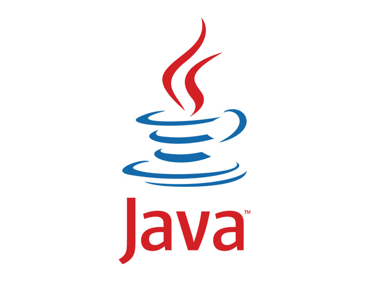

# Java 基础

## 基本数据类型

| 基本类型 |           字节            | 默认值  |
| :------: | :-----------------------: | :-----: |
|   byte   |             1             |    0    |
|  short   |             2             |    0    |
|   int    |             8             |    0    |
|   long   |             4             |   0L    |
|  float   |             4             |   0f    |
|  double  |             8             |   0d    |
|   char   |             2             | 'u0000' |
| boolean  | 1，实际上只使用其中的1bit |  false  |

> Java 的每种基本类型所占存储空间的大小不会像其他大多数语言那样随机器硬件架构的变化而变化。这种所占存储空间大小的不变性是 Java 程序比用其他大多数语言编写的程序更具可移植性的原因之一。
>
> Java 中的引用类型(如Object、String等)大小取决于具体实现和对象的内容，因此无法给出固定大小。

基本类型都有对应的包装类型，基本类型与其对应的包装类型之间的赋值使用自动装箱与拆箱完成。

这八种基本类型都有对应的包装类分别为：`Byte`、`Short`、`Integer`、`Long`、`Float`、`Double`、`Character`、`Boolean` 。

```java
Integer x = 2;     // 自动装箱，相当于 Integer x = Ineger.valueOf(2);
int y = x;         // 自动拆箱，相当于 int y = x.intValue();
```

### 缓存池

`new Integer(123)` 与 `Integer.valueOf(123)` 的区别在于：

- `new Integer(123)` 每次都会新建一个对象
- `Integer.valueOf(123)` 会使用缓存池中的对象，多次调用会取得同一个对象的引用

```java
Integer x = new Integer(123);
Integer y = new Integer(123);
Integer z = Integer.valueOf(123);
Integer k = Integer.valueOf(123);
System.out.println(x == y);// false
System.out.println(x == z);// false
System.out.println(z == k);// true
```

编译器会**在缓冲池范围内的基本类型**自动装箱过程调用 `valueOf()` 方法，因此多个 `Integer` 实例使用自动装箱来创建并且值相同，那么就会引用相同的对象。

```java
Integer m = 123;
Integer n = 123;
System.out.println(m == n); // true
```

`Byte`,`Short`,`Integer`,`Long` 这 4 种包装类默认创建了数值 **[-128,127]** 的相应类型的缓存数据，`Character` 创建了数值在 **[0,127]** 范围的缓存数据，`Boolean` 创建了值为 `true` 和 `false` 的缓存数据。


如果频繁拆装箱的话，也会严重影响系统的性能。应该尽量避免不必要的拆装箱操作。

```java
private static long sum() {
    // 应该使用 long 而不是 Long
    Long sum = 0L;
    for (long i = 0; i <= Integer.MAX_VALUE; i++)
        // 先将 sum 自动拆箱为 int 类型后进行加1，得出结果后自动装箱为 Long 类型
        sum += i;
    return sum;
}
```

## Java 面向对象

### 三大特性

#### 封装

利用抽象数据类型将数据和基于数据的操作封装在一起，使其构成一个不可分割的独立实体。数据被保护在抽象数据类型的内部，尽可能地隐藏内部的细节，只保留一些对外接口使之与外部发生联系。用户无需知道对象内部的细节，但可以通过对象对外提供的接口来访问该对象。

#### 继承

继承实现了 `IS-A` 关系，子类继承父类，获得父类的非 `private` 的属性和方法。

继承应遵循里氏替换原则，子类对象必须能够替换掉所有父类对象。使用父类引用指向子类对象称为向上转型。

如果子类的方法重写了父类的方法，那么子类中该方法的访问级别不允许低于父类的访问级别。这是为了确保可以使用父类实例的地方都可以使用子类实例，也就是确保满足里氏替换原则。

#### 多态

多态分为编译时多态和运行时多态：

- 编译时多态主要指方法的重载
- 运行时多态指程序中定义的对象引用所指向的具体类型在运行期间才确定

运行时多态有三个条件:

- 继承
- 覆盖(重写)
- 向上转型

**重写与重载**

1、重写(Override)

存在于继承体系中，指子类实现了一个与父类在方法声明上完全相同的一个方法。

为了满足里式替换原则，重写有以下两个限制:

- 子类方法的访问权限必须大于等于父类方法；
- 子类方法的返回类型必须是父类方法返回类型或为其子类型。

使用 `@Override` 注解，可以让编译器帮忙检查是否满足上面的两个限制条件。

2、重载(Overload)

存在于同一个类中，指一个方法与已经存在的方法名称上相同，但是参数类型，个数至少有一个不同，仅返回值不同不为重载。

### 关键字

#### final 

* `final` 修饰的类不能被继承，`final` 类中的所有成员方法都会被隐式的指定为 `final` 方法；
* `final` 修饰的方法不能被重写；
* `final` 修饰的变量是常量，如果是基本数据类型的变量，则其数值一旦在初始化之后便不能更改；如果是引用类型的变量，则在对其初始化之后便不能让其指向另一个对象。

#### **static**

**静态变量和静态方法** 

被 `static` 修饰的成员属于类，不属于单个这个类的对象，被类中所有对象共享，可以并且建议通过类名调用。

> 静态方法在类加载的时候就存在了，它不依赖于任何实例。所以静态方法必须有实现，也就是说它不能是抽象方法(*abstract*)，只能访问所属类的静态字段和静态方法，方法中不能有 `this` 和 `super` 关键字。

**静态语句块** 

静态语句块在类初始化时运行一次。

**初始化顺序**

静态变量和静态语句块优先于实例变量和普通语句块，静态变量和静态语句块的初始化顺序取决于它们在代码中的顺序。

```java
public static String staticField = "静态变量";
```

```java
static {
    System.out.println("静态语句块");
}
```

```java
public String field = "实例变量";
```

```java
{
    System.out.println("普通语句块");
}
```

```java
public InitialOrderTest() {
    System.out.println("构造函数");
}
```

存在继承的情况下，初始化顺序为:

- 父类(静态变量、静态语句块)
- 子类(静态变量、静态语句块)
- 父类(实例变量、普通语句块)
- 父类(构造函数)
- 子类(实例变量、普通语句块)
- 子类(构造函数)

### 接口

* 接口的成员变量只能是静态常量，默认修饰符 `public static final`，在声明成员变量的同时需要赋予初值。成员方法只能是抽象方法，默认修饰符 `public abstract`。
* 接口可以使用 `extends` 关键字继承一个或多个接口。

在 Java 8 之前，接口可以看成是一个完全抽象的类，没有任何方法的实现。

从 Java 8 开始，接口也可以拥有默认的方法实现，这是因为不支持默认方法的接口的维护成本太高了。在 Java 8 之前，如果一个接口想要添加新的方法，那么要修改所有实现了该接口的类。


### Java核心类

#### Object

##### equals()

**与 null 的比较**

对任何不是 `null` 的对象 `x` 调用 `x.equals(null)` 结果都为 `false`

##### 与 == 的区别

Java 中的数据类型，可分为两类： 

1、基本数据类型(`byte`,`short`,`char`,`int`,`long`,`float`,`double`,`boolean`)，它们之间的比较，应用双等号 `==`，比较的是它们的值。 

2、引用数据类型

当它们用 `==` 进行比较的时候，比较的是它们在内存中的存放地址，所以除非它们指向同一个对象，比较的结果才为`true`，否则为 `false`。 但在一些类库中 `equals()` 被覆盖掉了，如 `String`，`Integer`，`Date`，在这些类当中 `equals()` 有其自身的实现，而不再是比较类在内存中的存放地址了。

`Object` 类的 `equals()` 方法也是用 `==` 进行比较的：

```java
public boolean equals(Object obj) {
        return (this == obj);
    }
```

**一般实现**

```java
public class EqualExample {
    private int x;
    private int y;
    private int z;

    public EqualExample(int x, int y, int z) {
        this.x = x;
        this.y = y;
        this.z = z;
    }

    @Override
    public boolean equals(Object o) {
        // 检查是否为同一个对象的引用，如果是直接返回 true
    	if (this == o) return true;
        // 检查是否是同一个类型，如果不是，直接返回 false
    	if (o == null || this.getClass() != o.getClass()) return false;
	    // 将 Object 对象进行转型
        EqualExample that = (EqualExample) o;
		// 判断每个关键域是否相等
        if (x != that.x) return false;
        if (y != that.y) return false;
        return z == that.z;
    }
}
```

##### hashCode()

`hashCode()` 返回散列值，而 `equals()` 是用来判断两个对象是否等价。等价的两个对象散列值一定相同，但是散列值相同的两个对象不一定等价。

在覆盖 `equals()` 方法时应当总是覆盖 `hashCode()` 方法，保证等价的两个对象散列值也相等。

* `Object` 类的 `hashCode` 方法返回对象的内存地址经过处理后的结构，由于每个对象的内存地址都不一样，所以哈希码也不一样。
* `String` 类的 `hashCode` 方法根据 `String` 类包含的字符串的内容，根据一种特殊算法返回哈希码，只要字符串内容相同，返回的哈希码也相同。

##### toString()

默认返回 `ToStringExample@4554617c` 这种形式，其中 `@` 前为调用该方法的对象所属类名，`@` 后的数值为散列码的无符号十六进制表示。

##### clone()

`clone()` 是 `Object` 的 `protected` 方法。一个类不显式去重写 `clone()`，其它类就不能直接去调用该类实例的 `clone()` 方法。

```java
protected native Object clone() throws CloneNotSupportedException;
```

另外，如果一个类没有实现 `Cloneable` 接口又调用了 `clone()` 方法，就会抛出 `CloneNotSupportedException`。

> Java 提供的 `Cloneable` 接口的代码非常简单，它们都是空接口，这种空接口也称为标识接口，标识接口中没有任何方法的定义，其作用是告诉 JRE 这些接口的实现类是否具有某个功能。

**浅拷贝（*ShallowClone*）**

在浅拷贝中，如果原型对象的成员变量是值类型，将复制一份给拷贝对象；如果原型对象的成员变量是引用类型，则将引用对象的地址复制一份给拷贝对象，也就是说原型对象和拷贝对象的成员变量指向相同的内存地址。

**深拷贝（*DeepClone*）**

在深拷贝中，无论原型对象的成员变量是值类型还是引用类型，都将复制一份给拷贝对象。

> 使用 `clone()` 方法来拷贝一个对象即复杂又有风险，它会抛出异常，并且还需要类型转换。最好不要去使用 `clone()`，可以使用拷贝构造函数或者拷贝工厂来拷贝一个对象。

#### String

Java 没有内置的字符串类型， 而是在标准 Java 类库中提供了一个预定义类，叫做 `String` 。每个用双引号括起来的字符串都是 `String` 类的一个实例。

Java 中的字符串为不可变字符串，不能修改 Java 字符串中的字符。只能修改字符串变量，让它引用另外一个字符串。各种字符串存放在常量池中，字符串变量指向常量池中相应的位置。如果复制一个字符串变量，原始字符串与复制的字符串共享相同的字符（Java 的设计者认为共享带来的高效率远远胜过于提取、 拼接字符串所带来的低效率）。

> `String` 被声明为 `final`。内部使用 `char` 数组存储数据，该数组被声明为 `final`，且 `String` 内部没有改变该数据的方法，保证了 `String` 不可变。

`String` 直接创建的字符串存储在常量池中，而 `new` 创建的字符串对象存储在堆上。

```java
String s1 = "xiao";// String 直接创建
String s2 = new String("xiao");// String 对象创建
System.out.println(s1 == s2);// false
```

##### StringBuffer and StringBuilder

> 有些时候，需要由较短的字符串构建字符串，采用字符串连接的方式达到此目的的效率比较低。每次连接字符串，都会构建一个新的 `String` 对象，既耗时、又浪费空间。使用 `StringBuilder` 或 `StringBuffer` 类就可以避免这个问题的发生。

**1. 可变性**

- `String` 不可变
- `StringBuffer` 和 `StringBuilder` 可变

**2. 线程安全**

- `String` 不可变，因此是线程安全的
- `StringBuilder` 不是线程安全的
- `StringBuffer` 是线程安全的，内部使用 `synchronized` 进行同步

如果需要用许多小段的字符串构建一个字符串，那么应该按照下列步骤进行。 

首先，构建一个空的字符串构建器：

```java
StringBuilder builder = new StringBuilder();
```

当每次需要添加一部分内容时，就调用 `append` 方法：

```java
builder.append(ch);//ch 为单个字符
builder.append(str);//str 为字符串
```

在需要构建字符串时就调用 `toString` 方法，将可以得到一个 `String` 对象，其中包含了构建器中的字符序列。

```java
String completedString = builder.toString();
```

##### 空串与 Null 串

空串 `""` 是长度为 0 的字符串。

```java
// 检查一个字符串是否为空
if(str.length() == 0)
// 或
if(str.equals(""))
```

空串是一个 Java 对象， 有自己的串长度（长度为0） 和内容（空）。不过， `String` 变量还可以存放一个特殊的值，名为 `null`，这表示目前没有任何对象与该变量关联。

```java
//检查一个字符串是否为 null
if(str == null)
//检查一个字符串既不是 null 也不为空串
if(str != null && str.length() != 0)    
```

##### intern()

使用 `String` 中的 `intern()` 方法可以保证相同内容的字符串变量引用同一的内存对象。

```java
String s1 = new String("aaa");
String s2 = new String("aaa");
System.out.println(s1 == s2);// false
String s3 = s1.intern();
System.out.println(s1.intern() == s3);// true
```

##### String API

```java
//返回给定位置的代码单元
char charAt(int index)
/*按照字典顺序，如果字符串位于other之前，返回一个负数；如果字符串位于other之后，返回一个正数；如果两个字符串相等，返回0*/
int compareTo(String other)
//如果字符串与other相等，返回true
boolean equals(Object other)
//字符串以指定参数开头或结尾，则返回true
boolean startsWith(String prefix)
boolean endsWith(String suffix)
/*返回与字符串str匹配的第一个子串的开始位置，这个位置从索引0或fromIndex开始计算，如果在原始串中不存在str，返回-1*/
int indexOf(String str)
int indexOf(String str,int fromIndex)
//返回字符串的长度    
int length()
/*返回一个新字符串，这个字符串用 newString 代替原始字符串中所有的 oldString。可以用 String 或 StringBuilder 对象作为 CharSequence 参数*/
String replace(CharSequence oldString,CharSequence newString)
/*返回一个新字符串，这个字符串包含原始字符串中从beginIndex到串尾或 endIndex-1的所有代码单元*/
String substring(int beginIndex)
String substring(int beginIndex,int endIndex)
//将原始字符串改为全小写、全大写
String toLowerCase()
String toUpperCase()
//返回一个新字符串，这个字符串将删除原始字符串头部和尾部的空格
String trim()
//返回一个新字符串，用给定的定界符连接所有元素
String join(CharSequence delimiter,CharSequence... elements)
```

## 枚举

```java
public enum Size { SMALL,MEDIUM,LARGE,EXTRA_LARGE };
```

以上语句定义了一个枚举类。枚举类是一种特殊的类，每个枚举常量都是这个类的一个实例，所有的枚举都是 `java.lang.Enum` 类的子类。

枚举类确保在 JVM 中仅存在一个常量实例，因此，在比较两个枚举类型的值时，不需要调用 `equals` 方法，直接使用 `==` 即可。

`java.lang.Enum`

```java
// 返回指定名字、给定类的枚举常量
static Enum valueOf(Class enumClass, String name)
// 返回枚举常量名
String toString()
// 返回枚举常量在enmu声明中的位置，位置从0开始计数
int ordinal()
/* 如果枚举常量出现在other之前，则返回一个负值；如果this==other，则返回0；否则返回正值。枚举常量的出现次序在enum声明中给出 */
int compareTo(E other)
```

## 内部类

* 内部类可以访问外部类的所有成员（包括外部类的私有成员）。

* 外部类必须通过内部类对象访问内部类的成员。

* 内部类的创建需要依赖外部类实体。

  ```Java
  OuterClass out = new OuterClass();
  OuterClass.InnerClass inner = out.new InnerClass();
  ```

* 内部类不能定义 `static` 方法，定义 `static` 属性必须用 `final` 修饰。

#### **静态内部类** 

* 静态内部类只能访问外部类的静态属性。

* 静态内部类创建时不依赖外部类实例。

  ```java
  OuterClass.InnerClass innerClass = new OuterClass.InnerClass();
  ```

* 静态内部类可以定义 `static` 成员。

## 泛型

泛型一般有三种使用方式：泛型类、泛型接口、泛型方法。

### 泛型类

```java
//此处T可以随便写为任意标识，常见的如T、E、K、V等形式的参数常用于表示泛型
//在实例化泛型类时，必须指定T的具体类型
public class Generic<T> {

    private T key;

    public Generic(T key) {
        this.key = key;
    }

    public T getKey() {
        return key;
    }
}
```

实例化泛型类：

```java
Generic<Integer> genericInteger = new Generic<>(1);
```

### 泛型接口

```java
public interface Generator<T> {
    public T method();
}
```

实现泛型接口，不指定类型：

```java
class GeneratorImpl<T> implements Generator<T>{
    @Override
    public T method() {
        return null;
    }
}
```

实现泛型接口，指定类型：

```java
class GeneratorImpl implements Generator<String>{
    @Override
    public String method() {
        return "hello";
    }
}
```

### 泛型方法

```java
public static <E> void printArray(E[] inputArray) {
    for (E element : inputArray) {
        System.out.printf("%s ", element);
    }
    System.out.println();
}
```

使用：

```java
String[] stringArray = { "Hello", "World" };
printArray(stringArray);
```

### **类型擦除**

Java 的泛型是伪泛型，这是因为 Java 在编译期间，所有的泛型信息都会被编译器抹除。Java 中的泛型是在编译器这个层次上实现的，编译生成的字节码中不含泛型中的类型信息，使用泛型的时候加上的类型参数，在编译器编译的时候会被去掉，这个过程称为类型擦除。

## 反射

> 能够分析类能力的程序称为反射(*reflective*)。

### Class 类

每个类都有一个 `Class` 对象，包含了与类有关的信息。当编译一个新类时，会产生一个同名的 `.class` 文件，该文件内容保存着 `Class` 对象。

类加载相当于 `Class` 对象的加载，类在第一次使用时才动态加载到 JVM 中。

反射可以提供运行时的类信息，并且这个类可以在运行时才加载进来，甚至在编译时期该类的 `.class` 不存在也可以加载进来。

**获得 `Class` 对象的方法：**

1、`Object` 类中的 `getClass()` 方法将会返回一个 `Class` 类型的实例。

```java
Employee e = new Employee();
Class c1 = e.getClass();
```

2、调用静态方法 `forName()` 获得类名对应的 `Class` 对象。

```java
String className = "java.util.Random";
Class c1 = Class.forName(className);
```

如果类名保存在字符串中，并可在运行中改变，就可以使用这个方法。这个方法只有在 `className` 是类名或接口名时才能够执行，否则 `forName` 方法将抛出异常。无论何时使用这个方法， 都应该提供一个异常处理器(*exception handler*) 。

3、如果 `T` 是任意的 Java 类型（或 `void` 关键字），`T.class` 将代表匹配的 `Class` 对象。

```java
Class c1 = String.class; 
Class c2 = int.class;
Class c3 = Double[].class;
```

一个 `Class` 对象实际上表示的是一个类型，而这个类型未必一定是一种类。例如，`int` 不是类， 但 `int.class` 是一个 `Class` 类型的对象。

JVM 为每个类型管理一个 `Class` 对象。因此，可以利用 `==` 运算符实现两个类对象比较的操作：

```java
if (e.getClass() == Employee.class)
```

可以用 `newlnstance()` 动态地创建一个类的实例：

```java
e.getClass().newlnstance();
```

创建了一个与 `e` 具有相同类类型的实例。`newlnstance()` 方法调用默认的构造器（无参构造器）初始化新创建的对象。如果这个类没有默认的构造器，就会抛出一个异常。

将 `forName` 与 `newlnstance` 配合起来使用，可以根据存储在字符串中的类名创建一个对象：

```java
String s = "java.util.Random";
Object m = Class.forName(s).newlnstance();
```

如果需要以这种方式向希望按名称创建的类的构造器提供参数，就不要使用上面那条语句，而必须使用 `Constructor` 类中的 `newlnstance` 方法。

`java.lang.reflect.Constructor`

```java
//构造一个这个构造器所属类的新实例,arg为提供给构造器的参数
Object newlnstance(Object[] args)
```

### 利用反射分析类

在 `java.lang.reflect` 包中有三个类 `Field`、`Method` 和 `Constructor` 分别用于描述类的域、 方法和构造器。

`Class` 类中的 `getFields`、`getMethods` 和 `getConstructors` 方法将分别返回类提供的 `public` 域、方法和构造器数组，其中包括超类的公有成员。`Class` 类的 `getDeclareFields`、`getDeclareMethods` 和 `getDeclaredConstructors` 方法将分别返回类中声明的全部域、方法和构造器，其中包括私有和受保护成员，但不包括超类的成员。

### 在运行时使用反射分析对象

查看对象域的关键方法是 `Field` 类中的 `get` 方法。如果 `f` 是一个 `Field` 类型的对象，`obj` 是某个包含 `f` 域的类的对象，`f.get(obj)` 将返回一个对象，其值为 `obj` 域的当前值。

```java
//Employee 类中存在一个 String 类型的域 name。
Employee e = new Employee("xiao");
Class cl = e.getClass();
//返回类中声明的给定名称的域
Field f = cl.getDeclaredField("name");
Object obj = f.get(e);
System.out,println(obj.getClass());//class java.lang.String
```

实际上，这段代码存在一个问题。由于 `name` 是一个私有域，所以 `get` 方法将会抛出一个 `IllegalAccessException`。只有利用 `get` 方法才能得到可访问域的值。除非拥有访问权限，否则 Java 安全机制只允许査看任意对象有哪些域， 而不允许读取它们的值。

反射机制的默认行为受限于 Java 的访问控制。然而， 如果一个 Java 程序没有受到安全管理器的控制， 就可以覆盖访问控制。 为了达到这个目的， 需要调用 `Field`、`Method` 或 `Constructor` 对象的 `setAccessible` 方法。

```java
f.setAccessible(true);//now OK to call f.get(e);
```

`setAccessible` 方法是 `AccessibleObject` 类中的一个方法， 它是 `Field`、 `Method` 和 `Constructor` 类的公共超类。这个特性是为调试、 持久存储和相似机制提供的。

`get` 方法还有一个需要解决的问题。`name` 域是一个 `String`，因此把它作为 `Object` 返回没有什么问题。但是，假定想要查看 `salary` 域。它属于 `double` 类型，而 Java 中数值类型不是对象。要想解决这个问题，可以使用 `Field` 类中的 `getDouble` 方法，也可以调用 `get`方法，此时，反射机制将会自动地将这个域值打包到相应的对象包装器中，这里将打包成 `Double` 。

调用 `f.set(obj,value)` 可以将 `obj` 对象的 `f` 域设置成新值 `value`。

### 调用任意方法

在 `Method` 类中有一个 `invoke` 方法， 它允许调用包装在当前 `Method` 对象中的方法。

```java
Object invoke(Object obj, Object... args)
```

第一个参数是隐式参数，其余的对象提供了显式参数。对于静态方法，第一个参数可以被忽略， 即可以将它设置为 null。

```java
//Employee类中存在一个getName()方法
Method m1 = Employee.class.getMethod("getName");
//调用这个对象所描述的方法
String n = (String) m1.invoke(e);
```

如果返回类型是基本类型， `invoke` 方法会返回其包装器类型。

## 注解

> 注解(*Annotation*)能被用来为程序元素（类、方法、成员变量等）设置元数据。注解不影响程序代码的执行，无论增加、删除注解，代码都始终如一地执行。如果希望让程序中的注解起一定的作用，可以通过解析工具或编译工具对注解中的信息进行解析和处理。

> 元数据是关于数据的数据。在编程语言上下文中，元数据是添加到程序元素如方法、字段、类和包上的额外信息，是对数据进行说明描述的数据。
>
> 元数据的作用：
>
> 1）编写文档：通过代码里标识的元数据生成文档；　　
> 2）代码分析：通过代码里标识的元数据对代码进行分析；　　
> 3）编译检查：通过代码里标识的元数据让编译器能实现基本的编译检查。

### Java 内置注解

#### 元注解

`java.lang.annotation`

##### @Documented

如果定义注解时使用了 `@Documented` 修饰，则所有使用该注解修饰的程序元素的API文档中将会包含该注解说明。

```java
@Documented
@Retention(RetentionPolicy.RUNTIME)
@Target(ElementType.ANNOTATION_TYPE)
public @interface Documented {
}
```

##### @Inherited

如果定义注解时使用了 `@Inherited` 修饰，则该注解将具有继承性：如果某个类使用了该注解修饰，则其子类将自动被该注解修饰。

```java
@Documented
@Retention(RetentionPolicy.RUNTIME)
@Target(ElementType.ANNOTATION_TYPE)
public @interface Inherited {
}
```

##### @Retention

标记被修饰注解的保留时长。当注解声明中没有 `@Retention` 元注解，则默认保留策略(*RetentionPolicy*)为 `RetentionPolicy.CLASS`。

```java
@Documented
@Retention(RetentionPolicy.RUNTIME)
@Target(ElementType.ANNOTATION_TYPE)
public @interface Retention {
    RetentionPolicy value();
}
```

保留策略为枚举类型，共定义3种保留策略：

| 保留策略 |                       含义                        |
| :------: | :-----------------------------------------------: |
|  SOURCE  |               仅存在于Java源文件中                |
|  CLASS   |   存在于Java源文件和编译生成的Class字节码文件中   |
| RUNTIME  | 存在源文件、编译生成的Class字节码文件和运行时VM中 |

##### @Target

标记被修饰的注解所适用的程序元素(*ElementType*)类型。当注解声明中没有 `@Target` 元注解，则默认为可适用所有的程序元素。如果存在指定的 `@Target` 元注解，则编译器强制实施相应的使用限制。

```java
@Documented
@Retention(RetentionPolicy.RUNTIME)
@Target(ElementType.ANNOTATION_TYPE)
public @interface Target {
    ElementType[] value();
}
```

程序元素是枚举类型，共定义8种程序元素：

|    程序元素     |                含义                |
| :-------------: | :--------------------------------: |
| ANNOTATION_TYPE |            注解类型声明            |
|   CONSTRUCTOR   |            构造方法声明            |
|      FIELD      |      字段声明（包括枚举常量）      |
| LOCAL_VARIABLE  |            局部变量声明            |
|     METHOD      |              方法声明              |
|     PACKAGE     |               包声明               |
|    PARAMETER    |              参数声明              |
|      TYPE       | 类、接口（包括注解类型）或枚举声明 |

#### 其他注解

`java.lang`

##### **@Override**

检查该方法是否是重写方法。如果发现其父类，或者是引用的接口中并没有该方法时，会报编译错误。

```java
@Target(ElementType.METHOD)
@Retention(RetentionPolicy.SOURCE)
public @interface Override {
}
```

##### @Deprecated

 标记过时元素。如果使用该元素，会报编译警告。

```java
@Documented
@Retention(RetentionPolicy.RUNTIME)
@Target(value={CONSTRUCTOR, FIELD, LOCAL_VARIABLE, METHOD, PACKAGE, MODULE, PARAMETER, TYPE})
public @interface Deprecated {
    String since() default "";
    boolean forRemoval() default false;
}
```

##### @SuppressWarnings

指示编译器忽略注解中声明的警告。

```java
@Target({TYPE, FIELD, METHOD, PARAMETER, CONSTRUCTOR, LOCAL_VARIABLE, MODULE})
@Retention(RetentionPolicy.SOURCE)
public @interface SuppressWarnings {
    String[] value();
}
```

该注解有方法 `value()` ，可支持多个字符串参数，可指定忽略哪种警告：

```java
@SupressWarning(value={"uncheck","deprecation"})
```

|    参数     |                      含义                       |
| :---------: | :---------------------------------------------: |
| deprecation |          使用了过时的类或方法时的警告           |
|  unchecked  |           执行了未检查的转换时的警告            |
| fallthrough | 当switch程序块进入下一个case而没有break时的警告 |
|    path     |   在类路径、源文件路径等有不存在路径时的警告    |
|   serial    | 当可序列化的类缺少serialVersionUID定义时的警告  |
|   finally   |       任意finally子句不能正常完成时的警告       |
|     all     |               以上所有情况的警告                |

#### Java 7 后新增注解

##### @FunctionalInterface

Java 8 开始支持，标识一个匿名函数或函数式接口。

```java
@Documented
@Retention(RetentionPolicy.RUNTIME)
@Target(ElementType.TYPE)
public @interface FunctionalInterface {}
```

##### **@Repeatable** 

Java 8 开始支持，标识某注解可以在同一个声明上使用多次。

```java
@Documented
@Retention(RetentionPolicy.RUNTIME)
@Target(ElementType.ANNOTATION_TYPE)
public @interface Repeatable {
    Class<? extends Annotation> value();
}
```


### 自定义注解

> 当一个接口直接继承 `java.lang.annotation.Annotation` 接口时，仍是接口，而并非注解。要想自定义注解类型，只能通过 `@interface` 关键字的方式，该方式会隐含地继承 `Annotation` 接口。

```java
@Target(ElementType.METHOD)
@Retention(RetentionPolicy.RUNTIME)
public @interface MyAnnotation{
    String name() default "xiao";
    String website();
}
```

在自定义注解中定义成员变量是以无形参的方法形式来声明的。当注解中有成员变量时，若没有默认值，需要在使用注解时，指定成员变量的值。

```java
public class AnnotationDemo {
	@MyAnnotation(name="peng",website="www.baidu.com")
	public static void main(String[] args){
		...
	}
}
```

### 通过反射分析注解

> 只有保留策略为 `RetentionPolicy.RUNTIME` 的注解才能通过反射机制来分析。

反射类位于包 `java.lang.reflect` ，其中有一个接口 `AnnotatedElement` ，该接口主要有 `Class` 、`Constructor`、`Field`、`Method`、`Package` 几个实现类，该接口定义了与注解相关的几个核心方法：

```java
// 若该元素存在指定类型注解，则返回true,否则返回false
boolean isAnnotationPresent(Class<? extends Annotation> annotationClass)
// 若该元素存在指定类型注解，则返回相应注解，否则返回null
<T extends Annotation> T getAnnotation(Class<T> annotationClass)
// 返回该元素上存在的所有注解
Annotation[] getAnnotations()
// 返回直接存在于该元素上的所有注解
<T extends Annotation> T getDeclaredAnnotation(Class<T> annotationClass)
```

当获取了某个类的 `Class` 对象，就可以获取其 `Field`，`Method` 等对象，通过 `AnnotatedElement` 接口定义的方法获得该类的注解，然后获得注解的信息。

```java
public class AnnotationParser {
    public static void main(String[] args){
        public clazz = "com.xiao.annotation.Annotation"
    Method[] methods = Class.forName(clazz).getMethods();
    	for (Method method : methods) {
      		if(method.isAnnotationPresent(MyAnnotation.class)){
                MyAnnotation myAnno = method.getAnnotation(MyAnnotation.class);
                System.out.println("method：" + method + ", name = " + myAnno.name() + ", website = " + myAnno.website());
            }
        }
    }
}
```

## 多线程

### 进程与线程

进程(*Process*)是计算机中的程序关于某数据集合上的一次运行活动，是系统进行资源分配和调度的基本单位。

线程(*Thread*)是操作系统能够进行运算调度的最小单位。它被包含在进程之中，是进程中的实际运作单位。一条线程指的是进程中一个单一顺序的控制流，一个进程中可以并发多个线程，每条线程并行执行不同的任务。


### 创建一个线程

[Java创建线程的三种方式及对比 - 简书 (jianshu.com)](https://www.jianshu.com/p/0977349d20db)

#### 实现Runnable接口

1、将任务代码移到实现了 `Runnable` 接口的类的 `run` 方法中。这个接口非常简单，只有一个方法：

`java.lang.Runnable`

```java
@FunctionalInterface
public interface Runnable {
    public abstract void run();
}
```

由于 `Runnable` 是一个函数式接口，可以用 lambda 表达式建立一个实例：

```java
Runnable r = () -> { task code };
```

2、由 `Runnable` 实例，作为创建 `Thread` 对象的 `target` 参数，创建一个 `Thread` 对象：

```java
Thread t = new Thread(r);
```

3、启动线程：

```java
t.start();
```

#### 通过继承Thread类

1、继承 `Thread` 类并重写 `run()` 方法：

```java
class MyThread extends Thread {
	public void run() {
		// task code
	} 
}
```

2、构造一个子类的对象：

```java
Thread t = new MyThread();
```

3、调用该线程对象的 `start()` 方法来启动线程：

```java
t.start();
```

> 不要直接调用  `Thread` 类或  `Runnable` 对象的 `run()` 方法，这样只会让当前线程执行 `run()` 方法，而不会启动新线程。应该调用  `Thread` 类的 `start()` 方法，这个方法将创建一个新线程去执行 `run()` 方法。

#### 使用Callable和Future

1、定义实现 `Callable` 接口的实现类，并实现 `call()` 方法，该 `call()` 方法将作为线程执行体，并且有返回值，可以声明抛出异常。注意：`Callable` 有泛型限制，与返回值类型一致。

`java.util.concurrent.Callable`

```java
public interface Callable<V> {
    V call() throws Exception;
}
```

由于 `Callable` 是一个函数式接口，可以用 lambda 表达式建立一个实例：

```java
Callable<V> c = () -> { task code };
```

2、使用 `FutureTask` 类包装 `Callable` 的实例，该 `FutureTask` 对象封装了该 `Callable` 对象的 `call()` 方法的返回值：

```java
FutureTask<V> task = new FutureTask(c);
```

> Java 5 提供了 `Future` 接口来接收 `Callable` 接口中 `call()` 方法的返回值。`Callable` 接口是 Java 5 新增的接口，不是 `Runnable` 接口的子接口，所以 `Callable` 对象不能直接作为 `Thread` 对象的 `target` 参数。因此引出了 `RunnableFuture` 接口，`RunnableFuture` 接口是 `Runnable` 接口和 `Future` 接口的子接口，可以作为 `Thread` 对象的 `target` 参数。同时，Java 5 提供了一个 `RunnableFuture` 接口的实现类：`FutureTask`，`FutureTask` 可以作为 `Thread` 对象的 `target` 参数。


3、使用 `FutureTask` 对象作为 `Thread` 的 `target` 来创建并启动线程：

```java
new Thread(task).start();
```

4、调用 `FutureTask` 对象的 `get()` 方法来获得子线程执行结束后的返回值：

```java
V result = task.get();
```

`java.lang.Thread`

```java
// 构造一个新线程，用于调用给定目标的run()方法
Thread(Runnable target)
// 同上，name为线程名
Thread(Runnable target, String name)
// 启动这个线程，将引发调用run()方法。这个方法将立即返回，并且新线程将并发运行
void start()
// 返回代表当前执行线程的 Thread 对象
static native Thread currentThread()
// 暂停当前线程的活动，休眠给定的毫秒数
static void sleep(long minis)
```

### 线程生命周期


线程可以有如下 6 种状态： 

* New (新创建） 

* Runnable (可运行） 

* Blocked (被阻塞） 

* Waiting (等待)

* Timed waiting (计时等待） 

* Terminated (被终止）

要确定一个线程的当前状态， 可调用 `Thread` 类中的 `getState()` 方法。

#### 新创建线程

当用 `new` 操作符创建一个新线程时，如 `new Thread()`， 该线程还没有开始运行。这意味着它的状态是 `new`。当一个线程处于新创建状态时，程序还没有开始运行线程中的代码。在线程运行之前还有一些基础工作要做。

#### 可运行线程

一旦调用 `start` 方法，线程处于 `runnable` 状态。一个可运行的线程可能正在运行也可能没有运行， 这取决于操作系统给线程提供运行的时间（Java 的规范说明没有将它作为一个单独状态。一个正在运行中的线程仍然处于可运行状态）。

#### 被阻塞线程和等待线程

当线程处于被阻塞或等待状态时，它暂时不活动。它不运行任何代码且消耗最少的资源。直到线程调度器重新激活它。细节取决于它是怎样达到非活动状态的。

* 当一个线程试图获取一个内部的对象锁（而不是 `java.util.concurrent` 库中的锁），而该锁被其他线程持有， 则该线程进人阻塞状态。当所有其他线程释放该锁，并且线程调度器允许本线程持有它的时候，该线程将变成非阻塞状态。
* 当线程等待另一个线程通知调度器一个条件时，它自己进入等待状态。在调用 `Object.wait` 方法或 `Thread.join` 方法， 或者是等待 `java.util.concurrent` 库中的 `Lock` 或 `Condition` 时， 就会出现这种情况。
* 有几个方法有一个超时参数。调用它们导致线程进人计时等待(*timed waiting*) 状态。这一状态将一直保持到超时期满或者接收到适当的通知。带有超时参数的方法有  `Thread.sleep` 和 `Object.wait` 、`Thread.join`、`Lock.tryLock` 以及 `Condition.await` 的计时版。

当一个线程被阻塞或等待时（或终止时），另一个线程被调度为运行状态。当一个线程被重新激活（例如， 因为超时期满或成功地获得了一个锁)，调度器检查它是否具有比当前运行线程更高的优先级。如果是这样，调度器从当前运行线程中挑选一个， 剥夺其运行权，选择一个新的线程运行。

#### 被终止的线程

线程因如下两个原因之一而被终止：

1、因为 `run` 方法正常退出而自然死亡。

2、因为一个没有捕获的异常终止了 `run` 方法而意外死亡。

### 中断线程

没有可以强制线程终止的方法。然而，`interrupt()` 方法可以用来请求终止线程。

当对一个线程调用 `interrupt()` 方法时，线程的中断状态将被置位。这是每一个线程都具有的 `boolean` 标志。这个标志并不能终止线程，而是通知线程应该终止了，具体到底终止还是继续运行，应该由被通知的线程自己处理。

但是， 如果线程被阻塞，就无法检测中断状态。当在一个被阻塞的线程（调用 `sleep()` 或 `wait()`) 上调用 `interrupt()` 方法时，阻塞调用将会被 `Interrupted Exception` 异常中断。

一个线程如果有被终止的需求，那么就需要如下操作：

1、在程序正常运行时，每个线程都应该不时地检査这个标志， 如果被设置了中断标志就自行终止线程。

2、在调用阻塞方法时正确处理 `InterruptedException` 异常。

`java.lang.Thread`

```java
// 线程的中断状态将被设置为true。如果目前该线程被一个sleep调用阻塞，将抛出InterruptedException异常
void interrupt()
// 将当前线程的中断状态重置为false 
static boolean interrupted()
// 判断线程是否被中断
boolean islnterrupted()
```

### 同步

> 如果向一个变量写入值，而这个变量接下来可能会被另一个线程读取，或者，从一个变量读值，而这个变量可能是之前被另一个线程写入的，此时必须使用同步。

#### 锁对象

用 `ReentrantLock` 保护代码块的基本结构如下：

```java
myLock.lock();
try {
    critical section
} finally {
    /* make sure the lock is unlocked even if an exception is thrown */
    myLock.unlock();
}
```

这一结构确保任何时候只有一个线程进入临界区。一旦一个线程封锁了锁对象，其他任何线程都无法通过 `lock` 语句。当其他线程调用 `lock` 时，它们被阻塞，直到第一个线程释放锁对象。

> 临界区指的是一个访问公共资源的程序片段，而这些公共资源又无法同时被多个线程访问。当有线程进入临界区时，其他线程必须等待。

> 把解锁操作放在 `finally` 字句之内是至关重要的。如果在临界区的代码抛出异常，锁必须被释放。否则，其他线程将永远阻塞。

`java.util.concurrent.locks.Lock`

```java
// 获取锁，如果锁同时被另一个线程拥有则发生阻塞，直到另一个线程释放锁
void lock()
// 释放锁
void unlock()
```

#### 条件对象

通常线程进入临界区，却发现在某一条件满足之后才能执行。要使用一个条件对象来管理那些已经获得了一个锁但是却不能做有用工作的线程。

一个锁对象可以有一个或多个相关的条件对象。可以用 `newCondition` 方法获得一个条件对象。条件对象中的 `await` 方法使当前线程阻塞，并放弃锁。

等待获得锁的线程和调用 `await` 方法的线程存在本质上的不同。一旦一个线程调用 `await` 方法，它进入该条件的等待集。当锁可用时，该线程不能马上解除阻塞。相反，它处于阻塞状态，直到另一个线程调用同一条件上的 `signalAll` 方法时为止。这一调用重新激活因为这一条件而等待的所有线程。当这些线程从等待集当中移出时，它们再次成为可运行的，调度器将再次激活它们。同时，它们将试图重新进人该对象。一旦锁成为可用的，它们中的某个将从 `await` 调用返回，获得该锁并从被阻塞的地方继续执行。此时，线程应该再次测试该条件。由于无法确保该条件被满足，`signalAll` 方法仅仅是通知正在等待的线程：此时有可能已经满足条件，值得再次去检测该条件。

通常，对 `await` 的调用应该在如下形式的循环体中：

```java
while(!(ok to procced))
    condition.await();
```

至关重要的是最终需要某个其他线程调用 `signalAll` 方法。当一个线程调用 `await` 时，它没有办法重新激活自身。它寄希望于其他线程。如果没有其他线程来重新激活等待的线程，它就永远不再运行了。这将导致令人不快的死锁（*deadlock*) 现象。如果所有其他线程被阻塞，最后一个活动线程在解除其他线程的阻塞状态之前就调用 `await` 方法，那么它也被阻塞。没有任何线程可以解除其他线程的阻塞，那么该程序就挂起了。

注意调用 `signalAll` 不会立即激活一个等待线程。它仅仅解除等待线程的阻塞，以便这些线程可以在当前线程退出同步方法之后，通过竞争实现对对象的访问。另一个方法 `signal`， 则是随机解除等待集中某个线程的阻塞状态。这比解除所有线程的阻塞更加有效，但也存在危险。如果随机选择的线程发现自己仍然不能运行，那么它再次被阻塞。如果没有其他线程再次调用 `signal`， 那么系统就死锁了。

当一个线程拥有某个条件的锁时，它仅仅可以在该条件上调用 `await`、`signalAll` 或`signal` 方法。

`java.util.concurrent.locks.Lock`

```java
// 返回一个与该锁相关的条件对象
Condition newCondition()
```

`java.util.concurrent.locks.Condition`

```java
// 将该线程放到条件的等待集中
void await()
// 解除该条件的等待集中的所有线程的阻塞状态
void signalAll()
// 从该条件的等待集中随机地选择一个线程，解除其阻塞状态
void singal()
```

#### synchronized

Java 每个对象都有一个内部锁。如果一个方法用 `synchronized` 关键字声明，那么对象的锁将保护整个方法。也就是说，要调用该方法，线程必须获得内部的对象锁。如果是静态方法，使用的是该类的 `Class` 类对象，该对象只有一个。

```java
public synchronized void method(){
    method body
}
// 等价于
public void method(){
    this.intrinsicLock.lock();
    try{
        method body
    }finally{
        this.intrinsicLock.unlock();
    }
}
```

内部对象锁只有一个相关条件。`wait` 方法添加一个线程到等待集中，`notifyAll`/`notify` 方法解除等待线程的阻塞状态。换句话说，调用 `wait` 或 `notifyAll` 等价于调用 `intrinsicCondition.await` 或 `intrinsicCondition.signalAll`。  

将静态方法声明为 `synchronized` 也是合法的。如果调用这种方法，该方法获得相关的类对象的内部锁。没有其他线程可以调用同一个类的这个或任何其他的同步静态方法。

每个 Java 对象有一个锁，线程可以通过调用同步方法获得锁，还有另一种机制可以获得锁，通过进入一个 `synchronized` 代码块：

```java
synchronized (obj) {
	critical section
}
```

获得 `obj` 的锁。

`java.lang.Object`

```java
/* 解除那些在该对象上调用wait方法的线程的阻塞状态。该方法只能在同步方法或同步块内部调用。如果当前线程不是对象锁的持有者，该方法拋出一个 IllegalMonitorStateException异常 */
void notifyAll()
/* 随机选择一个在该对象上调用 wait 方法的线程，解除其阻塞状态。该方法只能在一个同步方法或同步块中调用。如果当前线程不是对象锁的持有者，该方法抛出一个
IllegalMonitorStateException 异常 */
void notify()
/* 导致线程进人等待状态直到它被通知。该方法只能在一个同步方法中调用。如果当前线程不是对象锁的持有者，该方法拋出一个 IllegalMonitorStateException 异常。 */
void wait()
/* 导致线程进入等待状态直到它被通知或者经过指定的时间。这些方法只能在一个同步方法中调用。如果当前线程不是对象锁的持有者该方法拋出一个IllegalMonitorStateException异常 */
void wait(long mi11is)
```

#### 死锁

死锁是指两个或两个以上的线程在执行过程中，因争夺资源而造成的一种互相等待的现象，若无外力作用，它们都将无法继续执行。

```java
Object o1 = new Object();
Object o2 = new Object();
Thread t1 = new Thread(() -> {
    synchronized (o1) {
        try {
            Thread.sleep(1000);
            synchronized (o2){
                System.out.println("线程t1执行");
            }
        } catch (InterruptedException e) {
            e.printStackTrace();
        }
    }
});
Thread t2 = new Thread(() -> {
    synchronized (o2) {
        try {
            Thread.sleep(1000);
            synchronized (o1){
                System.out.println("线程t2执行");
            }
        } catch (InterruptedException e) {
            e.printStackTrace();
        }
    }
});
t1.start();
t2.start();
```

##### 产生死锁的必要条件

- 互斥：一个资源每次只能被一个进程使用。
- 请求与保持：一个进程因请求资源而阻塞时，对已获得的资源保持不放。
- 非抢占式：进程已获得的资源，在末使用完之前，不能强行剥夺。
- 循环等待：若干进程之间形成一种头尾相接的循环等待资源关系。

##### 解决死锁的办法

- 互斥：把互斥的共享资源封装成可同时访问。
- 请求与保持：进程请求资源时，要求它不占有任何其它资源，也就是它必须一次性申请到所有的资源，这种方式会导致资源效率低。
- 非抢占式：如果进程不能立即分配资源，要求它不占有任何其他资源，也就是只能够同时获得所有需要资源时，才执行分配操作。
- 循环等待：对资源进行排序，要求进程按顺序请求资源。

##### 死锁排查

```shell
# 查看运行的进程
jps
# 查看堆栈信息,pid 是 jps 命令输出的进程号
jstack pid
```

#### ThreadLocal

## 序列化

序列化是一种对象持久化的手段。

序列化：把对象转换为字节序列的过程。

反序列化：把字节序列恢复为对象的过程。

**序列化的场景**

- 当需要把内存中的对象状态保存到一个文件中或者数据库中时候；
- 当需要使用套接字在网络上传送对象的时候；
- 当需要通过 RMI（远程方法调用，可以理解为 Java 对象之间的调用）传输对象的时候；
- 当要跨进程跨网络传输对象的时候。

### 序列化实现

#### 方法一： Serializable接口

Java 类通过实现 `java.io.Serializable` 接口以启用其序列化功能。未实现此接口的类将无法进行序列化或反序列化。
而 `Serializable` 只是一个空接口，接口没有任何的方法和字段，仅仅用于标识。 如果一个类没有实现这个接口，想要被序列化的话，就会抛出 `java.io.NotSerializableException` 异常。

#### 方法二： Externalizable接口

`Externalizable` 继承自 `Serializable` , 它更加灵活一点，它里面定义了 `writeExternal()` 和 `readExternal()` 两个抽象方法分别用于序列化和反序列化使用。
通过这两个方法，程序猿决定需要序列化哪些数据。如果对象中涉及到很少的属性需要序列化，大多数属性无需序列化，这种情况使用`Externalizable` 接口是比较灵活的。

### **transient **

transient 关键字的作用是控制变量的序列化，在变量声明前加上该关键字，可以阻止该变量被序列化到文件中，在被反序列化后，transient 变量的值被设为初始值，如 int 型的是 0，对象型的是 null。

### **serialVersionUID**

`serialVersionUID` 是用来验证版本一致性的 。
序列化是将对象的状态信息转换为可存储或传输的形式的过程。 Java对象是保存在 JVM 的堆内存中的，如果 JVM堆不存在了，对象也就跟着随即消失。
而序列化提供了一种方案，可以在即使 JVM 停机的情况下也能把对象保存下来的方案。 把 Java 对象序列化成可存储或传输的形式（如二进制流），比如保存在文件中。 当再次需要这个对象的时候，从文件中读取出二进制流，再从二进制流中反序列化出对象。
虚拟机是否允许反序列化，不仅取决于类路径和功能代码是否一致， 一个非常重要的一点是两个类的序列化 ID 是否一致，这个所谓的序列化ID(serialVersionUID)。
在反序列化时，`JVM` 会把传来的字节流中的 `serialVersionUID` 和本地相应实体类的 `serialVersionUID` 进行比较， 如果相同就认为一致，可以进行反序列化，否则出现 `InvalidCastException` 异常。

### **static & static-final**

`static` 静态变量不是对象状态的一部分，因此它不参与序列化。那么反序列化之后。我们可以这么理解，静态变量的话，不属于对象的特有的，谁都可以进行改变，所以序列化了之后，在反序列返回来可能就不是那个值了。
如果一个变量修饰为 `static final` 的话，这时候由于 `final` 定义的不可被改变，那么这时候这个属性就会被持久化了。

# Java8新特性

## 接口内允许添加默认实现的方法

Java 8 允许我们通过 `default` 关键字对接口中定义的抽象方法提供一个默认的实现。

```java
// 定义一个公式接口
interface Formula {
    // 计算
    double calculate(int a);

    // 求平方根
    default double sqrt(int a) {
        return Math.sqrt(a);
    }
}
```

在上面这个接口中，除了定义了一个抽象方法 `calculate`，还定义了一个带有默认实现的方法 `sqrt`。在实现这个接口时，可以只需要实现 `calculate` 方法，默认方法 `sqrt` 可以直接调用即可，也就是说可以不必强制实现 `sqrt` 方法。

> 通过 `default` 关键字这个新特性，可以非常方便地对之前的接口做拓展，而此接口的实现类不必做任何改动。

## Lambda表达式

在 Java 中，Lambda 表达式的格式是像下面这样：

```java
// 无参数，无返回值
() -> log.info("Lambda")

 // 有参数，有返回值
(int a, int b) -> a+b
```

其等价于

```java
log.info("Lambda");

private int plus(int a, int b){
   return a+b;
}
```

常见的一个例子是新建线程，匿名内部类的写法：

```java
new Thread(new Runnable() {
    @Override
    public void run() {
        System.out.println("快速新建并启动一个线程");
    }
}).start();
```

Lambda表达式的写法：

```java
new Thread(()->{
    System.out.println("快速新建并启动一个线程");
}).start();
```

Lambda 表达式简化了匿名内部类的形式，可以达到同样的效果，但是 Lambda 要优雅的多。虽然最终达到的目的是一样的，但其实内部的实现原理却不相同。

匿名内部类在编译之后会创建一个新的匿名内部类出来，而 Lambda 是调用 JVM `invokedynamic` 指令实现的，并不会产生新类。

## 函数式接口(*Functional Interface*)

在书写一段 Lambda 表达式后，Java 编译器是如何进行类型推断的，它又是怎么知道重写的哪个方法的？

需要说明的是，不是每个接口都可以缩写成 Lambda 表达式。只有那些函数式接口才能缩写成 Lambda 表示式。

函数式接口就是只包含一个抽象方法的声明。针对该接口类型的所有 Lambda 表达式都会与这个抽象方法匹配。

> Java 8 中通过 `defualt` 关键字来为接口添加的默认方法不算抽象方法。因此，可以毫无顾忌的添加默认方法，它并不违反函数式接口的定义。

只要接口中仅仅包含一个抽象方法，就可以将其改写为 Lambda 表达式。为了保证一个接口明确的被定义为一个函数式接口，需要为该接口添加注解：`@FunctionalInterface`。这样，一旦添加了第二个抽象方法，编译器会立刻抛出错误提示。

## 方法引用

方法引用的出现，使得我们可以将一个方法赋给一个变量或者作为参数传递给另外一个方法，`::` 双冒号作为方法引用的符号。

方法引用可以认为是 Lambda 表达式的一种特殊形式，Lambda 表达式可以让开发者自定义抽象方法的实现代码，方法引用则可以让开发者直接引用已存在的实现方法，作为 Lambda表达式的 Lambda 体（参数列表需要一致）。

### 方法引用的几种形式

#### 一、类::静态方法

可以将一个类中的静态方法作为 Lambda 体：

```java
@FunctionalInterface
public interface ImTheOne {
    String handleString(String a, String b);
}
class OneClass {
    public static String concatString(String a, String b) {
        return a + b;
    }
}
 
public class Test {
    public static void main(String[] args) {
        // 将 OneClass 类的 concatString 方法作为 Lambda 表达式的 Lambda 体，当调用接口 ImTheOne 的 handleString 方法时，实际上掉用的是 OneClass 类的 concatString 方法
        ImTheOne theOne = OneClass::concatString;
        String result = theOne.handleString("abc", "def");
        System.out.println(result);
        // 等价
        ImTheOne theOne2 = (a, b) -> OneClass.concatString(a, b);
        String result2 = theOne2.handleString("123", "456");
        System.out.println(result2);
    }
}
```

> 注意：
>
> 1、OneClass 类的 concatString 方法的参数列表，和 ImTheOne 接口的 handleString 方法参数列表必须一致，才能用方法引用，否则编译报错。
>
> 2、此时的 concatString 方法必须标记为静态方法，否则编译会报错。

#### 二、对象::实例方法

可以将一个实例的非静态方法作为 Lambda 体：

```java
@FunctionalInterface
public interface ImTheOne {
    String handleString(String a, String b);
}
class OneClass {
    public String concatString(String a, String b) {
        return a + b;
    }
}
 
public class Test {
    public static void main(String[] args) {
        OneClass oneClass = new OneClass();
        ImTheOne theOne = oneClass::concatString
        String result = theOne.handleString("abc", "def");
        System.out.println(result);
        // 等价
        OneClass oneClass2 = new OneClass();
        ImTheOne theOne2 = (a, b) -> oneClass2.concatString(a, b);
        String result2 = theOne2.handleString("123", "456");
        System.out.println(result2);
    }
}
```

> 注意：
>
> 1、这种模式下, concatString 方法不能标记为静态方法，否则编译会报错。
>
> 2、这里的对象可以是父对象，比如可以使用：
>
> ```java
> super::concatString
> ```
>
> 这种形式（如果有父类有这个方法的话）。

#### 三、类::实例方法

这种模式并不是要直接调用类的实例方法，实际上是 `对象::实例方法` 模式的一种变形。当一个对象调用方法时，方法的某个参数是函数式接口，而且函数式接口的方法参数列表的第一个参数就是调用者对象所属的类时，可以引用调用者类中定义的，不包含函数式接口第一个参数的方法，并用 `类::实例方法` 这种形式来表达。

```java
public class Test {
    public static void main(String[] args) {
    	List<Student> list = Stream.of(new Student("xiao", 90),new Student("peng", 80), new Student("ke", 95))
        	.sorted(Student::compareByScore)
        	.collect(Collectors.toList());
    	System.out.println(list);
    }
}
 
@Data
@AllArgsConstructor
@NoArgsConstructor
class Student {
    private String name;
    private int score;
    
    public int compareByScore(Student student){
        return this.getScore() - student.getScore();
    }
}
```

如果将上面的 `compareByScore` 方法改成如下形式，编译报错：

```java
 public int compareByScore(Student student1, Student student2){
 	return student1.getScore() - student2.getScore();
 }
```

这种模式有两个要求：

1、接口方法的参数比引用方法的参数多一个。

2、接口方法的第一个参数恰巧是调用引用方法的对象（其引用方法所在类或其子类的实例）。

#### 四、构造器引用 类::new

构造方法引用实际上表示一个函数式接口中的唯一方法引用了一个类的构造方法，引用的是那个参数相同的构造方法。

```java
@FunctionalInterface
public interface ImTheOne {
    TargetClass getTargetClass(String a);
}
class TargetClass {
    String oneString;
 
    public TargetClass() {
        oneString = "default";
    }
 
    public TargetClass(String a) {
        oneString = a;
    }
}
 
public class Test {
    public static void main(String[] args) {
        ImTheOne imTheOne = TargetClass::new;
        TargetClass targetClass = imTheOne.getTargetClass("abc");
        System.out.println(targetClass.oneString);
        // 等价
        ImTheOne imTheOne2 = (a) -> new TargetClass(a)
        TargetClass targetClass2 = imTheOne2.getTargetClass("123");
        System.out.println(targetClass2.oneString);
    }
}
```

#### 五、数组引用，数组::new

数组引用是构造器引用的一种，可以引用一个数组的构造。

```java
@FunctionalInterface
public interface ImTheOne<T> {
    T getArr(int a);
}
public class Test {
    public static void main(String[] args) {
        ImTheOne<int[]> imTheOne = int[]::new;
        int[] stringArr = imTheOne.getArr(5);
    }
}
```

使用数组引用时，函数式接口中抽象方法必须是有参数的，而且参数只能有一个，必须是数字类型 `int` 或 `Integer`，这个参数代表的是创建数组的长度。

## stream

## optional

# Java 集合框架

容器有两个基本接口：`Collection` 和 `Map`，`Collection` 存储着对象的集合，而 `Map` 存储着键值对（两个对象）的映射表。


## Collection

在 Java 中，集合类的基本接口是 `Collection` 接口。这个接口有 2 个基本方法：

```java
public interface Collection<E> extends Iterable<E> {
	// 向集合中添加元素，如果添加元素确实改变了集合就返回 true，如果集合没有发生变化就返回 false
    boolean add(E e);
    // 返回一个实现了 Iterator 接口的对象，可以使用这个迭代器对象依次访问集合中的元素
    Iterator<E> iterator();
}
```

### 迭代器

`Iterator` 接口包含4个方法：

```java
public interface Iterator<E> {
    // 如果迭代器对象还有多个供访问的元素，这个方法就返回 true
	boolean hasNext();
    // 通过反复调用 next 方法，可以逐个访问集合中的每个元素。但是，如果到达了集合的末尾，next 方法
    // 将抛出一个 NoSuchElementException
    E next();
    // 删除上次调用 next 方法时返回的元素，对 next 方法和 remove 方法的调用具有互相依赖性。如果调用 
    // remove 之前没有调用 next 将是不合法的
    default void remove() {
        throw new UnsupportedOperationException("remove");
    }
    default void forEachRemaining(Consumer<? super E> action) {
        Objects.requireNonNull(action);
        while (hasNext())
            action.accept(next());
    }
}
```

` for each` 循环可以与任何实现了 `Iterable` 接口的对象一起工作， 这个接口只包含一个抽象方法：

```java
public interface Iterable<T> {
	Iterator<T> iterator();
  
    default void forEach(Consumer<? super T> action) {
        Objects.requireNonNull(action);
        for (T t : this) {
            action.accept(t);
        }
    }
    
    default Spliterator<T> spliterator() {
        return Spliterators.spliteratorUnknownSize(iterator(), 0);
    }
}
```

`Collection` 接口扩展了 `Iterable` 接口。因此， 对于标准类库中的任何集合都可以使用  `for each`  循环。

在 `Java SE 8` 中，甚至不用写循环。可以调用 `forEachRemaining` 方法并提供 lambda 表达式，将对迭代器的每一个元素调用这个 lambda 表达式，直到再没有元素为止。

```java
iterator.forEachRemaining(element -> do something with element);
```

元素被访问的顺序取决于集合类型。 如果对 `ArrayList` 进行迭代， 迭代器将从索引 0 开 始，每迭代一次，索引值加 1。 然而，如果访问 `HashSet` 中的元素， 每个元素将会按照某种随机的次序出现。虽然可以确定在迭代过程中能够遍历到集合中的所有元素，但却无法预知元素被访问的次序。

 Java 迭代器位于两个元素之间。 当调用 `next` 时，迭代器就越过下一个元素，并返回刚刚越过的那个元素的引用。

## Set

### HashSet

基于哈希表实现，支持快速查找，但不支持有序性操作。并且失去了元素的插入顺序信息，也就是说使用 `Iterator` 遍历 `HashSet` 得到的结果是不确定的。

### TreeSet

基于红黑树实现，支持有序性操作，例如根据一个范围查找元素的操作。但是查找效率不如 `HashSet`，`HashSet` 查找的时间复杂度为 `O(1)`，`TreeSet` 则为 `O(LogN)`。

### LinkedHashSet

具有 `HashSet` 的查找效率，且内部使用双向链表维护元素的插入顺序。

## List

### ArrayList

`ArrayList` 实现了 `List` 接口，是顺序容器，即元素存放数据的顺序与放入时的顺序相同，允许放入`null` 元素，底层通过**对象数组**实现。除该类未实现同步外，其余跟 `Vector` 大致相同。每个 `ArrayList` 都有一个容量(*capacity*)，表示底层数组的实际大小，容器内存储元素的个数不能多于当前容量。当向容器中添加元素时，如果容量不足，容器会自动增大底层数组的大小。


`size()`，`isEmpty()`，`get()`，`set()` 方法均能在常数时间内完成，`add()` 方法的时间开销跟插入位置有关，`addAll()` 方法的时间开销跟添加元素的个数成正比。其余方法大都是线性时间。

为追求效率，`ArrayList` 没有实现同步(*synchronized*)，如果需要多个线程并发访问，用户可以手动同步，也可使用 `Vector` 替代。

#### ArrayList的实现

**自动扩容**

每当向数组中添加元素时，都要去检查添加后元素的个数是否会超出当前数组的长度，如果超出，数组将会进行扩容，以满足添加数据的需求。数组扩容通过一个公开的方法 `ensureCapacity()` 来实现。在实际添加大量元素前，也可以使用 `ensureCapacity()` 来手动增加 `ArrayList` 实例的容量，以减少递增式再分配的数量。

数组进行扩容时，会将老数组中的元素重新拷贝一份到新的数组中，每次数组容量的增长大约是其原容量的1.5 倍。这种操作的代价是很高的，因此在实际使用时，应该尽量避免数组容量的扩张。当我们可预知要保存的元素的多少时，要在构造 `ArrayList` 实例时，就指定其容量，以避免数组扩容的发生。或者根据实际需求，通过调用 `ensureCapacity()` 方法来手动增加 `ArrayList` 实例的容量。


**add(), addAll()**

这两个方法都是向容器中添加新元素，这可能会导致 `capacity` 不足，因此在添加元素之前，都需要进行剩余空间检查，如果需要则自动扩容。


`add(int index, E e)` 需要先对元素进行移动，然后完成插入操作，也就意味着该方法有着线性的时间复杂度。

`addAll()` 方法能够一次添加多个元素，根据位置不同也有两个版本，一个是在末尾添加的 `addAll(Collection<? extends E> c)` 方法，一个是从指定位置开始插入的 `addAll(int index, Collection<? extends E> c)` 方法。跟 `add()` 方法类似，在插入之前也需要进行空间检查，如果需要则自动扩容；如果从指定位置插入，也会存在移动元素的情况。 `addAll()` 的时间复杂度不仅跟插入元素的多少有关，也跟插入的位置相关。

### Vector

与 `ArrayList` 类似，但它是线程安全的。

### LinkedList

基于双向链表实现，只能顺序访问，但是可以快速地在链表中间插入和删除元素。不仅如此，`LinkedList` 还可以用作栈、队列和双向队列。

## Map

### HashMap

基于红黑树实现。

### HashTable

和 HashMap 类似，但它是线程安全的，这意味着同一时刻多个线程可以同时写入 HashTable 并且不会导致数据不一致。它是遗留类，不应该去使用它。现在可以使用 ConcurrentHashMap 来支持线程安全，并且 ConcurrentHashMap 的效率会更高，因为 ConcurrentHashMap 引入了分段锁。

### TreeMap

基于哈希表实现。

### LinkedHashMap

使用双向链表来维护元素的顺序，顺序为插入顺序或者最近最少使用(LRU)顺序。

# JUC

> JUC 是 `java.util.concurrent` 工具包的简称，这是一个处理线程的工具包，于 JDK 1.5 之后新增。

## 一些基本概念

### 进程与线程

进程(*process*)是系统进行资源分配和调度的基本单位。

线程(*thread*)是系统进行运算调度的最小单位。它被包含在进程之中，是进程中的实际运作单位。一个线程指的是进程中一个单一顺序的控制流，一个进程中可以并发多个线程，每条线程并行执行不同的任务。

### 串行、并行与并发

串行：所有任务都按先后顺序执行，只有完成当前任务，才能执行下一个任务。

并行：同时执行多个任务。

并发：同一时刻多个线程在访问同一个资源，如抢票，电商秒杀。

### 管程

管程指的是管理共享变量以及对共享变量的操作过程，让它们支持并发。在 Java 中就是管理类的成员变量和成员方法，让这个类是线程安全的。

是一种程序结构，结构内的多个子程序（对象或模块）形成的多个工作线程互斥访问共享资源。这些共享资源一般是硬件设备或一群变量。管程实现了在一个时间点，最多只有一个线程在执行管程的某个子程序。与那些通过修改数据结构实现互斥访问的并发程序设计相比，管程实现很大程度上简化了程序设计。 管程提供了一种机制，线程可以临时放弃互斥访问，等待某些条件得到满足后，重新获得执行权恢复它的互斥访问。

### 用户线程与守护线程

## sychronized

### 对象锁

包括方法锁(默认锁对象为 `this`，当前实例对象)和同步代码块锁(自己指定锁对象)。


# 源码(基于JDK11)

## ArrayList


在程序试图直接分配 `Integer.MAX_VALUE` 大小的 `ArrayList`，大概率得到一个错误：

```java
ArrayList<Integer> list = new ArrayList<>(Integer.MAX_VALUE);
```


由于在不同的平台上，受到平台的影响导致能够为数组分配的实际最大数值并非为`Integer.MAX_VALUE(2,147,483,647)`，而是与这个值相接近的数值。

因此，作者减8实际上是因为不想在创建的数组在扩容时计算的新容量值等于或过于接近最大值不能被平台分配出来而报出上述错误。

这样程序在不同平台上运行时不会因为分配数值过大而被平台限制而出现报错。换言之，`Integer.MAX_VALUE-8`将会保证程序在任何平台上都不会因为分配问题而报出 `Requested array size exceeds VM limit` 错误。

问题相关：https://stackoverflow.com/questions/31382531/why-i-cant-create-an-array-with-large-size

# JVM

> JVM(*Java Virtual Machine*：Java虚拟机)是运行Java字节码的虚拟机。


## JVM 内存模型


JVM 包含两个子系统和两个组件，两个子系统为 `Class Loader`(类装载)、`Execution Engine`(执行引擎)；两个组件为 `Runtime Data Area`(运行时数据区)、`Native Interface`(本地接口)。

**类装载(*Class Loader*)：**根据给定的全限定名类名(如：`java.lang.Object`)来装载 `.class` 文件到 `Runtime Data Area` 中的 `Method Area`。

**执行引擎(*Execution Engine*)：**执行 `.class` 文件中的指令。

**本地接口(*Native Interface*)：**与 `native libraries` 交互，是其它编程语言交互的接口。

**运行时数据区(*Runtime Data Area*)：**即 JVM 内存。

### JVM 运行时数据区

**本地方法栈(*Native Method Stack*)：**JVM 调用 `native` 方法所使用的栈。线程私有。

> native 方法就是一个 Java 调用非 Java 代码的接口，一个 native 方法对应的实现不在当前文件，而是在用其他的编程语言实现的文件中。

**Java栈(*Java Stacks*)：**存放局部变量（基本数据类型变量和引用类型变量）。线程私有。

**方法区(*Methed Area*)：**存放加载的：①类(class) ②静态变量(static) ③静态方法 ④常量 ⑤成员方法。线程共享。

**堆(*Heap*)：**存放对象（类的实例），存放的对象只包含各自的成员变量，不包括成员方法。同一个类的对象拥有各自的成员变量，存储在各自的堆中，它们共享该类的方法。线程共享。

**程序计数器(*Program Counter Register*)：**每个线程启动时，都会创建一个程序计数器，程序计数器是当前线程所执行的字节码的行号指示器，字节码解析器的工作是通过改变这个计数器的值，来选取下一条需要执行的字节码指令，程序计数器总是指向下一条将被执行的指令的地址。

### Java 常量池

[Java常量池理解与总结 - 简书 (jianshu.com)](https://www.jianshu.com/p/c7f47de2ee80)

#### **.class文件中的常量池**

在 `.class` 文件结构中，开头的 4 个字节用于存储魔数(*Magic Number*)，用于确定一个文件是否能被 JVM 接受。再接着 4 个字节用于存储版本号，前 2 个字节存储次版本号，后 2 个存储主版本号，会随着 Java 技术的发展而变化，表示虚拟机能够处理的版本号。再接着是用于存放常量的常量池，由于常量的数量是不固定的，所以常量池的入口放置一个 U2 类型的数据(constant_pool_count)存储常量池容量计数值。常量池主要用于存放两大类常量：字面量(*Literal*)和符号引用量(*Symbolic References*)，字面量相当于 Java 语言层面常量的概念，如字符串，声明为 `final` 的常量等，符号引用则属于编译原理方面的概念，包括以下类型的常量：①类和接口的全限定名 ②字段名称和描述符 ③方法名称和描述符。

#### **方法区中的运行时常量池**

运行时常量池是方法区的一部分。在 JVM 完成类加载操作，会将 `.class` 文件中的常量池载入到运行时常量池中存放。

运行时常量池区别于 `.class` 文件常量池的一个重要特征是**动态性**，并非预置入 `.class` 文件中常量池的内容才能进入运行时常量池，运行期间也可能将新的常量放入池中，这种特性被使用比较多的是 `String` 类的 `intern` 方法。

> `intern` 方法返回一个字符串，内容与此字符串相同，但取自常量池。

#### **常量池的好处**

常量池是为了避免频繁的创建和销毁对象而影响系统性能，实现了对象的共享。

#### 基本类型的包装类和常量池

Java 中基本类型的包装类的大部分都实现了常量池技术，有 `Byte`、`Short`、`Integer`、`Long`、`Character`，`Boolean`。前 4 种包装类默认创建了数值 [- 128,127] 的相应类型的缓存数据，`Character` 创建了数值在 [0,127] 范围的缓存数据，但是超出此范围仍然会去创建新的对象，`Boolean` 直接返回 true 或 false。 

## Java程序执行机制

首先通过编译器把 Java 代码转换成字节码，类加载器(*Class Loader*)再把字节码加载到内存中，将其放在运行时数据区(*Runtime Data Area*)的方法区内，而字节码文件只是 JVM 的一套指令集规范，并不能直接交给底层操作系统去执行，因此需要特定的命令解析器执行引擎(*Execution Engine*)，将字节码翻译成底层系统指令，再交由 CPU 去执行，而这个过程中需要调用其他语言的本地库接口(*Native Interface*)来实现整个程序的功能。

## **类加载机制**

[深入理解Java类加载机制（二） - 简书 (jianshu.com)](https://www.jianshu.com/p/8c8d6cba1f8e)

### 类的生命周期


上述流程只是描述了逻辑上各个阶段的开始顺序，实际过程中各个阶段可能是交错进行，并不是一个阶段等到另一个阶段完成才开始执行。

### **加载(Loading)**

查找并加载类的二进制数据（查找和导入 `.class` 文件），这个过程主要是类加载器完成。

1. 通过一个类的全限定名获取定义此类的二进制字节流。

2. 将这个类字节流所代表的静态存储结构转换为方法区的运行时数据结构。

3. 在堆中生成一个代表此类的 `java.lang.Class` 对象，作为访问方法区中这些数据结构的入口。

### **链接(Linking)**

链接又分为校验、准备、解析 3 个步骤。

#### **校验(Verification)**

这一阶段的主要为了确保 `.class` 文件的字节流中包含的信息符合当前虚拟机的要求，并且不会危害虚拟机的自身安全。

验证阶段大致会完成 4 个阶段的检验动作：

1. 文件格式验证，确保字节流符合 `.class` 文件格式的规范。

2. 元数据验证，对字节码描述的信息进行语义分析，确保该其描述的信息符合Java语言规范的要求（如该类是否错误继承了final类、是否是一个合法的抽象类等）。

3. 字节码验证，通过分析数据流和控制流，确保程序语义合法、符合逻辑（如验证类型转换是合法的）。

4. 符号引用验证，确保解析动作能正确执行。

#### **准备(Perparation) **

在准备阶段，JVM 在方法区中为静态变量分配内存，并设置静态变量的初始值为默认值。即使显式地赋值给静态对象，如 `public static int a = 1`，在准备阶段后，a 在内存中的值仍为 0，赋值操作会在初始化阶段执行，因此只有在初始化阶段产生了对应的类对象之后 a 的值才为 1。

#### **解析(Resolution) **

在解析阶段，JVM 会将常量池中的符号引用替换为直接引用，主要针对类或接口、字段、类方法、接口方法、方法类型、方法句柄和调用限定符 7 类符号引用进行。在转换为直接引用后，会触发校验阶段的符号引用验证。

### **初始化(Initialization)**

JVM 对类的静态变量、静态代码块执行初始化操作。

#### 类初始化的时机：

1、创建类的实例时

2、调用类的静态属性或者为静态属性赋值

3、调用类的静态方法

4、通过反射创建对象

5、初始化一个类的子类，使用子类时先初始化父类

6、JVM 启动时被标记为启动类的类，即 `main` 方法所在的类

## GC垃圾回收

> 垃圾回收(*Garbage Collection*)是 JVM 垃圾回收器提供的一种用于在空闲时间不定时回收无任何对象引用的对象占据的内存空间的一种机制。

# 第三方包

## lombok

> lombok可以在项目编译的时候生成一些代码。

#### Maven依赖

```xml
<dependency>
    <groupId>org.projectlombok</groupId>
    <artifactId>lombok</artifactId>
    <version>1.18.24</version>
</dependency>
```

#### POJO类常用注解

##### **@Getter/@Setter**

* 作用类上，生成所有成员变量的 `getter`/`setter` 方法。

* 作用于成员变量上，生成该成员变量的 `getter`/`setter` 方法。可以设定访问权限及是否懒加载等。

##### **@ToString**

作用于类，覆盖默认的 `toString()` 方法，可以通过 `of` 属性限定显示某些字段，通过 `exclude` 属性排除某些字段。

##### **@EqualsAndHashCode**

作用于类，覆盖默认的 `equals()` 和 `hashCode()`。

##### **@NonNull**

作用于成员变量和参数中，标识不能为空，否则抛出空指针异常。

##### **@NoArgsConstructor**

生成无参构造器。

##### **@RequiredArgsConstructor**

生成包含 `final` 和 `@NonNull` 注解的成员变量的构造器。

##### **@AllArgsConstructor**

生成全参构造器。

上述三个生成构造器的方法有 `staticName`，`access` 属性，`staticName` 属性设定将采用静态方法的方式生成实例，`access` 属性用于限定访问权限。

##### **@Data**

作用于类上，是以下注解的集合：`@ToString`，`@EqualsAndHashCode`，`@Getter `，`@Setter`，`@RequiredArgsConstructor`。

##### **@Builder**

作用于类上，将类转变为建造者模式。

创建对象时可以这样：

```java
User user = User.builder.name("xiao").password("114514").build();
```

#### 其他重要注解

##### **@Cleanup**

自动关闭资源，针对实现了 `java.io.Closeable` 接口的对象有效，如：典型的IO流对象。

```java
@Cleanup InputStream in = new FileInputStream(file);
```

##### **@SneakyThrows**

作用于方法上，可以对受检异常进行捕捉并抛出。

##### @Slf4j

项目中使用 `Slf4j` 日志时经常这样做：

```java
private static final Logger log = LoggerFactory.getLogger(UserController.class);
```

在类上使用 `@Slf4j` 后，Lombok 会提供一个名为 `log` 的 `Slf4j` 对象，在类中可以直接使用。

## JOL

>  JOL（Java Object Layout）是一个 Java 对象布局分析工具。它可以帮助开发人员分析 Java 对象在内存中的布局，查看对象的成员变量的大小、偏移量、对齐方式等信息。JOL 是基于 OpenJDK 的 HotSpot 虚拟机实现的，可以在程序运行时动态分析对象布局，非常适合用于 Java 性能优化和调试。

### Maven依赖

```xml
 <dependency>
     <groupId>org.openjdk.jol</groupId>
     <artifactId>jol-core</artifactId>
 </dependency>
```

### 使用方法

```java
// 查看对象内部信息
System.out.println(ClassLayout.parseInstance(object).toPrintable());
```

### 示例代码

```java
Object obj = new Object();
// 查看对象内部信息
System.out.println(ClassLayout.parseInstance(obj).toPrintable());
```

输出结果：

```shell
java.lang.Object object internals:
OFF  SZ   TYPE DESCRIPTION               VALUE
  0   8        (object header: mark)     0x0000000000000005 (biasable; age: 0)
  8   4        (object header: class)    0x00001000
 12   4        (object alignment gap)    
Instance size: 16 bytes
Space losses: 0 bytes internal + 4 bytes external = 4 bytes total
```

其中，每一行输出表示一个成员变量或对象头的信息，具体含义如下：

- OFFSET：相对于 Java 对象的起始地址成员变量或对象头的偏移量；
- SIZE：成员变量或对象头的大小，单位 Byte；
- TYPE：成员变量或对象头的类型，包括 Java 基本类型和对象类型；
- DESCRIPTION：成员变量或对象头的描述信息，包括成员变量的名称和类型；
- VALUE：成员变量或对象头的值，以16进制表示。对于对象头，包括 Mark Word 和 Klass Pointer 等信息；
- Instance size：对象实例的大小，包括对象头、实例变量和对齐填充的总大小。
- Space losses：对象实例中的空间损失，包括对象内部的空间损失和对象外部的空间损失。

需要注意的是，JOL 工具输出的信息可能会因不同的 JVM 实现和不同的 JVM 参数而有所不同，因此在使用 JOL 工具时需要注意选择合适的环境和参数。

### DESCRIPTION的“alignment/padding gap”是什么意思？

先看一段示例代码：

```java
public class JolTest {
    public static void main(String[] args) {
        Test1 test1 = new Test1();
        Test2 test2 = new Test2();
        System.out.println(ClassLayout.parseInstance(test1).toPrintable());
        System.out.println(ClassLayout.parseInstance(test2).toPrintable());
    }

}
class Test1{
    private long p;

    public Test1() {
    }
}

class Test2{
    private long p;

    private byte p2;

    private short p3;

    public Test2() {
    }
}
```

输出结果：

```shell
JOL.Test1 object internals:
OFF  SZ   TYPE DESCRIPTION               VALUE
  0   8        (object header: mark)     0x0000000000000005 (biasable; age: 0)
  8   4        (object header: class)    0xba3cce49
 12   4        (alignment/padding gap)   
 16   8   long Test1.p                   0
Instance size: 24 bytes
Space losses: 4 bytes internal + 0 bytes external = 4 bytes total

JOL.Test2 object internals:
OFF  SZ    TYPE DESCRIPTION               VALUE
  0   8         (object header: mark)     0x0000000000000005 (biasable; age: 0)
  8   4         (object header: class)    0xba3cce8a
 12   2   short Test2.p3                  0
 14   1    byte Test2.p2                  0
 15   1         (alignment/padding gap)   
 16   8    long Test2.p                   0
Instance size: 24 bytes
Space losses: 1 bytes internal + 0 bytes external = 1 bytes total
```

**为什么两个对象实例的大小(Instance size)都是24？**

因为 `alignment/padding gap` 进行了字节的对齐填充，如果其他变量比如 `byte` 和 `short` 加起来没有超过对齐填充的大小还是算加上了对齐填充的大小。

在 JOL 工具的输出结果中，每个成员变量或对象头的信息前面都有一个 DESCRIPTION 字段，它包含成员变量或对象头的名称和类型等描述信息。其中，如果成员变量或对象头的偏移量不是8的倍数，JOL 会在该字段后面显示一个 `alignment/padding gap` 字段，表示在该成员变量或对象头后面添加了多少字节的对齐填充。

对齐填充是指在成员变量或对象头之间添加一些字节，以保证它们的偏移量都是8的倍数。这样做的原因是为了提高访问成员变量或对象头的效率，因为访问8字节对齐的变量比非对齐变量更快。对齐填充的大小取决于成员变量或对象头的大小和偏移量等因素，因此可能会在输出结果中出现 `alignment/padding gap` 信息。

需要注意的是，对齐填充在内存中不占用任何有意义的数据，只是为了对齐而填充的字节。因此，对齐填充的大小可能会影响 Java 对象的内存占用大小，但不会影响对象的实际内容。

## org.apache.lucene

### RamUsageEstimator

估算 Java 对象的大小（内存表示形式）。

该类使用为 Hotspot 虚拟机发现的假设。如果您使用的不是基于 OpenJDK/Oracle 的 JVM，测量结果可能会略有偏差。

#### Maven依赖

```xml
<dependency>
    <groupId>org.apache.lucene</groupId>
    <artifactId>lucene-core</artifactId>
    <version>4.0.0</version>
</dependency>
```

#### 示例代码

```java
public class Test {

    public static void main(String[] args) throws InterruptedException {
        Student stu = new Student();
        String name = "keqing";
        Student stu2 = new Student();
        stu2.setName(name);
        System.out.println(RamUsageEstimator.sizeOf(stu));
        System.out.println(RamUsageEstimator.sizeOf(name));
        System.out.println(RamUsageEstimator.sizeOf(stu2));
    }
}
class Student{
    private String name;

    public Student() {
    }

    public String getName() {
        return name;
    }

    public void setName(String name) {
        this.name = name;
    }
}
```

输出结果：

```shell
16
48
64
```

# 算法

## 加密算法

[第一篇、MD5算法和SHA-1算法 - 简书 (jianshu.com)](https://www.jianshu.com/p/38c93c677124)

### MD5算法

> MD5(*Message Digest Algorithm 5*：消息摘要算法第五版)，是众多哈希算法中的一种（哈希算法是一种可以将任意长度的输入转化为固定长度输出的算法）。

#### 优点

1、容易计算，现在的主流编程语言基本都支持 MD5 算法的实现，所以非常容易计算出一个数据的 MD5 值；

2、不可逆性，无法通过常规的方式从 MD5 值倒推出原文；

3、压缩性，任意长度的数据，其 MD5 值都是一个 32 位长度的十六进制字符串，区分大小写；

4、抗修改性，即使对原数据做了微小的改动，MD5 值也会有巨大的变动；

5、抗碰撞性，知道了原数据及其 MD5 值，想要碰撞出这个 MD5 值，从而猜测出原数据，是非常困难的。所有的 MD5 值一共有 2 的 128 次方种可能性，用自然界无穷的数据去对应这个有限的 MD5 值集合，理论上会出现不同的数据有相同的 MD5 值，但是实际中想找到两个不同数据有着相同的 MD5 值是非常困难的。要寻找这样一对碰撞是需要耗费非常非常长的时间，依照现在计算机的计算能力，碰撞被认为在实际上是不可能发生的。

**现已有方法可以明显加快寻找一对碰撞的速度，所以在对安全性要求较高的场合，不建议直接使用 MD5 算法。**

#### 应用场景

**（1）生成数字签名**

##### **（2）登录、注册、修改密码等简单加密操作**

**这个过程为什么要加密？**

如果不对密码加密，数据库中将直接存储密码的明文。一旦数据库泄漏了，用户的密码将被黑客直接获取，后果非常严重。因此需要对密码进行加密存储。

**直接使用MD5加密的不可靠之处**

直接使用 MD5 加密，可能会被黑客通过**彩虹表**比对哈希值的方式根据密文得到明文。如果密码很不幸的被搜集在彩虹表中，就很可能被破解。

> **彩虹表**就是一个庞大的数据库，这个数据库里收集了着人们常用的密码，以及这些密码对应的 MD5 值、SHA-X 值等哈希值（还有别的各种哈希算法的哈希值）。

**加密时比较正确的方案是什么？**

可以增加密码的复杂度，尽量使得明文密码及其哈希值不在彩虹表里，但这样会使密码不便于记忆。

那就还是用简单的密码，通过程序来把简单的密码变的复杂一些，然后再加密存储起来，在验证的时候，用原来简单的密码就能验证通过。这个过程就称之为**加盐**。

> 加盐在密码学中就是指，在密码的任意位置插入一些指定的字符串（即盐值salt）的过程。加盐的目的就是为了增强密码的复杂度，从而使得密码及其哈希值不被收集在彩虹表里，使得用户的密码无法被破解。

**盐值有些什么要求？如何生成？**

1、对于每个用户来说，盐值最好具有唯一性，因为如果盐值不具备唯一性，那么万一一大片用户的原始密码相同，加盐后的密码也相同，这样万一破解了一个，就相当于破解了一大片。比如可以使用用户某些具备唯一性的字段来作为盐值，如id、手机号等等，但是如果要使用现成的字段作为盐值的话，千万不要使用那些可变化的字段作为盐值，如果字段发生改变，则可能导致用户无法登录。

2、盐值最好是由服务端为每个用户随机生成，并且保存在数据库中，之所以要随机生成也是为了使得密码的复杂度增加一些。

3、撒盐的方式最好是复杂点，比如分散的撒在原密码中，而不是简单的拼接在原密码的前面或者后面，这样也可以增加密码的复杂度。

**在实际开发中，如果采用了“MD5 加密，并且给密码加盐的方式”，客户端和服务端分别做些什么呢？**

盐值最好是由服务端为每个用户生成一个唯一的、随机的值，保存在服务端。那么加盐的过程就可以由我们客户端来完成，也可以由服务端来完成。

方案一，加盐由客户端来完成：

1、客户端走一个接口，向服务端请求盐值；

2、客户端md5(pwd+salt)；

3、客户端走登录接口，服务端保存密码。

方案二，加盐由服务端来完成：

1、客户端md5(pwd)；

2、客户端走登录接口，服务端md5(客户端md5(pwd)+salt)，服务端保存密码。

### SHA-1算法

> SHA 家族算法英文全称是 Secure Hash Algorithm，译为安全散列算法，包括SHA-1、SHA-256等好几种算法，因此SHA算法是一个算法家族。

#### SHA-1算法和MD5算法联系与区别

SHA-1算法和MD5算法都有MD4算法导出，因此他们俩的特点、缺陷、应用场景基本是相同的。

它俩的区别在于SHA-1算法在长度上是40位十六进制，即160位的二进制，而MD5算法是32位的十六进制，即128位的二进制，所以2的160次是远远超过2的128次这个数量级的，所以SHA-1算法相对来说要比MD5算法更安全一些。

# 设计模式

## 单例模式

### 懒汉式解决线程安全问题

[双重校验锁实现单例模式_Elizabeth-CSDN博客](https://blog.csdn.net/weixin_42214038/article/details/109577810)

#### 1、双重检测锁

```java
public class Singleton {
    private static volatile Singleton singleton;
    private Singleton(){}
    public static synchronized Singleton getInstance() {
         if (singleton == null){
            synchronized(Singleton.class){ 
                if(singleton == null){ 
                    singleton = new Singleton(); 
                }
            }
        }
        return singleton; 
    }
}
```

**声明变量时为什么要用 volatile 关键字进行修饰？**

```java
singleton = new Singleton(); 
```

JVM 执行这条语句可以大致分为3个操作：

1、分配内存

2、调用构造函数

3、赋值

但是由于 JVM 具有指令重排的特性，执行顺序有可能变成 1-3-2。 指令重排在单线程下不会出现问题，但是在多线程下会导致一个线程获得 一个未初始化的实例。例如：线程 T1 执行了 1 和 3，此时 T2 调用 `getInstance()` 后发现 `singleton` 不为空，因此返回 `singleton`，但是此时的 `singleton` 还没有被初始化，是一个不完整的对象。使用 `volatile` 会禁止 JVM 指令重排，从而保证在多线程下也能正常执行。

在 JDK1.2 之前，Java 的内存模型实现总是从主存（即共享内存）读取变量，是不需要进行特别的注意的。而在现在的 Java 内存模型下，线程可以把变量保存在缓存中，而不是直接在主存中进行读写。这就可能造成一个线程在主存中修改了一个变量的值，而另外一个线程还继续使用它在缓存中的变量值的拷贝，造成数据的不一致。要解决这个问题，可以把变量声明为 `volatile`，这就告诉 JVM，这个变量是不稳定的，每次使用它都到主存中进行读取。

#### 2、静态内部类

```java
public class Singleton {
    private Singleton(){}
    public static Singleton getInstance() {
        return SingletonInstance.INSTANCE;
    }
    //静态内部类
    private static class SingletonInstance {
        //持有外部类的实例，并初始化
        private static final Singleton INSTANCE = new Singleton();
    }
}
```

这种静态内部类方式在 `Singleton` 类被装载时并不会立即实例化，而是在需要实例化时，调用 `getInstance` 方法，才会装载 `SingletonInstance` 类，从而完成对象的实例化。
同时，因为类的静态属性只会在第一次加载类的时候初始化，也就保证了 `SingletonInstance` 中的对象只会被实例化一次，并且这个过程也是线程安全的。

#### 3、枚举

> 前两种方式是在不考虑反射机制和序列化机制的情况下实现的单例模式，但是如果考虑了反射，则上面的单例就无法做到单例类只能有一个实例这种说法了。事实上，通过 Java 反射机制是能够实例化构造方法为 private 的类的。

```java
public class Singleton {
    private Singleton() {}
    public static Singleton getInstance() {
        return SingletonEnum.INSTANCE.getInstance();
    }
    private enum SingletonEnum {
        INSTANCE;
        private Singleton instance;
        SingletonEnum() {
            instance = new Singleton();
        }
        public Singleton getInstance() {
            return instance;
        }
    }
}
```

反射在通过 `newInstance` 创建对象时，会检查该类是否用 `enum` 修饰，如果是则抛出异常。

## 代理模式

使用代理对象来代替对真实对象的访问，这样就可以在不修改原目标对象的前提下，提供额外的功能操作，扩展目标对象的功能。

代理模式的主要作用是扩展目标对象的功能，比如说在目标对象的某个方法执行前后你可以增加一些自定义的操作。

代理模式有静态代理和动态代理两种实现方式。

### 静态代理

静态代理中，对目标对象的每个方法的增强都是手动完成的，非常不灵活（比如接口一旦新增加方法，目标对象和代理对象都要进行修改）且麻烦（需要对每个目标类都单独写一个代理类）。 实际应用场景非常非常少，日常开发几乎看不到使用静态代理的场景。

从 JVM 层面来说， 静态代理在编译时就将接口、实现类、代理类这些都变成了一个个实际的 `.class` 文件。

静态代理实现步骤：

1. 定义一个接口及其实现类；
2. 创建一个代理类同样实现这个接口；
3. 将目标对象注入进代理类，然后在代理类的对应方法调用目标类中的对应方法。这样的话，我们就可以通过代理类屏蔽对目标对象的访问，并且可以在目标方法执行前后做一些自定义操作。

例：

1、定义发送短信的接口

```java
public interface SmsService{
    String send(String message);
}
```

2、实现发送短信的接口

```java
public class SmsServiceImpl implements SmsService {
    public String send(String message) {
        System.out.println("send message:" + message);
        return message;
    }
}
```

3、创建代理类并同样实现发送短信的接口

```java
public class SmsProxy implements SmsService {
    private final SmsService smsService;
    public SmsProxy(SmsService smsService) {
        this.smsService = smsService;
    }
    @Override
    public String send(String message) {
        //调用方法之前，我们可以添加自定义操作
        System.out.println("before method send()");
        smsService.send(message);
        //调用方法之后，我们同样可以添加自定义操作
        System.out.println("after method send()");
        return null;
    }
}
```

4、实际使用

```java
SmsService smsService = new SmsServiceImpl();
SmsProxy smsProxy = new SmsProxy(smsService);
smsProxy.send("Hello world!");
```

运行上述代码之后，控制台打印出：

```shell
before method send()
send message:Hello world!
after method send()
```

### 动态代理

相比于静态代理来说，动态代理更加灵活。我们不需要针对每个目标类都单独创建一个代理类，并且也不需要我们必须实现接口，我们可以直接代理实现类（*CGLIB 动态代理机制*）。

从 JVM 角度来说，动态代理是在运行时动态生成类字节码，并加载到 JVM 中的。

就 Java 来说，动态代理的实现方式有很多种，比如 JDK 动态代理、CGLIB 动态代理等。

#### JDK动态代理

在 JDK 动态代理中 `InvocationHandler` 接口和 `Proxy` 类是核心。

`Proxy` 类中使用频率最高的方法是：`newProxyInstance()` ，这个方法主要用来生成一个代理对象。

```java
public static Object newProxyInstance(ClassLoader loader,Class<?>[] interfaces,InvocationHandler h)throws IllegalArgumentException{
    ...
}
```

这个方法一共有 3 个参数：

* `loader`：类加载器，用于加载代理对象

* `interfaces`：被代理类实现的一些接口
* `h`：实现了 `InvocationHandler` 接口的对象

要实现动态代理的话，还必须需要实现 `InvocationHandler` 来自定义处理逻辑。 当我们的动态代理对象调用一个方法时，这个方法的调用就会被转发到实现 `InvocationHandler` 接口类的 `invoke` 方法来调用。

```java
public interface InvocationHandler {
    public Object invoke(Object proxy, Method method, Object[] args)
        throws Throwable;
}
```

`invoke()` 方法有下面三个参数：

* `proxy`：动态生成的代理类

* `method`：与代理类对象调用的方法相对应

* `args`：当前 `method` 方法的参数

通过 `Proxy` 类的 `newProxyInstance()` 创建的代理对象在调用方法的时候，实际会调用到实现 `InvocationHandler` 接口的类的 `invoke()`方法。可以在 `invoke()` 方法中自定义处理逻辑，比如在方法执行前后做什么事情。

**JDK 动态代理类使用步骤**

1. 定义一个接口及其实现类；
2. 自定义 `InvocationHandler` 并重写 `invoke` 方法，在 `invoke` 方法中我们会调用原生方法（被代理类的方法）并自定义一些处理逻辑；
3. 通过 `Proxy.newProxyInstance` 方法创建代理对象。

例：

1、定义发送短信的接口

```java
public interface SmsService {
    String send(String message);
}
```

2、实现发送短信的接口

```java
public class SmsServiceImpl implements SmsService {
    public String send(String message) {
        System.out.println("send message:" + message);
        return message;
    }
}
```

3、定义一个 JDK 动态代理类

```java
public class DebugInvocationHandler implements InvocationHandler {
    private final Object target;
    public DebugInvocationHandler(Object target) {
        this.target = target;
    }
    public Object invoke(Object proxy, Method method, Object[] args) throws Exception {
        //调用方法之前，我们可以添加自定义操作
        System.out.println("before method " + method.getName());
        Object result = method.invoke(target, args);
        //调用方法之后，我们同样可以添加自定义操作
        System.out.println("after method " + method.getName());
        return result;
    }
}
```

4、获取代理对象的工厂类

```java
public class JdkProxyFactory {
    public static Object getProxy(Object target) {
        return Proxy.newProxyInstance(
				target.getClass().getClassLoader(), 
                target.getClass().getInterfaces(),  
                new DebugInvocationHandler(target));
    }
}
```

5、实际使用

```java
SmsService smsService = (SmsService) JdkProxyFactory.getProxy(new SmsServiceImpl());
smsService.send("Hello world!");
```

运行上述代码之后，控制台打印出：

```shell
before method send
send message:Hello world!
after method send
```

#### CGLIB动态代理

CGLIB(*Code Generation Library*)是一个基于 ASM 的字节码生成库，它允许我们在运行时对字节码进行修改和动态生成。CGLIB 通过继承方式实现代理。

在 CGLIB 动态代理机制中 `MethodInterceptor` 接口和 `Enhancer` 类是核心。

需要自定义 `MethodInterceptor` 并重写 `intercept` 方法，`intercept` 用于拦截增强被代理类的方法。

```java
public interface MethodInterceptor extends Callback{
    public Object intercept(Object obj, java.lang.reflect.Method method, Object[] args, MethodProxy proxy) throws Throwable;
}
```

* `obj`：被代理的对象（需要增强的对象）

* `method`：被拦截的方法（需要增强的方法）

* `args`：方法入参

* `proxy` ：用于调用原始方法

你可以通过 `Enhancer` 类来动态获取被代理类，当代理类调用方法的时候，实际调用的是 `MethodInterceptor` 中的 `intercept` 方法。

**CGLIB 动态代理类使用步骤**

1. 定义一个类；
2. 自定义 `MethodInterceptor` 并重写 `intercept` 方法，`intercept` 用于拦截增强被代理类的方法，和 JDK 动态代理中的 `invoke` 方法类似；
3. 通过 `Enhancer` 类的 `create()`创建代理类。

例：

不同于 JDK 动态代理不需要额外的依赖。CGLIB 实际是属于一个开源项目，如果你要使用它的话，需要手动添加相关依赖。

```xml
<dependency>
    <groupId>cglib</groupId>
    <artifactId>cglib</artifactId>
    <version></version>
</dependency>
```

1、定义发送短信类

```java
public class SmsService {
    public String send(String message) {
        System.out.println("send message:" + message);
        return message;
    }
}
```

2、自定义 `MethodInterceptor`（方法拦截器）

```java
public class DebugMethodInterceptor implements MethodInterceptor {
    @Override
    public Object intercept(Object o, Method method, Object[] args, MethodProxy methodProxy) throws Throwable {
        //调用方法之前，我们可以添加自定义操作
        System.out.println("before method " + method.getName());
        Object object = methodProxy.invokeSuper(o, args);
        //调用方法之后，我们同样可以添加自定义操作
        System.out.println("after method " + method.getName());
        return object;
    }
}
```

3、获取代理类

```java
public class CglibProxyFactory {
    public static Object getProxy(Class<?> clazz) {
        // 创建动态代理增强类
        Enhancer enhancer = new Enhancer();
        // 设置类加载器
        enhancer.setClassLoader(clazz.getClassLoader());
        // 设置被代理类
        enhancer.setSuperclass(clazz);
        // 设置方法拦截器
        enhancer.setCallback(new DebugMethodInterceptor());
        // 创建代理类
        return enhancer.create();
    }
}
```

4、实际使用

```java
SmsService SmsService = (SmsService) CglibProxyFactory.getProxy(SmsService.class);
SmsService.send("Hello world!");
```

运行上述代码之后，控制台打印出：

```shell
before method send
send message:Hello world!
after method send
```

# Tips

## **Java环境变量配置**

1、`JAVA_HOME` 变量，点击【新建】，【变量名】为 `JAVA_HOME` ；【变量值】为 JDK 路径，例如 `C:\Program Files\Java\jdk1.8.0_xxx` 。

2、`PATH` 变量，因为系统已经预先配置有了这个变量，只需要修改即可，点击【编辑】，进入修改界面；点击【新建】，【变量值】为 `%JAVA_HOME%\bin` ，再点击【确定】即可。

3、`CLASSPATH` 变量，和 `JAVA_HOME` 变量的配置一样，点击【新建】，【变量名】为`CLASSPATH` ；【变量值】为 `.;%JAVA_HOME%\lib`。

打开命令行窗口，输入 `java -version` ，如果显示 Java 版本信息，说明环境变量配置成功。

## JavaBean命名规范

JavaBean 命名规范中要求属性以小写字母开头，且遵守驼峰命名格式，相应的 `getter/setter` 方法是 `get/set` 接上首字母大写的属性名。例如：属性名为 `userName`，其对应的 `getter/setter` 方法是 `getUserName/setUserName`。

以下是一些特殊情况的做法：

1、如果属性是 `boolean` 类型，如 `success`，则 `getter` 方式为 `isSuccess`；如果是 `Boolean` 包装类，则为 `getSuccess`；

2、如果属性名的前两个字母是大写，如 `URL`，则方法是 `getURL()/setURL()`。

以下是一些特殊情况下不规范的做法，这些做法可能导致使用 lombok 等自动代码工具时出现Bug：

 1、如果属性是 `boolean` 类型，属性名以 `isXXX` 开头，如 `isSuccess`，则 `getter` 方法并不是 `isIsSuccess`，而还是 `isSuccess`；如果是 `Boolean` 包装类，则为 `getSuccess`；

2、如果属性名的第二个字母大写，如 `uName`，方法是 `getuName/setuName`；

3、如果属性名首字母大写，如 `Name`，方法是 `getName/setName`。

## 正确使用equals方法

`Object` 的 `equals` 方法容易抛空指针异常，应使用常量或确定有值的对象来调用 `equals` 。

推荐使用 `java.util.Object` 类（JDK7 引入的工具类）中的 `equals` 方法。

```java
Objects.equals(null,"SnailClimb");// false
```

`java.util.Object` 类中的 `equals` 方法的源码：

```java
public static boolean equals(Object a, Object b) {
    // 可以避免空指针异常。如果a == null的话此时a.equals(b)就不会得到执行，避免出现空指针异常。
    return (a == b) || (a != null && a.equals(b));
}
```

## Java生成UUID

> UUID(*Universally Unique Identifier*)全局唯一标识符，是由一组32位数的16进制数字所组成，能够保证对在同一时空中的所有机器都是唯一的。

Java 中 `java.util.UUID` 类实现了生成 UUID 的功能。

```java
String uuid = UUID.randomUUID().toString();
```

## Java生成随机数

### 方法一：调用 `Math.random()` 静态方法

`java.lang.Math`

```java
//生成取值范围为[0.0,1.0)之间的double类型的随机数。
static double random()
```

### 方法二：使用 `java.util.Random` 类 

1、`java.util.Random` 类中实现的随机算法是伪随机，也就是有规则的随机，所谓有规则的随机就是在给定种子数(*seed*)的区间内随机生成数字。

2、相同种子数的 `Random` 对象，相同次数生成的随机数字是完全相同的。

3、`Random` 类中各方法生成的随机数字都是均匀分布的，也就是说区间内部的数字生成的几率均等 。

> 47是一个产生随机数的魔法数字，由47做种后，产生的随机数更加体现了随机性。

`Random` 类的构造方法：

```java
/*使用一个和当前系统时间对应的数字作为种子数，然后使用这个种子数构造Random对象*/
Random()
//使用指定的单个long类型的参数作为种子数 
Random(long seed)
```

注意：种子数只是随机算法的起源数字，和生成的随机数字的区间无关。

产生特定区间的随机值：

```java
Random rand = new Random(47);
//x为5-26之间的随机值
int x = rand.nextInt(25-5+1)+5;
```

**随机种子对结果影响 ：**

1、随机种子一定，随机数范围一定，则单个对象的单次运行结果一定：

```java
//多次循环输出的结果总是18
for(int i = 0;i < 10;i++){
    Random rand = new Random(47);
    System.out.println(random.nextInt(20));
}
```

2、随机种子一定，随机数范围一定，则多个对象单次运行的结果一定：

```java
//多次循环输出x1、x2的值都是18
for(int i = 0;i < 10;i++){
    Random rand1 = new Random(47);
    Random rand2 = new Random(47);
    System.out.println(rand1.nextInt(20));
    System.out.println(rand2.nextInt(20));
}
```

3、随机种子一定，随机数范围一定，但连续调用对象，运行结果不同：

```java
//多次循环输出的结果为18，15，13
for(int i = 0;i < 10;i++){
    Random rand = new Random(47);
    System.out.println(rand.next(20));
    System.out.println(rand.next(20));
    System.out.println(rand.next(20));
}
```

## 快速创建集合

#### 方法1、常规操作

```java
List<Integer> list = new ArrayList<>();
list.add(1);
list.add(2);
```

#### 方法2、Arrays工具类创建

```java
//这种方式构造的 List 是固定长度的，如果调用 add 方法增加新的元素时会报异常 java.lang.UnsupportedOperationException。
List<String> excludeFields = Arrays.asList("secretKey","privateKey","publicKey");
```

如果想要改变可以通过 `ArrayList` 包装成动态集合：

```java
List<Integer> list = Arrays.asList(1, 2, 3);
list = new ArrayList<>(list);
list.add(4);
```

#### 方法3、匿名内部类创建

```java
List<Integer> list= new ArrayList() {{
            add(1);
            add(2);
            add(3);
		}};
Set users = new HashSet() {{
            add("xiao");
            add("peng");
        }};
Map<String,String> users = new HashMap<>() {{
    put("username","xiao");
    put("password","114514");
}};
```

每次使用双括号初始化时，都会生成一个匿名内部类，有一个隐式的 `this` 指针指向外部类。

#### 方法4、stream创建

> Stream 是 Java 中提供的新特性，他可以对传入流内部的元素进行筛选、排序、聚合等中间操作(*intermediate operate*)，最后由最终操作(*terminal operation*)得到前面处理的结果。

```java
List<Integer> list = Stream.of(1, 2, 3).collect(Collectors.toList());
```

#### 方法5、Lists创建(JDK9 )

```java
List<Integer> list = Lists.newArrayList(1, 2, 3);
```

#### 方法6、List.of (不可变)(JDK9)

```java
List<Integer> list = List.of(1,2,3);
```

## 数组和集合的互转

### Arrays.asList

可以使用 `Arrays.asList()` 将一个数组转换为一个List集合。

```java
String[] myArray = {"Apple", "Banana", "Orange"};
List<String> myList = Arrays.asList(myArray);
// 上面两个语句等价于下面一条语句
List<String> myList = Arrays.asList("Apple","Banana", "Orange");
```

使用工具类 `Arrays.asList()` 把数组转换成集合时，不能使用其修改集合相关的方法，它的 `add、remove、clear` 方法会抛出 `UnsupportedOperationException` 异常。

说明：`asList` 的返回对象是一个 `Arrays` 内部类，并没有实现集合修改方法。`Arrays.asList()` 体现的是适配器模式，只是转换接口，后台数据仍是数组。

```java
String[] str = new String[] {"xiao","peng"};
List list = Arrays.asList(str);
list.add("keqing");//抛出UnsupportedOperationException
str[0] = "keqing";//list.get(0)也会随之修改
```

#### **使用时注意事项**

##### **1、传递的数组必须是对象数组，而不是基本类型。**

`Arrays.asList()`是泛型方法，传入的对象必须是对象数组。

```java
int[] myArray = {1, 2, 3};
List myList = Arrays.asList(myArray);
System.out.println(myList.size());//1
System.out.println(myList.get(0));//数组地址值
System.out.println(myList.get(1));//报错：ArrayIndexOutOfBoundsException
int[] array = (int[]) myList.get(0);
System.out.println(array[0]);//1
```

当传入一个原生数据类型数组时，`Arrays.asList()` 的真正得到的参数就不是数组中的元素，而是数组对象本身，此时List 的唯一元素就是这个数组。

使用包装类型数组就可以解决这个问题。

```java
Integer[] myArray = {1, 2, 3};
```

##### **2、使用集合的修改方法:`add()`、`remove()`、`clear()`会抛出异常。**

```java
List myList = Arrays.asList(1, 2, 3);
myList.add(4);//抛出UnsupportedOperationException
myList.remove(1);//抛出UnsupportedOperationException
myList.clear();//抛出UnsupportedOperationException
```

`Arrays.asList()` 方法返回的并不是 `java.util.ArrayList` ，而是 `java.util.Arrays` 的一个内部类，这个内部类并没有实现集合的修改方法或者说并没有重写这些方法。

```java
List myList = Arrays.asList(1, 2, 3);
System.out.println(myList.getClass());//java.util.Arrays$ArrayList
```

#### 正确的将数组转换为ArrayList

##### 1、手动实现

```java
//JDK1.5+
static <T> List<T> arrayToList(final T[] array) {
  final List<T> l = new ArrayList<T>(array.length);
  for (final T s : array) {
    l.add(s);
  }
  return l;
}
```

```java
Integer [] myArray = { 1, 2, 3 };
System.out.println(arrayToList(myArray).getClass());//java.util.ArrayList
```

##### 2、ArrayList 的构造方法

```java
List list = new ArrayList<>(Arrays.asList("a", "b", "c"))
```

### Collection.toArray()

该方法是一个泛型方法：`<T> T[] toArray(T[] a)`， 如果 `toArray` 方法中没有传递任何参数的话返回的是 `Object` 类型数组。

```java
String [] s= new String[]{
    "dog", "lazy", "a", "over", "jumps", "fox", "brown", "quick", "A"
};
List<String> list = Arrays.asList(s);
Collections.reverse(list);
s=list.toArray(new String[0]);//没有指定类型的话会报错
```

由于 JVM 优化，`new String[0]` 作为 `Collection.toArray()` 方法的参数现在使用更好，`new String[0]` 就是起一个模板的作用，指定了返回数组的类型，0是为了节省空间，因为它只是为了说明返回的类型。

## List去重

```java
public class ListDistinctDemo {

    public static void main(String[] args) {
        List<Integer> list = new ArrayList<Integer>() {{
            add(1);
            add(1);
            add(4);
            add(5);
            add(1);
            add(4);
        }};
        System.out.println("原集合:" + list);
        method2(list);
    }

    /**
     * 方法1、contains判断去重（无序）
     * @param list
     */
    public static void method1(List<Integer> list) {
        List<Integer> newList = new ArrayList<>(list.size());
        list.forEach(i -> {
            if (!newList.contains(i)) {
                // 如果新集合中不存在则插入
                newList.add(i);
            }
        });
        System.out.println("去重集合:" + newList);
    }

    /**
     * 方法2、迭代器去重（无序）
     * @param list
     */
    public static void method2(List<Integer> list) {
        Iterator<Integer> iterator = list.iterator();
        while (iterator.hasNext()) {
            // 获取循环的值
            Integer item = iterator.next();
            // 如果存在两个相同的值
            if (list.indexOf(item) != list.lastIndexOf(item)) {
                // 移除首个相同的值
                iterator.remove();
            }
        }
        System.out.println("去重集合:" + list);
    }

    /**
     * 方法3、HashSet 去重（无序）
     * @param list
     */
    public static void method3(List<Integer> list) {
        HashSet<Integer> set = new HashSet<>(list);
        System.out.println("去重集合:" + set);
    }

    /**
     * 方法4、LinkedHashSet 去重（有序）
     * @param list
     */
    public static void method4(List<Integer> list) {
        LinkedHashSet<Integer> set = new LinkedHashSet<>(list);
        System.out.println("去重集合:" + set);
    }

    /**
     * 方法5、使用 Stream 去重（有序）
     * @param list
     */
    public static void method5(List<Integer> list) {
        list = list.stream().distinct().collect(Collectors.toList());
        System.out.println("去重集合:" + list);
    }
}
```

## 'java.lang.Object' to 'java.util.List/Map'

方法一：使用 `@SuppressWarnings("unchecked")` 忽略问题。

方法二：通过泛型来解决

```java
/**
 * @param obj 需要转换的对象
 * @param tClass 需要转换后的类型
 * @param <T> 泛型
 * @return 返回转换后的结果
 */
public static <T> List<T> typeConversion(Object obj, Class<T> tClass) {
    List<T> list = new ArrayList<>();
    if (obj instanceof List<?>) {
        for (Object o : (List<?>) obj) {
            list.add(tClass.cast(o));
        }
    }
    return list;
}
```

```java
/**
* @param obj 需要转换的对象
* @param tClass key 对应的类型
* @param vClass value对应的类类型
* @return 转换后的结果
*/
public static <K, V> Map<K, V> typeConversionMap(Object obj, Class<K> tClass, Class<V> vClass) {
    HashMap<K, V> result = new HashMap<>();
    if (obj instanceof Map<?, ?>) {
        Map<?, ?> map = (Map<?, ?>) (obj);
        for (Map.Entry<?, ?> entry : map.entrySet()) {
            result.put(tClass.cast(entry.getKey()), vClass.cast(entry.getValue()));
        }
    }
    return result;
}
```

## 更新映射项

例：使用一个映射统计一个单词在文件中出现的频度，看到一个单词(word)时，我们将计数器增 1。

```java
map.put(word,map.get(word) + 1);
```

在第一次看到 `word` 时。在这种情况下，`get` 会返回 `null` , 因此会出现一个 `NullPointerException` 异常。

作为一个简单的补救，可以使用 `getOrDefault` 方法：

```java
map.put(word, map.getOrDefault(word, 0) + 1);
```

另一种方法是首先调用 `putlfAbsent` 方法，只有当键原先存在时才会放入一个值：

```java
map.putlfAbsent(word, 0);
map.put(word, map.get(word) + 1);
```

> ```java
> default V computeIfPresent(K key , BiFunction<? super K , ? super V , ? extends V > remappingFunction )
> ```
>
> 如果 key 与一个非 null 值 v 关联，将函数应用到 key 和 v， 将 key 与结果关联，或者如果结果为 null, 则删除这个键。返回 get(key)。

`merge` 方法可以简化这个常见的操作。如果键原先不存在，下面的调用：

```java
map.merge(word, 1, Integer::sum);
```

将把 word 与 1 关联，否则使用 `Integer::sum` 函数组合原值和 1 (也就是将原值与 1 求和）。

> ```java
> default V merge(K key, V value, BiFunction<? super V ,? super V ,? extends V> remappingFunctlon)
> ```
>
> 如果 key 与一个非 null 值 v 关联，将函数应用到 v 和 value, 将 key 与结果关联，或者如果结果为 null, 则删除这个键。否则，将 key 与 value 关联，返回 get(key)。

## 映射视图

集合框架不认为映射本身是一个集合。不过， 可以得到映射的视图(*View*)—这是实现了 `Collection` 接口或某个子接口的对象。

有 3 种视图： 键集、值集合（不是一个集）以及键/值对集。键和键/值对可以构成一个集，因为映射中一个键只能有一个副本。

下面的方法会分别返回这 3 个视图（条目集的元素是实现 `Map.Entry` 接口的类的对象）：

`java.util.Map<K,V>`

```java
Set<K> keySet()
Collection<V> values()
Set<Map.Entry<K, V>> entrySet()
```

需要说明的是，`keySet` 不是 `HashSet` 或 `TreeSet`，而是实现了 `Set` 接口的另外某个类的对象。`Set` 接口扩展了 `Collection` 接口。因此，可以像使用集合一样使用 `keySet`。

如果想同时查看键和值，可以通过枚举条目来避免查找值。使用以下代码：

```java
for (Map.Entry<String, Employee> entry : map.entrySet()){
	String k = entry.getKey();
	Employee v = entry.getValue();
    do something with k, v
}
```

如果在键集视图上调用迭代器的 `remove` 方法， 实际上会从映射中删除这个键和与它关联的值。不过，不能向键集视图增加元素。如果试图调用 add方法， 它会抛出一个 `UnsupportedOperationException`。条目集视图有同样的限制，尽管理论上增加一个新的键/值对好像是有意义的。

`java.util.Entry<K,V>`

```java
//返回这一条目的键
K getKey()
//返回这一条目的值    
V getValue() 
//将相关映射中的值改为新值，并返回原来的值
V setVa1ue(V newValue)
```

## 驼峰命名和下划线命名转换

### 使用 Google Guava 实现

使用 Guava 需要引入 Maven 依赖：

```xml
<dependency>
    <groupId>com.google.guava</groupId>
    <artifactId>guava</artifactId>
</dependency>
```

```java
// 驼峰转下划线
String resultStr = CaseFormat.LOWER_CAMEL.to(CaseFormat.LOWER_UNDERSCORE, "userName");
// 下划线转驼峰
String resultStr = CaseFormat.LOWER_UNDERSCORE.to(CaseFormat.LOWER_CAMEL, "user_name");
```

## 截取字符串

例：截取第一个空格前的字符

```java
String str = "a b c";
String subStr = str.split(" ")[0];// subStr 为 "a"
```

## try-with-resource

```java
private static String getFirstLine(String path) throws IOException {
    BufferedReader reader = null;
    try {
        reader = new BufferedReader(new FileReader(path));
        return reader.readLine();
    } finally {
        reader.close();
    }
}
```

当传入的 `path` 路径无法找到时，系统报空指针异常，这个异常是 `reader.close()` 产生的。但是实际上系统应该报两个异常，第一个是 `new FileReader(path)` 产生的文件未找到异常，第二个是 `reader.close()` 报的空指针异常，后一个异常刷掉了前一个异常。

JDK 1.7 后，有了 `try-with-resource`  语法糖，可将以上代码改为：

```java
private static String getFirstLine(String path) throws IOException {
    try (BufferedReader reader = new BufferedReader(new FileReader(path))) {
        return reader.readLine();
    }
}
```

在 try 代码段执行完成后，IO 管道流会自动关闭，无需手动关闭。

实现了 `AutoCloseable` 或 `Closeable` 接口的类可以自动的进行资源关闭。

```java
public interface Closeable extends AutoCloseable {
    public void close() throws IOException;
}
```

`Closeable` 接口继承自 `AutoCloseable` 接口，二者都包含 `close()` 方法。如果自定义的占用系统资源的类需要进行资源回收，请实现这两个接口之一，并在 `close()` 方法中进行资源回收与关闭。这样自定义的类，也可以使用 `try-with-resources` 语法进行资源回收与关闭。

打开编译后的文件可以看到，Java 自动做了异常捕捉和资源关闭。

```java
private static String getFirstLine(String path) throws IOException {
    BufferedReader reader = new BufferedReader(new FileReader(path));
    Throwable var2 = null;
    String var3;
    try {
        var3 = reader.readLine();
    } catch (Throwable var12) {
        var2 = var12;
        throw var12;
    } finally {
        if (reader != null) {
            if (var2 != null) {
                try {
                    reader.close();
                } catch (Throwable var11) {
                    var2.addSuppressed(var11);
                }
            } else {
                reader.close();
            }
        }
    }
    return var3;
}
```

**在 JDK 9 的改进**

在 JDK 9 之后，`try-with-resource` 语法的 `try()` 可以包含变量，多个变量用分号隔开，将资源创建代码与尝试资源回收的语法分离。

```java
private static void getFirstLine(String path) throws IOException {
    FileOutputStream fos = new FileOutputStream(path);
    OutputStreamWriter osw = new OutputStreamWriter(fos);
    BufferedWriter bw = new BufferedWriter(osw);
    try (fos;osw;bw) {
        bw.write("hello world");
        bw.flush();
    }
}
```

## 格式化输出

```java
// 输出字符串
// %s表示输出字符串，也就是将后面的字符串替换模式中的%s
System.out.printf("%s", new Integer(1212));
// %n表示换行
System.out.printf("%s%n", "end line");
// 还可以支持多个参数
System.out.printf("%s = %s%n", "Name", "Zhangsan");
// %S将字符串以大写形式输出
System.out.printf("%S = %s%n", "Name", "Zhangsan");
// 支持多个参数时，可以在%s之间插入变量编号，1$表示第一个字符串，3$表示第3个字符串
System.out.printf("%1$s = %3$s %2$s%n", "Name", "san", "Zhang");

// 输出boolean类型
System.out.printf("true = %b; false = ", true);
System.out.printf("%b%n", false);

// 输出整数类型
Integer iObj = 342;
// %d表示将整数格式化为10进制整数
System.out.printf("%d; %d; %d%n", -500, 2343L, iObj);
// %o表示将整数格式化为8进制整数
System.out.printf("%o; %o; %o%n", -500, 2343L, iObj);
// %x表示将整数格式化为16进制整数
System.out.printf("%x; %x; %x%n", -500, 2343L, iObj);
// %X表示将整数格式化为16进制整数，并且字母变成大写形式
System.out.printf("%X; %X; %X%n", -500, 2343L, iObj);

// 输出浮点类型
Double dObj = 45.6d;
// %e表示以科学计数法输出浮点数
System.out.printf("%e; %e; %e%n", -756.403f, 7464.232641d, dObj);
// %E表示以科学计数法输出浮点数，并且为大写形式            
System.out.printf("%E; %E; %E%n", -756.403f, 7464.232641d, dObj);
// %f表示以十进制格式化输出浮点数
System.out.printf("%f; %f; %f%n", -756.403f, 7464.232641d, dObj);
// 还可以限制小数点后的位数
System.out.printf("%.1f; %.3f; %f%n", -756.403f, 7464.232641d, dObj);
```

# Q&A

## 什么是面向对象？面向对象和面向过程的区别？

面向对象(*Object Oriented*)是一种对现实世界的理解和抽象的方法。面向对象把构成问题的事务分解成各个对象，建立对象的目的不是为了完成一个步骤，而是为了描述某个事物在整个解决问题的步骤中的行为。

面向过程(*Procedure Oriented*)是一种以过程为中心的编程思想。面向过程分析出解决问题所需要的步骤，通过自上而下的步骤实现解决问题。

## **什么是编译型语言和解释型语言？**

计算机是不能理解高级语言的，更不能直接执行高级语言，它只能直接理解机器语言，所以使用任何高级语言编写的程序若想被计算机运行，都必须将其转换成计算机语言，也就是机器码。

而这种转换的方式有两种：1.编译 2.解释，由此高级语言也分为编译型语言和解释型语言。**主要区别在于，前者源程序编译后即可在该平台运行，后者是在运行期间才编译。**

### **编译型语言**

使用专门的编译器，针对特定的平台，将高级语言源代码一次性的编译成可被该平台硬件执行的机器码，并包装成该平台所能识别的可执行性程序的格式。

**特点**

在编译型语言写的程序执行之前，需要一个专门的编译过程，把源代码编译成机器语言的文件，如 `.exe` 格式的文件，以后要再运行时，直接使用编译结果即可。因为只需编译一次，以后运行时不需要编译，所以编译型语言执行效率高。

**总结**

1.一次性的编译成平台相关的机器语言文件，运行时脱离开发环境，运行效率高；

2.与特定平台相关，一般无法移植到其它平台；

3.现有的C、C++ 等都属于编译型语言。

### **解释型语言**

使用专门的解释器对源程序逐行解释成特定平台的机器码并立即执行。是代码在执行时才被解释器一行行动态翻译和执行，而不是在执行之前就完成翻译。

**特点**

解释型语言不需要事先编译，其直接将源代码解释成机器码并立即执行，所以只要某一平台提供了相应的解释器即可运行该程序。

**总结**

1.解释型语言每次运行都需要将源代码解释成机器码并执行，效率较低；

2.只要平台提供相应的解释器，就可以运行源代码，所以可以方便源程序移植；

3.Python、JavaScript 等属于解释型语言。

### **编译型与解释型，两者各有利弊**

前者由于程序执行速度快，同等条件下对系统要求较低，因此像开发操作系统、大型应用程序、数据库系统等时都采用它，像 C、C++ 等都是编译语言，而一些网页脚本、服务器脚本及辅助开发接口这样的对速度要求不高、对不同系统平台间的兼容性有一定要求的程序则通常使用解释性语言，如 Python、JavaScript 等等。

### **关于 Java**

Java 和其它的语言不太一样。因为 Java 针对不同的平台有不同的 JVM，实现了跨平台。所以 Java 有一次编译到处运行的说法。

1.**你可以说它是编译型的：**因为所有的 Java 代码需要编译为字节码才能被 JVM 识别。 

2.**你可以说它是解释型的：**因为 Java 字节码不能直接在平台上运行，它是解释运行在 JVM 上的。 

> 经过解释执行，Java 代码执行速度必然会比直接执行机器码慢很多。为了提高执行速度，引入了 JIT(*just-in-time*：即时编译)技术。当 JVM 发现某个方法或代码块运行特别频繁时，就会把这些代码认定为 “Hot Spot Code”（热点代码），为了提高热点代码的执行效率，在运行时，JVM 将会把这些代码编译成与本地平台相关的机器码，并进行各层次的优化，完成这项任务由 JIT 编译器完成。
>
> 

## JVM，JDK与JRE

* Java 虚拟机(JVM)是运行 Java 字节码的虚拟机。JVM 有针对不同操作系统的特定实现，目的是使用相同的字节码，它们都会给出相同的结果。字节码和不同系统的 JVM 实现是 Java 语言 “一次编译，随处可以运行” 的关键所在。

  > JVM 并不是只有一种！只要满足 JVM 规范，每个公司、组织或者个人都可以开发自己的专属 JVM。 也就是说平时接触到的 `HotSpot` 仅仅是是 JVM 规范的一种实现而已。

* JRE(Java Runtime Environment) 是 Java 运行时环境，是运行已编译 Java 程序所需的所有内容的集合，包括 Java 虚拟机(JVM)，Java 类库，Java 命令和其他的一些基础构件。但是，它不能用于创建新程序。

* JDK(Java Development Kit) Java 的 SDK 开发工具包，包含工具包、JRE、JVM在内。

如果只是为了运行一下 Java 程序的话，那么只需要安装 JRE 就可以了。如果需要进行一些 Java 编程方面的工作，那么就需要安装 JDK 了。但是，这不是绝对的。有时即使不打算在计算机上进行任何 Java 开发，仍然需要安装 JDK。例如，如果要使用 JSP 部署 Web 应用程序，那么从技术上讲，您只是在应用程序服务器中运行 Java 程序。那你为什么需要 JDK 呢？因为应用程序服务器会将 JSP 转换为 `Java servlet`，并且需要使用 JDK 来编译 `servlet`。

## **抽象类和接口的区别**

抽象类对类整体进行抽象，包括属性和行为，而接口却对类局部行为进行抽象。例如，飞机和鸟是不同类的事物，但它们都有一个共性，就是都会飞。在设计的时候，可以将飞机设计为一个类 `Airplane`，将鸟设计为一个类 `Bird`，但是不能将 ”飞“ 这个特性也设计为类，因为它只是一个行为特性，并不是对一类事物的抽象描述。此时可以将 ”飞“ 设计为一个接口`Fly`，包含方法 `fly()`，然后 `Airplane` 和 `Bird` 分别根据自己的需要实现 `Fly` 这个接口。至于有不同种类的飞机，如战斗机、客机等直接继承 `Airplane` 即可，对于鸟也是类似的，不同种类的鸟直接继承 `Bird` 类即可。如果一个类继承了某个抽象类，子类与抽象类之间是一种 `IS-A` 关系；而接口与实现接口的类是一种 `LIKE-A` 关系，是有没有、是否具备的关系，比如鸟是否能具备飞这个特点，能飞则实现 `Fly` 这个接口，不能就不实现。

设计层面不同，抽象类作为很多子类的父类，是一种模板式设计。而接口是一种行为规范，是一种辐射式设计。对于抽象类，如果需要添加新方法或修改已有方法的实现，子类可以直接继承抽象父类的改动。对于接口，如果需要添加新的方法，则所有实现这个接口的类都必须实现这个新方法。

**使用选择**

使用接口：

- 需要让不相关的类都实现一个方法，例如不相关的类都可以实现 `Compareable` 接口中的 `compareTo()` 方法；
- 需要使用多重继承。

使用抽象类：

- 需要在几个相关的类中共享代码。
- 需要能控制继承来的成员的访问权限，而不是都为 `public`。
- 需要继承非静态和非常量字段。

在很多情况下，接口优先于抽象类，因为接口没有抽象类严格的类层次结构要求，可以灵活地为一个类添加行为。并且从 Java 8 开始，接口也可以有默认的方法实现，使得修改接口的成本也变的很低。

## Java 存在内存泄漏吗？

> 内存泄漏（*Memory Leak*）是指程序中已动态分配的堆内存由于某种原因程序未释放或无法释放，造成系统内存的浪费。理论上来说，Java 有GC垃圾回收机制，不再使用的对象会被GC自动回收。

但是即使这样，Java 也还是存在着内存泄漏的情况，长生命周期的对象持有短生命周期对象的引用就很可能发生内存泄露，尽管短生命周期对象已经不再需要，但是因为长生命周期对象持有它的引用而导致不能被回收。

## Arraylist 与 LinkedList 区别?

1. **是否保证线程安全：** `ArrayList` 和 `LinkedList` 都是不同步的，也就是不保证线程安全。

2. **底层数据结构：** `Arraylist` 底层使用的是 `Object` 数组；`LinkedList` 底层使用的是 双向链表数据结构（JDK1.6 之前为循环链表）。

3. **插入和删除是否受元素位置的影响：**

   `ArrayList` 采用数组存储，所以插入和删除元素的时间复杂度受元素位置的影响。 比如：执行`add(E e)`方法的时候， `ArrayList` 会默认在将指定的元素追加到此列表的末尾，这种情况时间复杂度就是 O(1)。但是如果要在指定位置 i 插入和删除元素的话（`add(int index, E element)`）时间复杂度就为 O(n-i)。因为在进行上述操作的时候集合中第 i 和第 i 个元素之后的(n-i)个元素都要执行向后位/向前移一位的操作。

   `LinkedList` 采用链表存储，所以，如果是在头尾插入或者删除元素不受元素位置的影响（`add(E e)`、`addFirst(E e)`、`addLast(E e)`、`removeFirst()` 、 `removeLast()`），近似 O(1)，如果是要在指定位置 `i` 插入和删除元素的话（`add(int index, E element)`，`remove(Object o)`） 时间复杂度近似为 O(n) ，因为需要先移动到指定位置再插入。

4. **是否支持快速随机访问：** `LinkedList` 不支持高效的随机元素访问，而 `ArrayList` 支持。快速随机访问就是通过元素的序号快速获取元素对象(对应于`get(int index)`方法)。

5. **内存空间占用：** `ArrayList` 的空间浪费主要体现在在 list 列表的结尾会预留一定的容量空间，而 `LinkedList` 的空间花费则体现在它的每一个元素都需要消耗比 `ArrayList` 更多的空间（因为要存放直接后继和直接前驱以及数据）。

## HashMap 和 Hashtable 的区别？

1. **线程是否安全：** `HashMap` 是非线程安全的，`HashTable` 是线程安全的,因为 `HashTable` 内部的方法基本都经过`synchronized` 修饰。（如果你要保证线程安全的话就使用 `ConcurrentHashMap` 吧！）。

2. **效率：** 因为线程安全的问题，`HashMap` 要比 `HashTable` 效率高一点。另外，`HashTable` 基本被淘汰，不要在代码中使用它。

3. **对 Null key 和 Null value 的支持：** `HashMap` 可以存储 null 的 key 和 value，但 null 作为键只能有一个，null 作为值可以有多个；HashTable 不允许有 null 键和 null 值，否则会抛出 `NullPointerException`。

4. **初始容量大小和每次扩充容量大小的不同 ：** 

   创建时如果不指定容量初始值，`Hashtable` 默认的初始大小为 11，之后每次扩充，容量变为原来的 2n+1。`HashMap` 默认的初始化大小为 16。之后每次扩充，容量变为原来的 2 倍。

   创建时如果给定了容量初始值，那么 `Hashtable` 会直接使用你给定的大小，而 `HashMap` 会将其扩充为 2 的幂次方大小（`HashMap` 中的`tableSizeFor()`方法保证）。也就是说 `HashMap` 总是使用 2 的幂作为哈希表的大小。

5. **底层数据结构：** JDK 1.8 以后的 `HashMap` 在解决哈希冲突时有了较大的变化，当链表长度大于阈值（默认为 8）（将链表转换成红黑树前会判断，如果当前数组的长度小于 64，那么会选择先进行数组扩容，而不是转换为红黑树）时，将链表转化为红黑树，以减少搜索时间。`Hashtable` 没有这样的机制。

## 出现并发问题的原因

### 可见性：CPU缓存引起

一个线程对共享变量的修改，另外一个线程能够立刻看到。

```java
// 线程1执行的代码
int i = 0;
i = 10;
// 线程2执行的代码
j = i;
```

假若执行线程1的是 CPU1，执行线程2的是 CPU2。由上面的分析可知，当线程1执行 `i =10` 这句时，会先把i的初始值加载到 CPU1 的高速缓存中，然后赋值为10，那么在 CPU1 的高速缓存当中 `i` 的值变为10了，却没有立即写入到主存当中。

此时线程2执行 `j = i`，它会先去主存读取i的值并加载到 CPU2 的缓存当中，注意此时内存当中 `i` 的值还是0，那么就会使得 `j` 的值为0，而不是10。

这就是可见性问题，线程1对变量 `i` 修改了之后，线程2没有立即看到线程1修改的值。

### 原子性：分时复用引起

一个操作或者多个操作要么全部执行并且执行的过程不会被任何因素打断，要么就都不执行。

### 有序性：重排序引起

程序执行的顺序按照代码的先后顺序执行。

```java
int i = 0;              
boolean flag = false;
i = 1;                // 语句1  
flag = true;          // 语句2
```

上面代码定义了一个 `int` 型变量，定义了一个 `boolean` 类型变量，然后分别对两个变量进行赋值操作。从代码顺序上看，语句1是在语句2前面的，那么 JVM 在真正执行这段代码的时候却**不一定能保证语句1一定会在语句2前面执行**。 这里可能会发生指令重排序(*Instruction Reorder*)。

在执行程序时为了提高性能，编译器和处理器常常会对指令做重排序。重排序分三种类型：

- 编译器优化的重排序。编译器在不改变单线程程序语义的前提下，可以重新安排语句的执行顺序。
- 指令级并行的重排序。现代处理器采用了指令级并行技术(Instruction-Level Parallelism,ILP)来将多条指令重叠执行。如果不存在数据依赖性，处理器可以改变语句对应机器指令的执行顺序。
- 内存系统的重排序。由于处理器使用缓存和读 / 写缓冲区，这使得加载和存储操作看上去可能是在乱序执行。

从 Java 源代码到最终实际执行的指令序列，会分别经历下面三种重排序：


上述的 1 属于编译器重排序，2 和 3 属于处理器重排序。这些重排序都可能会导致多线程程序出现内存可见性问题。对于编译器，JMM 的编译器重排序规则会禁止特定类型的编译器重排序（不是所有的编译器重排序都要禁止）。对于处理器重排序，JMM 的处理器重排序规则会要求 java 编译器在生成指令序列时，插入特定类型的内存屏障(*memory barriers*)指令，通过内存屏障指令来禁止特定类型的处理器重排序（不是所有的处理器重排序都要禁止）。

## Java 是怎么解决并发问题的：JMM（Java 内存模型）

### 原子性

在 Java 中，简单的读取、赋值（而且必须是将数字赋值给某个变量，变量之间的相互赋值不是原子操作）才是原子操作。

Java 内存模型只保证了基本读取和赋值是原子性操作，如果要实现更大范围操作的原子性，可以通过 `synchronized` 和 `Lock` 来实现。由于 `synchronized` 和 `Lock` 能够保证任一时刻只有一个线程执行该代码块，保证了原子性。

### 可见性

Java 提供了 `volatile` 关键字来保证可见性。

当一个共享变量被 `volatile` 修饰时，它会保证修改的值会立即被更新到主存，当有其他线程需要读取时，它会去内存中读取新值。而普通的共享变量不能保证可见性，因为普通共享变量被修改之后，什么时候被写入主存时不确定的，当其它线程去读取时，此时内存中可能还是原来的旧值，无法保证可见性。

> 通过 `synchronized` 和 `Lock` 也能够保证可见性，`synchronized` 和 `Lock` 能保证同一时刻只有一个线程获取锁然后执行同步代码，并且在释放锁之前会将对变量的修改刷新到主存当中，因此可以保证可见性。

### 有序性

在 Java 中，可以通过 `volatile` 关键字来保证一定的“有序性”。另外可以通过 `synchronized` 和 `Lock` 来保证有序性，`synchronized` 和 `Lock` 保证每个时刻只有一个线程执行同步代码，相当于是让线程顺序执行同步代码，自然就保证了有序性。JMM 是通过 HappensBefore 规则来保证有序性的。

