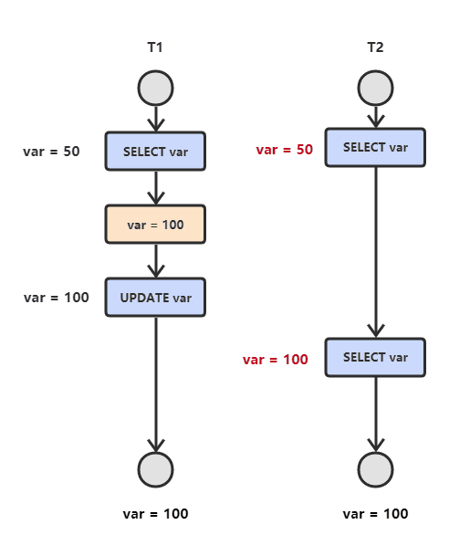
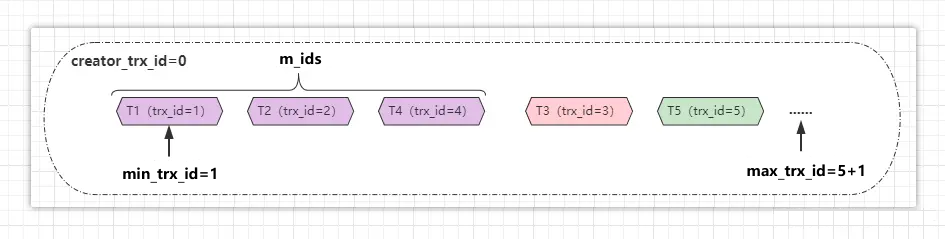
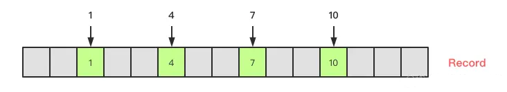
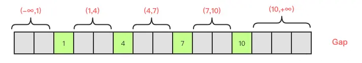
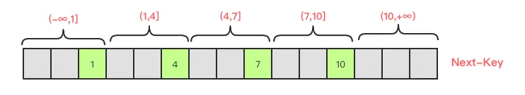
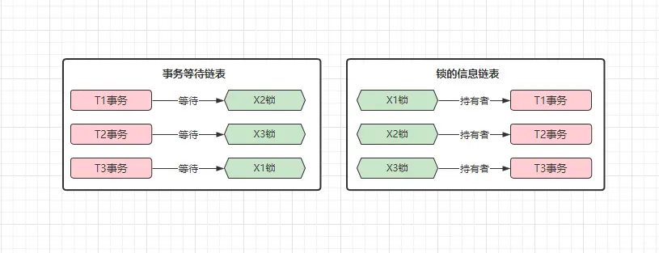
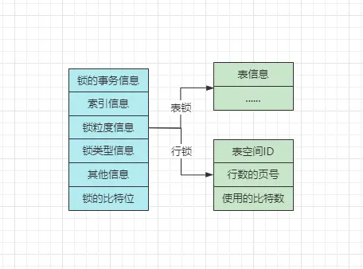
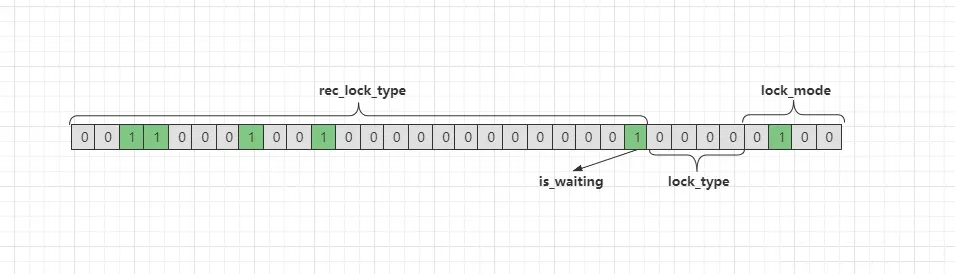
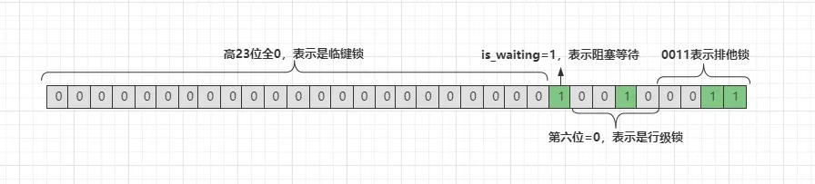

# MySQL架构


## 网络连接层

### 数据库连接池(Connection Pool)

`Connection Pool` 翻译过来的意思就是连接池，那为什么需要有这个东西呢？因为所有的客户端连接都需要一条线程去维护，而线程资源无论在哪里都属于宝贵资源，因此不可能无限量创建，所以这里的连接池就相当于 `Tomcat` 中的线程池，主要是为了复用线程、管理线程以及限制最大连接数的。

连接池的最大线程数可以通过参数 `max-connections` 来控制，如果到来的客户端连接超出该值时，新到来的连接都会被拒绝，关于最大连接数的一些命令主要有两条：

- `show variables like '%max_connections%';`：查询目前 DB 的最大连接数；
- `set GLOBAL max_connections = 200;`：修改数据库的最大连接数为指定值。

对于不同的机器配置，可以适当的调整连接池的最大连接数大小，以此可以在一定程度上提升数据库的性能。除了可以查询最大连接数外，`MySQL` 本身还会对客户端的连接数进行统计，对于这点可以通过命令 `show status like "Threads%";` 查询。


其中各个字段的释义如下：

- `Threads_cached`：目前空闲的数据库连接数。
- `Threads_connected`：当前数据库存活的数据库连接数。
- `Threads_created`：`MySQL-Server`运行至今，累计创建的连接数。
- `Threads_running`：目前正在执行的数据库连接数。

对于几个字段很容易理解，额外要说明的一点是 `Threads_cached` 这个字段，从名称上来看，似乎跟缓存有关系，其实也没错，因为这里是有一个数据库内部的优化机制。当一个客户端连接断开后，对于数据库连接却不会立马销毁，而是会先放入到一个缓存连接池当中。这样就能在下次新连接到来时，省去了创建线程、分配栈空间等一系列动作，但这个值不会是无限大的，一般都在 32 左右。

> 连接池的优化思想与`Java`线程池相同，会将数据库创建出的连接对象放入到一个池中，一旦出现新的访问请求会复用这些连接，一方面提升了性能，第二方面还节省了一定程度上的资源开销。

## 系统服务层

### SQL接口

主要作用是负责处理客户端的 SQL 语句，当客户端连接建立成功之后，会接收客户端的 SQL 命令，比如 DML、DDL 语句以及存储过程、触发器等，当收到 SQL 语句时，SQL 接口会将其分发给其他组件，然后等待接收执行结果的返回，最后会将其返回给客户端。简单来说，也就是 SQL 接口会作为客户端连接传递 SQL 语句时的入口，并且作为数据库返回数据时的出口。

### 解析器

 解析器这一步的作用主要是为了验证 SQL 语句是否正确，以及将 SQL 语句解析成 `MySQL` 能看懂的机器码指令。

### 优化器

优化器的主要职责在于生成执行计划，比如选择最合适的索引，选择最合适的 `join` 方式等，最终会选择出一套最优的执行计划。优化器生成了执行计划后，维护当前连接的线程会负责根据计划去执行 SQL，这个执行的过程实际上是在调用存储引擎所提供的 API。

### 缓存&缓冲

#### 读取缓存

读取缓存主要是指 `select` 语句的数据缓存，当然也会包含一些权限缓存、引擎缓存等信息，但主要还是 `select` 语句的数据缓存，`MySQL` 会对于一些经常执行的查询 SQL 语句，将其结果保存在 `Cache` 中，因为这些 SQL 经常执行，因此如果下次再出现相同的 SQL 时，能从内存缓存中直接命中数据，自然会比走磁盘效率更高，对于 `Cache` 是否开启可通过命令查询。

- `show global variables like "%query_cache_type%";`：查询缓存是否开启；
- `show global variables like "%query_cache_size%";`：查询缓存的空间大小；
- `show status like'%Qcache%';`：查询缓存相关的统计信息。

在`MySQL5.7` 版本，这些依旧可以查询到，但是在高版本的 `MySQL` 中，移除了查询缓存区，毕竟命中率不高，而且查询缓存这一步还要带来额外开销，同时一般程序都会使用 `Redis` 做一次缓存，因此结合多方面的原因就移除了查询缓存的设计。

#### 写入缓冲

一般来说，当你对数据库进行写操作时，都会先从缓冲区中查询是否有你要操作的页，如果有，则直接对内存中的数据页进行操作（例如修改、删除等），对缓冲区中的数据操作完成后，会直接给客户端返回成功的信息，然后 `MySQL` 会在后台利用一种名为 `Checkpoint`的机制，将内存中更新的数据刷写到磁盘。

> 缓冲区是与存储引擎有关的，不同的存储引擎实现也不同，比如 `InnoDB` 的缓冲区叫做 `innodb_buffer_pool`，而 `MyISAM` 则叫做 `key_buffer`。

## 存储引擎层

存储引擎也可以理解成 `MySQL` 最重要的一层，在前面的服务层中，聚集了 `MySQL` 所有的核心逻辑操作，而引擎层则负责具体的数据操作以及执行工作。

如果研究过 `Oracle、SQLServer` 等数据库的实现，会发现这些数据库只有一个存储引擎，因为它们是闭源的，所以仅有官方自己提供的一种引擎。而 `MySQL` 则因为其开源特性，所以存在很多很多款不同的存储引擎实现，`MySQL` 为了能够正常搭载不同的存储引擎运行，因此引擎层是被设计成可拔插式的，也就是可以根据业务特性，为自己的数据库选择不同的存储引擎。

`MySQL` 目前有非常多的存储引擎可选择，其中最为常用的则是 `InnoDB` 与 `MyISAM` 引擎。

存储引擎是 `MySQL` 数据库中与磁盘文件打交道的子系统，不同的引擎底层访问文件的机制也存在些许细微差异，引擎也不仅仅只负责数据的管理，也会负责库表管理、索引管理等， `MySQL` 中所有与磁盘打交道的工作，最终都会交给存储引擎来完成。

```mysql
# 查看当前所使用的引擎
show variables like '%storage_engine%';
```

## 文件系统层

这一层则是 `MySQL` 数据库的基础，本质上就是基于机器物理磁盘的一个文件系统，其中包含了配置文件、库表结构文件、数据文件、索引文件、日志文件等各类 `MySQL` 运行时所需的文件，这一层的功能比较简单，也就是与上层的存储引擎做交互，负责数据的最终存储与持久化工作。

### 日志模块

 在 `MySQL` 中存在以下常用的日志类型：

- ①`undo-logs`：撤销/回滚日志：记录事务开始前[修改数据]的备份，用于回滚事务（`InnoDB` 独有）。
- ②`redo-log`：重做/重写日志， `MySQL` 崩溃时，对于未落盘的操作会记录在这里面，用于重启时重新落盘（`InnoDB` 独有）。
- ③`bin-log`：变更日志，主要是记录所有对数据库表结构变更和表数据修改的操作，对于`select、show`这类读操作并不会记录。`bin-log` 是 `MySQL-Server` 级别的日志，也就是所有引擎都能用的日志，而 `redo-log、undo-log` 都是 `InnoDB` 引擎专享的，无法跨引擎生效。
- ④`error-log`：错误日志：记录 `MySQL` 启动、运行、停止时的错误信息。
- ⑤`slow-log`：慢查询日志，主要记录执行时间较长的 SQL。
- ⑥`general-log`：常规日志，主要记录 `MySQL` 收到的每一个查询或 SQL 命令。
- ⑦`relay-log`：中继日志，主要用于主从复制做数据拷贝。

#### undo-log

##### undo-log的内存缓冲区

`InnoDB` 在 `MySQL` 启动时，会在内存中构建一个 `BufferPool`，而这个缓冲池主要存放两类东西，一类是数据相关的缓冲，如索引、锁、表数据等，另一类则是各种日志的缓冲，如 `Undo、Bin、Redo....` 等日志。

而当一条写 SQL 执行时，不会直接去往磁盘中的 `xx.ibdata` 文件写数据，而是会写在 `undo_log_buffer` 缓冲区中，因为工作线程直接去写磁盘太影响效率了，写进缓冲区后会由后台线程去刷写磁盘。

如果当一个事务提交时，`undo` 的旧记录会不会立马被删除呢？因为事务都提交了，不需要再回滚改动过的数据，似乎用不上 `undo` 旧记录了，对吗？确实如此，但不会立马删除 `undo` 记录，对于旧记录的删除工作，`InnoDB` 中会有专门的 `purger` 线程负责，`purger` 线程内部会维护一个 `ReadView`，它会以此作为判断依据，来决定何时移除 `undo` 记录。为什么不是事务提交后立马删除 `undo` 记录呢？因为可能会有其他事务在通过快照，读 `undo` 版本链中的旧数据，直接移除可能会导致其他事务读不到数据，因此删除的工作就交给了 `purger` 线程。

##### undo-log相关参数

`MySQL5.5`之前：

- `innodb_max_undo_log_size`：本地磁盘文件中，`undo-log` 的最大值，默认 `1GB`。
- `innodb_rollback_segments`：指定回滚段的数量，默认为 `1` 个。

在 `MySQL5.5` 版本以后，`undo-log` 日志支持单独存放，并且多出了几个参数可以调整 `undo-log` 的区域。

* `innodb_undo_directory`：指定 `undo-log` 的存放目录，默认放在 `.ibdata` 文件中。
* `innodb_undo_logs`：指定回滚段的数量，默认为 `128` 个，也就是之前的 `innodb_rollback_segments`。
* `innodb_undo_tablespaces`：指定 ` undo-log` 分成几个文件来存储，必须开启 `innodb_undo_directory` 参数。
* `innodb_undo_log_truncate`：是否开启 `undo-log` 的在线压缩功能，即日志文件超过大小一半时自动压缩，默认 `OFF` 关闭。

#### redo-log

> 为什么需要 `redo-log`？
>
> `MySQL` 绝大部分引擎都是是基于磁盘存储数据的，但如若每次读写数据都走磁盘，其效率必然十分低下，因此 `InnoDB` 引擎在设计时，当 `MySQL` 启动后就会在内存中创建一个  `BufferPool`，运行过程中会将大量操作汇集在内存中进行，比如写入数据时，先写到内存中，然后由后台线程再刷写到磁盘。
>
> 虽然使用 `BufferPool` 提升了 `MySQL` 整体的读写性能，但它是基于内存的，也就意味着随着机器的宕机、重启，其中保存的数据会消失，那当一个事务向内存中写入数据后，`MySQL` 突然宕机了，这条未刷写到磁盘的数据会丢失。因为该原因，推出了 `redo-log`。
>
> 数据写到内存后有丢失风险，违背了事务 `ACID` 原则中的持久性，所以 `redo-log` 的出现就是为了解决该问题，`redo-log` 是一种预写式日志，在向内存写入数据前，会先写日志，当后续数据未被刷写到磁盘、`MySQL` 崩溃时，就可以通过日志来恢复数据，确保所有提交的事务都会被持久化。工作线程执行 SQL 前，`redo-log` 日志写在了内存中的 `redo_log_buffer` 缓冲区。

##### redo-log相关参数

* `innodb_flush_log_at_trx_commit`：设置 `redo_log_buffer` 的刷盘策略：
  * `0`：有事务提交的情况下，每间隔一秒时间刷写一次日志到磁盘。
  * `1`：每次提交事务时，都刷写一次日志到磁盘（性能最差，最安全，默认策略）。
  * `2`：每当事务提交时，把日志记录放到内核缓冲区，刷写的时机交给`OS`控制（性能最佳）。
* `innodb_log_group_home_dir`：指定 `redo-log` 日志文件的保存路径，默认为 `./`。
* `innodb_log_buffer_size`：指定 `redo_log_buffer` 缓冲区的大小，默认为 `16MB`。
* `innodb_log_files_in_group`：指定 `redo` 日志的磁盘文件个数，默认为 `2` 个。
* `innodb_log_file_size`：指定 `redo` 日志的每个磁盘文件的大小限制，默认为 `48MB`。

其中讨论一下 `redo-log` 的本地磁盘文件个数，为什么默认是 `2` 个呢？因为 `MySQL` 通过来回写这两个文件的形式记录 `redo-log` 日志，用两个日志文件组成一个“环形”。


简单解释一下图中存在的两根指针：

- `write pos`：这根指针用来表示当前 `redo-log` 文件写到了哪个位置。
- `check point`：这根指针表示目前哪些 `redo-log` 记录已经失效且可以被擦除（覆盖）。

两根指针中的红色区域，代表是可以写入日志记录的可用空间，而蓝色区域则表示日志落盘但数据还未落盘的记录。当一个事务写了 `redo-log` 日志、并将数据写入缓冲区后，但数据还未写到本地的表数据文件中，此时这个事务对应的 `redo-log` 记录就为上图中的蓝色，而当一个事务所写的数据也落盘后，对应的 `redo-log` 记录就会变为红色。当 `write pos` 指针追上 `check point` 指针时，红色区域就会消失，也就代表 `redo-log` 文件满了，再当 `MySQL` 执行写操作时就会被阻塞，因为无法再写入 `redo-log` 日志了，所以会触发 `checkpoint` 刷盘机制，将 `redo-log` 记录对应的事务数据，全部刷写到磁盘中的表数据文件后，阻塞的写事务才能继续执行。触发`checkpoint`刷盘机制后，随着数据的落盘，`check point`指针也会不断的向后移动，红色区域也会不断增长，因此阻塞的写事务才能继续执行。

有一些关于 `checkpoint` 机制的系统参数：

* `innodb_log_write_ahead_size`：设置 `checkpoint` 刷盘机制每次落盘动作的大小，默认为 `8K`，如果要设置，必须要为 `4k` 的整数倍，这跟 `read-on-write` 问题有关。
* `innodb_log_compressed_pages`：是否对 `redo` 日志开启页压缩机制，默认 `ON`，这跟 `InnoDB` 的页压缩技术有关。
* `innodb_log_checksums`：`redo` 日志完整性效验机制，默认开启，必须要开启，否则有可能刷写数据时，只刷一半，出现类似于“网络粘包”的问题。

#### bin-log

##### bin-log的缓冲区

`bin-log` 与 `redo-log、undo-log` 的缓冲区并不同，前面两种日志缓冲区，都位于 `InnoDB` 创建的共享 `BufferPool` 中，而 `bin_log_buffer` 位于每个线程中。也就是说，`MySQL-Server` 会给每一条工作线程，都分配一个 `bin_log_buffer`，而并不是放在共享缓冲区中，这是为什么呢？因为 `MySQL` 设计时要兼容所有引擎，直接将 `bin-log` 的缓冲区，设计在线程的工作内存中，这样就能够让所有引擎通用，并且不同线程/事务之间，由于写的都是自己工作内存中的 `bin-log` 缓冲，因此并发执行时也不会冲突。

##### bin-log本地日志文件的格式

`bin-log` 的本地日志文件，采用的是追加写的模式，也就是一直向文件末尾写入新的日志记录，当一个日志文件写满后，会创建一个新的 `bin-log` 日志文件，每个日志文件的命名为`mysql-bin.000001、mysql-bin.000002、mysql-bin.00000x....`，可以通过 `show binary logs;` 查看已有的 `bin-log` 日志文件。

在 `bin-log` 的本地文件中，其中存储的日志记录共有 `Statment、Row、Mixed` 三种格式：


目前推荐使用的是 `row` 模式，准确性高，虽然说文件大，但是现在有 SSD 和万兆光纤网络，这些磁盘 IO 和网络 IO 都是可以接受的。

> `Mixed` 模式下主从不一致问题：
>
> 当在主库上更新一条从库不存在的记录时，在主库是可以执行成功的，而从库拿到这个SQL后，也会照常执行，不报任何异常，只是更新操作不影响行数而已。并且执行命令 `show slave status`，查看输出，会发现没有异常。但是，如果是 `Row` 模式，由于这行根本不存在，会报 `1062` 错误。

##### bin-log相关的参数

* `log_bin`：是否开启 `bin-log` 日志，默认 `ON` 开启，表示会记录变更数据库的操作。
* `log_bin_basename`：设置 `bin-log` 日志的存储目录和文件名前缀，默认为 `./bin.0000x`。
* `log_bin_index`：设置 `bin-log` 索引文件的存储位置，因为本地有多个日志文件，需要用索引来确定目前该操作的日志文件。
* `binlog_format`：指定 `bin-log` 日志记录的存储方式，可选 `Statment、Row、Mixed`。
* `max_binlog_size`：设置 `bin-log` 本地单个文件的最大限制，最多只能调整到 `1GB`。
* `binlog_cache_size`：设置为每条线程的工作内存，分配多大的 `bin-log` 缓冲区。
* `sync_binlog`：控制 `bin-log` 日志的刷盘策略：
  * `0`：同 `redo-log` 的 `innodb_flush_log_at_trx_commit` 参数的`2`，交给`OS`控制（默认）。
  * `1`：同 `redo-log` 的`innodb_flush_log_at_trx_commit` 参数的 `1`，每次提交事务都会刷盘。

* `binlog_do_db`：设置后，只会收集指定库的 `bin-log` 日志，默认所有库都会记录。

### 数据模块

 前面聊到过，`MySQL` 的所有数据最终都会落盘（写入到磁盘），而不同的数据在磁盘空间中，存储的格式也并不相同，因此再列举出一些 `MySQL` 中常见的数据文件类型：

- `db.opt`文件：主要记录当前数据库使用的字符集和验证规则等信息；
- `.frm`文件：存储表结构的元数据信息文件，每张表都会有一个这样的文件；
- `.MYD`文件：用于存储表中所有数据的文件（`MyISAM` 引擎独有）；
- `.MYI`文件：用于存储表中索引信息的文件（`MyISAM` 引擎独有）；
- `.ibd`文件：用于存储表数据和索引信息的文件（`InnoDB` 引擎独有）；
- `.ibdata`文件：用于存储共享表空间的数据和索引的文件（`InnoDB` 引擎独有）；
- `.ibdata1`文件：这个主要是用于存储 `MySQL` 系统（自带）表数据及结构的文件；
- `.ib_logfile0/.ib_logfile1`文件：用于故障数据恢复时的日志文件；
- `.cnf/.ini`：`MySQL` 的配置文件，Windows 下是 `.ini`，其他系统大多为 `.cnf`；

# 索引

> 索引是一种用于快速查询和检索数据的数据结构，索引的作用就相当于目录的作用。打个比方，我们在查字典的时候，如果没有目录，那我们就只能一页一页的去找我们需要查的那个字，速度很慢。如果有目录了，我们只需要先去目录里查找字的位置，然后直接翻到那一页就行了。
>
> 数据库是基于磁盘工作的，所有的数据都会放到磁盘上存储，而索引也是数据的一种，因此与表数据相同，最终创建出的索引也会在磁盘生成本地文件。 不过索引文件在磁盘中究竟以何种方式存储，这是由索引的数据结构来决定的。同时，由于索引机制最终是由存储引擎实现，因此不同存储引擎下的索引文件，其保存在本地的格式也并不相同。
>
> 建立索引的工作在表数据越少时越好，因为索引实质上和表是一样的，都是磁盘中的文件，那也就代表着创建一个索引，并不像单纯的给一张表加个约束那么简单，而是会基于原有的表数据，重新在磁盘中创建新的本地索引文件。假设表中有一千万条数据，那创建索引时，就需要将索引字段上的 1000W 个值全部拷贝到本地索引文件中，同时做好排序并与表数据产生映射关系。

## MySQL索引分类

### 数据结构层次

索引建立后也会在磁盘生成索引文件，那每个具体的索引节点该如何在本地文件中存放呢？这点是由索引的数据结构来决定的。比如索引的底层结构是数组，那所有的索引节点都会以 `Node1→Node2→Node3→Node4....` 这样的形式，存储在磁盘同一块物理空间中，不过 `MySQL`的索引不支持数组结构，或者说数组结构不适合作为索引结构，`MySQL` 索引支持的数据结构如下：

- `B+Tree` 类型：`MySQL` 中最常用的索引结构，大部分引擎支持，有序
- `Hash` 类型：大部分存储引擎都支持，字段值不重复的情况下查询最快，无序
- ......

索引到底支持什么数据结构，这是由存储引擎决定的，不同的存储引擎支持的索引结构也并不同。在 `MySQL` 中创建索引时，其默认的数据结构就为 `B+Tree`，如何更换索引的数据结构呢？

```mysql
CREATE INDEX `index_name` ON `table_name` (`column_name`(`length`) [ASC|DESC]) USING HASH|BTREE;
```

也就是在创建索引时，通过 `USING` 关键字显示指定索引的数据结构（必须要为当前引擎支持的结构）。同时索引会被分为有序索引和无序索引，这是指索引文件中存储索引节点时，会不会按照字段值去排序。那一个索引到底是有序还是无序，就是依据数据结构决定的，例如 `B+Tree` 等树结构都是有序，而哈希结构则是无序的。

### 功能逻辑层次

#### 普通索引（Index）

> 普通索引的唯一作用就是为了提高查询数据速度，一张表允许创建多个普通索引，并允许重复数据和 `NULL`。

##### 创建

- ①使用 `CREATE` 语句创建：

  ```mysql
  CREATE INDEX|KEY `index_name` ON `table_name`(`column_name`(`length`) [ASC|DESC], ...);
  ```

  这种创建方式可以给一张已存在的表结构添加索引，其中需要指定几个值：

  - `index_name`：当前创建的索引，创建成功后的名称
  - `table_name`：要在哪张表上创建一个索引，这里指定表名
  - `column_name`：要为表中的哪个字段创建索引，这里指定字段名
  - `length`：如果字段存储的值过长，选用值的前多少个字符创建索引
  - `ASC|DESC`：指定索引的排序方式，`ASC` 是升序（默认），`DESC` 是降序

- ②使用 `ALTER` 语句创建：

  ```mysql
  ALTER TABLE `index_name` ADD INDEX `table_name`(`column_name`(`length`) [ASC|DESC], ...);
  ```

* ③建表时 `DDL` 语句中创建：

  ```mysql
  CREATE TABLE `table_name`(  
    col1 ...,   
    col2 ...,
    ......,
    INDEX [`index_name`] (`column_name`(`length`))  
  );
  ```

##### 查询、删除、指定索引

```mysql
# 查询表中拥有的索引
SHOW INDEX FROM `table_name`;
```


- ①`Table`：当前索引属于哪张表
- ②`Non_unique`：目前索引是否属于唯一索引，`0` 代表是，`1` 代表不是
- ③`Key_name`：当前索引名
- ④`Seq_in_index`：如果当前是联合索引，目前字段在联合索引中排第几个
- ⑤`Column_name`：当前索引是位于哪个字段上建立的
- ⑥`Collation`：字段值以什么方式存储在索引中，`A` 表示有序存储，`NULL` 表无序
- ⑦`Cardinality`：当前索引的散列程度，也就是索引中存储了多少个不同的值
- ⑧`Sub_part`：当前索引使用了字段值的多少个字符建立，`NULL` 表示全部
- ⑨`Packed`：表示索引在存储字段值时，以什么方式压缩，`NULL` 表示未压缩
- ⑩`Null`：当前作为索引字段的值中，是否存在 `NULL` 值，`YES` 表示存在
- ⑪`Index_type`：当前索引的结构（`BTREE，HASH`）

在 `MySQL` 中并未提供修改索引的命令，也是就说建错了索引，只能先删再重新建立一次，删除索引的语句如下：

```mysql
DROP INDEX `index_name` ON `table_name`;
```

在一条 `SELECT` 语句来到 `MySQL` 时，会经历优化器优化的过程，而优化器则会自动选择一个最合适的索引查询数据。当然，前提是查询条件中涉及到了索引字段才行。不想让优化器自动选择，也可以手动通过 `FORCE INDEX` 关键字强制指定：

```mysql
SELECT * FROM `table_name` FORCE INDEX(`index_name`) WHERE .....;
```

`FORCE INDEX` 关键字可以为一条查询语句强制指定走哪个索引查询，但要牢记的是：**如果当前的查询 SQL 压根不会走指定的索引字段，那这种方式是行不通的**，这个关键字的用法是：一条查询语句在有多个索引可以检索数据时，显式指定一个索引，减少优化器选择索引的耗时。

#### 唯一索引（Unique Key）

> 唯一索引中的索引节点值不允许重复，但是允许数据为 `NULL`，一张表允许创建多个唯一索引。建立唯一索引的目的大部分时候都是为了该属性列的数据的唯一性，而不是为了查询效率。

唯一索引在创建时，需要通过 `UNIQUE` 关键字创建：

```mysql
-- 方式①
CREATE UNIQUE INDEX `index_name` ON `table_name` (`column_name`(`length`));

-- 方式②
ALTER TABLE `table_name` ADD UNIQUE INDEX `index_name`(`column_name`);

-- 方式③
CREATE TABLE `table_name`(  
  col1 ...,   
  col2 ...,
  ......,
  UNIQUE INDEX [`index_name`] (`column_name`(`length`))  
);
```

在已有的表基础上创建唯一索引时要注意，如果选用的字段，表中字段的值存在相同值时，这时唯一索引是无法创建的。在这种情况下，就只能先删除重复数据，然后才能创建成功。

#### 主键索引（Primary Key）

> 表的主键列使用的就是主键索引。一张表有只能有一个主键，主键唯一非空。如果表中没有定义主键，`InnoDB` 会自动选择一个唯一的非空索引作为主键索引，但如果非空唯一索引也不存在，`InnoDB`  会隐式定义一个顺序递增的主键作为主键索引。

主键索引其实是一种特殊的唯一索引，通过 `PRIMARY` 关键字创建：

```mysql
-- 方式①
ALTER TABLE `table_name` ADD PRIMARY KEY `index_name`(`column_name`);

-- 方式②
CREATE TABLE `table_name`(  
  col1 ...,   
  col2 ...,
  ......,
  PRIMARY KEY [`index_name`] (`column_name`(`length`))  
);
```

创建主键索引时，必须要将索引字段先设为主键，不能使用 `CREATE` 语句创建，创建索引时，关键字要换成 `KEY`，不能是 `INDEX`，否则会提示语法错误。

在设计表的时候，不建议使用过长的字段作为主键，也不建议使用非单调的字段作为主键，这样会造成主索引频繁分裂。

#### 全文索引（Full Text）

> `MySQL5.6` 之前只有 `MyISAM` 引擎支持全文索引，5.7  `InnoDB` 也支持了全文索引，但是不支持中文全文索引。`MySQL5.7.6` 内置了 `ngram` 全文解析器，用来支持亚洲语种的分词。
>
> 全文索引类似于 `ES、Solr` 搜索中间件中的分词器，或者说和之前常用的 `like%` 模糊查询很类似，它只能创建在 `CHAR、VARCHAR、TEXT` 等这些文本类型字段上，而且使用全文索引查询时，条件字符数量必须大于最小字符数才生效。可以用全文索引代替之前的 `like%` 模糊查询，效率会更高。

全文索引和其他索引不同，想要创建全文索引，那么 `MySQL` 版本必须支持 ，同时使用时也需要手动指定，通过`FULLTEXT` 关键字创建：

```mysql
-- 方式①
ALTER TABLE `table_name` ADD FULLTEXT INDEX `index_name`(`column_name`);

-- 方式②
CREATE FULLTEXT INDEX `index_name` ON `table_name`(`column_name`);
```

举个栗子，为文章名称字段创建一个全文索引：

```mysql
ALTER TABLE article ADD FULLTEXT INDEX ft_article_name(article_name) WITH PARSER NGRAM;
```

创建好全文索引后，当使用全文索引时，优化器这时不能自动选择，因为全文索引有自己的语法，但在了解如何使用之前，得先清楚两个概念：最小搜索长度和最大搜索长度，先来看看全文索引的一些参数，可通过 `show variables like '%ft%';` 命令查询，如下：


重点讲一下其中的几个重要参数：

- `ft_min_word_len`：使用 `MyISAM` 引擎的表中，全文索引最小搜索长度。
- `ft_max_word_len`：使用 `MyISAM` 引擎的表中，全文索引最大搜索长度。
- `ft_query_expansion_limit`：`MyISAM` 中使用 `with query expansion` 搜索的最大匹配数。
- `innodb_ft_min_token_size`：`InnoDB` 引擎的表中，全文索引最小搜索长度。
- `innodb_ft_max_token_size`：`InnoDB` 引擎的表中，全文索引最大搜索长度。

那么究竟最小搜索长度、最大搜索长度的作用是什么呢？其实这个是一个限制，对于长度小于最小搜索长度和大于最大搜索长度的词语，都无法触发全文索引。也就是说，如果想要使用全文索引对一个词语进行搜索，那这个词语的长度必须在这两个值之间。

> 这两个值自己可以手动调整的，最小值可以手动调整为 1，`MyISAM` 引擎的最大值可以调整为 3600，但 `InnoDB` 引擎最大似乎就是 84。

全文索引中有两个专门用于检索的关键字，即 `MATCH(column)、AGAINST(keyword)`。`MATCH()` 主要是负责指定要搜索的列，这里要指定创建全文索引的字段，`AGAINST()` 则指定要搜索的关键字，也就是要搜索的词语，接下来简单的讲一下三种搜索模式。

##### 自然语言模式

这种模式也是在使用全文索引时，默认的搜索模式，使用方法如下：

```mysql
+------------+--------------------------+-------------------+
| article_id | article_name             | special_column    |
+------------+--------------------------+-------------------+
|          1 | MySQL架构篇：.......     | 《全解MySQL》     |
|          2 | MySQL执行篇：.......     | 《全解MySQL》     |
|          3 | MySQL设计篇：.......     | 《全解MySQL》     |
|          4 | MySQL索引篇：.......     | 《全解MySQL》     |
+------------+--------------------------+-------------------+

SELECT COUNT(article_id) AS '搜索结果数量' 
FROM article
WHERE MATCH(article_name) AGAINST('MySQL');
```

##### 布尔搜索模式

布尔搜索模式有些特殊，因为在这种搜索模式中，还需要掌握特定的搜索语法：

- `+`：表示必须匹配的行数据必须要包含相应关键字

- `-`：和上面的`+`相反，表示匹配的数据不能包含相应的关键字

- `>`：提升指定关键字的相关性，在查询结果中靠前显示

  > 相关性是检索数据后，数据的优先级顺序，当相关性越高，对应数据在结果中越靠前，当相关性为负，则相应的数据排到最后。

- `<`：降低指定关键字的相关性，在查询结果中靠后显示

- `~`：表示允许出现指定关键字，但出现时相关性为负

- `*`：表示以该关键字开头的词语，如 `A*`，可以匹配 `A、AB、ABC....`

- `""`：双引号中的关键字作为整体，检索时不允许再分词

- `"X Y"@n`：`""` 包含的多个词语之间的距离必须要在 `n` 之间，单位字节

- ......

举个几个例子：

```mysql
-- 查询文章名中包含 [MySQL] 但不包含 [设计] 的数据
SELECT *
FROM article
WHERE MATCH(article_name) AGAINST('+MySQL -设计' IN BOOLEAN MODE);

-- 查询文章名中包含 [MySQL] 和 [篇] 的数据，但两者间的距离不能超过10字节
SELECT  *
FROM article
WHERE MATCH(article_name) AGAINST('"MySQL 篇"@10' IN BOOLEAN MODE);
    
-- 查询文章名中包含[MySQL] 的数据，
-- 但包含 [执行] 关键字的行相关性要高于包含 [索引] 关键字的行数据
SELECT *
FROM article 
WHERE MATCH(article_name) AGAINST('+MySQL +(>执行 <索引)' IN BOOLEAN MODE);

-- 查询文章名中包含 [MySQL] 的数据，但包含 [设计] 时则将相关性降为负
SELECT *
FROM article
WHERE MATCH(article_name) AGAINST('+MySQL ~设计' IN BOOLEAN MODE);

-- 查询文章名中包含 [执行] 关键字的行数据
SELECT *
FROM article
WHERE MATCH(article_name) AGAINST('执行*' IN BOOLEAN MODE);

-- 查询文章名中必须要包含 [MySQL架构篇] 关键字的数据
SELECT *
FROM article 
WHERE MATCH(article_name) AGAINST('"MySQL架构篇"' IN BOOLEAN MODE);
```

##### 查询拓展搜索

查询拓展搜索其实是对自然语言搜索模式的拓展，比如举个例子：

```mysql
SELECT COUNT(article_id) AS '搜索结果数量' 
FROM article
WHERE MATCH(article_name) AGAINST('MySQL' WITH QUERY EXPANSION);
```

在自然语言模式的查询语句基础上，最后面多加一个 `WITH QUERY EXPANSION` 表示使用查询拓展搜索，这种模式下会比自然语言模式多一次检索过程：

1. 首先会根据指定的关键字 `MySQL` 进行一次全文检索
2. 然后会对指定的关键进行分词，然后再进行一次全文检索

之前介绍全文索引参数时，有一个名为 `ft_query_expansion_limit` 的参数，这个参数就是控制拓展搜索时的拓展行数的，最大可以调整到 `1000`。但由于 `Query Expansion` 的全文检索可能带来许多非相关性的查询结果，因此在实际情况中要慎用！

#### 前缀索引（Prefix Index）

前缀索引的索引列的值不是完整的列值，而是列值的一部分，通常是列值的前几个字符。前缀索引减小了索引文件的大小，从而降低了存储成本，提高了查询性能，因为较小的索引文件可以更快地加载到内存中。

使用以下语句创建前缀索引：

```mysql
CREATE INDEX `index_name` ON `table_name` (`column_name`(`N`));
```

### 字段数量层次

从表字段的层次来看，索引又可以分为单列索引和多列索引，单列索引是指索引是基于一个字段建立的，联合索引则是指由多个字段组合建立的索引。

#### 联合索引的最左前缀原则

组成联合索引的多个列，越靠左边优先级越高，同时也只有`SQL`查询条件中，包含了最左的字段，才能使用联合索引。比如此时基于 `X、Y、Z` 字段建立了一个联合索引，实际上也相当于建立了三个索引：`X`、`X、Y`、`X、Y、Z`，因此只要查询中使用了这三组字段，都可以让联合索引生效。

```mysql
SELECT * FROM tb WHERE Y = "..." AND Z = "...";
```

上面这条 SQL 就显然并不会使用联合索引，因为不符合最左前缀原则，最左侧的 `X` 字段未曾被使用。

建立联合索引时，一定要考虑优先级，查询频率最高的字段应当放首位。因为将查询频率越高的字段放首位，就代表着查询时命中索引的几率越大。同时，`MySQL` 的最左前缀原则，在匹配到范围查询时会停止匹配，比如 `>、<、between、like` 这类范围条件，并不会继续使用联合索引，举个栗子：

```mysql
SELECT * FROM tb WHERE X="..." AND Y > "..." AND Z="...";
```

当执行时，虽然上述 SQL 使用到 `X、Y、Z` 作为查询条件，但由于 `Y` 字段是 `>` 范围查询，因此这里只能使用 `X` 索引，而不能使用 `X、Y` 或 `X、Y、Z` 索引。

### 存储方式层次

#### 聚簇索引

聚簇索引是索引结构和数据一起存放的索引，一张表中只能存在一个聚簇索引，主键索引属于聚簇索引，这种索引为 `InnoDB` 特有。

#### 非聚簇索引

非聚簇索引即索引结构和数据分开存放的索引，一张表中可以有多个非聚簇索引。`MyISAM` 的主键索引属于非聚簇索引，叶子节点不存放数据而是存放指向数据的地址。`InnoDB` 除主键索引外其他所有索引都是非聚簇索引，叶子节点存放的是主键，根据主键再回表查数据。

## MySQL索引实现原理

> 索引机制是由存储引擎层提供实现的，不同的引擎实现的索引也不同，因此创建索引时会根据不同的存储引擎创建索引，这里重点讨论常用的 `InnoDB` 和 `MyISAM`。

### InnoDB和MyISAM的数据存储方式

首先为了能够实际观察到两个引擎之间的区别，分别使用 `MyISAM、InnoDB` 两个引擎创建两张表：

```mysql
-- 创建一张使用MyISAM引擎的表：myisam_index
CREATE TABLE `myisam_index`  (
  `m_id` int(8) NOT NULL,
  `m_name` varchar(255) NULL DEFAULT ''
) 
ENGINE = MyISAM 
CHARACTER SET = utf8 
COLLATE = utf8_general_ci 
ROW_FORMAT = Compact;

-- 创建一张使用InnoDB引擎的表：innodb_index
CREATE TABLE `innodb_index`  (
  `i_id` int(8) NOT NULL,
  `i_name` varchar(255) NULL DEFAULT ''
) 
ENGINE = InnoDB 
CHARACTER SET = utf8 
COLLATE = utf8_general_ci 
ROW_FORMAT = Compact;
```

上述过程中分别使用了不同的引擎创建了两张表：`myisam_index、innodb_index`，而 `MySQL` 中对于所有的数据都会放入到磁盘中存储，这两张表的本地位置默认位于 `C:\ProgramData\MySQL\MySQL Server x.x\data` 这个目录中，在这里保存着所有已创建的数据库文件。

#### 使用MyISAM的表

`myisam_index` 这张表是使用 `MyISAM` 引擎的表，在磁盘中有三个文件：

- `myisam_index.frm`：存储表的结构信息
- `myisam_index.MYI`：存储表的索引数据
- `myisam_index.MYD`：存储表的行数据

`MyISAM` 引擎的表数据和索引数据，是分别放在两个不同的磁盘文件中存储的，`.MYI` 索引文件中存储的是表数据所在的地址指针。这也说明了 `MyISAM` 不支持聚簇索引，因为聚簇索引的索引结构和数据是存放在一起的。

#### 使用InnoDB的表

`innodb_index` 这张表是使用 `InnoDB` 引擎的表，在磁盘中仅有两个文件：

- `innodb_index.frm`：存储表的结构信息
- `innodb_index.ibd`：存储表的行数据和索引数据

`InnoDB` 引擎中，表数据和索引数据都一起放在 `.ibd` 文件中，也就代表着索引数据和表数据是处于同一块空间存储的，这符合聚簇索引的定义，因此 `InnoDB` 支持聚簇索引。

> 正由于这个原因，所以如果使用 `InnoDB` 引擎的表未主动创建聚簇索引，它会自动选择表中的主键字段，作为聚簇索引的字段。但如果表中未声明主键字段，那则会选择一个非空唯一索引来作为聚簇索引。但如果表中依旧没有非空的唯一索引，`InnoDB` 则会隐式定义一个主键来作为聚簇索引（这个列在上层是不可见的，是一个按序自增的值）。

### 索引创建过程

当手动创建索引后，`MySQL` 会先看一下当前表的存储引擎，接着会判断一下表中是否存在数据，如果表中没有数据，则直接构建一些索引的信息，例如索引字段是谁、索引键占多少个字节、创建的是什么类型索引、索引的名字、索引归属哪张表、索引的数据结构.....，然后直接写入对应的磁盘文件中，比如 `MyISAM` 的表则写入到 `.MYI` 文件中，`InnoDB` 引擎的表则写入到 `.ibd` 文件中。

上述这个过程，是表数据为空时，创建索引会干的工作，还算比较简单，但当表中有数据时，会多出很多步骤。

当表中有数据时，首先 `MySQL-Server` 会先看一下目前要创建什么类型的索引，然后基于索引的类型对索引字段的值，进行相应的处理，比如：

- 唯一索引：判断索引字段的每个值是否存在重复值，如果有则抛出错误码和信息
- 主键索引：判断主键字段的每个值是否重复、是否有空值，有则抛出错误信息
- 全文索引：判断索引字段的数据类型是否为文本，对索引字段的值进行分词处理
- 前缀索引：对于索引字段的值进行截取工作，选用指定范围的值作为索引键
- 联合索引：对于组成联合索引的多个列进行值拼接，组成多列索引键
- `......`

根据索引类型做了相应处理后，紧接着会再看一下当前索引的数据结构是什么？是 `B+Tree、Hash` 亦或是其他结构，然后根据数据结构对索引字段的值进行再次处理，如：

- `B+Tree`：对索引字段的值进行排序，按照顺序组成 `B+Tree` 结构。
- `Hash`：对索引字段的值进行哈希计算，处理相应的哈希冲突，方便后续查找。
- `.......`

到这一步为止，已经根据索引结构，对索引字段的值处理好了，此时就会准备将内存中处理好的字段数据，写入到本地相应的磁盘文件中，但如果此时为 `InnoDB` 引擎，那在写入前还会做最后一个判断，也就是判断当前的索引是否为主键/聚簇索引：

如果当前创建索引的字段是主键字段，则在写入时重构 `.ibd` 文件中的数据，将索引键和行数据调整到一块区域中存储。如果这里创建的不是主键/聚簇索引，或者目前是 `MyISAM` 引擎，则意味着现在需要创建的是非聚簇索引，因此会先会为每个索引键（索引字段值）寻找相应的行数据，找到之后与索引键关联起来，不过 `InnoDB、MyISAM` 引擎两者之间的非聚簇索引也会存在些许差异，所以在这里也会有一些不同：

- `InnoDB`：因为有聚簇索引存在，所以非聚簇索引在与行数据建立关联时，存放的是主键/聚簇索引的字段值。
- `MyISAM`：由于表数据在单独的 `.MYD` 文件中，因此可以直接以指针的形式关联起来。

也就是说，`InnoDB` 引擎中的非聚簇索引，都是主键/聚簇索引的“附庸”，因此每个索引信息中是以「索引键：聚簇字段值」这种形式关联的。

但 `MyISAM` 引擎中由于表数据和索引数据都是分开存储的，所以 `MyISAM` 的每个非聚簇索引都是独立的，因此每个索引信息则是以「索引键：行数据的地址指针」这种形式关联。

> 由于 `MyISAM` 引擎的非聚簇索引，关联的是行数据的指针，而 `InnoDB` 引擎关联的是聚簇索引的索引键，所以 `InnoDB` 的非聚簇索引在查询时需要回表，再查一次聚簇索引才能得到数据。而 `MyISAM` 每个非聚簇索引都能直接获取到行数据的地址，可以直接根据指针获取数据，从整体而言，`MyISAM` 检索数据的效率会比 `InnoDB` 快上不少。

到这里，索引键和行数据关联好之后，就会开始根据引擎的不同，将内存中的索引信息分别写入到不同的磁盘文件中。写完完成后，`B+Tree` 的根节点会放到内存中维护，以便于后续索引查询时再次从磁盘读取根节点信息。

> 表中不同的索引在本地有不同的索引记录，比如 `id、name` 字段分别建立了两个索引，那么就会有两颗不同的索引树写入到本地磁盘文件中。

> 到这里为止，应该明白了为什么创建表之后，此时创建索引会很快，但当表中有不少数据时创建索引会很慢的原因，就是因为表中有数据时，创建索引要做一系列判断、处理工作。

#### 索引键的大小会随着值长度变化吗？

这个问题很有趣，比如现在基于一个 `int` 类型的字段建立了一个索引，但目前的字段值是 `1`，按理来说这个值只占 `1bits`  对不对？那在索引键中，或数据库中占多少呢？答案是 `4Bytes/32bits`，这是因为一个  `int`  类型在操作系统中就会占用 `32bit` 空间，不会根据实际值而减少占用空间。

但数据库中还有不少文本类型，例如 `varchar` 类型，它是固定的长度吗？并不是，它是一个变长类型，而非一个定长类型，也就是一个 `varchar` 字段值，占用的空间会随着实际所存储的数据而变化。

所以对于一个索引键的大小是否会发生变化，这要取决于基于什么字段类型建立的索引，如果是定长类型就不会变化，但如果是变长类型就会随之发生改变。

### 索引内部查询与维护的过程

#### 聚簇索引查找数据的过程

当查询 SQL 来到 `MySQL` 后，经过一系列处理后，最终会来到优化器，此时会由优化器来为 SQL 语句选择出一个合适的索引，当然，也可以手动强制指定索引。那当 SQL 命中索引时，索引内部是如何查找对应的行数据的？

工作线程执行查询 SQL 时，首先会先看一下当前索引的结构，如果是 `Hash` 索引就很简单了，直接对索引字段的值进行哈希计算，然后直接根据哈希值，从索引中找到相应的索引信息，最后获取数据即可。

如果索引结构是默认的 `B+Tree`，此时首先会根据条件字段，去内存中找到聚簇索引的根节点，然后根据节点中记录的地址去找次级的叶节点，最后再根据叶节点中的指针地址，找到最下面的叶子节点，从而获取其中的行数据。

#### 非聚簇索引查找数据的过程

相较于聚簇索引而言，非聚簇索引前面的步骤都是相同的，仅是最后一步有些许不同罢了，非聚簇索引经过一系列查询步骤后，最终会取到一个聚簇索引的字段值，然后再做一次回表查询，也就是再去聚簇索引中查一次才能取到数据。

> 如果是 `MyISAM` 引擎，则直接根据索引树中记录的指针地址，直接触发磁盘 IO 再次读取数据即可。

### 写SQL执行时索引的维护过程

前面分析了查询 SQL 执行时，索引查找数据的过程，那当出现增、删、改 SQL 时呢？索引会怎么维护呢？其实这里也要分索引类型，如果是 `Hash` 结构的索引，直接增删改对应的索引键即可，但 `B+Tree` 结构的索引，因为要内部节点是有序的，所以需要维护有序性。

#### 插入数据时索引的变化

`B+Tree` 索引是有序的，对于这点在前面已经反复提到了，但如果索引字段是数值类型，例如 `int、bigint、long` 等，本身就能区分大小顺序，此时可以直接做排序工作。但如果是基于字符串或其他类型的字段建立索引呢？又该如何排序？

在创建库表时，通常都会指定一个排序规则，而这个规则就是 `MySQL` 对非数值类型字段的排序规则，比如字符串类型的字段，`MySQL` 就会基于该规则对值先做计算处理，然后得到一个数值用于排序。

此时像数据库中插入一条数据时，还是以之前的用户表为例，比如：

```mysql
INSERT INTO tb_user VALUES(6,"ganyu",0);
```

同样假设用户表上有两个索引，一是基于自增 `id` 建立的主键索引，第二个则是基于 `name` 字段建立的普通索引。当表中插入这条数据后，索引又会发生什么变化呢？咱们分开聊聊。

##### 主键/聚簇索引的变化

因为主键索引字段，也就是 `id` 字段是顺序递增的，因此只需要在本地索引文件的 `B+Tree` 结构中，按照树结构找到最后的位置，将当前插入的 `id` 作为索引键，以当前插入的行数据作为索引值，然后插入到最后的节点中即可。

##### 普通/非聚簇索引的变化

因为 `name` 字段的数据类型是字符串，与数值型字段天生的有序不同，字符串类型是无序的，因此首先需要根据已经配置好的排序规则，先对插入的 `name`  进行计算，然后根据计算出的值，决定当前数据在 `B+Tree` 中的索引位置，计算好之后再执行插入工作。

相较于主键字段的顺序 `id`，插入字符串类型的 `name` 值会复杂一些，因为插入的数据经过计算后，它并不一定排最后面。若排不排在最后，要将这个值插入到对应的位置，此时树的节点会发生裂变，后续的所有叶子节点都需要往后移动，这个开销是较大的。同时，在插入索引信息时，会以 `name` 的值作为索引键，以  `id`  作为索引值，然后一同插入，也就是要与行数据建立关联（`MyISAM` 引擎则是行数据的地址指针）。

#### 删除数据时索引的变化

```mysql
DELETE FROM tb_user WHERE id = 6;
```

例如上述这条删除语句，当执行后则会先根据 `id` 在索引树中查找索引信息，然后先删除非聚簇索引上的索引信息，紧接着再去聚簇索引上删除主键索引信息和行数据。

#### 更改数据时索引的变化

```mysql
UPDATE tb_user SET name = "hutao" WHERE id = 6;
```

例如执行上述这条更新语句，首先在聚簇索引上查到 `id=6` 这条数据，获取原本的 `name` 字段值：`ganyu`，然后以该值去非聚簇索引上找到对应的索引信息，然后把聚簇索引上查到的数据的 `name` 字段更新为 `hutao`，接着删除次级（非聚簇）索引的信息，最后再插入一个 `hutao` 的次级索引信息。

## 索引的其他特性

### 索引覆盖

> 要查询的列，在使用的索引中已经包含，这种情况称之为索引覆盖。

在之前聊到过，由于表中只能存在一个聚簇索引，一般都为主键索引，而建立的其他索引都为辅助索引，包括联合索引也例外，最终索引节点上存储的都是指向主键索引的值，拿前面的用户表为例：

```mysql
SELECT * FROM `tb_user` WHERE `user_name`="keqing" AND `sex`=1;
```

虽然这条 SQL 会走联合索引查询，但是基于联合索引查询出来的值仅是一个指向主键索引的 id，然后会拿着这个 id 再去主键索引中查一遍，这个过程称为回表过程。

回表问题可以解决吗？必须得经过两次查询才能得到数据吗？

比如假设此时只需要 `user_name、sex` 这两个字段的信息，此时 SQL 语句可以更改为如下情况：

```mysql
SELECT `user_name`,`sex` FROM `tb_user` WHERE `user_name` = "keqing" AND `sex` = "1";
```

此时将 SQL 更改为查询所需的列后，就不会发生回表现象。因为此时所需的 `user_name、sex` 两个字段数据，在联合索引中完全包含，因此可以直接通过联合索引获取到数据。

> 但如果查询时用 `*`，因为联合索引中不具备完整的一行数据，只能再次转向聚簇索引中获取完整的行数据，因此到这里应该也明白了为什么查询数据时，不能用 `*` 的原因，这是因为会导致索引覆盖失效，造成回表问题。

当然，再来提一点比较有意思的事情，先看 SQL：

```mysql
EXPLAIN SELECT `user_name`,`sex` FROM `tb_user` WHERE `sex` = "1";
```

比如上述这条 SQL，显然是不符合联合索引的最左前缀匹配原则的，但来看看执行结果：


通过 `EXPLAIN` 分析的结果显示，这条 `SQL` 竟然使用了索引，这是什么原因呢？也是因为索引覆盖。

### 索引下推

> 索引下推是 `MySQL5.6` 版本以后引入的一种优化机制，将 `Server` 层筛选数据的工作，下推到引擎层处理。

 通过一个具体的示例来说明索引下推的概念。假设有一个包含以下列的数据库表 `employees`：

- `employee_id` (主键)
- `first_name`
- `last_name`
- `age`
- `department`

在 `age` 列上创建了一个单列索引，现在，查询年龄大于 30 岁且所在部门为 `Sales` 的员工信息。

如果数据库系统支持索引下推并可以使用单列索引，它将在索引层面执行部分过滤操作，以减少需要检索的数据行数。查询可能如下所示：

```mysql
SELECT * FROM employees WHERE age > 30 AND department = 'Sales';
```

在这个查询中，数据库系统会使用索引来首先定位所有年龄大于 30 岁的员工，这部分操作可以在索引层面执行。然后，对于这个子集，它会进一步检查部门是否为 `Sales`，并返回符合条件的结果。

这种方式相比于不使用索引下推，将所有数据行检索到数据层面然后进行过滤，显著提高了查询性能，因为数据库只需要处理满足条件的数据行。

需要注意的是，索引下推的有效性取决于数据库系统的优化器和支持的索引类型。不同的数据库系统可能在这方面有不同的实现和行为。但这个示例展示了索引下推如何在一个查询中减少数据访问，提高查询性能。

> 索引下推在 `MySQL5.6` 版本之后是默认开启的，可以通过命令 `set optimizer_switch='index_condition_pushdown=off|on';` 命令来手动管理。

### MRR(Multi-Range Read)机制

`MRR`机制也是和索引下推一同在 `MySQL5.6` 版本中引入的性能优化措施，那什么叫做 `MRR` 机制呢？

```mysql
SELECT * FROM `student_score` WHERE `score` BETWEEN 0 AND 59;
```

上述这条 SQL 所做的工作很简单，就是在学生成绩表中查询所有成绩未及格的学生信息，假设成绩字段上存在一个普通索引，那思考一下，这条 SQL 的执行流程是什么样的呢？

- ①先在成绩字段的索引上找到 `0` 分的节点，然后拿着 `id` 去回表得到成绩零分的学生信息；
- ②再次回到成绩索引，继续找到所有 `1` 分的节点，继续回表得到 `1` 分的学生信息；
- ③再次回到成绩索引，继续找到所有 `2` 分的节点......
- ④周而复始，不断重复这个过程，直到将 `0~59` 分的所有学生信息全部拿到为止。

那此时假设此时成绩 `0~5` 分的表数据，位于磁盘空间的 `page_01` 页上，而成绩为 `5~10` 分的数据，位于磁盘空间的 `page_02` 页上，成绩为 `10~15` 分的数据，又位于磁盘空间的 `page_01` 页上。此时回表查询时就会导致在 `page_01、page_02` 两页空间上来回切换，但`0~5、10~15` 分的数据完全可以合并，然后读一次 `page_02` 就可以了，既能减少 `IO` 次数，同时还避免了离散 `IO`。

那`MRR`机制具体是怎么做的呢？`MRR` 机制中，对于辅助索引中查询出的 `id`，会将其放到缓冲区的 `read_rnd_buffer` 中，然后等全部的索引检索工作完成后，或者缓冲区中的数据达到 `read_rnd_buffer_size` 大小时，此时 `MySQL` 会对缓冲区中的数据排序，从而得到一个有序的 id 集合：`rest_sort`，最终再根据顺序 IO 去聚簇/主键索引中回表查询数据。可以通过 `SET @@optimizer_switch='mrr=on|off,mrr_cost_based=on|off';` 开启或关闭 `MRR` 机制，`MySQL5.6` 及以后的版本是默认开启的。

### Index Skip Scan索引跳跃式扫描

在联合索引中，有最左前缀匹配原则，也就是 SQL 的查询条件中必须要包含联合索引的第一个字段，这样才能命中联合索引查询，但实际上这条规则也并不是 `100%` 遵循的。因为在 `MySQL8.0` 版本中加入了一个新的优化机制，也就是索引跳跃式扫描，这种机制使得咱们即使查询条件中，没有使用联合索引的第一个字段，也依旧可以使用联合索引，看起来就像跳过了联合索引中的第一个字段一样，这也是跳跃扫描的名称由来。

比如此时通过 `(A、B、C)` 三个列建立了一个联合索引，此时有如下一条 SQL：

```mysql
SELECT * FROM `tb_xxx` WHERE B = `xxx` AND C = `xxx`;
```

按理来说，这条 SQL 既不符合最左前缀原则，也不具备使用索引覆盖的条件，因此绝对是不会走联合索引查询的，但思考一个问题，这条 SQL 中都已经使用了联合索引中的两个字段，结果还不能使用索引，这似乎有点亏啊对不？因此 `MySQL8.x` 推出了跳跃扫描机制，但跳跃扫描并不是真正的“跳过了”第一个字段，而是使用优化器重构了 `SQL`，比如上述这条 SQL 则会重构成如下情况：

```mysql
SELECT * FROM `tb_xx` WHERE B = `xxx` AND C = `xxx`
UNION ALL
SELECT * FROM `tb_xx` WHERE B = `xxx` AND C = `xxx` AND A = "yyy"
......
SELECT * FROM `tb_xx` WHERE B = `xxx` AND C = `xxx` AND A = "zzz";
```

`MySQL` 优化器会自动对联合索引中的第一个字段的值去重，然后基于去重后的值全部拼接起来查一遍。

```mysql
-- 开启或关闭跳跃式扫描机制
set @@optimizer_switch = 'skip_scan=off|on';
```

## 索引失效的场景

### 查询中带有OR会导致索引失效

```mysql
EXPLAIN SELECT * FROM `tb_user` WHERE id = 1 OR user_name = "keqing";
```

例如上述这条 SQL，其中既包含了主键索引的字段，又包含了联合索引的第一个字段，按理来说是会走索引查询，但看看执行结果：


从结果中可看到 `type=ALL`，显然并未使用索引来查询，也就代表着，虽然所有查询条件都包含了索引字段，但由于使用了 `OR`，最终导致索引失效。

### 模糊查询中like以%开头导致索引失效

众所周知，使用 `like` 关键字做模糊查询时，是可以使用索引的，那来看看下述这条 SQL：

```mysql
EXPLAIN SELECT * FROM `tb_user` WHERE user_name LIKE "%qing";
```

在这条 SQL 中以联合索引中的第一个字段作为了查询条件，此时会使用索引吗？看看结果：


结果中显示依旧走了全表扫描，并未使用索引，但 `like` 不以 `%` 开头，实际上是不会导致索引失效的，例如：


在这里以 `%` 结尾，其实可以使用联合索引来检索数据，并不会导致索引失效。

### 字段被用于函数计算导致索引失效

```mysql
EXPLAIN SELECT * FROM `users` WHERE user_id - 1 = 1;
```

上面这条 SQL 看着估计有些懵，但实际上很简单，就是查询 `id=2` 的数据，理论上因为查询条件中使用了主键字段，应该会使用主键索引，但结果呢？


由于索引字段参与了计算，所以此时又导致了索引失效，因此大家要切记，千万不要让索引字段在 SQL 中参与计算，也包括使用一些聚合函数时也会导致索引失效，其根本原因就在于索引字段参与了计算导致的。

> 这里说的运算也包括 `+、-、*、/、!.....` 等一系列涉及字段计算的逻辑。

### 违背最左前缀原则导致索引失效

```mysql
EXPLAIN SELECT * FROM `tb_user` WHERE sex = 1;
```

上述这条 SQL 中，用到了联合索引中的性别字段，此时再看看结果：


由于违背了联合索引的最左前缀原则，因为没使用最左边的 `user_name` 字段，因此也导致索引失效，从而走了全表查询。

# 事务

> 事务指的是满足 ACID 特性的一组操作，可以通过 `Commit` 提交一个事务，也可以使用 `Rollback` 进行回滚。

## ACID

### 原子性(Atomicity)

事务被视为不可分割的最小单元，事务的所有操作要么全部提交成功，要么全部失败回滚。回滚可以用日志来实现，日志记录着事务所执行的修改操作，在回滚时反向执行这些修改操作即可。

### 一致性(Consistency)

一个事务中的所有操作，要么一起改变数据库中的数据，要么都不改变，对于其他事务而言，数据的变化是一致的。

以转账举例：假设用户 A 和用户 B 两者的钱加起来一共是100，那么不管 A 和 B 之间如何转账，转几次账，事务结束后两个用户的钱相加起来都应该还是100，这就是事务的一致性。

### 隔离性(Isolation)

多个事务之间都是独立的，互不影响。

### 持久性(Durability)

一旦事务提交，则其所做的修改将会永远保存到数据库中。即使系统发生崩溃，事务执行的结果也不能丢失。可以通过数据库备份和恢复来实现。

事务的 ACID 特性概念简单，但不是很好理解，主要是因为这几个特性不是一种平级关系：

- 只有满足一致性，事务的执行结果才是正确的。
- 在无并发的情况下，事务串行执行，隔离性一定能够满足。此时只要能满足原子性，就一定能满足一致性。
- 在并发的情况下，多个事务并行执行，事务不仅要满足原子性，还需要满足隔离性，才能满足一致性。
- 事务满足持久性是为了能应对数据库崩溃的情况。


## 并发一致性问题

在并发环境下，事务的隔离性很难保证，因此会出现很多并发一致性问题。

### 脏写

脏写指多个事务一起操作同一条数据，造成数据覆盖，或者主键冲突的问题。T1 和 T2 两个事务都对一个数据进行修改，T1 先修改，T2 随后修改，T2 的修改覆盖了 T1 的修改。


### 脏读

脏读指一个事务读到了其他事务还未提交的数据。T1 修改一个数据，T2 随后读取这个数据。如果 T1 撤销了这次修改，那么 T2 读取的数据是脏数据。


### 不可重复读

不可重复读指在一个事务中，多次读取同一数据，先后读取到的数据不一致。T2 读取一个数据，T1 对该数据做了修改。如果 T2 再次读取这个数据，此时读取的结果和第一次读取的结果不同。



### 幻读

幻读指另外一个事务在第一个事务要处理的目标数据范围之内新增了数据，然后先于第一个事务提交造成的问题。T1 读取某个范围的数据，T2 在这个范围内插入新的数据，T1 再次读取这个范围的数据，此时读取的结果和和第一次读取的结果不同。


产生并发不一致性问题主要原因是破坏了事务的隔离性，解决方法是通过并发控制来保证隔离性。并发控制可以通过锁来实现，但是锁操作需要用户自己控制，相当复杂。数据库管理系统提供了事务的隔离级别，让用户以一种更轻松的方式处理并发一致性问题。

## 隔离级别

### 读未提交(READ UNCOMMITTED)

事务中的修改，即使没有提交，对其它事务也是可见的。解决了脏写问题，脏读、不可重复读、幻读问题都有可能发生，所以很少应用于实际项目。

### 读已提交(READ COMMITTED)

一个事务只能读取已经提交的事务所做的修改。换句话说，一个事务所做的修改在提交之前对其它事务是不可见的。解决了脏写、脏读问题，不可重复读、幻读问题依旧存在。

### 可重复读(REPEATABLE READ)

保证在同一个事务中多次读取同样数据的结果是一样的。在该隔离级别下，一个事务多次读同一个数据，在这个事务还没结束时，其他事务不能访问该数据（包括读写），这样就可以在同一个事务内两次读到的数据是一样的。解决了脏写、脏读、不可重复读问题，解决了部分幻读问题。

### 串行化(SERIALIZABLE)

强制事务串行执行。事务只能一个接着一个地执行，不能并发执行。在这个级别，可以解决上面提到的所有并发问题，但可能导致大量的超时现象和锁竞争，通常不会用这个隔离级别。

## MySQL中事务的实现

`MySQL` 的事务事务机制是基于日志实现的，与事务实现有关的日志为 `redo-log` 和 `undo-log`。

`MySQL` 是基于磁盘的，但磁盘的写入速度相较内存而言会较慢，因此 `InnoDB` 引擎中不会直接将数据写入到磁盘文件中，而是会先写到 `BufferPool` 缓冲区中，当 SQL 被成功写入到缓冲区后，紧接着会将 `redo-log` 日志中相应的记录改为 `commit` 状态，然后再由 `MySQL` 刷盘机制去做具体的落盘操作。

默认情况下，一条 SQL 会被当成一个事务，数据写入到缓冲区后，就代表执行成功，因此会自动修改日志记录为 `commit` 状态，后续则会由 `MySQL` 的后台线程执行刷盘动作。

手动开启事务的情况下：

* ①当 `MySQL` 执行时，遇到 `start transaction;` 语句时，会将后续所有写操作全部先关闭自动提交机制，也就是后续的所有写操作，不管有没有成功都不会将日志记录修改为 `commit` 状态。
* ②在 `redo-log` 中为第一条 SQL 语句，记录一条 `prepare` 状态的日志，然后将数据记录到 `undo-log` 中备份，然后执行 SQL，将要写入的数据先更新到缓冲区。
* ③再对第二条 SQL 语句做相同处理，如果有更多条 SQL 则逐条依次做相同处理。
* ④直到碰到了 `rollback、commit` 命令时，再对前面的所有写 SQL 做相应处理：
  * 如果是 `commit` 提交事务的命令，则先将当前事务中，所有的 SQL 的 `redo-log` 日志改为 `commit` 状态，然后由 `MySQL` 后台线程做刷盘，将缓冲区中的数据落入磁盘存储。
  * 如果是 `rollback` 回滚事务的命令，则在 `undo-log` 日志中找到对应的撤销 SQL 执行，将缓冲区内更新过的数据全部还原，由于缓冲区的数据被还原了，因此后台线程在刷盘时，依旧不会改变磁盘文件中存储的数据。

### 事务的恢复机制

有这么一种情况，当 SQL 执行时，缓冲区数据还没被刷写到磁盘中，结果数据库宕机了，这些数据是否就丢失了？ 答案是否，数据被更新到缓冲区代表着 SQL 执行成功了，此时客户端会收到 `MySQL` 返回的写入成功提示，只是没有落盘，所以 `MySQL` 重启后只需要再次落盘即可。`redo-log` 会先记录日志再去更新缓冲区中的数据，所以就算缓冲区的数据未被刷写到磁盘，在 `MySQL` 重启时，依旧可以通过 `redo-log` 日志重新恢复未落盘的数据，从而确保数据的持久化特性。

还有一种情况，在记录 `redo-log` 日志时，`MySQL` 宕机了怎么办？这种情况的 SQL 都没执行成功，`MySQL` 也不会向客户端返回任何信息，因为 `MySQL` 一直没返回执行结果，因此会导致客户端连接超时，而一般客户端都会有超时补偿机制的，比如会超时后重试，如果`MySQL` 做了热备/灾备，这个重试的时间足够 `MySQL` 重启完成了，因此用户的操作依旧不会丢失（对于超时补偿机制，在各大数据库连接池中是有实现的）。

## MVCC

> 对于脏写问题，这是 `写-写` 场景下会出现的，`写-写` 场景必须要加锁才能保障安全，因此先将该场景排除在外。对于 `读-写` 并存的场景中，脏读、不可重复读及幻读问题都出自该场景中，但实际项目中，出现这些问题的几率本身就比较小，为了防止一些小概率事件，就将所有操纵同一数据的并发读写事务串行化，很浪费系统的并发性能。
>
> 因此 `MySQL` 就基于 `读-写` 并存的场景，推出了 `MVCC` 机制，在线程安全问题和加锁串行化之间做了一定取舍，让两者之间达到了很好的平衡，即防止了脏读、不可重复读及幻读问题的出现，又无需对并发 `读-写` 事务加锁处理。
>
> `MVCC（Multi-Version Concurrency Control）` 多版本并发控制技术，主要是为了提升数据库并发性能而设计的，其中采用更好的方式处理了 `读-写` 并发冲突，做到即使有读写冲突时，也可以不加锁解决，从而确保了任何时刻的读操作都是非阻塞的。`MySQL` 众多的开源存储引擎中，几乎只有 `InnoDB` 实现了 `MVCC` 机制，`MVCC` 机制只对 `RC、RR` 两个隔离级别下的事务生效。

### InnoDB表的隐藏字段

> 使用 `InnoDB` 引擎建立一张表后，`MySQL` 除了会构建显式声明的字段外，通常还会构建一些 `InnoDB` 引擎的隐藏字段，在`InnoDB` 引擎中主要有 `ROW_ID、Deleted_Bit、TRX_ID、ROLL_PTR` 这四个隐藏字段。

####  隐藏主键 ROW_ID（6Bytes）

对于 `InnoDB` 引擎的表而言，由于其表数据是按照聚簇索引的格式存储，因此通常都会选择主键作为聚簇索引列，然后基于主键字段构建索引树，但如若表中未定义主键，则会选择一个具备唯一非空属性的字段，作为聚簇索引的字段来构建树。当两者都不存在时，`InnoDB` 就会隐式定义一个顺序递增的列 `ROW_ID` 来作为聚簇索引列。只不过这个索引在 SQL 中无法使用，仅提供给 `InnoDB` 构建树结构存储表数据。

#### 删除标识 Deleted_Bit（1Bytes）

对于一条 `DELETE` 语句而言，当执行后并不会立马删除表的数据，而是将这条数据的 `Deleted_Bit` 删除标识改为 `1/true`，后续的查询SQL 检索数据时，如果检索到了这条数据，但看到隐藏字段 `Deleted_Bit=1` 时，就知道该数据已经被其他事务 `DELETE` 了，因此不会将这条数据纳入结果集。

但设计 `Deleted_Bit` 这个隐藏字段的好处是什么呢？主要是能够有利于聚簇索引，比如当一个事务中删除一条数据后，后续又执行了回滚操作，假设此时是真正的删除了表数据，会发生什么情况呢？

* ①删除表数据时，有可能会破坏索引树原本的结构，导致出现叶子节点合并的情况。
* ②事务回滚时，又需重新插入这条数据，再次插入时又会破坏前面的结构，导致叶子节点分裂。

如果执行 `DELETE` 语句就删除真实的表数据，由于事务回滚的问题，就很有可能导致聚簇索引树发生两次结构调整，这其中的开销可想而知，而且先删除，再回滚，最终树又变成了原状，那这两次树的结构调整还是无意义的。所以，当执行 `DELETE` 语句时，只会改变将隐藏字段中的删除标识改为 `1/true`，如果后续事务出现回滚动作，直接将其标识再改回 `0/false` 即可，这样就避免了索引树的结构调整。

但如若事务删除数据之后提交了事务呢？总不能让这条数据一直留在磁盘吧？毕竟如果所有的 `DELETE` 操作都这么干，就会导致磁盘爆满，显然这样是不妥的，删除标识为 `1/true` 的数据最终依旧会从磁盘中移除，啥时候移呢？`MySQL` 后台会维护一个线程去自动清理 `Deleted_Bit=1/true` 的行数据。当然，为了确保清理数据时不会影响 `MVCC` 的正常工作，后台线程自身也会维护一个 `ReadView`，如果某条数据的 `Deleted_Bit=true`，并且 `TRX_ID` 对后台线程的 `ReadView` 可见，那么这条数据一定是可以被安全清除的（即不会影响 `MVCC` 工作）。

#### 事务ID TRX_ID（6Bytes）

表中的隐藏字段 `TRX_ID`，记录的就是最近一次改动当前这条数据的事务 `ID`，这个字段是实现 `MVCC` 机制的核心之一。`MySQL` 对于所有包含写入 SQL 的事务，会为其分配一个顺序递增的事务 `ID`，但如果是一条 `SELECT` 查询语句，则分配的事务 `ID=0`。不过对于手动开启的事务，`MySQL` 都会为其分配事务 `ID`，就算这个手动开启的事务中仅有 `SELECT` 操作。

#### 回滚指针 ROLL_PTR（7Bytes）

当一个事务对一条数据做了改动后，都会将旧版本的数据放到 `Undo-log` 日志中，而 `rollback_pointer` 就是一个地址指针，指向 `Undo-log` 日志中旧版本的数据，当需要回滚事务时，就可以通过这个隐藏列，来找到改动之前的旧版本数据，而 `MVCC` 机制也利用这点，实现了行数据的多版本。

### InnoDB的undo-log日志

`undo-log` 日志中会存储旧版本的数据，但要注意：`undo-log` 中并不仅仅只存储一条旧版本数据，其实在该日志中会有一个版本链。不同的旧版本数据，会以 `roll_ptr` 回滚指针作为链接点，然后将所有的旧版本数据组成一个单向链表。但要注意一点：最新的旧版本数据，都会插入到链表头中，而不是追加到链表尾部。

一个 `Update` 语句的执行流程：

* ①对 `ID=1` 这条要修改的行数据加上排他锁。
* ②将原本的旧数据拷贝到 `undo-log` 的 `rollback Segment` 区域。
* ③对表数据上的记录进行修改，修改完成后将隐藏字段中的 `trx_id` 改为当前事务 `ID`。
* ④将隐藏字段中的 `roll_ptr` 指向 `undo-log` 中对应的旧数据，并在提交事务后释放锁。


`undo-log` 日志要设计出版本链一方面可以实现事务点回滚，另一方面则可以实现 `MVCC` 机制。

> 与 `Deleted_Bit` 类似，一条数据被 `DELETE` 后并提交了，最终会从磁盘移除，而 `undo-log` 中记录的旧版本数据，同样会占用空间，因此在事务提交后也会移除，移除的工作同样由后台线程负责，后台线程内部也会维护一个 `ReadView`，它会以此作为判断依据，来决定何时移除 `undo` 记录。

### ReadView

如果 `T2` 事务要查询一条行数据，此时这条行数据正在被 `T1` 事务写，那也就代表着这条数据可能存在多个旧版本数据，`T2` 事务在查询时，应该读这条数据的哪个版本呢？此时就需要用到 `ReadView`，用它来做多版本的并发控制，根据查询的时机来选择一个当前事务可见的旧版本数据读取。

`ReadView` 是一个事务在尝试读取一条数据时，`MVCC` 基于当前 `MySQL` 的运行状态生成的快照。当一个事务启动后，首次执行 `SELECT` 操作时，`MVCC` 就会生成一个数据库当前的 `ReadView`，通常而言，一个事务与一个 `ReadView` 属于一对一的关系（不同隔离级别下也会存在细微差异），`ReadView` 一般包含四个核心内容：

- `creator_trx_id`：代表创建当前这个 `ReadView` 的事务 `ID`。
- `m_ids`：表示在生成当前 `ReadView` 时，系统内活跃的事务 `ID` 列表。
- `min_trx_id`：活跃的事务列表中，最小的事务 `ID`。
- `max_trx_id`：表示在生成当前 `ReadView` 时，系统中要给下一个事务分配的 `ID` 值。

重点讨论一下 `max_trx_id`，它并不是目前系统中活跃事务的最大 `ID`，因为之前讲到过，`MySQL` 的事务 `ID` 是按序递增的，因此当启动一个新的事务时，都会为其分配事务 `ID`，而这个 `max_trx_id` 则是整个 `MySQL` 中，要为下一个事务分配的 `ID` 值。

下图是 `ReadView` 的示例图：



假设目前数据库中共有 `T1~T5` 这五个事务，`T1、T2、T4` 还在执行，`T3` 已经回滚，`T5` 已经提交，此时当有一条查询语句执行时，就会利用 `MVCC` 机制生成一个 `ReadView`，由于前面讲过，单纯由一条 `SELECT` 语句组成的事务并不会分配事务 `ID`，因此默认为 `0`，所以目前这个快照的信息如下：

```json
{
    "creator_trx_id" : "0",
    "m_ids" : "[1,2,4]",
    "min_trx_id" : "1",
    "max_trx_id" : "6"
}
```

### MVCC机制实现原理

- ①当一个事务尝试改动某条数据时，会将原本表中的旧数据放入 `undo-log` 日志中。
- ②当一个事务尝试查询某条数据时，`MVCC` 会生成一个 `ReadView` 快照。

其中 `undo-log` 主要实现数据的多版本，`ReadView` 则主要实现多版本的并发控制。

举个例子，目前存在 `T1、T2` 两个并发事务，`T1` 在修改 `ID=1` 的这条数据，而 `T2` 则准备查询这条数据，那么 `T2` 在执行时具体过程是怎么回事呢？如下：

* ①当事务中出现 `SELECT` 语句时，会先根据 `MySQL` 的当前情况生成一个 `ReadView`。
* ②判断行数据中的隐藏列 `trx_id` 与 `ReadView.creator_trx_id` 是否相同：
  * 相同：代表创建 `ReadView` 和修改行数据的事务是同一个，自然可以读取最新版数据。
  * 不相同：代表目前要查询的数据，是被其他事务修改过的，继续往下执行。
* ③判断隐藏列 `trx_id` 是否小于 `ReadView.min_trx_id` 最小活跃事务 `ID`：
  * 小于：代表改动行数据的事务在创建快照前就已结束，可以读取最新版本的数据。
  * 不小于：则代表改动行数据的事务还在执行，因此需要继续往下判断。
* ④判断隐藏列 `trx_id` 是否小于 `ReadView.max_trx_id` 这个值：
  * 大于或等于：代表改动行数据的事务是生成快照后才开启的，因此不能访问最新版数据。
  * 小于：表示改动行数据的事务 `ID` 在 `min_trx_id、max_trx_id` 之间，需要进一步判断。
* ⑤如果隐藏列 `trx_id` 小于 `min_trx_id`，继续判断 `trx_id` 是否在 `m_ids` 中：
  * 在：表示改动行数据的事务目前依旧在执行，不能访问最新版数据。
  * 不在：表示改动行数据的事务已经结束，可以访问最新版的数据。

说简单一点，就是首先会去获取表中行数据的隐藏列，然后经过上述一系列判断后，可以得知：目前查询数据的事务到底能不能访问最新版的数据。如果能，就直接拿到表中的数据并返回，反之，不能则去 `undo-log` 日志中获取旧版本的数据返回。

### 不同隔离级别下的MVCC

`ReadView` 是一个事务中只生成一次，还是每次 `SELECT` 时都会生成呢？这个问题的答案跟事务的隔离机制有关，不同级别的隔离机制也并不同。`RC` 级别下，`MVCC` 机制是会在每次 `SELECT` 语句执行前，都会生成一个 `ReadView`。在 `RR` 级别中，一个事务只会在首次执行 `SELECT` 语句时生成快照，后续所有的 `SELECT` 操作都会基于这个 `ReadView` 来判断，这样也就解决了 `RC` 级别中存在的不可重复问题。

## 锁

事务并发访问同一数据资源的情况主要就分为 `读-读`、`写-写` 和 `读-写` 三种：

1. `读-读`：即并发事务同时访问同一行数据记录。由于两个事务都进行只读操作，不会对记录造成任何影响，因此并发读完全允许。
2. `写-写`：即并发事务同时修改同一行数据记录。这种情况下可能导致脏写问题，这是任何情况下都不允许发生的，因此只能通过加锁实现，也就是当一个事务需要对某行记录进行修改时，首先会先给这条记录加锁，如果加锁成功则继续执行，否则就排队等待，事务执行完成或回滚会自动释放锁。
3. `读-写`：即一个事务进行读取操作，另一个进行写入操作。这种情况下可能会产生脏读、不可重复读、幻读。最好的方案是读操作利用多版本并发控制（`MVCC`），写操作进行加锁。

### 锁的粒度

按锁作用的数据范围进行分类的话，锁可以分为行级锁和表级锁。

1. 行级锁：作用在数据行上，锁的粒度比较小。
2. 表级锁：作用在整张数据表上，锁的粒度比较大。

### 锁的分类

为了实现读-读之间不受影响，并且写-写、读-写之间能够相互阻塞，`MySQL` 使用了读写锁的思路进行实现，具体来说就是分为了共享锁和排它锁：

1. `共享锁（Shared Locks）`：简称 `S锁`，在事务要读取一条记录时，需要先获取该记录的 `S锁`。`S锁` 可以在同一时刻被多个事务同时持有。

   ```mysql
   -- 手动加s锁
   SELECT ... LOCK IN SHARE MODE;
   -- MySQL8.0之后新增的写法
   SELECT ... FOR SHARE;
   ```

2. `排他锁(Exclusive Locks)`：简称 `X锁`，在事务要改动一条记录时，需要先获取该记录的 `X锁`。`X锁` 在同一时刻最多只能被一个事务持有。在对数据进行增删改的时候，都会默认加上一个 `X锁`。

   ```mysql
   -- 手动加x锁
   SELECT ... FOR UPTATE;
   ```

还需要注意的一点是，如果一个事务已经持有了某行记录的 `S锁`，另一个事务是无法为这行记录加上 `X锁` 的，反之亦然。

### InnoDB中的表级锁

`InnoDB` 中的表级锁主要包括表级别的 `意向共享锁(IS锁)` 和 `意向排他锁(IX锁)` 以及 `自增锁(AUTO-INC锁)`。

`意向锁(Intention Locks)` 是由数据库自己维护的，一般来说，给一行数据加上共享锁之前，数据库会自动在这张表上面加一个 `意向共享锁(IS锁)`；当我们给一行数据加上排他锁之前，数据库会自动在这张表上面加一个 `意向排他锁(IX锁)`。意向锁可以认为是 `S锁` 和 `X锁` 在数据表上的标识，通过意向锁可以快速判断表中是否有记录被上锁，从而避免通过遍历的方式来查看表中有没有记录被上锁，提升加锁效率。例如，要加表级别的 `X锁`，这时候数据表里面如果存在行级别的 `X锁` 或者 `S锁` 的，加锁就会失败，此时直接根据 `意向锁` 就能知道这张表是否有行级别的 `X锁` 或者 `S锁`。

如果给某列字段加了 `AUTO_INCREMENT` 自增属性，插入的时候不需要为该字段指定值，系统会自动保证递增。系统实现这种自动给 `AUTO_INCREMENT` 修饰的列递增赋值的原理主要是两个：

1. `AUTO-INC锁`：在执行插入语句的时先加上表级别的 `AUTO-INC锁`，插入执行完成后立即释放锁。如果在执行插入语句前无法确定具体要插入多少条记录，比如 `INSERT ... SELECT` 这种插入语句，一般采用 `AUTO-INC锁` 的方式。
2. `轻量级锁`：在插入语句生成 `AUTO_INCREMENT` 值时才获取这个轻量级锁，然后在 `AUTO_INCREMENT` 值生成之后就释放轻量级锁。如果在执行插入语句前就可以确定具体要插入多少条记录，那么一般采用轻量级锁的方式对 `AUTO_INCREMENT` 修饰的列进行赋值。这种方式可以避免锁定表，可以提升插入性能。

`MySQL` 默认根据实际场景自动选择加锁方式，当然也可以通过 `innodb_autoinc_lock_mode` 强制指定只使用其中一种。

### InnoDB中的行级锁

前面说过，通过 `MVCC` 可以解决脏读、不可重复读、幻读这些读一致性问题，但实际上这只是解决了普通 `SELECT` 语句的数据读取问题。事务利用 `MVCC` 进行的读取操作称之为快照读，所有普通的 `SELECT` 语句在 `READ COMMITTED、REPEATABLE READ` 隔离级别下都算是快照读。除了快照读之外，还有一种是锁定读，即在读取的时候给记录加锁，在锁定读的情况下依然要解决脏读、不可重复读、幻读的问题。由于都是在记录上加锁，这些锁都属于行级锁。

**`InnoDB` 的行锁，是通过锁住索引来实现的，如果加锁查询的时候没有使用过索引，会将整个聚簇索引都锁住，相当于锁表了。**根据锁定范围的不同，行锁可以使用 `记录锁(Record Locks)`、`间隙锁(Gap Locks)` 和 `临键锁(Next-Key Locks)` 的方式实现。

假设现在有一张表 `t`，主键是 `id`。插入了4行数据，主键值分别为 `1、4、7、10`。接下来以主键索引为例，具体介绍三种形式的行锁：

* `记录锁（Record Locks）`：所谓记录，就是指聚簇索引中真实存放的数据，比如上面的 `1、4、7、10` 都是记录。

  

  显然，记录锁就是直接锁定某行记录。使用唯一性的索引（包括唯一索引和主键索引）进行等值查询且精准匹配到一条记录时，此时就会直接将这条记录锁定。例如 `select * from t where id =4 for update;` 就会将 `id=4` 的记录锁定。

* `间隙锁（Gap Locks）`：间隙指的是两个记录之间逻辑上尚未填入数据的部分，比如上述的 `(1,4)、(4,7)` 等。

  

  同理，间隙锁就是锁定某些间隙区间的。使用用等值查询或者范围查询，并且没有命中任何一条记录，此时就会将对应的间隙区间锁定。例如 `select * from t where id = 3 for update;` 或者 `select * from t where id > 1 and id < 4 for update;` 就会将 `(1,4)` 区间锁定。

* `临键锁（Next-Key Locks）`：临键指的是间隙加上它右边的记录组成的左开右闭区间。比如上述的 `(1,4]、(4,7]` 等。

  

  临键锁就是 `记录锁（Record Locks）` 和 `间隙锁（Gap Locks）` 的结合，即除了锁住记录本身，还要再锁住索引之间的间隙。使用范围查询，并且命中了部分记录，此时锁住的就是临键区间。注意，临键锁锁住的区间会包含最后一个记录的右边的临键区间。例如 `select * from t where id > 5 and id <= 7 for update;` 会锁住 `(4,7)、[7,10)`。**`MySQL` 默认行锁类型就是 `临键锁(Next-Key Locks)`。**当使用唯一性索引，等值查询匹配到一条记录的时候，临键锁会退化成记录锁；没有匹配到任何记录的时候，退化成间隙锁。

`间隙锁(Gap Locks)` 和 `临键锁(Next-Key Locks)` 都是用来解决幻读问题的，在 `读已提交（READ COMMITTED）` 隔离级别下，`间隙锁(Gap Locks)` 和 `临键锁(Next-Key Locks)` 都会失效。

### MySQL中的死锁

> 死锁是指两个或两个以上的线程（或进程）在运行过程中，因为资源竞争而造成相互等待、相互僵持的现象，一般当程序中出现死锁问题后，若无外力介入，则不会解除“僵持”状态，它们之间会一直相互等待下去。

而 `MySQL` 与 `Redis、Nginx` 这类单线程工作的程序不同，它属于一种内部采用多线程工作的应用，因而不可避免的就会产生死锁问题，举个例子：

```mysql
SELECT * FROM `account`;
+-----------+---------+
| user_name | balance |
+-----------+---------+
|   keqing  | 6666666 |
|   ganyu   | 8888888 |
+-----------+---------+

-- T1事务：`keqing`向`ganyu`转账
UPDATE `account` SET balance = balance - 888 WHERE user_name = "keqing";
UPDATE `account` SET balance = balance + 888 WHERE user_name = "ganyu";

-- T2事务：`ganyu`向`keqing`转账
UPDATE `account` SET balance = balance - 666 WHERE user_name = "ganyu";
UPDATE `account` SET balance = balance + 666 WHERE user_name = "keqing";
```

上面有一张很简单的账户表，因为只是为了演示效果，所以其中仅设计了用户名和余额两个字段，紧接着有 `T1、T2` 两个事务，`T1` 中 `keqing` 向 `ganyu` 转账，而 `T2` 中则是 `ganyu` 向 `keqing` 转账，也就是一个相互转账的过程，此时来分析一下：

- ①`T1`事务会先扣减 `keqing` 的账户余额，因此会修改数据，此时会默认加上排他锁。
- ②`T2`事务也会先扣减 `ganyu` 的账户余额，因此同样会对 `ganyu` 这条数据加上排他锁。
- ③`T1`减完了 `keqing` 的余额后，准备获取锁把 `ganyu` 的余额加 `888`，但由于此时 `ganyu` 的锁被 `T2` 事务持有，`T1` 会陷入阻塞等待。
- ④`T2` 减完 `ganyu` 的余额后，也准备获取锁把 `keqing` 的余额加 `666`，但此时 `keqing` 的锁被 `T1` 持有。

此时就会出现问题，`T1` 等待 `T2` 释放锁、`T2` 等待 `T1` 释放锁，双方各自等待对方释放锁，一直如此僵持下去，引发死锁问题。

#### MySQL解决死锁问题

对于解决死锁问题可以从多个维度出发，比如预防死锁、避免死锁、解除死锁等，而当死锁问题出现后该如何解决呢？一般只有两种方案：

- 锁超时机制：事务/线程在等待锁时，超出一定时间后自动放弃等待并返回。
- 外力介入打破僵局：第三者介入，将死锁情况中的某个事务/线程强制结束，让其他事务继续执行。

##### 锁超时机制

在 `InnoDB` 中提供了锁的超时机制，也就是一个事务在长时间内无法获取到锁时，就会主动放弃等待，抛出相关的错误码及信息，然后返回给客户端。但这里的时间限制到底是多久呢？可以通过如下命令查询：

```mysql
SHOW VARIABLES LIKE 'innodb_lock_wait_timeout';
```

默认的锁超时时间是 `50s`，也就是在 `50s` 内未获取到锁的事务，会自动结束并返回。那也就意味着当死锁情况出现时，这个死锁过程最多持续 `50s`，然后其中就会有一个事务主动退出竞争，释放持有的锁资源，但实际业务中，仅依赖超时机制去解除死锁是不够的，毕竟高并发情况下，`50s` 时间太长了，会导致越来越多的事务阻塞。

那么能不能把这个参数调小一点呢？比如调到 `1s`，可以吗？当然可以，确实也能确保死锁发生后，在很短的时间内可以自动解除，但改掉了这个参数之后，也会影响正常事务等待锁的时间，也就是大部分未发生死锁，但需要等待锁资源的事务，在等待`1s`之后，就会立马报错并返回，这显然并不合理，容易误伤“友军”。

##### 死锁检测算法 wait-for graph

正是由于依靠锁超时机制略微有些不靠谱，因此 `InnoDB` 也专门针对于死锁问题，研发了一种检测算法，名为 `wait-for graph` 算法，这种算法是专门用于检测死锁问题的。

`wait-for graph` 算法被启用后，会要求 `MySQL` 收集两个信息：

- 锁的信息链表：目前持有每个锁的事务是谁。
- 事务等待链表：阻塞的事务要等待的锁是谁。

每当一个事务需要阻塞等待某个锁时，就会触发一次 `wait-for graph` 算法，该算法会以当前事务作为起点，然后从「锁的信息链表」中找到对应中锁信息，再去根据锁的持有者（事务），在「事务等待链表」中进行查找，看看持有锁的事务是否在等待获取其他锁，如果是，则再去看看另一个持有锁的事务，是否在等待其他锁 ...，经过一系列的判断后，再看看是否会出现闭环，出现的话则介入破坏。

举个栗子：



此时当 `T3` 事务需要阻塞等待获取 `X1` 锁时，就会触发一次 `wait-for graph` 算法，流程如下：

- ①先根据 `T3` 要获取的 `X1` 锁，在「锁的信息链表」中找到 `X1` 锁的持有者 `T1`。
- ②再在「事务等待链表」中查找，看看 `T1` 是否在等待获取其他锁，此时会得知 `T1` 等待 `X2`。
- ③再去「锁的信息链表」中找到 `X2` 锁的持有者 `T2`，再看看 `T2` 是否在阻塞等待获取其他锁。
- ④再在「事务等待链表」中查找 `T2`，发现 `T2` 正在等待获取 `X3` 锁，再找 `X3` 锁的持有者。

经过上述一系列算法过程后，最终会发现 `X3` 锁的持有者为 `T3`，而本次算法又正是 `T3` 事务触发的，此时又回到了 `T3` 事务，也就代表着产生了“闭环”，因此也可以证明这里出现了死锁现象，所以 `MySQL` 会强制回滚其中的一个事务来解除死锁。

但出现死锁问题时，`MySQL` 会选择哪个事务回滚呢？之前分析过，当一个事务在执行 SQL 更改数据时，都会记录在 `undo-log` 日志中， `undo` 量越小的事务，代表它对数据的更改越少，同时回滚的代价最低，因此会选择 `undo` 量最小的事务回滚（如若两个事务的 `undo` 量相同，会选择回滚触发死锁的事务）。可以通过 `innodb_deadlock_detect=on|off` 这个参数，来控制死锁检测机制的开闭。

死锁检测机制在 `MySQL` 后续的高版本中是默认开启的，但实际上死锁检测的开销不小，上面三个并发事务阻塞时，已经检索了多次「事务等待链表、锁的信息链表」，当阻塞的并发事务越来越多时，检测的次数也会呈线性增长。

##### 如何避免死锁产生？

死锁的检测过程较为耗时，所以尽量不要等死锁出现后再去解除，而是尽量调整业务避免死锁的产生，一般可以从如下方面考虑：

- 合理的设计索引结构，使业务 SQL 在执行时能通过索引定位到具体的几行数据，减小锁的粒度。
- 业务允许的情况下，也可以将隔离级别调低，因为级别越低，锁的限制会越小。
- 调整业务 SQL 的逻辑顺序，较大、耗时较长的事务尽量放在特定时间去执行（如凌晨对账...）。
- 尽可能的拆分业务的粒度，一个业务组成的大事务，尽量拆成多个小事务，缩短一个事务持有锁的时间。
- 如果没有强制性要求，就尽量不要手动在事务中获取排他锁，否则会造成一些不必要的锁出现，增大产生死锁的几率。
- ......

其实简单来说，就是在业务允许的情况下，尽量缩短一个事务持有锁的时间、减小锁的粒度以及锁的数量。

> 当 `MySQL` 运行过程中产生了死锁问题，那这个死锁问题以后绝对会再次出现，当死锁被 `MySQL` 自己解除后，一定要记住去排除业务 SQL 的执行逻辑，找到产生死锁的业务，然后调整业务 SQL 的执行顺序，这样才能从根源上避免死锁产生。

### MySQL中锁的实现

#### 锁的内存结构



* **锁的事务信息**：记录着当前的锁结构是由哪个事务生成的，记录的是指针，指向一个具体的事务。

* **索引信息**：这个是行锁的特有信息，对于行锁来说，需要记录一下加锁的行数据属于哪个索引、哪个节点，记录的也是指针。

* **锁粒度信息**：

  对于不同粒度的锁，其中存储的信息也并不同：

  * 如果是表锁，其中就记录了一下是对哪张表加的锁，以及表的一些其他信息。
  * 如果是行锁，其中记录的信息更多，有三个较为重要的：
    * `Space ID`：加锁的行数据，所在的表空间 `ID`。
    * `Page Number`：加锁的行数据，所在的页号。
    * `n_bits`：使用的比特位，对于一页数据中，加了多少个锁。

* **锁类型信息**：

  对于锁结构的类型，在内部实现了复用，采用一个 `32bit` 的 `type_mode` 来表示，这个 `32bit` 的值可以拆为 `lock_mode、lock_type、rec_lock_type` 三部分，如下：

  

  * `lock_mode`：表示锁的模式，使用低四位。

    - `0000/0`：表示当前锁结构是共享意向锁，即 `IS` 锁。

    - `0001/1`：表示当前锁结构是排他意向锁，即 `IX` 锁。

    - `0010/2`：表示当前锁结构是共享锁，即 `S` 锁。

    - `0011/3`：表示当前锁结构是排他锁，即 `X` 锁。

    - `0100/4`：表示当前锁结构是自增锁， 即 `AUTO-INC` 锁。


  * `lock_type`：表示锁的类型，使用低位中的 `5~8` 位。

    - `LOCK_TABLE`：当第 `5` 个比特位是 `1` 时，表示目前是表级锁。

    - `LOCK_REC`：当第 `6` 个比特位是 `1` 时，表示目前是行级锁。


  * `rec_lock_type`：表示行锁的具体类型，使用其余位。

    - `LOCK_ORDINARY`：当高 `23` 位全零时，表示目前是临键锁。

    - `LOCK_GAP`：当第 `10` 位是 `1` 时，表示目前是间隙锁。

    - `LOCK_REC_NOT_GAP`：当第 `11` 位是 `1` 时，表示目前是记录锁。

    - `LOCK_INSERT_INTENTION`：当第 `12` 位是 `1` 时，表示目前是插入意向锁。

    - `.....`：内部还有一些其他的锁类型，会使用其他位。


  * `is_waiting`：表示目前锁处于等待状态还是持有状态，使用低位中的第 `9` 位。

    - `0`：表示`is_waiting=false`，即当前锁无需阻塞等待，是持有状态。

    - `1`：表示`is_waiting=true`，即当前锁需要阻塞，是等待状态。


  举个例子，有一组 `bit`：`00000000000000000000000100100011`，锁粒度、锁类型、锁状态是什么情况呢？如下：

  

  从上图中可得知，这组 `bit` 代表一个阻塞等待的行级排他临键锁结构。

* **其他信息**：

  指一些用于辅助锁机制的信息，比如之前死锁检测机制中的「事务等待链表、锁的信息链表」，每一个事务和锁的持有、等待关系，都会在这里存储，将所有的事务、锁连接起来，就形成了上述的两个链表。

* **锁的比特位**：

  举个例子：

  ```mysql
  SELECT * FROM `user`;
  
  +----+-----------+------+
  | id | user_name | sex  |
  +----+-----------+------+
  |  1 | keqing    |   女 |
  |  2 | ganyu     |   女 |
  |  3 | yanfei    |   女 |
  |  4 | xingqiu   |   男 |
  |  5 | chongyun  |   男 |
  +----+-----------+------+
  ```

  `user` 表中有七条数据，此时就会形成一个比特数组：`0000000`，表中只有 `5` 条数据，为什么会有 `7` 个比特位呢？因为行锁中，间隙锁可以锁定无穷小、无穷大这两个间隙，因此这组比特中，首位和末位即表示无穷小、无穷大两个间隙。

  好比此时 `T1` 事务，对 `ID=2、3、5` 这三条数据加锁了，此时这个比特数组就会变为 `0011010`，表示 `T1` 事务同时锁定了三条数据。锁粒度信息中的 `n_bits` 会记录一下在这组比特中，多少条记录被上锁了。

有这么一个问题，如果一个事务同时需要对表中的 `1000` 条数据加锁，会生成 `1000` 个锁结构吗？

* ①目前对表中不同行记录加锁的事务是同一个。
* ②需要加锁的记录在同一个 `Page` 中。
* ③目前事务加锁的类型都是相同的。
* ④锁的等待状态也是相同的。

当上述四点条件被满足时，符合条件的行记录会被放入到同一个锁结构中，以上面的问题为例：假设加锁的 `1000` 条数据分布在 `3` 个 `Page`中，同时表中没有其他事务在操作，加的都是同一类型的锁。此时依据上述的前提条件，那在内存中仅会生成 `3` 个锁结构。

#### MySQL获取锁的过程

当一个事务需要获取某个行锁时，首先会看一下内存中是否存在这条数据的锁结构，如果存在则生成一个锁结构，将其 `is_waiting` 对应的比特位改为 `1`，表示目前事务在阻塞等待获取该锁，当其他事务释放锁后，会唤醒当前阻塞的事务，然后会将其 `is_waiting` 改为 `0`，接着执行 SQL。

> 事务获取锁时是如何在内存中判断是否已经存在相同记录的锁结构呢？锁结构中会记录「锁粒度信息」。在事务获取锁时，就是去看内存中已存在的锁结构的这个信息，来判断是否存在其他事务获取了锁。

释放锁的工作一般由 `MySQL` 自动完成，当事务结束后会自动释放锁，释放的时候会去查看内存中是否有锁结构正在等待获取目前释放的锁，如果有则唤醒对应的线程/事务。

### MySQL事务隔离机制的底层实现

* `RU`：写操作加排他锁，读操作不加锁。
* `RC`：写操作加排他锁，而读操作会使用 `MVCC` 机制，一个事务中每个 `SELECT` 都会生成一个 `ReadView` 快照。
* `RR`：写操作加排他锁，对读操作依旧采用 `MVCC` 机制，一个事务中只有首次 `SELECT` 会生成 `ReadView` 快照。
* `Serializable`：所有写操作加临键锁（具备互斥特性），所有读操作加共享锁。

# SQL执行过程


## 读操作

## 写操作

### 写操作时的日志

执行「读 SQL」一般都不会有状态，也就是说：`MySQL` 执行一条 `select` 语句，几乎不会留下什么痕迹。但这里为什么用几乎这个词呢？因为查询时也有些特殊情况会留下“痕迹”，就是慢查询 SQL：

> **慢查询 SQL**：查询执行过程耗时较长的 SQL 记录。
> 在执行查询 SQL 时，大多数的普通查询 `MySQL` 并不关心，但慢查询 SQL  除外，这类 SQL 一般是引起响应缓慢问题的“始作俑者”，所以当一条查询 SQL 的执行时长超过规定的时间限制，就会被“记录在案”，也就是会记录到慢查询日志中。

与「查询 SQL」恰恰相反，任何一条写入类型的 SQL 都是有状态的，也就代表着只要是会对数据库发生更改的 SQL，执行时都会被记录在日志中。首先所有的写 SQL 在执行之前都会生成对应的撤销 SQL，撤销 SQL 也就是相反的操作，比如现在执行的是 `insert` 语句，那这里就生成对应的 `delete` 语句，然后记录在 `undo-log` 撤销/回滚日志中。但除此之外，还会记录 `redo-log` 日志。

`redo-log` 会将写 SQL 的事务过程记录在案，如果服务器或者 `MySQL` 宕机，重启时就可以通过 `redo_log` 日志恢复更新的数据。在「写 SQL」正式执行之前，就会先记录一条 `prepare` 状态的日志，表示当前「写 SQL」准备执行，然后当执行完成并且事务提交后，这条日志记录的状态才会更改为 `commit` 状态。

除开上述的 `redo-log、undo-log` 日志外，同时还会记录 `bin-log` 日志，这个日志和 `redo-log` 日志很像，都是记录对数据库发生更改的 SQL，只不过 `redo-log` 是 InnoDB 引擎专属的，而 `bin-log` 日志则是 `MySQL` 自带的日志。

不过无论是什么日志，都需要在磁盘中存储，而本身「写 SQL」在磁盘中写表数据效率就较低了，此时还需写入多种日志，效率定然会更低。对于这个问题 `MySQL` 以及存储引擎的设计者自然也想到了，所以大部分日志记录也是采用先写到缓冲区中，然后再异步刷写到磁盘中。

#### redo-log为什么要分别写入两次？

要回答这个问题，需要结合 `bin-log` 一起讨论。

假设 `redo-log` 只写入一次，会出现 `redo-log` 和 `bin-log` 的写入顺序问题：

* 先写 `bin-log`，再写 `redo-log`：当事务提交后，先写 `bin-log` 成功，结果在写 `redo-log` 时宕机了，再重启后由于 `redo-log` 中没有该事务的日志记录，因此不会恢复该事务提交的数据。但要注意，主从架构中同步数据是使用 `bin-log` 来实现的，而宕机前 `bin-log` 写入成功了，就代表这个事务提交的数据会被同步到从机，也就意味着从机会比主机多出一条数据。
* 先写 `redo-log`，再写 `bin-log`：当事务提交后，先写 `redo-log` 成功，但在写 `bin-log` 时宕机了，主节点重启后，会根据 `redo-log` 恢复数据，但从机依旧是依赖 `bin-log` 来同步数据的，因此从机无法将这个事务提交的数据同步过去，毕竟 `bin-log` 中没有撒，最终从机会比主机少一条数据。

经过上述分析后可得知：如果 `redo-log` 只写一次，那不管谁先写，都有可能造成主从同步数据时的不一致问题出现，为了解决该问题，`redo-log` 就被设计成了两阶段提交模式，设置成两阶段提交后，整个执行过程有三处崩溃点：

* `redo-log(prepare)`：在写入准备状态的 `redo` 记录时宕机，事务还未提交，不会影响一致性。
* `bin-log`：在写 `bin` 记录时崩溃，重启后会根据 `redo` 记录中的事务 `ID`，回滚前面已写入的数据。
* `redo-log(commit)`：在 `bin-log` 写入成功后，写 `redo(commit)` 记录时崩溃，因为 `bin-log` 中已经写入成功了，所以从机也可以同步数据，因此重启时直接再次提交事务，写入一条 `redo(commit)` 记录即可。

通过这种写入两次的方案，就能够保证 `redo-log、bin-log` 两者的日志数据是相同的，确保了数据库系统数据的一致性。

# SQL

> SQL(Structured Query Language)，标准 SQL 由 ANSI 标准委员会管理，从而称为 ANSI SQL。各个 DBMS 都有自己的实现，如 PL/SQL、Transact-SQL 等。SQL 语句不区分大小写，但是数据库表名、列名和值是否区分依赖于具体的 DBMS 以及配置。本章主要介绍 `MySQL` 的实现。

```shell
# 客户端连接MySQL服务
mysql -h {ip} -p {port} -u {user_name} -p
# 退出当前数据库连接
quit
```

## 数据库操作

```mysql
-- 查看所有库
SHOW DATABASES [LIKE 'pattern'];
-- 指定要使用的数据库
USE `db_name`;
-- 查看创建库的SQL详细信息
SHOW CREATE DATABASE `db_name`;
-- 查看MySQL版本
SELECT version();
-- 创建库
CREATE DATABASE [IF NOT EXISTS] `db_name` {db_option};
-- 修改库
ALTER DATABASE `db_name` {db_option};
-- 删除库
DROP DATABASE [IF EXISTS] `db_name`;
```

数据库选项(`db_option`)

* `CHARSET {charset_name}` 字符集

  > `字符集(charset)`是用来定义 `MySQL` 存储字符串的方式。给定一系列字符并赋予对应的编码后，所有这些字符和编码对组成的集合就是字符集。例如，给定字符列表为 `{‘A’, ’B’}` 时，`{‘A’=>0,‘B’=>1}` 就是一个字符集。

  ```mysql
  -- 查询MySQL支持的字符集种类
  SHOW CHARACTER SET;
  SHOW CHARSET;
  ```

* `COLLATE {collation_name}` 校验规则

  > `校验规则(collation)`定义了比较字符串的规则。确定比较规则后，才能在一个字符集上定义什么是等价的字符，以及字符之间的大小关系。
  >
  > * 校验规则会影响到 `ORDER BY` 语句的顺序，会影响到 `WHERE` 条件中大于小于号筛选出来的结果，会影响 `DISTINCT`、`GROUP BY`、`HAVING` 语句的查询结果。另外，`MySQL` 建索引的时候，如果索引列是字符类型，也会影响索引创建，总之，凡是涉及到字符类型比较或排序的地方，都和校验规则有关。
  >
  > * 校验规则命名惯例：以对应的字符集名称开头；以 `ci` (表示大小写不敏感)、`cs` (表示大小写敏感)或 `bin` (表示按编码值比较)结尾。例如：在校验规则 `utf8_general_ci` 下，字符 `a` 和 `A` 是等价的。
  >
  > * 每种校验规则唯一对应一种字符集，但一个字符集可以对应多种校验规则。
  
  ```mysql
  -- 查询MySQL所支持的字符集的校验规则
  SHOW COLLATION;
  ```

## 表操作

```mysql
-- 查看所有表
SHOW TABLES [LIKE 'pattern'];
SHOW TABLES FROM `db_name`;
-- 查看表结构
DESC `tb_name`;
-- 查看创建表的SQL详细信息
SHOW CREATE TABLE `tb_name`;
```

### 创建表

```mysql
CREATE [TEMPORARY] TABLE [IF NOT EXISTS] [`db_name`.] `tb_name` (
   `column_name1` {type} [{column_option1}],
   `column_name2` {type} [{column_option2}]
    ...
) [{tb_option}];
```

* `TEMPORARY`： 表示该表为临时表，只存在于当前会话。
* 字段选项（`column_option`）：
  * `NULL`：表示该字段可以为空。
  * `NOT NULL`：表示改字段不允许为空。
  * `DEFAULT {value}`：插入数据时若未对该字段赋值，则使用这个默认值。
  * `AUTO_INCREMENT`：是否将该字段声明为一个自增列。
  * `PRIMARY KEY`：将当前字段声明为表的主键。
  * `UNIQUE KEY`：为当前字段设置唯一约束，表示不允许重复。
  * `CHARACTER SET {charset_name}`：指定该字段的编码格式。
  * `COLLATE {collation_name}`：指定该字段的排序规则。
  * `COMMENT {desc}`：为当前字段添加备注信息，类似于代码中的注释。
* 表选项（`tb_option`）：
  * `ENGINE = {engine_name}`：存储引擎，表在管理数据时采用的不同的数据结构，结构不同会导致处理方式、提供的特性操作等不同。
  * `CHARSET = {charset_name}`：字符集，决定了可以在数据库中存储的字符种类。
  * `COLLATE = {collate_name}`：排序规则，决定了字符数据在排序和比较操作中的行为方式。
  * `AUTO_INCREMENT = {n}`：设置自增列的步长，默认为 `1`。
  * `ROW_FORMAT = {format}`：指定存储行数据的格式，如 `Compact、Redundant、Dynamic...`。

示例：

```mysql
CREATE TABLE `user`  (
  `id` int NOT NULL AUTO_INCREMENT,
  `user_name` varchar(255) NOT NULL,
  `sex` int,
  `password` varchar(255),
  `email` varchar(255),
  `telephone` varchar(11),
  PRIMARY KEY (`id`) USING BTREE,
) ENGINE = InnoDB AUTO_INCREMENT = 1 CHARACTER SET = utf8mb4 COLLATE = utf8mb4_0900_ai_ci ROW_FORMAT = Dynamic;
```

### 修改表

```mysql
-- 修改表选项
ALTER TABLE `tb_name` {tb_option};
-- 重命名表
RENAME TABLE `old_tb_name` TO `new_tb_name`;
```

### 修改表的字段

```mysql
-- 添加字段
ALTER TABLE `tb_name` ADD [COLUMN] `new_column_name` {type} [AFTER `column_name` / FIRST];
-- 删除字段
ALTER TABLE `tb_name` DROP [COLUMN] `column_name`;
-- 修改字段
ALTER TABLE `tb_name` MODIFY [COLUMN] `column_name` {type} {column_option};
-- 重命名、修改字段属性
ALTER TABLE `tb_name` CHANGE [COLUMN] `old_column_name` `new_column_name` {type} {column_option};
-- 索引相关
-- 将某个字段声明为主键
ALTER TABLE `tb_name` ADD PRIMARY KEY(`column_name`);
-- 为一个字段创建唯一索引
ALTER TABLE `tb_name` ADD UNIQUE `index_name`(`column_name`);
-- 为一个字段创建普通索引
ALTER TABLE `tb_name` ADD INDEX `index_name`(`column_name`);
-- 删除主键，删除主键前需先删除“auto_increment”属性
ALTER TABLE `tb_name` DROP PRIMARY KEY;
-- 删除索引
ALTER TABLE `tb_name` DROP INDEX;   
```

### 复制表

```mysql
-- 复制表结构创建新表
CREATE TABLE `target_tb_name` LIKE `source_tb_name`;
-- 同时复制表结构和数据创建新表
CREATE TABLE `target_tb_name` [AS] SELECT * FROM `source_tb_name`;
-- 复制表结构和数据到另一个数据库中
RENAME TABLE `source_db` TO `target_db`.`new_tb_name`;
```

### 删除表

```mysql
DROP TABLE [IF EXISTS] `tb_name`;
```

## 数据操作

### 增加(Create)

```mysql
INSERT [INTO] `tb_name` [(`column_name1`,`column_name2`, ...)] VALUES ({value1}, {value2}, ...) [, ...];
```

如果要插入的值列表包含所有字段且顺序一致，则可以省略字段列表；可同时插入多条数据记录。

```mysql
-- 插入一条数据，但只插入某个字段的值
INSERT INTO `tb_name` SET `column_name1` = {value1}, `column_name2` = {value2} [, ...];
-- 使用insert语句批量插入另一张表中查询的数据
INSERT INTO `tb_name`(`column_name1`,`column_name2`, ...) SELECT `column_name1`,`column_name2`, ... FROM `tb_name` WHERE ...;
-- 使用replace语句来实现批量插入
-- 使用replace关键字来插入数据的表必须要有主键，MySQL会根据主键值来决定新增或修改数据，当批量插入的数据中，主键字段值在表中不存在时，则会向表中插入一条相应的数据，而当插入数据中的主键值存在时，则会使用新数据覆盖原有的旧数据
REPLACE INTO `tb_name`(`column_name1`,`column_name2`, ...) VALUES ({value1}, {value2}, ...) [, ...];
```

### 更新(Update)

```mysql
UPDATE `tb_name` SET `column_name1` = {value1} [,`column_name2` = {value2} ...] [WHERE ...];
```

### 删除(Delete)

```mysql
DELETE FROM `tb_name` [WHERE ...];
```

没有条件子句，则会删除所有数据。

> 注意：使用更新和删除操作时一定要用 `WHERE` 子句，不然会把整张表的数据都破坏。可以先用 `SELECT` 语句进行测试，防止错误删除。

`TRUNCATE` 可以删除表的所有数据，并将 `AUTO_INCREMENT` 的值重置为 `0`。

```mysql
TRUNCATE [TABLE] `tb_name`;
```

### 检索(Retrieve)

```mysql
SELECT [ALL|DISTINCT] `column_name1`,`column_name2` ... FROM `tb_name` [WHERE ...];
```

#### SELECT语句结构

```mysql
SELECT [ALL|DISTINCT] {select_expr} FROM -> WHERE -> GROUP BY [funtion()] ->
HAVING -> ORDER BY -> LIMIT
```

* `ALL|DISTINCT`：`ALL` 全部记录（默认），`DISTINCT` 去除重复记录。

* `select_expr`： 

  ```mysql
  -- 查询所有数据，可以用“*”表示所有字段
  SELECT
  	* 
  FROM
  	`tb_name`;
  ```

  * **计算字段**

    > 在数据库服务器上完成数据的转换和格式化的工作往往比客户端上快得多，并且转换和格式化后的数据量更少的话可以减少网络通信量。

    计算字段通常需要使用 `AS` 来取别名，否则输出的时候字段名为计算表达式。

    ```mysql
    SELECT
    	`column_name1` * `column_name2` AS `column_name_alias` 
    FROM
    	`tb_name`;
    ```

    `CONCAT()` 用于连接两个字段。许多数据库会使用空格把一个值填充为列宽，因此连接的结果会出现一些不必要的空格，使用 `TRIM()` 可以去除首尾空格。
    
    ```mysql
    SELECT
    	CONCAT( TRIM( `column_name1` ), '(', TRIM( `column_name2` ), ')' ) AS `concat_column` 
    FROM
    	`tb_name`;
    ```

* `FROM` 子句：用于标识查询来源，可以使用 `AS` 关键字为表设置别名。

  ```mysql
  SELECT
  	* 
  FROM
  	`tb_name1` AS `tb_name_alias1`,
  	`tb_name2` AS `tb_name_alias2`;
  ```

* `WHERE` 子句：筛选从 `FROM` 获得的数据。

  * `WHERE` 子句可用的操作符：

    | 操作符  |     说明     |
    | :-----: | :----------: |
    |    =    |     等于     |
    |    <    |     小于     |
    |    >    |     大于     |
    |  <> !=  |    不等于    |
    |  <= !>  |   小于等于   |
    |  >= !<  |   大于等于   |
    | BETWEEN | 在两个值之间 |
    | IS NULL |  为 NULL 值  |

  * `AND` 和 `OR` 用于连接多个过滤条件，优先处理 `AND`。当一个过滤表达式涉及到多个 `AND` 和 `OR` 时，可以使用 `()` 来决定优先级，使得优先级关系更清晰。

  * `NOT` 用于否定一个条件，`IS` 操作符用于确定一个条件。如 `NOT NULL` 表示不为 `NULL`，`IS NULL` 表示为 `NULL`。

  * `IN` 用于匹配一组值，其后也可以接一个 `SELECT` 子句，从而匹配子查询得到的一组值。

    ```mysql
    SELECT * FROM `db_name` WHERE `column_name` IN ({value1},{value2},{value3}, ...) 
    ```

  * `BETWEEN` 用于检查一个字段的值是否在指定的范围内（包括边界值）。

    ```mysql
    SELECT * FROM `db_name` WHERE `column_name` BETWEEN {lower_bound} AND {upper_bound};
    ```

    - `column_name`：要检查的字段。
    - `lower_bound`：范围的下限值，表示范围的开始。
    - `upper_bound`：范围的上限值，表示范围的结束。

    应用示例：

    ```mysql
    -- 检查数字范围
    -- 查询工资在30,000到50,000之间的员工
    SELECT
    	`employee_name`,
    	`salary` 
    FROM
    	`employees` 
    WHERE
    	`salary` BETWEEN 30000 
    	AND 50000;
    
    -- 检查日期范围
    -- 查找在2023年下订单的客户
    SELECT
    	`customer_name`,
    	`order_date` 
    FROM
    	`orders` 
    WHERE
    	`order_date` BETWEEN '2023-01-01' 
    	AND '2023-12-31';
    	
    -- 检查文本范围
    -- 查找名字在'A'和'M'之间的客户
    SELECT
    	`customer_name` 
    FROM
    	`customers` 
    WHERE
    	`customer_name` BETWEEN 'A' 
    	AND 'M';
    ```

  * `LIKE` 用于在查询中进行模糊匹配。

    > 通配符只能用于文本字段，使用 `LIKE` 来进行通配符匹配。
    >
    > - `%` 匹配 `>= 0` 个任意字符。
    > - `_` 匹配 `== 1` 个任意字符。
    > - `[ ]` 可以匹配集合内的字符，例如 `[ab]` 将匹配字符 `a` 或者 `b`。用脱字符 `^` 可以对其进行否定，也就是不匹配集合内的字符。
    >
    > 不要滥用通配符，通配符位于开头处匹配会非常慢。

    示例，查询不以 `A` 和 `B` 开头的数据：

    ```mysql
    SELECT
    	* 
    FROM
    	`mytable` 
    WHERE
    	`col` LIKE '[^AB]%';
    ```

  * `EXISTS` 返回布尔值（`true` 或 `false`），指示子查询是否返回结果。

    应用示例：

    * **存在性检查：** 检查是否存在满足某些条件的行。

      例如，查找是否有员工的工资大于 `100,000` 的记录：
    
      ```mysql
      SELECT
      	* 
      FROM
      	`employees` 
      WHERE
      	EXISTS ( SELECT 1 FROM `salaries` WHERE `salaries`.`employee_id` = `employees`.`id` AND `salaries`.`salary` > 100000 );
      ```
    
    * **相关子查询：** `EXISTS` 常用于相关子查询，其中子查询的结果依赖于外部查询的条件。
    
      例如，查找是否有订单中包含产品 `ABC123` 的情况：
    
      ```mysql
      SELECT
      	* 
      FROM
      	`orders` 
      WHERE
      	EXISTS ( SELECT 1 FROM `order_items` WHERE `order_items`.`order_id` = `orders`.`id` AND `order_items`.`product_id` = 'ABC123' );
      ```
    
    * **子查询的结果不重要：** 有时可能只对子查询的存在与否感兴趣，而不关心子查询返回的具体值。在这种情况下，`EXISTS` 用于提高查询性能，因为它在找到匹配项后立即停止执行，而不必获取所有子查询的结果。

* `GROUP BY` 子句：

  `GROUP BY` 用于分组，分组就是把具有相同的数据值的行放在同一组中。可以对同一分组数据使用汇总函数进行处理，例如求分组数据的平均值等。指定的分组字段除了能按该字段进行分组，也会自动按该字段进行排序。

  ```mysql
  -- 基于字段进行分组
  SELECT * FROM 表名 GROUP BY 字段1,字段2....;
  ```

  分组规定:

  - 除了汇总字段外，`SELECT` 语句中的每一字段都必须在 `GROUP BY` 子句中给出。
  - `NULL` 的行会单独分为一组。
  - 大多数 SQL 实现不支持 `GROUP BY` 列具有可变长度的数据类型。

* `HAVING` 子句：

  > `HAVING` 与 `WHERE` 功能、用法相同，执行时机不同：
  >
  > * `WHERE` 在开始时执行检测数据，对原数据进行过滤，`HAVING` 对筛选出的结果再次进行过滤。
  > * `WHERE` 字段必须是数据表存在的，`HAVING` 字段必须是查询出来的。
  > * `WHERE` 不可以使用字段的别名，`HAVING` 可以，因为执行 `WHERE` 代码时，可能尚未确定列值。
  > * `WHERE` 不可以使用聚集函数，一般需用聚集函数才会用 `HAVING`。

  ```mysql
  -- 基于分组查询后的结果做条件过滤
  SELECT * FROM `tb_name` GROUP BY `column_name` HAVING ...;
  ```

* `ORDER BY` 子句：取一个或多个列的名字，据此对输出进行排序。

  ```mysql
  -- 基于一个字段进行排序查询
  SELECT * FROM `tb_name` ORDER BY `column_name` ASC; -- 按字段值正序返回结果集
  SELECT * FROM `tb_name` ORDER BY `column_name` DESC; -- 按字段值倒序返回结果集
  -- 按照多字段进行排序查询
  SELECT * FROM `tb_name` ORDER BY `column_name1` ASC, `column_name2` DESC; 
  ```

* `LIMIT` 子句：限制查询结果集中返回的行数。

  ```mysql
  LIMIT [{offset},] {number_of_rows};
  LIMIT {number_of_rows} OFFSET {offset};
  ```

  - `number_of_rows`：是要返回的行数的数量。如果不提供 `offset` 参数，那么查询结果将包含前 `number_of_rows` 行。
  - `offset`：是可选的，表示要跳过的行数，索引从 0 开始。它允许您从结果集中的某个特定位置开始返回行。如果提供了 `offset`，查询结果将从第 `offset + 1` 行开始，返回 `number_of_rows` 行。

  应用示例：

  * **分页查询：** `LIMIT` 常用于分页，以便在 Web 应用程序中显示大型结果集的一部分。例如，可以使用 `LIMIT` 来获取每页的数据，然后根据用户的请求来调整 `offset` 和 `number_of_rows`，从而获取不同页的数据。
  * **限制结果集大小：** 在某些情况下，可能希望限制结果集的大小，以便只获取前几行或一定数量的数据，以加快查询性能或减小数据传输的成本。

#### SELECT语句执行顺序

1. `FROM`
2. `ON`
3. `JOIN<JOIN, LEFT JOIN, RIGHT JOIN ...>`
4. `WHERE`
5. `GROUP BY`
6. `HAVING`
7. `SELECT`
8. `DISTINCT`
9. `ORDER BY`
10. `LIMIT`

#### 子查询

子查询是由多条`SQL`语句组成的查询语句。

```mysql
-- 基于一条SQL语句的查询结果进一步做查询
select * from (select * from 表名 where 条件) as 别名 where 条件;

-- 将一条SQL语句的查询结果作为条件继续查询（只适用于子查询返回单值的情况）
select * from 表名 where 字段名 = (select 字段名 from 表名 where 条件);

-- 将一条SQL语句的查询结果作为条件继续查询（适用于子查询返回多值的情况）
-- exists可以换为not exists，表示查询不包含相应条件的数据
select * from 表名 where 字段名 exists (select 字段名 from 表名 where 条件);

-- 将一条SQL语句的多个查询结果，作为条件与多个字段进行范围查询
select * from 表名 where (字段1,字段2...) in (select 字段1,字段2... from 表名);
```

示例，查询客户的订单数量，子查询语句会对第一个查询检索出的每个客户执行一次：

```mysql
SELECT
	`cust_name`,
	( SELECT COUNT(*) FROM `orders` WHERE orders.`cust_id` = customers.`cust_id` ) AS `orders_num` 
FROM
	`customers` 
ORDER BY
	`cust_name`;
```

## 关联查询

```mysql
-- 内连接：只返回两张表条件都匹配的数据
-- 隐式的内连接写法
SELECT * FROM 表1,表2... WHERE 表1.字段 = 表2.字段 ...; 
-- 等值内连接
SELECT * FROM 表1 别名1 INNER JOIN 表2 别名2 ON 别名1.字段 = 别名2.字段;
-- 不等式内连接
SELECT * FROM 表1 别名1 INNER JOIN 表2 别名2 ON 别名1.字段 < 别名2.字段;

-- 左外连接：左表为主，右表为次，无论左表在右表是否匹配，都返回左表数据，缺失的右表数据显示NULL
SELECT * FROM 表1 LEFT JOIN 表2 ON 表1.字段 = 表2.字段;

-- 右外连接：和左连接相反，右表为主，左表为次，永远返回右表的所有数据
SELECT * FROM 表1 RIGHT JOIN 表2 ON 表1.字段 = 表2.字段;

-- 全外连接：两张表没有主次之分，每次查询都会返回两张表的所有数据，不匹配的显示NULL
-- MYSQL中不支持全连接语法，只能通过UNION ALL语句，将左、右连接查询拼接起来实现
SELECT * FROM 表1 LEFT JOIN 表2 ON 表1.字段 = 表2.字段
UNION ALL
SELECT * FROM 表1 RIGHT JOIN 表2 ON 表1.字段 = 表2.字段;

-- 继续拼接查询两张以上的表
SELECT * FROM 表1 LEFT JOIN 表2 ON 表1.字段 = 表2.字段 LEFT JOIN 表3 ON 表2.字段 = 表3.字段;
-- 通过隐式连接的方式，查询两张以上的表
SELECT * FROM 表1,表2,表3... WHERE 表1.字段 = 表2.字段 AND 表1.字段 = 表3.字段...;
-- 通过子查询的方式，查询两张以上的表
SELECT * FROM 
(表1 AS 别名1 LEFT JOIN 表2 AS 别名2 ON 别名1.字段 = 别名2.字段) 
LEFT JOIN 
表3 AS 别名3 ON 别名1.字段 = 别名3.字段;
```

## 函数

> 各个 DBMS 的函数都是不相同的，因此不可移植，以下主要是 `MySQL` 的函数。

### 聚合函数

聚合函数一般会结合 `select、group by having` 筛选数据使用。

|      函数      |              说明              |
| :------------: | :----------------------------: |
|     AVG()      |        返回某列的平均值        |
|    COUNT()     |         返回某列的行数         |
|     MAX()      |        返回某列的最大值        |
|     MIN()      |        返回某列的最小值        |
|     SUM()      |         返回某列值之和         |
| GROUP_CONCAT() | 返回指定字段所有值组合成的结果 |

以上函数会忽略 `NULL` 行。

举个栗子：

```mysql
SELECT * FROM `user`;
+----+-----------+------+----------+-------+-----------+
| id | user_name | sex  | password | email | telephone |
+----+-----------+------+----------+-------+-----------+
|  1 | keqing    |    0 | NULL     | NULL  | NULL      |
|  2 | ganyu     |    0 | NULL     | NULL  | NULL      |
|  3 | yanfei    |    0 | NULL     | NULL  | NULL      |
|  4 | xingqiu   |    1 | NULL     | NULL  | NULL      |
|  5 | chongyun  |    1 | NULL     | NULL  | NULL      |
+----+-----------+------+----------+-------+-----------+

-- 基于性别字段分组，然后显示各组中的所有ID
SELECT CONVERT
	( group_concat( id ORDER BY id ASC SEPARATOR "," ) USING utf8 ) AS "分组统计" 
FROM
	`user` 
GROUP BY
	`sex`;
+----------+
| 分组统计 |
+----------+
| 1,2,3    |
| 4,5      |
+----------+
```

使用 `DISTINCT` 可以让汇总函数值汇总不同的值：

```mysql
SELECT
	AVG( DISTINCT `col1` ) AS `avg_col` 
FROM
	`mytable`;
```

### 字符串函数

|           函数           |            说明            |
| :----------------------: | :------------------------: |
|     LEFT()、RIGHT()      |       左、右边的字符       |
|     LOWER()、UPPER()     |      转换为小写、大写      |
| TRIM()、LTRIM()、RTRIM() | 去除两边、左边、右边的空格 |
|         LENGTH()         |            长度            |

### 日期和时间函数

- 日期格式：`YYYY-MM-DD`
- 时间格式：`HH:MM:SS`

|     函数      |              说明              |
| :-----------: | :----------------------------: |
|     NOW()     |       返回当前日期和时间       |
|   CURDATE()   |          返回当前日期          |
|   CURTIME()   |          返回当前时间          |
|    DATE()     |     返回日期时间的日期部分     |
|    TIME()     |   返回一个日期时间的时间部分   |
|    HOUR()     |     返回一个时间的小时部分     |
|   MINUTE()    |     返回一个时间的分钟部分     |
|   SECOND()    |      返回一个时间的秒部分      |
|    YEAR()     |     返回一个日期的年份部分     |
|   MOUNTH()    |     返回一个日期的月份部分     |
|     DAY()     |     返回一个日期的天数部分     |
|  DAYOFWEEK()  | 对于一个日期，返回对应的星期几 |
|   ADDDATE()   |     增加一个日期(天、周等)     |
|   ADDTIME()   |     增加一个时间(时、分等)     |
|  DATEDIFF()   |        计算两个日期之差        |
|  DATE_ADD()   |     高度灵活的日期运算函数     |
| DATE_FORMAT() |  返回一个格式化的日期或时间串  |

### 数值处理

|        函数         |       说明       |
| :-----------------: | :--------------: |
| SIN()、COS()、TAN() | 正弦、余弦、正切 |
|        ABS()        |      绝对值      |
|       SQRT()        |      平方根      |
|        MOD()        |       余数       |
|        EXP()        |       指数       |
|       RAND()        |      随机数      |

### 其他

#### INSTR

获取子串第一次出现的索引，如果没有找到，则返回 `0`（从 `1` 开始）。

```mysql
INSTR({str},{substr})
```

##### 示例

```mysql
SELECT INSTR('apple','a');
```

返回的查询结果是 `1`，`a` 出现在字符串 `apple` 中的第 `1` 个索引。

#### IF

在查询中执行条件逻辑，根据条件的真假返回不同的结果。

```mysql
IF({condition}, {value_if_true}, {value_if_false})
```

解释：

- `condition`：是一个条件表达式，如果评估为 `true`（非零），则返回 `value_if_true`，否则返回 `value_if_false`。
- `value_if_true`：是当 `condition` 评估为 `true` 时要返回的值。
- `value_if_false`：是当 `condition` 评估为 `false` 时要返回的值。

##### 应用示例

- **条件分组：** `IF` 函数可用于根据特定条件对数据进行分组。

  ```mysql
  -- 将员工分为高薪和低薪组
  SELECT
  	`employee_name`,
  	`salary`,
  IF
  	( `salary` > 50000, '高薪', '低薪' ) AS `salary_group` 
  FROM
  	`employees`;
  ```

- **条件计算：** `IF` 函数可用于根据不同的条件计算值。

  ```mysql
  -- 计算订单总金额时，如果某项商品打了折扣，可以使用IF函数来应用不同的计算公式
  SELECT
  	`order_id`,
  	`product_name`,
  	`quantity`,
  IF
  	( `discount` > 0, ( `price` - ( `price` * `discount` )) * `quantity`, `price` * `quantity` ) AS `total_price` 
  FROM
  	`order_details`;
  ```

- **条件筛选：** `IF` 函数可用于在查询中根据条件筛选数据。

  ```mysql
  -- 仅选择销售金额大于1000的销售订单
  SELECT
  	`order_id`,
  	`order_date`,
  	`salesperson_id,
  	`amount` 
  FROM
  	`sales_orders` 
  WHERE
  IF
  	( `amount` > 1000, 1, 0 ) = 1;
  ```

## 流程控制

### CASE

> `CASE` 是 SQL 中的条件表达式，用于在查询中执行条件逻辑。它允许根据一个或多个条件评估的结果返回不同的值。`CASE` 表达式可以在 `SELECT` 语句、`WHERE` 子句、`ORDER BY` 子句和其他地方使用，以根据不同情况生成不同的输出。

`CASE` 表达式通常有两种形式：

#### 形式1

```sql
CASE {expression}
    WHEN {value1} THEN {result1}
    WHEN {value2} THEN {result2}
    ...
    [ELSE {default_result}]
END
```

- `expression`：是要评估的表达式或列；
- `WHEN {value} THEN {result}`：定义了一个条件分支，如果 `expression` 等于 `value`，则返回 `result`；
- `ELSE {default_result}`：可选的，如果没有匹配的条件分支，则返回 `default_result`。

#### 形式2

```mysql
CASE
    WHEN {condition1} THEN {result1}
    WHEN {condition2} THEN {result2}
    ...
    [ELSE default_result]
END
```

- `WHEN {condition} THEN {result}`：定义了一个条件分支，如果 `condition` 评估为 `true`，则返回 `result`。
- `ELSE default_result`：可选的，如果没有匹配的条件分支，则返回 `default_result`。

#### 应用示例

1、在 `SELECT` 语句中使用 `CASE`：可以使用 `CASE` 在查询中创建计算字段。例如，将员工的薪水分为不同的级别：

```mysql
SELECT
	`employee_name`,
	`salary`,
CASE
		
		WHEN `salary` > 50000 THEN
		'高薪' 
		WHEN `salary` > 30000 THEN
		'中薪' ELSE '低薪' 
	END AS `salary_level` 
FROM
	`employees`;
```

这将创建一个名为 `salary_level` 的计算字段，根据员工的工资将其分为不同的级别。

2、在 `WHERE` 子句中使用 `CASE`： 可以在 `WHERE` 子句中使用 `CASE` 条件筛选数据。例如，选择销售金额大于 1000 并且客户评级为 "优秀" 的订单：

```mysql
SELECT
	`order_id`,
	`order_date`,
	`customer_name`,
	`amount`
FROM
	`sales_orders` 
WHERE
CASE
		
		WHEN `rating` = '优秀' 
		AND `amount` > 1000 THEN
			1 ELSE 0 
	END = 1;
```

3、在 `ORDER BY` 子句中使用 `CASE`： 您可以在 `ORDER BY` 子句中使用 `CASE` 来自定义排序顺序。例如，按产品销售额排序，但在某些产品之前将某个特定产品排在前面：

```mysql
SELECT
	`product_name`,
	`sales_amount` 
FROM
	`products` 
ORDER BY
CASE
		
		WHEN `product_name` = '特定产品' THEN
		1 ELSE 2 
	END,
	`sales_amount` DESC;
```

这将首先按特定产品，然后按销售金额降序排序。

## 事务

事务是基于数据库连接的，数据库连接本身会有一条工作线程来维护，也就是说事务的执行本质上就是工作线程在执行。并发事务指多条线程并发执行。

基本术语：

- 事务 `(transaction)` 指一组 SQL 语句
- 回滚 `(rollback)` 指撤销指定 SQL 语句的过程
- 提交 `(commit)` 指将未存储的 SQL 语句结果写入数据库表
- 保留点 `(savepoint)` 指事务处理中设置的临时占位符 `(placeholder)`，可以对它发布回滚(与回滚整个事务处理不同)

在 `MySQL` 中只有使用了 `InnoDB` 数据库引擎的数据库或表才支持事务，事务不能被嵌套。

**`MySQL` 的事务提交默认是隐式提交，每执行一条语句就把这条语句当成一个事务然后进行提交。**当出现 `START TRANSACTION` 语句时，会关闭隐式提交；当 `COMMIT` 或 `ROLLBACK` 语句执行后，事务会自动关闭，重新恢复隐式提交。

```mysql
-- 查看 自动提交事务 是否开启
SHOW VARIABLES LIKE 'autocommit';
-- 关闭或开启自动提交，只对当前连接有效
SET autocommit = 0|1|ON|OFF;
```

不能回滚 `SELECT` 语句，回滚 `SELECT` 语句也没意义；也不能回滚 `CREATE` 和 `DROP` 语句。如果没有设置保留点，`ROLLBACK` 会回滚到 `START TRANSACTION` 语句处；如果设置了保留点，并且在 `ROLLBACK` 中指定该保留点，则会回滚到该保存点。

> 但要注意：回滚到保存点后不代表着事务结束了，只是事务内发生了一次回滚，如果要结束当前这个事务，还依旧需要通过`commit|rollback;` 命令处理。

```mysql
-- 开启一个事务,所有被执行的SQL语句均被认作当前事务内的SQL语句
BEGIN/START TRANSACTION;
-- 提交事务
COMMIT;
-- 事务回滚
ROLLBACK;
-- 在事务中创建一个保存点，一个事务中可以有多个保存点
SAVEPOINT {point_name};
-- 把事务回滚到保存点
ROLLBACK TO {point_name}; 
-- 删除一个事务的保存点，当没有指定的保存点时，执行该语句会抛出一个异常
RELEASE SAVEPOINT {point_name};
-- 查询隔离级别方式1
SELECT @@tx_isolation;
-- 查询隔离级别方式2
show variables like '%tx_isolation%';
+---------------+-----------------+
| Variable_name | Value           |
+---------------+-----------------+
| tx_isolation  | REPEATABLE-READ |
+---------------+-----------------+
-- 设置隔离级别为RU级别（当前连接生效）
set transaction isolation level read uncommitted;
-- 设置隔离级别为RC级别（全局生效）
set global transaction isolation level read committed;
-- 设置隔离级别为RR级别（当前连接生效）
set tx_isolation = 'repeatable-read';
-- 设置隔离级别为最高的serializable级别（全局生效）
set global.tx_isolation = 'serializable'; 
```

## 日志

### 慢查询日志

```mysql
-- 开启慢查询日志，MySQL默认关闭
SET GLOBAL slow_query_log = 1;
-- 指定查询SQL的阈值，默认单位是s，如果要指定更细粒度的时间，可以通过小数的形式设置，如0.01表示10ms
-- 该参数也可以不设置，默认为10s
SET GLOBAL long_query_time = 1;
```

# SQL调优

## SQL优化策略

对于 `MySQL` 层优化一般遵从五个原则：

1. 减少数据访问： 设置合理的字段类型，启用压缩，通过索引访问等减少磁盘 IO
2. 返回更少的数据： 只返回需要的字段和数据分页处理 减少磁盘 IO 及网络 IO
3. 减少交互次数： 批量 DML 操作，函数存储等减少数据连接次数
4. 减少服务器 CPU 开销： 尽量减少数据库排序操作以及全表查询，减少 CPU 内存占用
5. 利用更多资源： 使用表分区，可以增加并行操作，更大限度利用 CPU 资源

总结到 SQL 优化中为:

- 最大化利用索引
- 尽可能避免全表扫描
- 减少无效数据的查询

### 一、避免出现 like '%x'

尽量避免在字段开头模糊查询，会导致数据库引擎放弃索引进行全表扫描。

```sql
SELECT * FROM t WHERE username LIKE '%x%'
```

优化方式：尽量在字段后面使用模糊查询。

```sql
SELECT * FROM t WHERE username LIKE 'x%'
```

如果需求是要在字段前使用模糊查询：

- 使用 `MySQL` 内置函数 `INSTR(str,substr)` 来匹配
- 使用 `FullText` 全文索引，用 `match against` 检索
- 数据量较大的情况，建议引用 `ElasticSearch`、`solr`，亿级数据量检索速度秒级
- 当表数据量较少（几千条），直接使用 `LIKE '%xx%'`。

### **二、 避免出现 SELECT \***

首先，`SELECT *` 操作在任何类型数据库中都不是一个好的 SQL 编写习惯。

使用 `SELECT *` 取出全部列，会让优化器无法完成索引覆盖扫描这类优化，会影响优化器对执行计划的选择，也会增加网络带宽消耗，更会带来额外的 IO，内存和 CPU 消耗。

建议提出业务实际需要的列数，将指定列名以取代 `SELECT *`。

### 三、用 UNION ALL 代替 UNION

使用 `UNION` 关键字后，可以获取排重后的数据，而如果使用 `UNION ALL` 关键字，可以获取所有数据，包含重复的数据。排重的过程需要遍历、排序和比较，它更耗时，更消耗 CPU 资源。除非是有些特殊的场景，比如 `UNION ALL` 之后，结果集中出现了重复数据，而业务场景中是不允许产生重复数据的，这时可以使用 `UNION`。

### 四、批量操作

批量操作减少了请求数据库的次数，提升了查询效率。

但需要注意的是，不建议一次批量操作太多的数据，如果数据太多数据库响应也会很慢。批量操作需要把握一个度，建议每批数据尽量控制在 500 以内。如果数据多于 500，则分多批次处理。

### 五、 LIMIT

* 在需要查询部分数据时，使用 `LIMIT` 减少查询数据的数量提高查询效率。

* 在删除或者修改数据时，为了防止误操作，导致删除或修改了不相干的数据，可以在 SQL 语句最后加上 `LIMIT`。

* 在一次查询中查询的数据量过大，如果不做任何限制，很容易造成接口超时，可以使用 `LIMIT` 限制查询的数据量。

### 六、分页

有时候，列表页在查询数据时，为了避免一次性返回过多的数据影响接口性能，一般会对查询接口做分页处理。

在 `MySQL` 中分页一般用的 `LIMIT` 关键字：

```sql
select id,name,age 
from user limit 10,20;
```

如果表中数据量少，用 `LIMIT` 关键字做分页，没啥问题。但如果表中数据量很多，用它就会出现性能问题。

比如现在分页参数变成了：

```sql
select id,name,age 
from user limit 1000000,20;
```

`MySQL` 会查到 1000020 条数据，然后丢弃前面的 1000000 条，只查后面的 20 条数据，这样非常浪费资源。

优化 SQL：

```sql
select id,name,age 
from user where id > 1000000 limit 20;
```

先找到上次分页最大的 id，然后利用 id 上的索引查询。不过该方案，要求 id 是连续的，并且有序的。

使用 `BETWEEN` ：

```sql
select id,name,age 
from user where id between 1000000 and 1000020;
```

需要注意的是 `BETWEEN` 要在唯一索引上分页，不然会出现每页大小不一致的问题。

### 七、用连接查询代替子查询

`MySQL` 执行子查询时，需要创建临时表，查询完毕后，需要再删除这些临时表，有一些额外的性能消耗。

### 八、JOIN 的表不宜过多

如果 `JOIN`太多，`MySQL` 在选择索引的时候会非常复杂，很容易选错索引。

### 九、分组

有很多业务场景需要使用 `GROUP BY`关键字，它主要的功能是去重和分组。通 `HAVING` 一起配合使用，表示分组后再根据一定的条件过滤数据。

```sql
select user_id,user_name from order
group by user_id
having user_id <= 200;
```

这种写法性能不好，它先把所有的订单根据用户 id 分组之后，再去过滤用户 id 大于等于 200 的用户。

分组是一个相对耗时的操作，可以先缩小数据的范围之后，再分组：

```sql
select user_id,user_name from order
where user_id <= 200
group by user_id
```

使用 `WHERE` 条件在分组前，就把多余的数据过滤掉了，这样分组时效率就会更高一些。

> 这种思路不仅限于优化分组。在做一些耗时的操作之前，应尽可能缩小数据范围，以提升效率。

## EXPLAIN


|     列名      |                             说明                             |
| :-----------: | :----------------------------------------------------------: |
|      id       | 执行编号，标识 `SELECT` 所属的行。如果在语句中没子查询或关联查询，只有唯一的 `SELECT`，每行都将显示 1。否则，内层的 `SELECT` 语句一般会顺序编号，对应于其在原始语句中的位置。 |
|  select_type  | 显示本行是简单或复杂 `SELECT`。如果查询有任何复杂的子查询，则最外层标记为 `PRIMARY`。 |
|     table     |                        访问引用哪个表                        |
|     type      | 数据访问/读取操作类型(`ALL`、`index`、`range`、`ref`、`eq_ref`、`const/system`、`NULL`)。 |
| possible_keys |             显示哪一些索引可能有利于高效的查找。             |
|      key      |          显示 `MySQL` 决定采用哪个索引来优化查询。           |
|    key_len    |             显示 `MySQL` 在索引里使用的字节数。              |
|      ref      | 显示了之前的表在 `key` 列记录的索引中查找值所用的列或常量。  |
|     rows      | 为了找到所需的行而需要读取的行数，估算值，不精确。通过把所有`rows` 列值相乘，可粗略估算整个查询会检查的行数。 |
|     Extra     |                           额外信息                           |

### id

`id` 是用来顺序标识整个查询中 `SELECT` 语句的，在嵌套查询中 `id` 越大的语句越先执行。如果这一行用来说明的是其他行的联合结果，该值可能为 `NULL`。

### select_type

表示查询的类型。

|        类型        |                             说明                             |
| :----------------: | :----------------------------------------------------------: |
|       simple       |             简单子查询，不包含子查询和 `UNION`。             |
|      primary       |    包含子查询或者`UNION`，最外层的部分标记为 `primary`。     |
|      subquery      | 一般子查询中的子查询被标记为 `subquery`，也就是位于 `SELECT` 列表中的查询。 |
|      derived       | 派生表，该临时表是从子查询派生出来的，位于 `FROM` 中的子查询。 |
|       union        | 位于 `UNION` 中第二个及其以后的子查询被标记为 `union`，第一个就被标记为 `primary` 如果是 `UNION` 位于 `FROM` 中则标记为 `derived`。 |
|    union result    | 用来从匿名临时表里检索结果的 `SELECT` 被标记为 `union result`。 |
|  dependent union   | 顾名思义，首先需要满足 `UNION` 的条件，及 `UNION` 中第二个以及后面的 `SELECT` 语句，同时该语句依赖外部的查询。 |
|      subquery      |                子查询中第一个 `SELECT` 语句。                |
| dependent subquery |           和 `DEPENDENT UNION` 相对 `UNION` 一样。           |

### table

对应行正在访问哪一个表，表名或者别名

- 关联优化器会为查询选择关联顺序，左侧深度优先
- 当 `FROM` 中有子查询的时候，表名是 `derivedN` 的形式，`N` 指向子查询，也就是 `EXPLAIN` 结果中的下一列
- 当有 `union result` 的时候，表名是 `union1,2 ...` 的形式，`1,2 ...`表示参与 `UNION` 的 `query id`

注意：`MySQL` 对待这些临时表和普通表一样，但是这些表是没有任何索引。

### type

`type` 显示的是访问类型，是较为重要的一个指标，结果值从好到坏依次是：
 `system` > `const` > `eq_ref` > `ref` > `fulltext` > `ref_or_null` > `index_merge` > `unique_subquery` > `index_subquery` > `range` > `index` > `ALL` ，一般来说，得保证查询至少达到 `range` 级别，最好能达到 `ref`。

| 类型   | 说明                                                         |
| ------ | ------------------------------------------------------------ |
| All    | 最坏的情况，全表扫描。                                       |
| index  | 和全表扫描一样。只是扫描表的时候按照索引次序进行而不是行。主要优点就是避免了排序，但是开销仍然非常大。如在 `Extra` 列看到 `Using index`，说明正在使用覆盖索引，只扫描索引的数据，它比按索引次序全表扫描的开销要小很多。 |
| range  | 范围扫描，一个有限制的索引扫描。`key` 列显示使用了哪个索引。当使用 `=`、`<>`、`>`、`>=`、`<`、`<=`、`IS NULL`、`<=>`、`BETWEEN` 或者 `IN` 操作符，用常量比较关键字列时，可以使用 `range`。 |
| ref    | 一种索引访问，它返回所有匹配某个单个值的行。此类索引访问只有当使用非唯一性索引或唯一性索引非唯一性前缀时才会发生。这个类型跟 `eq_ref` 不同的是，它用在关联操作只使用了索引的最左前缀，或者索引不是 `UNIQUE` 和 `PRIMARY KEY`。`ref` 可以用于使用 `=` 或 `<=>` 操作符的带索引的列。 |
| eq_ref | 最多只返回一条符合条件的记录，使用唯一性索引或主键查找时会发生 （高效）。 |
| const  | 当确定最多只会有一行匹配的时候，`MySQL` 优化器会在查询前读取它而且只读取一次，因此非常快。当主键放入 `WHERE` 子句时，`MySQL` 把这个查询转为一个常量（高效）。 |
| system | 这是 `const` 连接类型的一种特例，表仅有一行满足条件。        |
| Null   | 意味说 `MySQL` 能在优化阶段分解查询语句，在执行阶段甚至用不到访问表或索引（高效）。 |

### possible_keys

显示查询使用了哪些索引，表示该索引可以进行高效地查找，但是列出来的索引对于后续优化过程可能是没有用的。

### key

`key` 列显示 `MySQL` 实际决定使用的索引。如果没有选择索引，键是 `NULL`。要想强制`MySQL` 使用或忽视 `possible_keys` 列中的索引，在查询中使用 `FORCE INDEX`、`USE INDEX` 或者 `IGNORE INDEX`。

### key_len

`key_len` 列显示 `MySQL` 决定使用的索引长度。如果索引是 `NULL`，则长度为 `NULL`。在不损失精确性的情况下，长度越短越好 。

### ref

`ref` 列显示使用哪个列或常数与 `key` 一起从表中选择行。

### rows

`rows` 列显示 `MySQL` 认为它执行查询时必须检查的行数（注意这是一个预估值）。

### Extra

`Extra` 是 `EXPLAIN` 输出中另外一个很重要的列，该列显示  `MySQL`  在查询过程中的一些详细信息，`MySQL` 查询优化器执行查询的过程中对查询计划的重要补充信息。

| 类型                         | 说明                                                         |
| ---------------------------- | ------------------------------------------------------------ |
| Using filesort               | `MySQL` 有两种方式可以生成有序的结果，通过排序操作或者使用索引，当 `Extra` 中出现了 `Using filesort` 说明 `MySQL` 使用了后者，但注意虽然叫 `filesort` 但并不是说明就是用了文件来进行排序，只要可能排序都是在内存里完成的。大部分情况下利用索引排序更快，所以一般这时也要考虑优化查询了。使用文件完成排序操作，这是可能是 `ORDER BY`，`GROUP BY`语句的结果，这可能是一个CPU密集型的过程，可以通过选择合适的索引来改进性能，用索引来为查询结果排序。 |
| Using temporary              | 用临时表保存中间结果，常用于 `GROUP BY` 和 `ORDER BY` 操作中，一般看到它说明查询需要优化了，就算避免不了临时表的使用也要尽量避免硬盘临时表的使用。 |
| Not exists                   | `MySQL` 优化了 `LEFT JOIN`，一旦它找到了匹配 `LEFT JOIN` 标准的行，就不再搜索了。 |
| Using index                  | 说明查询是覆盖了索引的，不需要读取数据文件，从索引树（索引文件）中即可获得信息。如果同时出现 `Using where`，表明索引被用来执行索引键值的查找，没有 `Using where`，表明索引用来读取数据而非执行查找动作。这是 `MySQL` 服务层完成的，但无需再回表查询记录。 |
| Using index condition        | 这是 `MySQL5.6` 出来的新特性，叫做“索引条件推送”。简单说一点就是 `MySQL` 原来在索引上是不能执行如 `LIKE` 这样的操作的，但是现在可以了，这样减少了不必要的 IO 操作，但是只能用在二级索引上。 |
| Using where                  | 使用了 `WHERE` 从句来限制哪些行将与下一张表匹配或者是返回给用户。注意：`Extra` 列出现 `Using where` 表示 `MySQL` 服务器将存储引擎返回服务层以后再应用 `WHERE` 条件过滤。 |
| Using join buffer            | 使用了连接缓存：`Block Nested Loop`，连接算法是块嵌套循环连接；`Batched Key Access`，连接算法是批量索引连接。 |
| impossible where             | `WHERE` 子句的值总是 `false`，不能用来获取任何元组。         |
| select tables optimized away | 在没有 `GROUP BY` 子句的情况下，基于索引优化 `MIN/MAX` 操作，或者对于 MyISAM 存储引擎优化 `COUNT(*)` 操作，不必等到执行阶段再进行计算，查询执行计划生成的阶段即完成优化。 |
| distinct                     | 优化 `DISTINCT` 操作，在找到第一匹配的元组后即停止找同样值的动作。 |

# Tips

## 判断奇数的方法

* `mod(x,2) = 1`，如果余数是 1 就是奇数。
* `power(-1,x) = -1`，如果结果是 -1 就是奇数。
* `x % 2 = 1`，如果余数是 1 就是奇数。
* x & 1 = 1，如果是 1 就是奇数。

## 查看表中某个字段的所有重复数据

```sql
SELECT * 
FROM tb
WHERE b IN ( SELECT b FROM tb GROUP BY b HAVING COUNT ( b ) > 1 )
```

## 重置自动递增值为初始值

```sql
alter table table_name auto_increment=1
```

## id 自增，获取数据库最后一条数据

```sql
# 方法一
SELECT * FROM tb
ORDER BY id DESC
LIMIT 1;

# 方法二
SELECT * FROM tb
WHERE id = (SELECT MAX(id) FROM tb);
```

# Q&A

## DML & DDL

DML 是数据库操作语言（Data Manipulation Language）的缩写，是指对数据库中表记录的操作，主要包括表记录的插入（insert）、更新（update）、删除（delete）和查询（select），是开发人员日常使用最频繁的操作。

DDL（Data Definition Language）是数据定义语言的缩写，简单来说，就是对数据库内部的对象进行创建、删除、修改的操作语言。它和 DML 语言的最大区别是 DML 只是对表内部数据的操作，而不涉及到表的定义、结构的修改，更不会涉及到其他对象。DDL 语句更多的被数据库管理员所使用，一般的开发人员很少使用。

## MyISAM & InnoDB

|              |       MyISAM       |            InnoDB             |
| :----------: | :----------------: | :---------------------------: |
|   索引类型   |     非聚簇索引     |           聚簇索引            |
|   支持事务   |         否         |              是               |
|   支持表锁   |         是         |              是               |
|   支持行锁   |         否         |              是               |
| 支持全文索引 |         是         |              是               |
| 适合操作类型 | 大量 `SELECT` 语句 | 大量 `INSERT、UPDATE、DELETE` |

* `MyISAM` 引擎和 `InnoDB` 引擎都是使用 `B+Tree` 作为索引结构，但是，两者的实现方式不太一样。

  `MyISAM` 引擎中，`B+Tree` 叶节点的 `data` 域存放的是数据记录的地址。在索引检索的时候，首先按照 `B+Tree` 搜索算法搜索索引，如果指定的 key 存在，则取出其 `data` 域的值，然后以 `data` 域的值为地址读取相应的数据记录。这被称为“非聚集索引”。

  `InnoDB` 引擎中，其数据文件本身就是索引文件。相比 `MyISAM`，索引文件和数据文件是分离的，其表数据文件本身就是按 `B+Tree` 组织的一个索引结构，树的叶节点 `data` 域保存了完整的数据记录。这个索引的 key 是数据表的主键，因此 `InnoDB` 表数据文件本身就是主索引。这被称为“聚簇索引（或聚集索引）”，而其余的索引都作为辅助索引，辅助索引的 `data` 域存储相应记录主键的值而不是地址，这也是和 `MyISAM` 不同的地方。在根据主索引搜索时，直接找到 key 所在的节点即可取出数据；在根据辅助索引查找时，则需要先取出主键的值，再走一遍主索引。

* `MyISAM` 引擎不支持聚簇索引，所以无法实现行锁，出现多条线程同时读写数据时，只能锁住整张表。而 `InnoDB` 由于支持聚簇索引，每个索引最终都会指向聚簇索引中的索引键，因此出现并发事务时，`InnoDB` 只需要锁住聚簇索引的数据即可，而不需要锁住整张表，因此并发性能更高。

* `InnoDB` 引擎专门设计了 `redo-log` 日志，可以用于故障恢复，而 `MyISAM` 没有类似的实现，而是企图通过 `MySQL Server` 的 `bin-log` 日志实现这个功能。

### 为什么MyISAM适合 R，而 InnoDB 适合 CUD?

* `MyISAM` 所有索引的 `data` 域存储指向数据的地址，无论走什么索引，仅需走一次索引就可获取数据。而 `InnoDB` 除主键索引外的索引 `data` 域存储主键，查询时需要回表，会影响一定的查询性能。
* `InnoDB` 支持事务，确保了数据的完整性和一致性；支持行锁，锁的粒度小，提高了并发性能。而这些特性 `MyISAM` 都是不支持的。

## MySQL 中的 utf8mb3、utf8mb4

`utf8` 是一种变长的编码方式，它可以使用1~4个字节来表示一个 `Unicode` 字符。

`MySQL` 的 `utf8` 并不是真正概念里的 `UTF-8`。`MySQL` 中的 `utf8` 编码只支持最大 3 字节每字符。但是 `unicode6` 系列编码上，它们需要 4 个字节，这部分就是 `emoji` 表情。所以，如果数据库使用默认字符设置，是无法存储 `emoji` 表情的。`MySQL` 的开发者并没有修复这个 bug，而是推出新的字符集 `utf8mb4`。

`MySQL5.5.3` 之后增加了 `utf8mb4` 的编码，`mb4` 就是 `most bytes 4` 的意思，专门用来兼容四字节的 `Unicode`。因此可以用来存储 `emoji` 表情。

`MySQL8.0` 后， 也将会在某个版本中开始使用 `utf8mb4` 作为默认的字符编码。

## MySQL自增id相关问题

### 什么场景下MySQL的id会产生不连续？

先创建一张表：

```mysql
CREATE TABLE `person` (
  `id` MEDIUMINT(11) NOT NULL AUTO_INCREMENT,
  `name` VARCHAR(64) NOT NULL,
  `sex` VARCHAR(1) NOT NULL,
  `id_no` VARCHAR(64) NOT NULL,
  PRIMARY KEY (`id`),
  UNIQUE KEY `id_no_unique` (`id_no`)
) ENGINE=INNODB DEFAULT CHARSET=utf8 COLLATE=utf8_bin
```

在插入记录的时候，SQL 不带 `id` 的值，`id` 会自增：

```mysql
INSERT INTO person(name,sex,id_no) VALUES('张三', '1', '12345');
```

`id` 的值是 `0` 或者 `NULL` 的话，`id` 也会自增。

```mysql
INSERT INTO person(id,name,sex,id_no) VALUES(NULL, '李四', '1', '12346');
INSERT INTO person(id,name,sex,id_no) VALUES(0, '王五', '1', '12347');
```

如果上面的 3 条SQL 执行成功了，这时候3条记录 `id` 依次是 `1、2、3`。如果再插入一条，`id_no` 赋值 `12347`，这时候唯一键冲突，SQL 如下：

```mysql
INSERT INTO person(name,sex,id_no) VALUES('赵六', '1', '12347');
```

这时候虽然插入失败了，但是 `id` 的值还是增加了 `1`，为什么这么说呢，修改上面的语句如下，插入成功后表里面虽然有4条记录，但是 `id` 是 `1、2、3、5`。

```mysql
INSERT INTO person(name,sex,id_no) VALUES('赵六', '1', '12348');
```

执行 `INSERT INTO SELECT` 这种语句的时候，也会出现自增 `id` 不连续的情况，因为 `MySQL` 申请批量 `id` 的策略是对于同一条 SQL 中的申请 `id`，第一次分配一个，如果第一次分配后这个 SQL 还会来申请，就会给2个，依次类推，下一次总是上一次的2倍。

以上面的例子来说，新建一张表，然后执行插入语句：

```mysql
CREATE TABLE person2 like person;
INSERT INTO person2(name, sex, id_no) SELECT name, sex, id_no FROM person;
```

上面的 `INSERT` 语句有4条记录，第一次申请 id 时分配了1个，不够用，第二次分配了2个，还是不够用，第三次申请分配4个，够用了，这时 `person2` 表的自增 `id` 已经是 `8` 了，所以执行如下 SQL，插入的记录，`id` 是 `8`：

```mysql
INSERT INTO person2(name, sex,id_no) VALUES('马七', '1', '12349');
```

这时 `person2` 表里面总共有5条记录，`id` 是 `1、2、3、4、8`。

### MySQL的自增id在唯一索引冲突的时候为什么不会回滚回去呢？

`MySQL` 在获取 `id` 时为了保证一致性，是加锁的，比如2个并发事务申请自增 `id`，上面例子的情况，假如一个申请了 `4`，一个申请了`5`，加入申请 `5` 的事务成功了，申请到 `4` 的事务唯一键冲突，这时候如果回退，则下一次插入的 `id` 为 `4`，会出现主键冲突。同时为了保持高并发性能，而回滚会导致性能下降，所以不回滚已分配的自增值。

### 对这种自增id不连续的情况，对生产有什么影响吗？有什么好的建议？

`MySQL` 的主备同步是通过 `bin-log` 来进行的，`bin-log` 的格式有 3 种，`statement` 格式记录 SQL，`row` 格式记录数据，还有一种是上面 2 个混合使用。如果使用 `statement` 格式来记录 `bin-log`，那在备库那儿执行的只是成功的 SQL，备库的表自增 `id` 值会跟主库不一致，这种情况还是非常危险的，如果用 `id` 来做一些业务上的查询，会查到不一样的结果。为了应对这种情况，建议把 `bin-log` 记录为 `row` 格式，同时把系统参数 `innodb_autoinc_lock_mode` 设置为 `2`，这个参数默认是 `1`。这个参数是记录申请 `id` 获取锁后释放锁的策略，如果设置为 `0`，则申请 `id` 的语句结束后才释放锁；如果是 `1`，则对单条 `INSERT` 语句，申请到 `id` 后马上释放，对批量插入语句像上面的例子，则是语句执行结束后释放；如果设置成 `2`，则所有语句都是申请到 `id` 后马上释放，效率最高。

### 如何把不连续的id改成连续？

方法一、备份数据，然后 `TRUNCATE`，再把备份写回原表。

方法二、删除然后重新添加 `id` 字段。

```mysql
ALTER  TABLE  `person` DROP `id`;
ALTER  TABLE  `person` ADD `id` MEDIUMINT(11) PRIMARY KEY NOT NULL AUTO_INCREMENT FIRST;
```

方法三、

```mysql
ALTER TABLE `person` AUTO_INCREMENT = 0;
```

## MySQL中一张千万级别的数据表，如果基于自增id的主键字段建立B+树索引，求树高

想要科学的弄懂这个问题，那必须建立在实际的依据上来计算，想要计算出树高，首先得有三个值：

* ①索引字段值的大小；
* ②`MySQL` 中 `B+Tree` 单个节点的大小；
* ③`MySQL` 中单个指针的大小。

### 如何计算索引字段值的大小？

这点要依据字段所使用的数据类型来决定。假设此时表的自增 `id`，创建表时使用的 `int` 类型，`int` 类型在计算机中占 `4Bytes`，那此时基于 `id` 字段建立主键索引时，`B+Tree` 每个节点的索引键大小就为 `4Bytes`。

### MySQL中B+树单个节点的大小？

对于索引单个节点的容量是多少呢？在 `MySQL` 中默认使用引擎的一页大小作为单节点的容量，假设此时表的存储引擎为 `InnoDB`，就可以通过下述这条命令查询：

```mysql
SHOW GLOBAL STATUS LIKE "Innodb_page_size";

+------------------+-------+
| Variable_name    | Value |
+------------------+-------+
| Innodb_page_size | 16384 |
+------------------+-------+
```

从上述查询结果来看，`InnoDB` 引擎的一页大小为 `16384Bytes`，也就是 `16KB`，此时也就代表着 `B+Tree` 的每个节点容量为 `16KB`。

### MySQL单个中指针的大小？

一般来说，操作系统的指针为了方便寻址，一般都与当前的操作系统位数对应，例如 `32` 位的系统，指针就是 `32bit/4Bytes`，`64` 位的操作系统指针则为 `64bit/8Bytes`，但由于 `64bit` 的指针寻址范围太大，目前的计算机根本用不上这么大的寻址范围，因此在 `MySQL-InnoDB` 引擎的源码中，单个指针被缩小到 `6Bytes` 大小。

### 千万级别的索引树高计算

从上述三条可得知：单个索引节点容量为 `16KB`，主键字段值为 `4B`，指针大小为 `6B`，一个完整的索引信息是由主键字段值+指针组成的，也就是 `4+6=10B`，那此时先来计算一下单个节点中可存储多少个索引信息呢？`16KB / 10B ≈ 1638`个。

那此时来计算一下，对于一颗高度为 `2` 的 `B+` 树，根节点可存储 `1638` 个叶子节点指针，也就代表着 `B+Tree` 的第二层有 `1638` 个叶子节点，因为叶子节点要存储实际的行数据，假设表中每行数据为 `1KB`，这也就是代表着一个叶子节点中可存储 `16` 条行数据，那么一颗高度为 `2` 的 `B+` 树可存储的索引信息为：`1638 * 16 = 26208` 条数据。

再来算算树高为 `3` 的 `B+` 树可以存多少呢？因为最下面一排才是叶子节点，此时树高为 `3`，也就代表着中间一排是叶节点，只存储指针并不存储数据，而每个节点可容纳 `1638` 个索引键+指针信息，因此计算过程是：`1638 * 1638 * 16 = 42928704` 条。

> 以上只是简化计算。实际上 `B+Tree` 中的每个索引页中，还会存储页头（页号、指针、伪记录等）、页目录、页尾等信息，大概一共占用 `128Bytes` 左右，因此想要真正的计算出来接近实际情况的索引树高，还需要把这些考虑在内。

