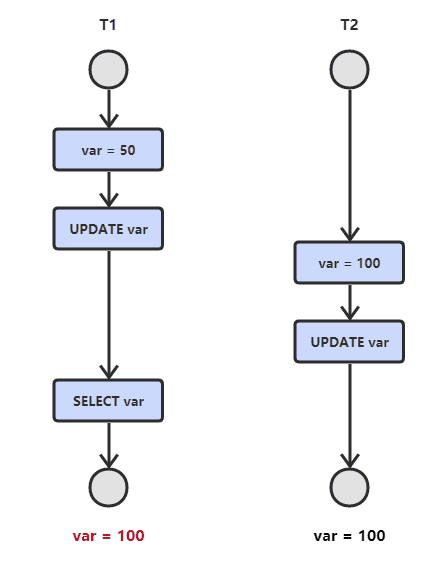

# 关系型数据库是如何工作的

## 全局概览


### 核心组件

- **进程管理器（process manager）**：很多数据库具备一个需要妥善管理的进程/线程池。再者，为了实现纳秒级操作，一些现代数据库使用自己的线程而不是操作系统线程；
- **网络管理器（network manager）**：网路I/O是个大问题，尤其是对于分布式数据库。所以一些数据库具备自己的网络管理器；
- **文件系统管理器（File system manager）**：磁盘I/O是数据库的首要瓶颈。具备一个文件系统管理器来完美地处理OS文件系统甚至取代OS文件系统，是非常重要的；
- **内存管理器（memory manager）**：为了避免磁盘I/O带来的性能损失，需要大量的内存。但是如果要处理大容量内存就需要高效的内存管理器，尤其是有很多查询同时使用内存的时候；
- **安全管理器（Security Manager）**：用于对用户的验证和授权；
- **客户端管理器（Client manager）**：用于管理客户端连接。
- ……

### 工具

- **备份管理器（Backup manager）**：用于保存和恢复数据；
- **恢复管理器（Recovery manager**）：用于崩溃后重启数据库到一个一致状态；
- **监控管理器（Monitor manager）**：用于记录数据库活动信息和提供监控数据库的工具；
- **管理员管理器（Administration manager）**：用于保存元数据（比如表的名称和结构），提供管理数据库、模式、表空间的工具。
- ……

### 查询管理器

- **查询解析器（Query parser）**：用于检查查询是否合法；
- **查询重写器（Query rewriter）**：用于预优化查询；
- **查询优化器（Query optimizer）**：用于优化查询；
- **查询执行器（Query executor）**：用于编译和执行查询。

### 数据管理器

- **事务管理器（Transaction manager）**：用于处理事务；
- **缓存管理器（Cache manager）**：数据被使用之前置于内存，或者数据写入磁盘之前置于内存；
- **数据访问管理器（Data access manager）**：访问磁盘中的数据。

## 数据查询的流程

本章集中探讨数据库如何通过如下进程管理 SQL 查询的：

- 客户端管理器
- 查询管理器
- 数据管理器（含恢复管理器）
- 客户端管理器

### 客户端管理器

> 客户端管理器是处理客户端通信的。客户端可以是一个（网站）服务器或者一个最终用户或最终应用。客户端管理器通过一系列知名的API（JDBC, ODBC, OLE-DB …）提供不同的方式来访问数据库。客户端管理器也提供专有的数据库访问API。


**当Client连接到数据库时**：

- 管理器首先检查 Client 验证信息（用户名和密码），然后检查 Client 是否有访问数据库的授权，这些权限由 DBA 分配；
- 然后，管理器检查是否有空闲进程（或线程）来处理查询；
- 管理器还会检查数据库是否负载很重；
- 管理器可能会等待一会儿来获取需要的资源，如果等待时间达到超时时间，它会关闭连接并给出一个可读的错误信息；
- 然后管理器会把 Client 的查询送给查询管理器来处理；
- 因为查询处理进程不是 “不全则无” 的，一旦它从查询管理器得到数据，它会把部分结果保存到一个缓冲区并且开始发送给 Client；
- 如果遇到问题，管理器关闭连接，向 Client 发送可读的解释信息，然后释放资源。

### 查询管理器

> 这部分是数据库的威力所在，在这部分里，一个写得糟糕的查询可以转换成一个快速执行的代码，代码执行的结果被送到客户端管理器。


这个多步骤操作过程如下：

- 查询首先被**解析**并判断是否合法；
- 然后被**重写**，去除了无用的操作并且加入**预优化**部分；
- 接着被**优化**以便提升性能，并被**转换为可执行代码**和**数据访问计划**；
- 然后计划被**编译**；
- 最后被**执行**。

这里对最后两步不做过多探讨，因为它们不太重要。

#### 查询解析器

> 每一条 SQL 语句都要送到解析器来检查语法，如果你的查询有错，解析器将拒绝该查询。比如，如果写成 `SLECT …` 而不是 `SELECT …`，那就没有下文了。

但这还不算完，解析器还会检查关键字是否使用正确的顺序，比如 `WHERE` 写在 `SELECT` 之前会被拒绝。

然后，解析器要分析查询中的表和字段，使用数据库元数据来检查：

- 表是否存在；
- 表的字段是否存在；
- 对某类型字段的运算是否可能（比如，不能将整数和字符串进行比较，不能对一个整数使用 `substring()` 函数）

接着，解析器检查在查询中 Client 是否有权限来读取（或写入）表。再强调一次：这些权限由 DBA 分配。在解析过程中，SQL 查询被转换为内部表示（通常是一个树）。如果一切正常，内部表示被送到查询重写器。

#### 查询重写器

在这一步，已经有了查询的内部表示，重写器的目标是：

- 预优化查询
- 避免不必要的运算
- 帮助优化器找到合理的最佳解决方案

重写器按照一系列已知的规则对查询执行检测。如果查询匹配一种模式的规则，查询就会按照这条规则来重写。下面是（可选）规则的非详尽的列表：

- **视图合并**：如果你在查询中使用视图，视图就会转换为它的 SQL 代码；

- **子查询扁平化**：子查询是很难优化的，因此重写器会尝试移除子查询 ；

  例如：

  ```sql
  SELECT PERSON.*
  FROM PERSON
  WHERE PERSON.person_key IN
  (SELECT MAILS.person_key
  FROM MAILS
  WHERE MAILS.mail LIKE 'christophe%');
  ```

  会被转换为：

  ```sql
  SELECT PERSON.*
  FROM PERSON, MAILS
  WHERE PERSON.person_key = MAILS.person_key
  and MAILS.mail LIKE 'christophe%';
  ```

- **去除不必要的运算符**：比如，如果使用了 `DISTINCT`，而其实有 `UNIQUE` 约束（这本身就防止了数据出现重复），那么 `DISTINCT` 关键字就被去掉了；

- **排除冗余的联接**：如果相同的 `JOIN` 条件出现两次，比如隐藏在视图中的 `JOIN` 条件，或者由于传递性产生的无用 `JOIN`，都会被消除；

- **常数计算赋值**：如果查询需要计算，那么在重写过程中计算会执行一次。比如 `WHERE AGE > 10+2` 会转换为 `WHERE AGE > 12`， `TODATE(“{日期字符串}”)` 会转换为 `datetime` 格式的日期值；

- **分区裁剪（Partition Pruning）**：如果你用了分区表，重写器能够找到需要使用的分区；

- **物化视图重写（Materialized view rewrite）**：如果有个物化视图匹配查询谓词的一个子集，重写器将检查视图是否最新并修改查询，令查询使用物化视图而不是原始表；

- **自定义规则**：如果有自定义规则来修改查询（就像 Oracle policy），重写器就会执行这些规则；

- **OLAP转换**：分析/加窗函数，星形联接，ROLLUP 函数……都会发生转换（但不确定这是由重写器还是优化器来完成，因为两个进程联系很紧，必须看是什么数据库）。

重写后的查询接着送到优化器。

#### 统计

> 研究数据库如何优化查询之前需要谈谈统计，因为**没有统计的数据库是愚蠢的**。除非明确指示，数据库是不会分析自己的数据的。没有分析会导致数据库做出（非常）糟糕的假设。

但是，数据库需要什么类型的信息呢？

首先必须（简要地）谈谈数据库和操作系统如何保存数据。两者使用的最小单位叫做页或块（默认 4 或 8 KB）。这就是说如果仅需要 1KB，也会占用一个页。要是页的大小为 8KB，就浪费了 7KB。

回来继续讲统计！ 当要求数据库收集统计信息，数据库会计算下列值：

- 表中行和页的数量
- 表中每个列中的： 
  - 唯一值
  - 数据长度（最小，最大，平均）
  - 数据范围（最小，最大，平均）
- 表的索引信息

**这些统计信息会帮助优化器估计查询所需的磁盘 I/O、CPU、和内存使用**

对每个列的统计非常重要。比如，如果一个表 `PERSON` 需要联接 2 个列： `LAST_NAME`、`FIRST_NAME`。根据统计信息，数据库知道`FIRST_NAME` 只有 1,000 个不同的值，`LAST_NAME` 有 1,000,000 个不同的值。因此，数据库就会按照 `LAST_NAME`，`FIRST_NAME` 联接。因为 `LAST_NAME` 不大可能重复，多数情况下比较 `LAST_NAME` 的头 2 、 3 个字符就够了，这将大大减少比较的次数。

不过，这些只是基本的统计。可以让数据库做一种高级统计，叫直方图。直方图是列值分布情况的统计信息。例如：

- 出现最频繁的值
- 分位数(quantiles)
- …

这些额外的统计会帮助数据库找到更佳的查询计划，尤其是对于等式谓词（例如：`WHERE AGE = 18` ）或范围谓词（例如：`WHERE AGE > 10 and AGE < 40`），因为数据库可以更好的了解这些谓词相关的数字类型数据行（注：这个概念的技术名称叫选择率）。

统计信息保存在数据库元数据内，例如（非分区）表的统计信息位置：

- Oracle： `USER / ALL / DBA_TABLES 和 USER / ALL / DBA_TAB_COLUMNS`
- DB2： `SYSCAT.TABLES` 和 `SYSCAT.COLUMNS`

**统计信息必须及时更新**。如果一个表有 1,000,000 行而数据库认为它只有 500 行，没有比这更糟糕的了。统计唯一的不利之处是需要时间来计算，这就是为什么数据库大多默认情况下不会自动计算统计信息。数据达到百万级时统计会变得困难，这时候，你可以选择仅做基本统计或者在一个数据库样本上执行统计。

举个例子，一个项目需要处理每表上亿条数据的库，选择只统计10%，结果造成了巨大的时间消耗。本例证明这是个糟糕的决定，因为有时候 Oracle 10G 从特定表的特定列中选出的 10% 跟全部 100% 有很大不同（对于拥有一亿行数据的表，这种情况极少发生）。这次错误的统计导致了一个本应 30 秒完成的查询最后执行了 8 个小时，查找这个现象根源的过程简直是个噩梦。这个例子显示了统计的重要性。

#### 查询优化器

> 所有的现代数据库都在用**基于成本的优化**（即CBO）来优化查询。道理是针对每个运算设置一个成本，通过应用成本最低廉的一系列运算，来找到最佳的降低查询成本的方法。

为了理解成本优化器的原理，这里用个例子来表现这个任务背后的复杂性。这里给出联接 2 个表的 3 个方法，能看到即便一个简单的联接查询对于优化器来说都是个噩梦。

**对于这些联接操作，程序员可能会专注于它们的时间复杂度，但是，数据库优化器计算的是它们的 CPU 成本、磁盘 I/O 成本、和内存需求**。时间复杂度和 CPU 成本的区别是，时间成本是个近似值，而 CPU 成本，包括了所有的运算，比如：加法、条件判断、乘法、迭代……还有呢：每一个高级代码运算都要特定数量的低级 CPU 运算。对于 Intel Core i7、Intel Pentium 4、AMD Opteron…等，（就 CPU 周期而言）CPU 的运算成本是不同的，也就是说它取决于 CPU 的架构，使用时间复杂度就容易多了。**大多数时候瓶颈在于磁盘 I/O 而不是 CPU 使用**。

##### 索引

##### 存取路径

在应用联接运算符(join operators)之前，你首先需要获得数据。以下是获得数据的方法（由于所有存取路径的真正问题是磁盘 I/O，不过多探讨时间复杂度）。

- 全扫描

简单的说全扫描就是数据库完整的读一个表或索引。就磁盘 I/O 而言，很明显全表扫描的成本比索引全扫描要高昂。

- 范围扫描

其他类型的扫描有索引范围扫描，比如使用谓词 `WHERE AGE > 20 AND AGE < 40` 的时候就会发生。

当然，需要在 `AGE` 字段上有索引才能用到索引范围扫描。

范围查询的时间成本大约是 `log(N)+M`，这里 N 是索引的数据量，M 是范围内估测的行数。多亏有了统计我们才能知道 N 和 M 的值（注： M 是谓词 `AGE > 20 AND AGE < 40`  的选择率）。另外范围扫描时，不需要读取整个索引，因此在磁盘 I/O 方面没有全扫描那么昂贵。

- 唯一扫描

如果只需要从索引中取一个值你可以用唯一扫描。

- 根据 ROW ID 存取

多数情况下，如果数据库使用索引，它就必须查找与索引相关的行，这样就会用到根据 ROW ID 存取的方式。

例如：

```sql
SELECT LASTNAME, FIRSTNAME from PERSON WHERE AGE = 28
```

如果 `person` 表的 `age` 列有索引，优化器会使用索引找到所有年龄为 28 的人，然后它会去表中读取相关的行，这是因为索引中只有 `age` 的信息而需要的是姓和名。

如果换个做法：

```sql
SELECT TYPE_PERSON.CATEGORY from PERSON ,TYPE_PERSON
WHERE PERSON.AGE = TYPE_PERSON.AGE
```

`person` 表的索引会用来联接 `type_person` 表，但是 `person` 表不会根据行 id 存取，因为并没有要求这个表内的信息。

虽然这个方法在少量存取时表现很好，这个运算的真正问题其实是磁盘 I/O。假如需要大量的根据行 id 存取，数据库也许会选择全扫描。

# 数据库核心知识点

## 事务

> 事务指的是满足 ACID 特性的一组操作，可以通过 Commit 提交一个事务，也可以使用 Rollback 进行回滚。

### ACID

#### 原子性(Atomicity)

事务被视为不可分割的最小单元，事务的所有操作要么全部提交成功，要么全部失败回滚。回滚可以用日志来实现，日志记录着事务所执行的修改操作，在回滚时反向执行这些修改操作即可。

#### 一致性(Consistency)

数据库在事务执行前后都保持一致性状态。在一致性状态下，所有事务对一个数据的读取结果都是相同的。

以转账举例：假设用户 A 和用户 B 两者的钱加起来一共是100，那么不管 A 和 B 之间如何转账，转几次账，事务结束后两个用户的钱相加起来都应该还是100，这就是事务的一致性。

#### 隔离性(Isolation)

一个事务所做的修改在最终提交以前，对其它事务是不可见的。

#### 持久性(Durability)

一旦事务提交，则其所做的修改将会永远保存到数据库中。即使系统发生崩溃，事务执行的结果也不能丢失。可以通过数据库备份和恢复来实现，在系统发生崩溃时，使用备份的数据库进行数据恢复。

事务的 ACID 特性概念简单，但不是很好理解，主要是因为这几个特性不是一种平级关系：

- 只有满足一致性，事务的执行结果才是正确的；
- 在无并发的情况下，事务串行执行，隔离性一定能够满足。此时只要能满足原子性，就一定能满足一致性；
- 在并发的情况下，多个事务并行执行，事务不仅要满足原子性，还需要满足隔离性，才能满足一致性；
- 事务满足持久性是为了能应对数据库崩溃的情况。


> MySQL 默认采用自动提交模式。也就是说，如果不显式使用 `START TRANSACTION` 语句来开始一个事务，那么每个查询都会被当做一个事务自动提交。

## 并发一致性问题

在并发环境下，事务的隔离性很难保证，因此会出现很多并发一致性问题。

### 丢失修改

T1 和 T2 两个事务都对一个数据进行修改，T1 先修改，T2 随后修改，T2 的修改覆盖了 T1 的修改。



### 脏读

T1 修改一个数据，T2 随后读取这个数据。如果 T1 撤销了这次修改，那么 T2 读取的数据是脏数据。


### 不可重复读

T2 读取一个数据，T1 对该数据做了修改。如果 T2 再次读取这个数据，此时读取的结果和第一次读取的结果不同。


### 幻读

T1 读取某个范围的数据，T2 在这个范围内插入新的数据，T1 再次读取这个范围的数据，此时读取的结果和和第一次读取的结果不同。


产生并发不一致性问题主要原因是破坏了事务的隔离性，解决方法是通过并发控制来保证隔离性。并发控制可以通过锁来实现，但是锁操作需要用户自己控制，相当复杂。数据库管理系统提供了事务的隔离级别，让用户以一种更轻松的方式处理并发一致性问题。

## 锁

### 锁粒度

MySQL 中提供了两种锁粒度: 行级锁以及表级锁。应该尽量只锁定需要修改的那部分数据，而不是所有的资源。锁定的数据量越少，发生锁争用的可能就越小，系统的并发程度就越高。但是加锁需要消耗资源，锁的各种操作(包括获取锁、释放锁、以及检查锁状态)都会增加系统开销。因此锁粒度越小，系统开销就越大。在选择锁粒度时，需要在锁开销和并发程度之间做一个权衡。


### 锁类型

#### 1. 读写锁

- 排它锁(Exclusive)，简写为 X 锁，又称写锁。
- 共享锁(Shared)，简写为 S 锁，又称读锁。

有以下两个规定:

- 一个事务对数据对象 A 加了 X 锁，就可以对 A 进行读取和更新。加锁期间其它事务不能对 A 加任何锁。
- 一个事务对数据对象 A 加了 S 锁，可以对 A 进行读取操作，但是不能进行更新操作。加锁期间其它事务能对 A 加 S 锁，但是不能加 X 锁。 

#### 2. 意向锁

使用意向锁(Intention Locks)可以更容易地支持多粒度锁。

在存在行级锁和表级锁的情况下，事务 T 想要对表 A 加 X 锁，就需要先检测是否有其它事务对表 A 或者表 A 中的任意一行加了锁，那么就需要对表 A 的每一行都检测一次，这是非常耗时的。

意向锁在原来的 X/S 锁之上引入了 IX/IS，IX/IS 都是表锁，用来表示一个事务想要在表中的某个数据行上加 X 锁或 S 锁。有以下两个规定:

- 一个事务在获得某个数据行对象的 S 锁之前，必须先获得表的 IS 锁或者更强的锁；
- 一个事务在获得某个数据行对象的 X 锁之前，必须先获得表的 IX 锁。

通过引入意向锁，事务 T 想要对表 A 加 X 锁，只需要先检测是否有其它事务对表 A 加了 X/IX/S/IS 锁，如果加了就表示有其它事务正在使用这个表或者表中某一行的锁，因此事务 T 加 X 锁失败。

各种锁的兼容关系如下:


解释如下:

- 任意 IS/IX 锁之间都是兼容的，因为它们只是表示想要对表加锁，而不是真正加锁；
- S 锁只与 S 锁和 IS 锁兼容，也就是说事务 T 想要对数据行加 S 锁，其它事务可以已经获得对表或者表中的行的 S 锁

### 锁协议

#### 一级锁协议

事务 T 要修改数据 A 时必须加 X 锁，直到 T 结束才释放锁。可以解决丢失修改问题，因为不能同时有两个事务对同一个数据进行修改，那么事务的修改就不会被覆盖。


#### 二级锁协议

在一级的基础上，要求读取数据 A 时必须加 S 锁，读取完马上释放 S 锁。可以解决读脏数据问题，因为如果一个事务在对数据 A 进行修改，根据 1 级锁协议，会加 X 锁，那么就不能再加 S 锁了，也就是不会读入数据。


#### 三级锁协议

在二级的基础上，要求读取数据 A 时必须加 S 锁，直到事务结束了才能释放 S 锁。可以解决不可重复读的问题，因为读 A 时，其它事务不能对 A 加 X 锁，从而避免了在读的期间数据发生改变。


####  两段锁协议

加锁和解锁分为两个阶段进行。可串行化调度是指，通过并发控制，使得并发执行的事务结果与某个串行执行的事务结果相同。事务遵循两段锁协议是保证可串行化调度的充分条件。例如以下操作满足两段锁协议，它是可串行化调度。

```
lock-x(A)...lock-s(B)...lock-s(C)...unlock(A)...unlock(C)...unlock(B)
```

但不是必要条件，例如以下操作不满足两段锁协议，但是它还是可串行化调度。

```
lock-x(A)...unlock(A)...lock-s(B)...unlock(B)...lock-s(C)...unlock(C)
```

#### MySQL 隐式与显示锁定

MySQL 的 InnoDB 存储引擎采用两段锁协议，会根据隔离级别在需要的时候自动加锁，并且所有的锁都是在同一时刻被释放，这被称为隐式锁定。

InnoDB 也可以使用特定的语句进行显示锁定：

```sql
SELECT ... LOCK In SHARE MODE;
SELECT ... FOR UPDATE;
```

## 隔离级别

> 为了解决并发一致性的问题，主流的关系型数据库都会提供四种事务的隔离级别。事务隔离级别从低到高分别是：读未提交、读已提交、可重复读、串行化。事务隔离级别等级越高，越能保证数据的一致性和完整性，但是执行效率也越低。所以在设置数据库的事务隔离级别时需要做一下权衡。MySQL 默认的隔离级别是可重复读。

### 读未提交(READ UNCOMMITTED)

事务中的修改，即使没有提交，对其它事务也是可见的。不能解决丢失修改，脏读，不可重复读和幻读，所以很少应用于实际项目。

### 读已提交(READ COMMITTED)

一个事务只能读取已经提交的事务所做的修改。换句话说，一个事务所做的修改在提交之前对其它事务是不可见的。可以防止脏读，但是不能解决丢失修改，可重复读和幻读的问题。

### 可重复读(REPEATABLE READ)

保证在同一个事务中多次读取同样数据的结果是一样的。在该隔离级别下，一个事务多次读同一个数据，在这个事务还没结束时，其他事务不能访问该数据（包括读写），这样就可以在同一个事务内两次读到的数据是一样的。可以防止脏读、不可重复读、丢失修改的问题，不过还是会出现幻读。

### 可串行化(SERIALIZABLE)

强制事务串行执行。事务只能一个接着一个地执行，不能并发执行。在这个级别，可以解决上面提到的所有并发问题，但可能导致大量的超时现象和锁竞争，通常不会用这个隔离级别。

## 多版本并发控制

> 多版本并发控制(Multi-Version Concurrency Control，MVCC)是 MySQL 的 InnoDB 存储引擎实现隔离级别的一种具体方式，用于实现读已提交和可重复读这两种隔离级别。而读未提交隔离级别总是读取最新的数据行，无需使用 MVCC。可串行化隔离级别需要对所有读取的行都加锁，单纯使用 MVCC 无法实现。

### 版本号

- 系统版本号：是一个递增的数字，每开始一个新的事务，系统版本号就会自动递增；
- 事务版本号：事务开始时的系统版本号。

### 隐藏的列

MVCC 在每行记录后面都保存着两个隐藏的列，用来存储两个版本号：

- 创建版本号：指示创建一个数据行的快照时的系统版本号；
- 删除版本号：如果该快照的删除版本号大于当前事务版本号表示该快照有效，否则表示该快照已经被删除了。

### Undo 日志

MVCC 使用到的快照存储在 Undo 日志中，该日志通过回滚指针把一个数据行(Record)的所有快照连接起来。


### 实现过程

以下实现过程针对可重复读隔离级别。

当开始新一个事务时，该事务的版本号肯定会大于当前所有数据行快照的创建版本号，理解这一点很关键。

#### 1、SELECT

多个事务必须读取到同一个数据行的快照，并且这个快照是距离现在最近的一个有效快照。但是也有例外，如果有一个事务正在修改该数据行，那么它可以读取事务本身所做的修改，而不用和其它事务的读取结果一致。

把没有对一个数据行做修改的事务称为 T，T 所要读取的数据行快照的创建版本号必须小于 T 的版本号，因为如果大于或者等于 T 的版本号，那么表示该数据行快照是其它事务的最新修改，因此不能去读取它。除此之外，T 所要读取的数据行快照的删除版本号必须大于 T 的版本号，因为如果小于等于 T 的版本号，那么表示该数据行快照是已经被删除的，不应该去读取它。

#### 2、INSERT

将当前系统版本号作为数据行快照的创建版本号。

####  3、 DELETE

将当前系统版本号作为数据行快照的删除版本号。

#### 4、UPDATE

将当前系统版本号作为更新前的数据行快照的删除版本号，并将当前系统版本号作为更新后的数据行快照的创建版本号。可以理解为先执行 `DELETE` 后执行 `INSERT`。

### 快照读与当前读

#### 快照读

使用 MVCC 读取的是快照中的数据，这样可以减少加锁所带来的开销。

```sql
select * from table ...;
```

#### 当前读

读取的是最新的数据，需要加锁。以下第一个语句需要加 S 锁，其它都需要加 X 锁。

```sql
select * from table where ? lock in share mode;
select * from table where ? for update;
insert;
update;
delete;
```

## Next-Key Locks

> Next-Key Locks 是 MySQL 的 InnoDB 存储引擎的一种锁实现。
>
> MVCC 不能解决幻读的问题，Next-Key Locks 就是为了解决这个问题而存在的。在可重复读(REPEATABLE READ)隔离级别下，使用 MVCC + Next-Key Locks 可以解决幻读问题。

### Record Locks

锁定索引之间的间隙，但是不包含索引本身。例如当一个事务执行以下语句，其它事务就不能在 t.c 中插入 15：

```sql
SELECT c FROM t WHERE c BETWEEN 10 and 20 FOR UPDATE;
```

### Next-Key Locks

它是 Record Locks 和 Gap Locks 的结合，不仅锁定一个记录上的索引，也锁定索引之间的间隙。例如一个索引包含以下值：10，11，13，20，那么就需要锁定以下区间：

```sql
(negative infinity, 10]
(10, 11]
(11, 13]
(13, 20]
(20, positive infinity)
```

# SQL

> SQL(Structured Query Language)，标准 SQL 由 ANSI 标准委员会管理，从而称为 ANSI SQL。各个 DBMS 都有自己的实现，如 PL/SQL、Transact-SQL 等。SQL 语句不区分大小写，但是数据库表名、列名和值是否区分依赖于具体的 DBMS 以及配置。本文主要介绍 MySQL 的实现。

SQL 支持以下三种注释:

```mysql
# 注释
SELECT *
FROM mytable; -- 注释
/* 注释1
   注释2 */
```

## 数据库操作

```mysql
# 指定要使用的数据库
USE {数据库名};
# 查看当前使用的库
SELECT database();
# 查看所有库
SHOW DATABASES [LIKE 'pattern'];
# 查看当前系统时间
SELECT now();
# 查看当前用户
SELECT user();
# 查看MySQL版本
SELECT version();
```

### 创建库

```sql
CREATE DATABASE [IF NOT EXISTS] {db_name} {db_option};
```

* 数据库选项：

  > 字符集(*charset*)是用来定义 MySQL 存储字符串的方式。给定一系列字符并赋予对应的编码后，所有这些字符和编码对组成的集合就是字符集。例如，给定字符列表为 `{‘A’, ’B’}` 时，`{‘A’=>0,‘B’=>1}` 就是一个字符集。
  >
  > 校验规则(*collation*)定义了比较字符串的规则。确定比较规则后，才能在一个字符集上定义什么是等价的字符，以及字符之间的大小关系。
  >
  > 校验规则会影响到 `ORDER BY` 语句的顺序，会影响到 `WHERE` 条件中大于小于号筛选出来的结果，会影响 `DISTINCT`、`GROUP BY`、`HAVING` 语句的查询结果。另外，MySQL 建索引的时候，如果索引列是字符类型，也会影响索引创建，总之，凡是涉及到字符类型比较或排序的地方，都和校验规则有关。
  >
  > 校验规则命名惯例：以对应的字符集名称开头；以 `ci` (表示大小写不敏感)、`cs` (表示大小写敏感)或 `bin` (表示按编码值比较)结尾。例如：在校验规则 `utf8_general_ci` 下，字符 `a` 和 `A` 是等价的。
  >
  > 每种校验规则唯一对应一种字符集，但一个字符集可以对应多种校验规则。

  * `CHARSET {charset_name}` 字符集

    查询 MySQL 支持的字符集种类：

    ```mysql
    SHOW CHARACTER SET/CHARSET;
    ```

  * `COLLATE {collation_name}` 校验规则

    查询 MySQL 所支持的字符集的校验规则：

    ```mysql
    SHOW COLLATION;
    ```

### 修改库

```mysql
ALTER DATABASE {db_name} {db_option};
```

### 删除库

```mysql
DROP DATABASE [IF EXISTS] {db_name};
```

## 表操作

```mysql
# 查看所有表
SHOW TABLES [LIKE 'pattern'];
SHOW TABLES FROM {db_name};
# 查看表结构
SHOW CREATE TABLE {tb_name};
DESC/DESCRIBE {tb_name};
EXPLAIN {tb_name};
SHOW COLUMNS FROM {tb_name} [LIKE 'pattern'];
SHOW TABLE STATUS [FROM {db_name}] [LIKE 'pattern'];
```

### 创建表

```mysql
CREATE [TEMPORARY] TABLE [IF NOT EXISTS] [{db_name}.]{tb_name} ({table_str_definition})[{tb_option}];
```

* `TEMPORARY`： 表示该表为临时表，只存在于当前会话；

* 表结构定义：由数个字段定义组成，每个字段定义由逗号隔开：

  ```mysql
  {c_name} {type} [NOT NULL | NULL] [DEFAULT {default_value}] [AUTO_INCREMENT] [UNIQUE [KEY] | [PRIMARY] KEY]
  ```

* 表选项：

  * `CHARSET = {charset_name}`：字符集，决定了可以在数据库中存储的字符种类；
  * `COLLATE = {collate_name}`：排序规则，决定了字符数据在排序和比较操作中的行为方式；
  * `ENGINE = {engine_name}`：存储引擎，表在管理数据时采用的不同的数据结构，结构不同会导致处理方式、提供的特性操作等不同。

示例：

```mysql
CREATE TABLE mytable (
  id INT NOT NULL AUTO_INCREMENT PRIMARY KEY,
  col1 INT NOT NULL DEFAULT 1,
  col2 VARCHAR(45) NULL,
  col3 DATE NULL
);
```

### 修改表

```mysql
# 修改表选项
ALTER TABLE {tb_name} {tb_option};
# 对表进行重命名
RENAME TABLE {old_tb_name} TO {new_tb_name};
```

### 修改表的字段

```mysql
ALTER TABLE {tb_name} {option};
```

#### 添加字段

```mysql
ADD [COLUMN] {type} [AFTER {c_name}/FIRST]
```

* `AFTER {c_name}`：增加的字段放在指定字段后；
* `FIRST`：增加的字段放在首位。

#### 删除字段

```mysql
DROP [COLUMN] {c_name}
```

#### 修改字段属性

```mysql
MODIFY [COLUMN] {c_name} {type}
```

#### 重命名、修改字段属性

```mysql
CHANGE [COLUMN] {old_c_name} {new_c_name} {type} [NOT NULL | NULL] [DEFAULT {default_value}] [AUTO_INCREMENT] [UNIQUE [KEY] | [PRIMARY] KEY]
```

示例：

```mysql
ALTER TABLE mytable 
CHANGE col col1 CHAR(32) NOT NULL DEFAULT '123';
```

#### 索引相关

```mysql
# 删除主键，删除主键前需先删除“auto_increment”属性
DROP PRIMARY KEY
# 删除索引
DROP INDEX 
```

### 复制表

```mysql
# 复制将一张表的结构到一张新表中
CREATE TABLE {target_tb_name} LIKE {source_eb_name};
# 将一张表的内容插入到一张新表中
CREATE TABLE {target_tb_name} [AS] SELECT * FROM {source_eb_name};
# 复制表结构和数据到另一个数据库中
RENAME TABLE {source_db} TO {target_db}.{new_tb_name};
# 从一个表中选取数据，然后把数据插入另一个表中
SELECT column_name(s) INTO new_table_name [IN externaldatabase] FROM old_tablename
```

### 删除表

```mysql
DROP TABLE [IF EXISTS] {tb_name};
```

### 清空表所有数据

`TRUNCATE` 可以删除表的所有数据，并将自动递增值重置为0。

```mysql
TRUNCATE [TABLE] {tb_name};
```

## 数据操作

### 增加(Create)

```mysql
INSERT [INTO] {tb_name} [(c_name1,c_name2 ...)] VALUES (value1，value2 ...) [,(value1，value2 ...)];
```

如果要插入的值列表包含所有字段且顺序一致，则可以省略字段列表。可同时插入多条数据记录。

示例：

```mysql
# 普通插入
INSERT INTO mytable(col1, col2)
VALUES(val1, val2);
# 插入检索出来的数据
INSERT INTO mytable1(col1, col2)
SELECT col1, col2
FROM mytable2;
```

### 更新(Update)

```mysql
UPDATE {tb_name} SET {c_name1} = {value1}[,{c_name2} = {value2} ...] [WHERE ...];
```

### 删除(Delete)

```mysql
DELETE FROM {tb_name} [WHERE ...];
```

没有条件子句，则会删除所有数据。

> 注意：使用更新和删除操作时一定要用 `WHERE` 子句，不然会把整张表的数据都破坏。可以先用 `SELECT` 语句进行测试，防止错误删除。

### 检索(Retrieve)

```mysql
SELECT [ALL|DISTINCT] c_name1,c_name2 ... FROM {tb_name} [WHERE ...];
```

#### SELECT语句结构

```mysql
SELECT [ALL|DISTINCT] select_expr FROM -> WHERE -> GROUP BY [funtion()] ->
HAVING -> ORDER BY -> LIMIT
```

* `ALL|DISTINCT`：`ALL` 全部记录（默认），`DISTINCT` 去除重复记录；

* `select_expr`： 

  ```mysql
  # 查询所有数据，可以用“*”表示所有字段
  SELECT * FROM tb;
  ```

  * **计算字段**

    > 在数据库服务器上完成数据的转换和格式化的工作往往比客户端上快得多，并且转换和格式化后的数据量更少的话可以减少网络通信量。

    计算字段通常需要使用 `AS` 来取别名，否则输出的时候字段名为计算表达式。

    ```mysql
    SELECT col1 * col2 AS alias
    FROM mytable;
    ```

    `CONCAT()` 用于连接两个字段。许多数据库会使用空格把一个值填充为列宽，因此连接的结果会出现一些不必要的空格，使用 `TRIM()` 可以去除首尾空格。

    ```mysql
    SELECT CONCAT(TRIM(col1), '(', TRIM(col2), ')') AS concat_col
    FROM mytable;
    ```

* `FROM` 子句：用于标识查询来源，可以使用 `AS` 关键字为表设置别名；

  ```mysql
  SELECT * FROM tb1 AS t1, tb2 AS t2;
  ```

* `WHERE` 子句：筛选从 `FROM` 获得的数据；

  * `WHERE` 子句可用的操作符：

  ​	

  * `AND` 和 `OR` 用于连接多个过滤条件，优先处理 `AND`。当一个过滤表达式涉及到多个 `AND` 和 `OR` 时，可以使用 `()` 来决定优先级，使得优先级关系更清晰；

  * `NOT` 用于否定一个条件，`IS` 操作符用于确定一个条件。如 `NOT NULL` 表示不为 `NULL`，`IS NULL` 表示为 `NULL`；

  * `IN` 用于匹配一组值，其后也可以接一个 `SELECT` 子句，从而匹配子查询得到的一组值；

    ```mysql
    select * from where field in (value1,value2,value3,…) 
    ```

  * `BETWEEN` 用于检查一个值是否在指定的范围内（包括边界值）；

    ```mysql
    value BETWEEN lower_bound AND upper_bound;
    ```

    解释：

    - `value`：是要检查的值；
    - `lower_bound`：是范围的下限值，表示范围的开始；
    - `upper_bound`：是范围的上限值，表示范围的结束。

    应用示例：

    1、**检查数字范围：** 例如，如果想查找工资在某个特定范围内的员工，可以使用 `BETWEEN`：

    ```mysql
    SELECT employee_name, salary
    FROM employees
    WHERE salary BETWEEN 30000 AND 50000;
    ```

    这将返回工资在 30,000 到 50,000 之间的员工。

    2、**检查日期范围：** 用于检查日期是否在给定范围内。例如，查找在某个时间段内下订单的客户：

    ````mysql
    SELECT customer_name, order_date
    FROM orders
    WHERE order_date BETWEEN '2023-01-01' AND '2023-12-31';
    ````

    这将返回在2023年下订单的客户。

    3、**检查文本范围：** 虽然 `BETWEEN` 主要用于数值和日期，但您也可以使用它来检查文本值是否在字母顺序上位于两个给定的文本之间。例如，查找名字以 `A` 和 `M` 之间的客户：

    ```mysql
    SELECT customer_name
    FROM customers
    WHERE customer_name BETWEEN 'A' AND 'M';
    ```

    这将返回客户名字以字母 `A` 到 `M` 之间的客户。

  * `LIKE` 用于在查询中进行模糊匹配。

    > 通配符只能用于文本字段，使用 `LIKE` 来进行通配符匹配。
    >
    > - `%` 匹配 >= 0 个任意字符；
    > - `_` 匹配 == 1 个任意字符；
    > - `[ ]` 可以匹配集合内的字符，例如 `[ab]` 将匹配字符 `a` 或者 `b`。用脱字符 `^` 可以对其进行否定，也就是不匹配集合内的字符。
    >
    > 注意：不要滥用通配符，通配符位于开头处匹配会非常慢。

    示例：

    ```mysql
    # 不以A和B开头的任意文本
    SELECT *
    FROM mytable
    WHERE col LIKE '[^AB]%'; 
    ```

  * `EXISTS` 返回布尔值(`true` 或 `false`) ，指示子查询是否返回结果。

    应用示例：

    * **存在性检查：** 检查是否存在满足某些条件的行。

      例如，可以使用 `EXISTS` 来查找是否有员工的工资大于100,000 的记录：

      ```mysql
      SELECT *
      FROM employees
      WHERE EXISTS (
          SELECT 1
          FROM salaries
          WHERE salaries.employee_id = employees.id
          AND salaries.salary > 100000
      );
      ```

    * **相关子查询：** `EXISTS` 常用于相关子查询，其中子查询的结果依赖于外部查询的条件。

      例如，可以使用 `EXISTS` 来查找是否有订单中包含特定产品的情况：

      ```mysql
      SELECT *
      FROM orders
      WHERE EXISTS (
          SELECT 1
          FROM order_items
          WHERE order_items.order_id = orders.id
          AND order_items.product_id = 'ABC123'
      );
      ```

      这将返回包含产品 `ABC123` 的所有订单。

    * **子查询的结果不重要：** 有时可能只对子查询的存在与否感兴趣，而不关心子查询返回的具体值。在这种情况下，`EXISTS` 用于提高查询性能，因为它在找到匹配项后立即停止执行，而不必获取所有子查询的结果。

* `GROUP BY` 子句：

  > 分组就是把具有相同的数据值的行放在同一组中。可以对同一分组数据使用汇总函数进行处理，例如求分组数据的平均值等。指定的分组字段除了能按该字段进行分组，也会自动按该字段进行排序。

  ```mysql
  SELECT col, COUNT(*) AS num
  FROM mytable
  GROUP BY col;
  # GROUP BY 自动按分组字段进行排序，ORDER BY 也可以按汇总字段来进行排序
  SELECT col, COUNT(*) AS num
  FROM mytable
  GROUP BY col
  ORDER BY num;
  # WHERE 过滤行，HAVING 过滤分组，行过滤应当先于分组过滤
  SELECT col, COUNT(*) AS num
  FROM mytable
  WHERE col > 2
  GROUP BY col
  HAVING num >= 2;
  ```

  分组规定:

  - 除了汇总字段外，`SELECT` 语句中的每一字段都必须在 `GROUP BY` 子句中给出；
  - `NULL` 的行会单独分为一组；
  - 大多数 SQL 实现不支持 `GROUP BY` 列具有可变长度的数据类型。

* `HAVING` 子句：与 `WHERE` 功能、用法相同，执行时机不同。

  * `WHERE` 在开始时执行检测数据，对原数据进行过滤，`HAVING` 对筛选出的结果再次进行过滤；
  * `WHERE` 字段必须是数据表存在的，`HAVING` 字段必须是查询出来的；
  * `WHERE` 不可以使用字段的别名，`HAVING` 可以，因为执行 `WHERE` 代码时，可能尚未确定列值；
  * `WHERE` 不可以使用聚集函数，一般需用聚集函数才会用 `HAVING`。

* `ORDER BY` 子句：取一个或多个列的名字，据此对输出进行排序。

  ```mysql
  ORDER BY {c_name1}/{c_name_alias1} ASC|DESC [,{c_name2}/{c_name_alias2} ASC|DESC]...
  ```

* `LIMIT` 子句：限制查询结果集中返回的行数。

  ```mysql
  LIMIT [{offset},] {number_of_rows};
  LIMIT {number_of_rows} OFFSET {offset};
  ```

  - `number_of_rows`：是要返回的行数的数量。如果不提供 `offset` 参数，那么查询结果将包含前 `number_of_rows` 行。
  - `offset`：是可选的，表示要跳过的行数，索引从 0 开始。它允许您从结果集中的某个特定位置开始返回行。如果提供了 `offset`，查询结果将从第 `offset + 1` 行开始，返回 `number_of_rows` 行。

  应用示例：

  * **分页查询：** `LIMIT` 常用于分页，以便在 Web 应用程序中显示大型结果集的一部分。例如，可以使用 `LIMIT` 来获取每页的数据，然后根据用户的请求来调整 `offset` 和 `number_of_rows`，从而获取不同页的数据。
  * **限制结果集大小：** 在某些情况下，可能希望限制结果集的大小，以便只获取前几行或一定数量的数据，以加快查询性能或减小数据传输的成本。

#### 子查询

子查询中只能返回一个字段的数据。

可以将子查询的结果作为 `WHRER` 语句的过滤条件：

```mysql
SELECT *
FROM mytable1
WHERE col1 IN (SELECT col2
               FROM mytable2);
```

下面的语句可以检索出客户的订单数量，子查询语句会对第一个查询检索出的每个客户执行一次：

```mysql
SELECT cust_name, (SELECT COUNT(*)
                   FROM Orders
                   WHERE Orders.cust_id = Customers.cust_id)
                   AS orders_num
FROM Customers
ORDER BY cust_name;
```

## 连接

连接用于连接多个表，使用 `JOIN` 关键字，并且条件语句使用 `ON` 而不是 `WHERE`。连接可以替换子查询，并且比子查询的效率一般会更快。可以用 `AS` 给列名、计算字段和表名取别名，给表名取别名是为了简化 SQL 语句以及连接相同表。

### 内连接

内连接又称等值连接，使用 `INNER JOIN` 关键字。

```mysql
SELECT A.value, B.value
FROM tablea AS A INNER JOIN tableb AS B
ON A.key = B.key;
```

可以不明确使用 `INNER JOIN`，而使用普通查询并在 `WHERE` 中将两个表中要连接的列用等值方法连接起来。

```mysql
SELECT A.value, B.value
FROM tablea AS A, tableb AS B
WHERE A.key = B.key;
```

在没有条件语句的情况下返回笛卡尔积。

### 自连接

自连接可以看成内连接的一种，只是连接的表是自身而已。

例如，一张员工表，包含员工姓名和员工所属部门，要找出与 Jim 处在同一部门的所有员工姓名。

```mysql
# 子查询版本
SELECT name
FROM employee
WHERE department = (
      SELECT department
      FROM employee
      WHERE name = "Jim");
# 自连接版本
SELECT e1.name
FROM employee AS e1 INNER JOIN employee AS e2
ON e1.department = e2.department
      AND e2.name = "Jim";
```

### 自然连接

自然连接是把同名列通过等值测试连接起来的，同名列可以有多个。

内连接和自然连接的区别: 内连接提供连接的列，而自然连接自动连接所有同名列。

```mysql
SELECT A.value, B.value
FROM tablea AS A NATURAL JOIN tableb AS B;
```

### 外连接

外连接保留了没有关联的那些行。分为左外连接，右外连接以及全外连接，左外连接就是保留左表没有关联的行。

例如：检索所有顾客的订单信息，包括还没有订单信息的顾客。

```mysql
SELECT Customers.cust_id, Orders.order_num
FROM Customers LEFT OUTER JOIN Orders
ON Customers.cust_id = Orders.cust_id;
```

## 组合查询

使用 `UNION` 来组合两个查询，如果第一个查询返回 M 行，第二个查询返回 N 行，那么组合查询的结果一般为 M+N 行。每个查询必须包含相同的列、表达式和聚集函数。默认会去除相同行，如果需要保留相同行，使用 `UNION ALL`。只能包含一个 `ORDER BY` 子句，并且必须位于语句的最后。

```mysql
SELECT col
FROM mytable
WHERE col = 1
UNION
SELECT col
FROM mytable
WHERE col =2;
```

## 函数

> 各个 DBMS 的函数都是不相同的，因此不可移植，以下主要是 MySQL 的函数。

### 汇总

|  函数   |       说明       |
| :-----: | :--------------: |
|  AVG()  | 返回某列的平均值 |
| COUNT() |  返回某列的行数  |
|  MAX()  | 返回某列的最大值 |
|  MIN()  | 返回某列的最小值 |
|  SUM()  |  返回某列值之和  |

以上函数会忽略 `NULL` 行。

使用 `DISTINCT` 可以让汇总函数值汇总不同的值：

```mysql
SELECT AVG(DISTINCT col1) AS avg_col
FROM mytable;
```

### 文本处理

|           函数           |            说明            |
| :----------------------: | :------------------------: |
|     LEFT()、RIGHT()      |       左、右边的字符       |
|     LOWER()、UPPER()     |      转换为小写、大写      |
| TRIM()、LTRIM()、RTRIM() | 去除两边、左边、右边的空格 |
|         LENGTH()         |            长度            |

### 日期和时间处理

- 日期格式：`YYYY-MM-DD`
- 时间格式：`HH:MM:SS`

|     函数      |              说明              |
| :-----------: | :----------------------------: |
|     NOW()     |       返回当前日期和时间       |
|   CURDATE()   |          返回当前日期          |
|   CURTIME()   |          返回当前时间          |
|    DATE()     |     返回日期时间的日期部分     |
|    TIME()     |   返回一个日期时间的时间部分   |
|    HOUR()     |     返回一个时间的小时部分     |
|   MINUTE()    |     返回一个时间的分钟部分     |
|   SECOND()    |      返回一个时间的秒部分      |
|    YEAR()     |     返回一个日期的年份部分     |
|   MOUNTH()    |     返回一个日期的月份部分     |
|     DAY()     |     返回一个日期的天数部分     |
|  DAYOFWEEK()  | 对于一个日期，返回对应的星期几 |
|   ADDDATE()   |     增加一个日期(天、周等)     |
|   ADDTIME()   |     增加一个时间(时、分等)     |
|  DATEDIFF()   |        计算两个日期之差        |
|  DATE_ADD()   |     高度灵活的日期运算函数     |
| DATE_FORMAT() |  返回一个格式化的日期或时间串  |

### 数值处理

|        函数         |       说明       |
| :-----------------: | :--------------: |
| SIN()、COS()、TAN() | 正弦、余弦、正切 |
|        ABS()        |      绝对值      |
|       SQRT()        |      平方根      |
|        MOD()        |       余数       |
|        EXP()        |       指数       |
|       RAND()        |      随机数      |

### 其他

#### INSTR

获取子串第一次出现的索引，如果没有找到，则返回0（从1开始）。

```mysql
INSTR({str},{substr})
```

##### 示例

```mysql
SELECT INSTR('apple','a');
```

返回的查询结果是1，`a` 出现在字符串 `apple` 中的第1个索引。

#### IF

在查询中执行条件逻辑，根据条件的真假返回不同的结果。

```mysql
IF(condition, value_if_true, value_if_false)
```

解释：

- `condition`：是一个条件表达式，如果评估为真（非零），则返回 `value_if_true`，否则返回 `value_if_false`；
- `value_if_true`：是当 `condition` 评估为真时要返回的值；
- `value_if_false`：是当 `condition` 评估为假时要返回的值。

##### 应用示例

- **条件分组：** `IF` 函数可用于根据特定条件对数据进行分组。例如，可以使用 `IF` 函数将员工分为高薪和低薪组：

  ```mysql
  SELECT employee_name, salary,
         IF(salary > 50000, '高薪', '低薪') AS salary_group
  FROM employees;
  ```

- **条件计算：** `IF` 函数可用于根据不同的条件计算值。例如，计算订单总金额时，如果某项商品打了折扣，可以使用 `IF` 函数来应用不同的计算公式：

  ```mysql
  SELECT order_id, product_name, quantity,
         IF(discount > 0, (price - (price * discount)) * quantity, price * quantity) AS total_price
  FROM order_details;

- **条件筛选：** `IF` 函数可用于在查询中根据条件筛选数据。例如，仅选择销售金额大于1000的销售订单：

  ```mysql
  SELECT order_id, order_date, salesperson_id, amount
  FROM sales_orders
  WHERE IF(amount > 1000, 1, 0) = 1;
  ```

## 流程控制

### CASE

> `CASE` 是 SQL 中的条件表达式，用于在查询中执行条件逻辑。它允许根据一个或多个条件评估的结果返回不同的值。`CASE` 表达式可以在 `SELECT` 语句、`WHERE` 子句、`ORDER BY` 子句和其他地方使用，以根据不同情况生成不同的输出。

`CASE` 表达式通常有两种形式：

#### 形式1

```sql
CASE expression
    WHEN value1 THEN result1
    WHEN value2 THEN result2
    ...
    ELSE default_result
END
```

解释：

- `expression`：是要评估的表达式或列；
- `WHEN value1 THEN result1`：定义了一个条件分支，如果 `expression` 等于 `value1`，则返回 `result1`；
- `ELSE default_result`：可选的，如果没有匹配的条件分支，则返回 `default_result`。

#### 形式2

```mysql
CASE
    WHEN condition1 THEN result1
    WHEN condition2 THEN result2
    ...
    ELSE default_result
END
```

解释：

- `WHEN condition1 THEN result1`：定义了一个条件分支，如果 `condition1` 评估为真，则返回 `result1`。
- `ELSE default_result`：可选的，如果没有匹配的条件分支，则返回 `default_result`。

#### 应用示例

1、在 `SELECT` 语句中使用 `CASE`：可以使用 `CASE` 在查询中创建计算字段。例如，将员工的薪水分为不同的级别：

```mysql
SELECT employee_name, salary,
       CASE
           WHEN salary > 50000 THEN '高薪'
           WHEN salary > 30000 THEN '中薪'
           ELSE '低薪'
       END AS salary_level
FROM employees;
```

这将创建一个名为 `salary_level` 的计算字段，根据员工的工资将其分为不同的级别。

2、在 `WHERE` 子句中使用 `CASE`： 可以在 `WHERE` 子句中使用 `CASE` 条件筛选数据。例如，选择销售金额大于 1000 并且客户评级为 "优秀" 的订单：

```mysql
SELECT order_id, order_date, customer_name, amount
FROM sales_orders
WHERE CASE
          WHEN rating = '优秀' AND amount > 1000 THEN 1
          ELSE 0
       END = 1;
```

3、在 `ORDER BY` 子句中使用 `CASE`： 您可以在 `ORDER BY` 子句中使用 `CASE` 来自定义排序顺序。例如，按产品销售额排序，但在某些产品之前将某个特定产品排在前面：

```mysql
SELECT product_name, sales_amount
FROM products
ORDER BY CASE
            WHEN product_name = '特定产品' THEN 1
            ELSE 2
         END, sales_amount DESC;
```

这将首先按特定产品，然后按销售金额降序排序。

## 存储过程

> 在项目的业务开发中，每条 SQL 语句不会太过复杂，通常就由几行 SQL 组成，但往往在一些复杂的业务需求下，SQL 操作不会那么简单，有时写着写着，可能会编写出一条由几百行、甚至上千行 SQL 组成的语句，这种大 SQL 执行的效率通常会异常的缓慢，因此需要从各方面去尽可能的优化它，而存储过程则是专门为这类 SQL 而创造的。
>
> MySQL 起初并不支持存储过程，而是到了 MySQL5.0 版本才支持存储过程的编写与执行，在 MySQL 中存储过程主要分为两类，一类是普通的存储过程，另一类则是触发器类型的存储过程。
>
> 存储过程(Stored Procedure)是一组为了完成特定功能的 SQL 语句集合，使用存储过程的目的在于：将常用且复杂的 SQL 语句预先写好，然后用一个指定名称存储起来，这个过程经过 MySQL 编译解析、执行优化后存储在数据库中，因此称为存储过程。当以后需要使用这个过程时，只需调用根据名称调用即可。
>
> 对比常规的 SQL 语句来说，普通 SQL 在执行时需要先经过编译、分析、优化等过程，最后再执行，而存储过程则不需要，一般存储过程都是预先已经编译过的。

存储过程的定义语法如下：

```mysql
DELIMITER $

-- 创建的语法：指定名称、入参、出参
CREATE 
    PROCEDURE 存储过程名称(返回类型 参数名1 参数类型1, ....)
-- 表示开始编写存储过程体
BEGIN
    -- 具体组成存储过程的SQL语句....
-- 表示到这里为止，存储过程结束
END $

DELIMITER ;
```

## 触发器

> 触发器本质上是一种特殊的存储过程，但存储过程需要人为手动调用，而触发器则不需要，它可以在执行某项数据操作后自动触发，就类似于 Spring AOP 中的切面一样，当执行了某个操作时就会触发相应的切面逻辑。
>
> 但触发器是在 MySQL5.0.2 版本以后才开始被支持的，在此之前的 MySQL 并不能创建触发器，而触发器的触发条件是以事件为单位的，对于事件相信诸位一定不陌生，比如前端的按钮标签，就会经常用到它的点击事件，当用户点击某个按钮后，就会触发对应的点击函数，从而执行相应逻辑，而 MySQL 触发器亦是同理。

创建一个触发器的语法如下：

```mysql
CREATE TRIGGER 触发器名称
    {BEFORE | AFTER} {INSERT | UPDATE | DELETE} ON 表名
FOR EACH ROW
    -- 触发器的逻辑（代码块）;
```

## 事务管理

基本术语：

- 事务(transaction)指一组 SQL 语句；
- 回退(rollback)指撤销指定 SQL 语句的过程；
- 提交(commit)指将未存储的 SQL 语句结果写入数据库表；
- 保留点(savepoint)指事务处理中设置的临时占位符(placeholder)，你可以对它发布回退(与回退整个事务处理不同)。

在 MySQL 中只有使用了 InnoDB 数据库引擎的数据库或表才支持事务，事务不能被嵌套。

MySQL 的事务提交默认是隐式提交，每执行一条语句就把这条语句当成一个事务然后进行提交。当出现 `START TRANSACTION` 语句时，会关闭隐式提交；当 `COMMIT` 或 `ROLLBACK` 语句执行后，事务会自动关闭，重新恢复隐式提交。通过设置 `autocommit` 为 0 可以取消自动提交；`autocommit` 标记是针对每个连接而不是针对服务器的。

不能回退 `SELECT` 语句，回退 `SELECT` 语句也没意义；也不能回退 `CREATE` 和 `DROP` 语句。

如果没有设置保留点，`ROLLBACK` 会回退到 `START TRANSACTION` 语句处；如果设置了保留点，并且在 `ROLLBACK` 中指定该保留点，则会回退到该保留点。

```mysql
# 开启一个事务,所有被执行的SQL语句均被认作当前事务内的SQL语句
BEGIN/START TRANSACTION;
# 提交事务
COMMIT;
# 事务回滚
ROLLBACK;
# 允许在事务中创建一个保存点，一个事务中可以有多个保存点
SAVEPOINT identifier;
# 把事务回滚到标记点
ROLLBACK TO identifier; 
# 删除一个事务的保存点，当没有指定的保存点时，执行该语句会抛出一个异常
RELEASE SAVEPOINT identifier;
```

## 权限管理

MySQL 的账户信息保存在 `mysql` 这个数据库中。

```mysql
USE mysql;
SELECT user FROM user;
# 创建账户，新创建的账户没有任何权限
CREATE USER {user_name} IDENTIFIED BY '{password}';
# 修改账户名
RENAME {user_name_old} TO {user_name_new};
# 删除账户
DROP USER {user_name};
# 查看权限
SHOW GRANTS FOR {user_name};
# 授予权限，账户用username@host的形式定义，username@%使用的是默认主机名
GRANT SELECT, INSERT ON {db_name}.* TO {user_name};
# 更改密码，必须使用Password()函数
SET PASSWROD FOR {user_name} = Password('{password}');
```

# 索引

> 索引是一种用于快速查询和检索数据的数据结构。索引的作用就相当于目录的作用。打个比方，我们在查字典的时候，如果没有目录，那我们就只能一页一页的去找我们需要查的那个字，速度很慢。如果有目录了，我们只需要先去目录里查找字的位置，然后直接翻到那一页就行了。

## 索引类型

### 主键索引(Primary Key)

数据表的主键列使用的就是主键索引。

**一张数据表有只能有一个主键，并且主键不能为 NULL，不能重复。**

> 在 MySQL 的 InnoDB 的表中，当没有显示的指定表的主键时，InnoDB 会自动先检查表中是否有唯一索引的字段，如果有，则选择该字段为默认的主键，否则 InnoDB 将会自动创建一个 6 Byte 的自增主键。

### **唯一索引(Unique Key)**

**唯一索引的属性列不能出现重复的数据，但是允许数据为 NULL，一张表允许创建多个唯一索引。** 建立唯一索引的目的大部分时候都是为了该属性列的数据的唯一性，而不是为了查询效率。

### **普通索引(Index)**

普通索引的唯一作用就是为了快速查询数据，一张表允许创建多个普通索引，并允许数据重复和 NULL。

### **全文索引(Full Text)**

全文索引，通过建立倒排索引，可以极大的提升检索效率，解决"是否包含字段"的问题。

> MySQL 5.6 之前只有 MyISAM 引擎支持全文索引，5.6 之后 InnoDB 也支持了全文索引，但是不支持中文全文索引。在 5.7.6 版本，MySQL内置了 ngram 全文解析器，用来支持亚洲语种的分词。

> 倒排索引(*Inverted Index*)，也常被称为反向索引、置入档案或反向档案，是一种索引方法，被用来存储在全文搜索下某个单词在一个文档或者一组文档中的存储位置的映射。它是文档检索系统中最常用的数据结构。

### 联合索引

 两个或更多个列上的索引被称作联合索引，对于联合索引，MySQL 从左到右的使用索引中的字段，一个查询可以只使用索引中的一部分，但只能是最左侧部分。例如索引是 `a,b,c`，可以支持 `a`、`a,b`、`a,b,c` 3 种组合进行查找，但不支持 `b,c` 进行查找 。当最左侧字段是常量引用时，索引就十分有效。

### 聚集索引与非聚集索引

#### 聚集索引

聚集索引即索引结构和数据一起存放的索引，主键索引属于聚集索引。

> 在 MySQL 中，InnoDB 引擎的表的 .ibd 文件就包含了该表的索引和数据，对于 InnoDB 引擎表来说，该表的索引(B+树)的每个非叶子节点存储索引，叶子节点存储索引和索引对应的数据。

**聚集索引的优点**

聚集索引的查询速度非常的快，因为整个 B+ 树本身就是一颗多叉平衡树，叶子节点也都是有序的，定位到索引的节点，就相当于定位到了数据。

**聚集索引的缺点**

1. **依赖于有序的数据** ：因为 B+ 树是多路平衡树，如果索引的数据不是有序的，那么就需要在插入时排序，如果数据是整型还好，否则类似于字符串或 UUID 这种又长又难比较的数据，插入或查找的速度肯定比较慢。
2. **更新代价大** ： 如果对索引列的数据被修改时，那么对应的索引也将会被修改， 而且况聚集索引的叶子节点还存放着数据，修改代价肯定是较大的， 所以对于主键索引来说，主键一般都是不可被修改的。

#### 非聚集索引

非聚集索引即索引结构和数据分开存放的索引，二级索引属于非聚集索引。

> MyISAM 引擎的表的 .MYI 文件包含了表的索引， 该表的索引(B+树)的每个非叶子节点存储索引， 叶子节点存储索引和索引对应数据的指针，指向 .MYD 文件的数据。

非聚集索引的叶子节点并不一定存放数据的指针， 因为二级索引的叶子节点就存放的是主键，根据主键再回表查数据。

**非聚集索引的优点**

更新代价比聚集索引要小。非聚集索引的更新代价就没有聚集索引那么大了，非聚集索引的叶子节点是不存放数据的。

**非聚集索引的缺点**

1. 跟聚集索引一样，非聚集索引也依赖于有序的数据。
2. 可能会二次查询(回表) ：这应该是非聚集索引最大的缺点了。当查到索引对应的指针或主键后，可能还需要根据指针或主键再到数据文件或表中查询。

### 覆盖索引

如果一个索引包含（或者说覆盖）所有需要查询的字段的值，我们就称之为覆盖索引。我们知道在 InnoDB 存储引擎中，如果不是主键索引，叶子节点存储的是主键+列值。最终还是要回表，也就是要通过主键再查找一次，这样就会比较慢。覆盖索引就是把要查询出的列和索引是对应的，不做回表操作。

**覆盖索引即需要查询的字段正好是索引的字段，那么直接根据该索引，就可以查到数据了， 而无需回表查询。**

> 如主键索引，如果一条 SQL 需要查询主键，那么正好根据主键索引就可以查到主键。
>
> 再如普通索引，如果一条 SQL 需要查询 name，name 字段正好有索引， 那么直接根据这个索引就可以查到数据，也无需回表。

## 创建索引的注意事项

**1.选择合适的字段创建索引**

- **不为 NULL 的字段** ：索引字段的数据应该尽量不为 NULL，因为对于数据为 NULL 的字段，数据库较难优化。如果字段频繁被查询，但又避免不了为 NULL，建议使用 0，1，true，false 这样语义较为清晰的短值或短字符作为替代。
- **被频繁查询的字段** ：我们创建索引的字段应该是查询操作非常频繁的字段。
- **被作为条件查询的字段** ：被作为 WHERE 条件查询的字段，应该被考虑建立索引。
- **频繁需要排序的字段** ：索引已经排序，这样查询可以利用索引的排序，加快排序查询时间。
- **被经常频繁用于连接的字段** ：经常用于连接的字段可能是一些外键列，对于外键列并不一定要建立外键，只是说该列涉及到表与表的关系。对于频繁被连接查询的字段，可以考虑建立索引，提高多表连接查询的效率。

**2.被频繁更新的字段应该慎重建立索引**

虽然索引能带来查询上的效率，但是维护索引的成本也是不小的。 如果一个字段不被经常查询，反而被经常修改，那么就更不应该在这种字段上建立索引了。

**3.尽可能的考虑建立联合索引而不是单列索引**

因为索引是需要占用磁盘空间的，可以简单理解为每个索引都对应着一颗 B+树。如果一个表的字段过多，索引过多，那么当这个表的数据达到一个体量后，索引占用的空间也是很多的，且修改索引时，耗费的时间也是较多的。如果是联合索引，多个字段在一个索引上，那么将会节约很大磁盘空间，且修改数据的操作效率也会提升。

**4.注意避免冗余索引**

冗余索引指的是索引的功能相同，能够命中索引(a, b)就肯定能命中索引(a) ，那么索引(a)就是冗余索引。能够命中前者的查询肯定是能够命中后者的。在大多数情况下，都应该尽量扩展已有的索引而不是创建新索引。

## 使用索引的一些建议

- 对于中到大型表索引都是非常有效的，但是特大型表的话维护开销会很大，不适合建索引
- 避免 WHERE 子句中对字段施加函数，这会造成无法命中索引。
- 在使用 InnoDB 时使用与业务无关的自增主键作为主键，即使用逻辑主键，而不要使用业务主键。
- 删除长期未使用的索引，不用的索引的存在会造成不必要的性能损耗 MySQL 5.7 可以通过查询 sys 库的 schema_unused_indexes 视图来查询哪些索引从未被使用。
- 在使用 LIMIT OFFSET 查询缓慢时，可以借助索引来提高性能。

## MySQL为表字段添加索引

```sql
# 添加 PRIMARY KEY（主键索引）
ALTER TABLE `table_name` ADD PRIMARY KEY ( `column` )
# 添加 UNIQUE（唯一索引）
ALTER TABLE `table_name` ADD UNIQUE ( `column` )
# 添加 INDEX（普通索引）
ALTER TABLE `table_name` ADD INDEX index_name ( `column` )
# 添加 FULLTEXT（全文索引）
ALTER TABLE `table_name` ADD FULLTEXT ( `column`)
# 添加多列索引
ALTER TABLE `table_name` ADD INDEX index_name ( `column1`, `column2`, `column3` )
```

# MySQL优化

## 数据库命令规范

- 所有数据库对象名称必须使用小写字母并用下划线分割
- 所有数据库对象名称禁止使用 MySQL 保留关键字（如果表名中包含关键字查询时，需要将其用单引号括起来）
- 数据库对象的命名要能做到见名识意，并且最后不要超过 32 个字符
- 临时库表必须以 `tmp` 为前缀并以日期为后缀，备份表必须以 `bak` 为前缀并以日期 (时间戳) 为后缀
- 所有存储相同数据的列名和列类型必须一致（一般作为关联列，如果查询时关联列类型不一致会自动进行数据类型隐式转换，会造成列上的索引失效，导致查询效率降低）

## 数据库基本设计规范

### 1、所有表必须使用 InnoDB 存储引擎

没有特殊要求（即 InnoDB 无法满足的功能如：列存储，存储空间数据等）的情况下，所有表必须使用 InnoDB 存储引擎（MySQL 5.5 之前默认使用 MyISAM，5.6 以后默认的为 InnoDB）。

Innodb 支持事务，支持行级锁，更好的恢复性，高并发下性能更好。

### 2、数据库和表的字符集统一使用 UTF-8

兼容性更好，统一字符集可以避免由于字符集转换产生的乱码，不同的字符集进行比较前需要进行转换会造成索引失效，如果数据库中有存储 emoji 表情的需要，字符集需要采用 `utf8mb4` 字符集。

### 3、所有表和字段都需要添加注释

使用 `comment` 从句添加表和列的备注，从一开始就进行数据字典的维护。

### 4. 尽量控制单表数据量的大小,建议控制在 500 万以内

500 万并不是 MySQL 数据库的限制，过大会造成修改表结构，备份，恢复都会有很大的问题。

可以用历史数据归档（应用于日志数据），分库分表（应用于业务数据）等手段来控制数据量大小。

### 5、谨慎使用 MySQL 分区表

分区表在物理上表现为多个文件，在逻辑上表现为一个表。

谨慎选择分区键，跨分区查询效率可能更低。

建议采用物理分表的方式管理大数据。

### 6、尽量做到冷热数据分离，减小表的宽度

> MySQL 限制每个表最多存储 4096 列，并且每一行数据的大小不能超过 65535 字节。

减少磁盘 IO，保证热数据的内存缓存命中率（表越宽，把表装载进内存缓冲池时所占用的内存也就越大，也会消耗更多的 IO）。

更有效的利用缓存，避免读入无用的冷数据。

经常一起使用的列放到一个表中（避免更多的关联操作）。

### 7、禁止在表中建立预留字段

预留字段的命名很难做到见名识义。

预留字段无法确认存储的数据类型，所以无法选择合适的类型。

对预留字段类型的修改，会对表进行锁定。

### 8、禁止在数据库中存储图片，文件等大的二进制数据

通常文件很大，会短时间内造成数据量快速增长，数据库进行数据库读取时，通常会进行大量的随机 IO 操作，文件很大时，IO 操作很耗时。

通常存储于文件服务器，数据库只存储文件地址信息。

### 9、 禁止在线上做数据库压力测试

### 10、禁止从开发环境,测试环境直接连接生产环境数据库

## 索引优化

### 索引设计规范

#### 1、限制每张表上的索引数量，建议单张表索引不超过 5 个

索引并不是越多越好！索引可以提高效率同样可以降低效率。

索引可以增加查询效率，但同样也会降低插入和更新的效率，甚至有些情况下会降低查询效率。

因为 MySQL 优化器在选择如何优化查询时，会根据统一信息，对每一个可以用到的索引来进行评估，以生成出一个最好的执行计划，如果同时有很多个索引都可以用于查询，就会增加 MySQL 优化器生成执行计划的时间，同样会降低查询性能。

#### 2、禁止给表中的每一列都建立单独的索引

5.6 版本之前，一个 SQL 只能使用到一个表中的一个索引，5.6 以后，虽然有了合并索引的优化方式，但是还是远远没有使用一个联合索引的查询方式好。

#### 3、每个 InnoDB 表必须有个主键

InnoDB 是一种索引组织表：数据的存储的逻辑顺序和索引的顺序是相同的。每个表都可以有多个索引，但是表的存储顺序只能有一种。

InnoDB 是按照主键索引的顺序来组织表的。

- 不要使用更新频繁的列作为主键，不适用多列主键（相当于联合索引）
- 不要使用 `UUID`，`MD5`，`HASH`，字符串列作为主键（无法保证数据的顺序增长）
- 主键建议使用自增 ID 值

#### 4、避免建立冗余索引和重复索引（增加了查询优化器生成执行计划的时间）

- 重复索引示例：primary key(id)、index(id)、unique index(id)
- 冗余索引示例：index(a,b,c)、index(a,b)、index(a)

#### 5、 对于频繁的查询优先考虑使用覆盖索引

> 覆盖索引：就是包含了所有查询字段(`WHERE`,`SELECT`,`ORDER BY`,`GROUP BY` 包含的字段)的索引

**覆盖索引的好处：**

- **避免 InnoDB 表进行索引的二次查询:** InnoDB 是以聚集索引的顺序来存储的，对于 InnoDB 来说，二级索引在叶子节点中所保存的是行的主键信息，如果是用二级索引查询数据的话，在查找到相应的键值后，还要通过主键进行二次查询才能获取我们真实所需要的数据。而在覆盖索引中，二级索引的键值中可以获取所有的数据，避免了对主键的二次查询 ，减少了 IO 操作，提升了查询效率。
- **可以把随机 IO 变成顺序 IO 加快查询效率:** 由于覆盖索引是按键值的顺序存储的，对于 IO 密集型的范围查找来说，对比随机从磁盘读取每一行的数据 IO 要少的多，因此利用覆盖索引在访问时也可以把磁盘的随机读取的 IO 转变成索引查找的顺序 IO。

#### **6、尽量避免使用外键约束**

- 不建议使用外键约束（*Foreign Key*），但一定要在表与表之间的关联键上建立索引
- 外键可用于保证数据的参照完整性，但建议在业务端实现
- 外键会影响父表和子表的写操作从而降低性能

### 常见索引列建议

- 出现在 `SELECT`、`UPDATE`、`DELETE` 语句的 `WHERE` 从句中的列
- 包含在 `ORDER BY`、`GROUP BY`、`DISTINCT` 中的字段
- 并不要将符合 1 和 2 中的字段的列都建立一个索引， 通常将 1、2 中的字段建立联合索引效果更好
- 多表 `JOIN` 的关联列

### 如何选择索引列的顺序

建立索引的目的是：希望通过索引进行数据查找，减少随机 IO，增加查询性能 ，索引能过滤出越少的数据，则从磁盘中读入的数据也就越少。

- 区分度最高的放在联合索引的最左侧（区分度 = 列中不同值的数量/列的总行数）
- 尽量把字段长度小的列放在联合索引的最左侧（因为字段长度越小，一页能存储的数据量越大，IO 性能也就越好）
- 使用最频繁的列放到联合索引的左侧（这样可以比较少的建立一些索引）

### 常见索引失效原因


## EXPLAIN输出列


|     列名      |                             说明                             |
| :-----------: | :----------------------------------------------------------: |
|      id       | 执行编号，标识 `SELECT` 所属的行。如果在语句中没子查询或关联查询，只有唯一的 `SELECT`，每行都将显示 1。否则，内层的 `SELECT` 语句一般会顺序编号，对应于其在原始语句中的位置。 |
|  select_type  | 显示本行是简单或复杂 `SELECT`。如果查询有任何复杂的子查询，则最外层标记为 `PRIMARY`。 |
|     table     |                        访问引用哪个表                        |
|     type      | 数据访问/读取操作类型(`ALL`、`index`、`range`、`ref`、`eq_ref`、`const/system`、`NULL`)。 |
| possible_keys |             显示哪一些索引可能有利于高效的查找。             |
|      key      |           显示 MySQL 决定采用哪个索引来优化查询。            |
|    key_len    |              显示 MySQL 在索引里使用的字节数。               |
|      ref      | 显示了之前的表在 `key` 列记录的索引中查找值所用的列或常量。  |
|     rows      | 为了找到所需的行而需要读取的行数，估算值，不精确。通过把所有`rows` 列值相乘，可粗略估算整个查询会检查的行数。 |
|     Extra     |                           额外信息                           |

### id

`id` 是用来顺序标识整个查询中 `SELECT` 语句的，在嵌套查询中 `id` 越大的语句越先执行。如果这一行用来说明的是其他行的联合结果，该值可能为 `NULL`。

### select_type

表示查询的类型。

|        类型        |                             说明                             |
| :----------------: | :----------------------------------------------------------: |
|       simple       |             简单子查询，不包含子查询和 `UNION`。             |
|      primary       |    包含子查询或者`UNION`，最外层的部分标记为 `primary`。     |
|      subquery      | 一般子查询中的子查询被标记为 `subquery`，也就是位于 `SELECT` 列表中的查询。 |
|      derived       | 派生表，该临时表是从子查询派生出来的，位于 `FROM` 中的子查询。 |
|       union        | 位于 `UNION` 中第二个及其以后的子查询被标记为 `union`，第一个就被标记为 `primary` 如果是 `UNION` 位于 `FROM` 中则标记为 `derived`。 |
|    union result    | 用来从匿名临时表里检索结果的 `SELECT` 被标记为 `union result`。 |
|  dependent union   | 顾名思义，首先需要满足 `UNION` 的条件，及 `UNION` 中第二个以及后面的 `SELECT` 语句，同时该语句依赖外部的查询。 |
|      subquery      |                子查询中第一个 `SELECT` 语句。                |
| dependent subquery |           和 `DEPENDENT UNION` 相对 `UNION` 一样。           |

### table

对应行正在访问哪一个表，表名或者别名

- 关联优化器会为查询选择关联顺序，左侧深度优先
- 当 `FROM` 中有子查询的时候，表名是 `derivedN` 的形式，`N` 指向子查询，也就是 `EXPLAIN` 结果中的下一列
- 当有 `union result` 的时候，表名是 `union1,2 ...` 的形式，`1,2 ...`表示参与 `UNION` 的 `query id`

注意：MySQL 对待这些临时表和普通表一样，但是这些表是没有任何索引。

### type

`type` 显示的是访问类型，是较为重要的一个指标，结果值从好到坏依次是：
 `system` > `const` > `eq_ref` > `ref` > `fulltext` > `ref_or_null` > `index_merge` > `unique_subquery` > `index_subquery` > `range` > `index` > `ALL` ，一般来说，得保证查询至少达到 `range` 级别，最好能达到 `ref`。

| 类型   | 说明                                                         |
| ------ | ------------------------------------------------------------ |
| All    | 最坏的情况，全表扫描。                                       |
| index  | 和全表扫描一样。只是扫描表的时候按照索引次序进行而不是行。主要优点就是避免了排序，但是开销仍然非常大。如在 `Extra` 列看到 `Using index`，说明正在使用覆盖索引，只扫描索引的数据，它比按索引次序全表扫描的开销要小很多。 |
| range  | 范围扫描，一个有限制的索引扫描。`key` 列显示使用了哪个索引。当使用 `=`、`<>`、`>`、`>=`、`<`、`<=`、`IS NULL`、`<=>`、`BETWEEN` 或者 `IN` 操作符，用常量比较关键字列时，可以使用 `range`。 |
| ref    | 一种索引访问，它返回所有匹配某个单个值的行。此类索引访问只有当使用非唯一性索引或唯一性索引非唯一性前缀时才会发生。这个类型跟 `eq_ref` 不同的是，它用在关联操作只使用了索引的最左前缀，或者索引不是 `UNIQUE` 和 `PRIMARY KEY`。`ref` 可以用于使用 `=` 或 `<=>` 操作符的带索引的列。 |
| eq_ref | 最多只返回一条符合条件的记录，使用唯一性索引或主键查找时会发生 （高效）。 |
| const  | 当确定最多只会有一行匹配的时候，MySQL 优化器会在查询前读取它而且只读取一次，因此非常快。当主键放入 `WHERE` 子句时，MySQL 把这个查询转为一个常量（高效）。 |
| system | 这是 `const` 连接类型的一种特例，表仅有一行满足条件。        |
| Null   | 意味说 MySQL 能在优化阶段分解查询语句，在执行阶段甚至用不到访问表或索引（高效）。 |

### possible_keys

显示查询使用了哪些索引，表示该索引可以进行高效地查找，但是列出来的索引对于后续优化过程可能是没有用的。

### key

`key` 列显示 MySQL 实际决定使用的索引。如果没有选择索引，键是 `NULL`。要想强制MySQL 使用或忽视 `possible_keys` 列中的索引，在查询中使用 `FORCE INDEX`、`USE INDEX` 或者 `IGNORE INDEX`。

### key_len

`key_len` 列显示 MySQL 决定使用的索引长度。如果索引是 `NULL`，则长度为 `NULL`。在不损失精确性的情况下，长度越短越好 。

### ref

`ref` 列显示使用哪个列或常数与 `key` 一起从表中选择行。

### rows

`rows` 列显示 MySQL 认为它执行查询时必须检查的行数（注意这是一个预估值）。

### Extra

`Extra` 是 `EXPLAIN` 输出中另外一个很重要的列，该列显示 `MySQL` 在查询过程中的一些详细信息，MySQL 查询优化器执行查询的过程中对查询计划的重要补充信息。

| 类型                         | 说明                                                         |
| ---------------------------- | ------------------------------------------------------------ |
| Using filesort               | MySQL 有两种方式可以生成有序的结果，通过排序操作或者使用索引，当 `Extra` 中出现了 `Using filesort` 说明 MySQL 使用了后者，但注意虽然叫 `filesort` 但并不是说明就是用了文件来进行排序，只要可能排序都是在内存里完成的。大部分情况下利用索引排序更快，所以一般这时也要考虑优化查询了。使用文件完成排序操作，这是可能是 `ORDER BY`，`GROUP BY`语句的结果，这可能是一个CPU密集型的过程，可以通过选择合适的索引来改进性能，用索引来为查询结果排序。 |
| Using temporary              | 用临时表保存中间结果，常用于 `GROUP BY` 和 `ORDER BY` 操作中，一般看到它说明查询需要优化了，就算避免不了临时表的使用也要尽量避免硬盘临时表的使用。 |
| Not exists                   | MySQL 优化了 `LEFT JOIN`，一旦它找到了匹配 `LEFT JOIN` 标准的行，就不再搜索了。 |
| Using index                  | 说明查询是覆盖了索引的，不需要读取数据文件，从索引树（索引文件）中即可获得信息。如果同时出现 `Using where`，表明索引被用来执行索引键值的查找，没有 `Using where`，表明索引用来读取数据而非执行查找动作。这是 MySQL 服务层完成的，但无需再回表查询记录。 |
| Using index condition        | 这是 MySQL 5.6 出来的新特性，叫做“索引条件推送”。简单说一点就是 MySQL 原来在索引上是不能执行如 `LIKE` 这样的操作的，但是现在可以了，这样减少了不必要的 IO 操作，但是只能用在二级索引上。 |
| Using where                  | 使用了 `WHERE` 从句来限制哪些行将与下一张表匹配或者是返回给用户。注意：`Extra` 列出现 `Using where` 表示 MySQL 服务器将存储引擎返回服务层以后再应用 `WHERE` 条件过滤。 |
| Using join buffer            | 使用了连接缓存：`Block Nested Loop`，连接算法是块嵌套循环连接；`Batched Key Access`，连接算法是批量索引连接。 |
| impossible where             | `WHERE` 子句的值总是 `false`，不能用来获取任何元组。         |
| select tables optimized away | 在没有 `GROUP BY` 子句的情况下，基于索引优化 `MIN/MAX` 操作，或者对于 MyISAM 存储引擎优化 `COUNT(*)` 操作，不必等到执行阶段再进行计算，查询执行计划生成的阶段即完成优化。 |
| distinct                     | 优化 `DISTINCT` 操作，在找到第一匹配的元组后即停止找同样值的动作。 |

## SELECT语句执行顺序

```sql
FROM <表名> 
ON <筛选条件> 
JOIN<join, left join, right join...> <表> 
WHERE <where条件>
GROUP BY <分组条件> <聚合函数> 
HAVING <分组筛选> 
SELECT <返回数据列表>
DISTINCT 
ORDER BY <排序条件>
LIMIT <行数限制>
```

## SQL优化策略

对于 MySQL 层优化一般遵从五个原则：

1. 减少数据访问： 设置合理的字段类型，启用压缩，通过索引访问等减少磁盘 IO
2. 返回更少的数据： 只返回需要的字段和数据分页处理 减少磁盘 IO 及网络 IO
3. 减少交互次数： 批量 DML 操作，函数存储等减少数据连接次数
4. 减少服务器 CPU 开销： 尽量减少数据库排序操作以及全表查询，减少 CPU 内存占用
5. 利用更多资源： 使用表分区，可以增加并行操作，更大限度利用 CPU 资源

总结到 SQL 优化中为:

- 最大化利用索引
- 尽可能避免全表扫描
- 减少无效数据的查询

### 一、避免出现 like '%x'

尽量避免在字段开头模糊查询，会导致数据库引擎放弃索引进行全表扫描。

```sql
SELECT * FROM t WHERE username LIKE '%x%'
```

优化方式：尽量在字段后面使用模糊查询。

```sql
SELECT * FROM t WHERE username LIKE 'x%'
```

如果需求是要在字段前使用模糊查询：

- 使用 MySQL 内置函数 `INSTR(str,substr)` 来匹配
- 使用 `FullText` 全文索引，用 `match against` 检索
- 数据量较大的情况，建议引用 `ElasticSearch`、`solr`，亿级数据量检索速度秒级
- 当表数据量较少（几千条），直接使用 `LIKE '%xx%'`。

### **二、 避免出现 SELECT \***

首先，`SELECT *` 操作在任何类型数据库中都不是一个好的 SQL 编写习惯。

使用 `SELECT *` 取出全部列，会让优化器无法完成索引覆盖扫描这类优化，会影响优化器对执行计划的选择，也会增加网络带宽消耗，更会带来额外的 IO，内存和 CPU 消耗。

建议提出业务实际需要的列数，将指定列名以取代 `SELECT *`。

### 三、用 UNION ALL 代替 UNION

使用 `UNION` 关键字后，可以获取排重后的数据，而如果使用 `UNION ALL` 关键字，可以获取所有数据，包含重复的数据。排重的过程需要遍历、排序和比较，它更耗时，更消耗 CPU 资源。除非是有些特殊的场景，比如 `UNION ALL` 之后，结果集中出现了重复数据，而业务场景中是不允许产生重复数据的，这时可以使用 `UNION`。

### 四、批量操作

批量操作减少了请求数据库的次数，提升了查询效率。

但需要注意的是，不建议一次批量操作太多的数据，如果数据太多数据库响应也会很慢。批量操作需要把握一个度，建议每批数据尽量控制在 500 以内。如果数据多于 500，则分多批次处理。

### 五、 LIMIT

* 在需要查询部分数据时，使用 `LIMIT` 减少查询数据的数量提高查询效率。

* 在删除或者修改数据时，为了防止误操作，导致删除或修改了不相干的数据，可以在 SQL 语句最后加上 `LIMIT`。

* 在一次查询中查询的数据量过大，如果不做任何限制，很容易造成接口超时，可以使用 `LIMIT` 限制查询的数据量。

### 六、分页

有时候，列表页在查询数据时，为了避免一次性返回过多的数据影响接口性能，一般会对查询接口做分页处理。

在 MySQL 中分页一般用的 `LIMIT` 关键字：

```sql
select id,name,age 
from user limit 10,20;
```

如果表中数据量少，用 `LIMIT` 关键字做分页，没啥问题。但如果表中数据量很多，用它就会出现性能问题。

比如现在分页参数变成了：

```sql
select id,name,age 
from user limit 1000000,20;
```

MySQL 会查到 1000020 条数据，然后丢弃前面的 1000000 条，只查后面的 20 条数据，这样非常浪费资源。

优化 SQL：

```sql
select id,name,age 
from user where id > 1000000 limit 20;
```

先找到上次分页最大的 id，然后利用 id 上的索引查询。不过该方案，要求 id 是连续的，并且有序的。

使用 `BETWEEN` ：

```sql
select id,name,age 
from user where id between 1000000 and 1000020;
```

需要注意的是 `BETWEEN` 要在唯一索引上分页，不然会出现每页大小不一致的问题。

### 七、用连接查询代替子查询

MySQL 执行子查询时，需要创建临时表，查询完毕后，需要再删除这些临时表，有一些额外的性能消耗。

### 八、JOIN 的表不宜过多

如果 `JOIN`太多，MySQL 在选择索引的时候会非常复杂，很容易选错索引。

### 九、分组

有很多业务场景需要使用 `GROUP BY`关键字，它主要的功能是去重和分组。通 `HAVING` 一起配合使用，表示分组后再根据一定的条件过滤数据。

```sql
select user_id,user_name from order
group by user_id
having user_id <= 200;
```

这种写法性能不好，它先把所有的订单根据用户 id 分组之后，再去过滤用户 id 大于等于 200 的用户。

分组是一个相对耗时的操作，可以先缩小数据的范围之后，再分组：

```sql
select user_id,user_name from order
where user_id <= 200
group by user_id
```

使用 `WHERE` 条件在分组前，就把多余的数据过滤掉了，这样分组时效率就会更高一些。

> 这种思路不仅限于优化分组。在做一些耗时的操作之前，应尽可能缩小数据范围，以提升效率。

# MySQL命令

```shell
# 连接MySQL
mysql -h {ip} -p {port} -u {username} -p {password}
# 查看MySQL的运行状态
> status
# 退出程序
> exit
```

# Tips

## 判断奇数的方法

* `mod(x,2) = 1`，如果余数是 1 就是奇数。
* `power(-1,x) = -1`，如果结果是 -1 就是奇数。
* `x % 2 = 1`，如果余数是 1 就是奇数。
* x & 1 = 1，如果是 1 就是奇数。

## 查看表中某个字段的所有重复数据

```sql
SELECT * 
FROM tb
WHERE b IN ( SELECT b FROM tb GROUP BY b HAVING COUNT ( b ) > 1 )
```

## 重置自动递增值为初始值

```sql
alter table table_name auto_increment=1
```

## id 自增，获取数据库最后一条数据

```sql
# 方法一
SELECT * FROM tb
ORDER BY id DESC
LIMIT 1;

# 方法二
SELECT * FROM tb
WHERE id = (SELECT MAX(id) FROM tb);
```


# Q&A

## DML & DDL

DML 是数据库操作语言(*Data Manipulation Language*)的缩写，是指对数据库中表记录的操作，主要包括表记录的插入(insert)、更新(update)、删除(delete)和查询(select)，是开发人员日常使用最频繁的操作。

DDL (*Data Definition Language*)是数据定义语言的缩写，简单来说，就是对数据库内部的对象进行创建、删除、修改的操作语言。它和 DML 语言的最大区别是 DML 只是对表内部数据的操作，而不涉及到表的定义、结构的修改，更不会涉及到其他对象。DDL 语句更多的被数据库管理员所使用，一般的开发人员很少使用。

## MyISAM & InnoDB

|              |     MyISAM     |           InnoDB           |
| :----------: | :------------: | :------------------------: |
|   索引类型   |   非聚簇索引   |          聚簇索引          |
|   支持事务   |       否       |             是             |
|   支持表锁   |       是       |             是             |
|   支持行锁   |       否       |             是             |
|   支持外键   |       否       |             是             |
| 支持全文索引 |       是       |             是             |
| 适合操作类型 | 大量SELECT语句 | 大量INSERT、UPDATE、DELETE |

MyISAM 引擎和 InnoDB 引擎都是使用 B+Tree 作为索引结构，但是，两者的实现方式不太一样。

MyISAM 引擎中，B+Tree 叶节点的 data 域存放的是数据记录的地址。在索引检索的时候，首先按照 B+Tree 搜索算法搜索索引，如果指定的 Key 存在，则取出其 data 域的值，然后以 data 域的值为地址读取相应的数据记录。这被称为“非聚集索引”。

InnoDB 引擎中，其数据文件本身就是索引文件。相比 MyISAM，索引文件和数据文件是分离的，其表数据文件本身就是按 B+Tree 组织的一个索引结构，树的叶节点 data 域保存了完整的数据记录。这个索引的 key 是数据表的主键，因此 InnoDB 表数据文件本身就是主索引。这被称为“聚簇索引（或聚集索引）”，而其余的索引都作为辅助索引，辅助索引的 data 域存储相应记录主键的值而不是地址，这也是和 MyISAM 不同的地方。在根据主索引搜索时，直接找到 key 所在的节点即可取出数据；在根据辅助索引查找时，则需要先取出主键的值，在走一遍主索引。 因此，在设计表的时候，不建议使用过长的字段作为主键，也不建议使用非单调的字段作为主键，这样会造成主索引频繁分裂。

## MySQL 中的 utf8mb3、utf8mb4

`utf8` 是一种变长的编码方式，它可以使用1~4个字节来表示一个 `Unicode` 字符。

MySQL 的 `utf8` 并不是真正概念里的 `UTF-8`。MySQL 中的 `utf8` 编码只支持最大 3 字节每字符。但是 `unicode6` 系列编码上，它们需要 4 个字节，这部分就是 `emoji` 表情。所以，如果数据库使用默认字符设置，是无法存储 `emoji` 表情的。MySQL 的开发者并没有修复这个 bug，而是推出新的字符集 `utf8mb4`。

MySQL 在 5.5.3 之后增加了 `utf8mb4` 的编码，`mb4` 就是 `most bytes 4` 的意思，专门用来兼容四字节的 `Unicode`。因此可以用来存储 `emoji` 表情。

从 8.0 后，MySQL 也将会在某个版本中开始使用 `utf8mb4` 作为默认的字符编码。

## MySQL自增id相关问题

### 什么场景下MySQL的id会产生不连续？

先创建一张表：

```mysql
CREATE TABLE `person` (
  `id` MEDIUMINT(11) NOT NULL AUTO_INCREMENT,
  `name` VARCHAR(64) NOT NULL,
  `sex` VARCHAR(1) NOT NULL,
  `id_no` VARCHAR(64) NOT NULL,
  PRIMARY KEY (`id`),
  UNIQUE KEY `id_no_unique` (`id_no`)
) ENGINE=INNODB DEFAULT CHARSET=utf8 COLLATE=utf8_bin
```

在插入记录的时候，SQL 不带 id 的值，id 会自增：

```mysql
INSERT INTO person(name,sex,id_no) VALUES('张三', '1', '12345');
```

id 的值是 0 或者 `NULL` 的话，id 也会自增的。

```mysql
INSERT INTO person(id,name,sex,id_no) VALUES(NULL, '李四', '1', '12346');
INSERT INTO person(id,name,sex,id_no) VALUES(0, '王五', '1', '12347');
```

如果上面的 3 条SQL执行成功了，这时候 3 条记录 id 依次是1、2、3。如果再插入一条，`id_no` 赋值 `12347`，这时候唯一键冲突，SQL 如下：

```mysql
INSERT INTO person(name,sex,id_no) VALUES('赵六', '1', '12347');
```

这时候虽然插入失败了，但是 id 的值还是增加了 1，为什么这么说呢，修改上面的语句如下，插入成功后表里面虽然有 4 条记录，但是 id 是 1、2、3、5。

```mysql
INSERT INTO person(name,sex,id_no) VALUES('赵六', '1', '12348');
```

执行 `INSERT INTO SELECT` 这种语句的时候，也会出现自增 id 不连续的情况，因为 MySQL 申请批量 id 的策略是对于同一条 SQL 中的申请 id，第一次分配一个，如果第一次分配后这个 SQL 还会来申请，就会给 2 个，依次类推，下一次总是上一次的 2 倍。

以上面的例子来说，新建一张表，然后执行插入语句：

```mysql
CREATE TABLE person2 like person;
INSERT INTO person2(name, sex, id_no) SELECT name, sex, id_no FROM person;
```

上面的 `INSERT` 语句有 4 条记录，第一次申请 id 时分配了 1 个，不够用，第二次分配了 2 个，还是不够用，第三次申请分配 4 个，够用了，这时 `person2` 表的自增 id 已经是 8 了，所以执行如下 SQL，插入的记录，id 是 8：

```mysql
INSERT INTO person2(name, sex,id_no) VALUES('马七', '1', '12349');
```

这时 `person2` 表里面总共有 5 条记录，id 是 1、2、3、4、8。

### MySQL的自增id在唯一索引冲突的时候为什么不会回滚回去呢？

MySQL 在获取 id 时为了保证一致性，是加锁的，比如 2 个并发事务申请自增 id，上面例子的情况，假如一个申请了 4，一个申请了5，加入申请 5 的事务成功了，申请到 4 的事务唯一键冲突，这时候如果回退，则下一次插入的 id 为 4，会出现主键冲突。同时为了保持高并发性能，而回滚会导致性能下降，所以不回滚已分配的自增值。

### id在MySQL中是怎么存储的呢？

MySQL 有 2 种主流存储引擎，MyISAM 和 InnoDB，MyISAM 自增 id 存储在数据文件中的索引结构中，MyISAM 引擎使用一个独立的文件扩展名为 `.MYI` 的文件来存储索引，这些索引包括自增 id 的值以及其他列的值。而 InnoDB 在 MySQL8.0 之前存储在内存中，8.0 之后存储在 Redo Log 里。

### 存储在内存中，那MySQL 服务重启了怎么记录自增id呢？

MySQL 使用一个称为“自增计数器”（Auto-Increment Counter）的内部机制来处理自增 id 的分配。这个计数器会在 MySQL 重启时初始化，然后根据表的自增 id 定义以及表中已有的数据来确定下一个可用的 id 值。

### 对这种自增id不连续的情况，对生产有什么影响吗？有什么好的建议？

MySQL 的主备同步是通过 binlog 来进行的，binlog 的格式有 3 种，statement 格式记录 SQL，row 格式记录数据，还有一种是上面 2 个混合使用。如果使用 statement 格式来记录 binlog，那在备库那儿执行的只是成功的 SQL，备库的表自增 id 值会跟主库不一致，这种情况还是非常危险的，如果用 id 来做一些业务上的查询，会查到不一样的结果。为了应对这种情况，建议把 binlog 记录为 row 格式，同时把系统参数 `innodb_autoinc_lock_mode` 设置为 2，这个参数默认是 1。这个参数是记录申请 id 获取锁后释放锁的策略，如果设置为 0，则申请 id 的语句结束后才释放锁；如果是 1，则对单条 `INSERT` 语句，申请到 id 后马上释放，对批量插入语句像上面的例子，则是语句执行结束后释放；如果设置成 2，则所有语句都是申请到 id 后马上释放，效率最高。

### 如何把不连续的id改成连续？

方法一、备份数据，然后 `TRUNCATE`，再把备份写回原表。

方法二、删除然后重新添加id字段。

```mysql
ALTER  TABLE  `person` DROP `id`;
ALTER  TABLE  `person` ADD `id` MEDIUMINT(11) PRIMARY KEY NOT NULL AUTO_INCREMENT FIRST;
```

方法三、

```mysql
ALTER TABLE `person` AUTO_INCREMENT = 0;
```


