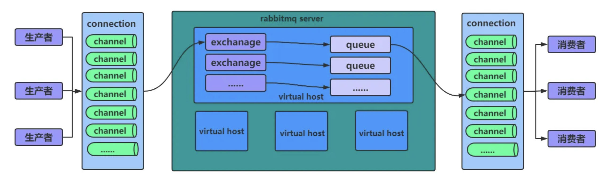

# MyBatis


## 使用分页插件pagehelper

### 一、添加 Maven 依赖

```xml
<dependency>
    <groupId>com.github.pagehelper</groupId>
    <artifactId>pagehelper-spring-boot-starter</artifactId>
</dependency>
```

### 二、配置

`pagehelper.helper-dialect` ：指定分页插件使用哪种语言。

`pagehelper.offset-as-page-num` ：默认为 `false`, 该参数对使用 `RowBounds` 作为分页参数时有效，当为 `true` 时，会将 `RowBounds` 的 `offset` 参数当成 `pageNum` 使用。

`pagehelper.row-bounds-with-count` ： 默认为 `false`，该参数对使用 `RowBounds` 作为分页参数时有效，当该参数值为 `true` 时，使用 `RowBounds` 分页会进行 `count` 查询。

`pagehelper.page-size-zero` ：默认为 `false` ，当该参数为 `true` 时，如果 `pageSize=0` 或者 `RowBounds.limit=0` 就会查询所有结果。

`pagehelper.reasonable` ：分页合理化参数，默认为 `false`，当该值为 `true`，`pageNum<=0` 默认查询第一页，`pageNum>pages` 时会查询最后一页，`false` 时直接根据参数进行查询。

`pagehelper.params` ：为了支持 `startPage(Object params)` 方法，增加该参数来配置参数映射，用于从对象中根据属性名取值，可以配置`pageNum`，`pageSize`，`pageSizeZero`，`reasonable`。不配置时的默认值为`pageNum=pageNum`，`pageSize=pageSize`，`count=countSql`，`reasonable=reasonable`，`pageSizeZero=pageSizeZero`。

`pagehelper.support-methods-arguments` ：支持通过 `Mapper` 接口参数来传递分页参数，默认为 `false`, 分页插件会从查询方法的参数中根据 `params` 配置的字段中取值，查找到合适的就进行分页。

`pagehelper.auto-runtime-dialect` ：默认为 `false`, 为 `true` 时允许在运行时根据多数据源自动识别对应的方言进行分页。

`pagehelper.close-conn` : 默认为 `true`, 当使用运行是动态数据源或者没有设置 `helperDialect` 属性自动获取数据库类型时，会自动获取一个数据库连接，通过该属性来设置是否关闭获取的这个连接，默认为 `true` 关闭，`false` 不会自动关闭。

### 三、编写 Service 接口

```java
/**
  * @param currentPage 当前页码
  * @param pageSize 一页的记录数
  * @return
  */
public PageResult<Employee> page(int currentPage, int pageSize) {
        Page<Employee> employeePage = PageHelper.startPage(currentPage,pageSize)
                .doSelectPage(() -> empMapper.getAll());
        return new PageResult<>(employeePage);
    }
```

使用 `PageHelper` 查询得到的 `Page` 对象有以下方法：

```java
// 获取当前的页码
int getPageNum()
// 获取总页数
int getPages()
// 获取总记录数
long getTotal()
// 获取当前页的记录集合
List<E> getResult()
```

# Redis


## 数据类型

**Redis 支持五种数据类型：String（字符串），List（列表），Set（集合），Hash（哈希），及  Zset（Sorted Set有序集合）**。

**String(字符串)：**`String` 是 Redis 最基本的类型。`String` 类型是二进制安全的，因此 Redis 的 `String` 可以包含任何数据，比如 `.jpg` 图片或者序列化的对象。

`String` 的数据结构为简单动态字符串(*Simple Dynamic String*)。是可以修改的字符串，内部结构类似于 Java 中的 `ArrayList`，采用预分配冗余空间的方式来减少内存的频繁分配。为当前字符串实际分配的空间一般要高于实际字符串长度。当字符串长度小于 `1M` 时，扩容都是加倍现有的空间，如果超过 `1M`，扩容时一次只会多扩 `1M` 的空间，字符串最大长度为` 512M`。

一般常用在需要计数的场景，比如用户的访问次数、热点文章的点赞转发数量等等。

**List(列表)：**Redis 的 `List` 的实现为一个双向链表。

**Set(集合)：**Redis 的 `Set` 是一个无序集合。底层为一个值为 `NULL` 的哈希表。可以基于 `Set` 轻易实现交集、并集、差集的操作。

**Hash(哈希)：**Redis 的 `Hash` 的底层是一个 `String` 类型的 `field` 和 `value` 的映射表，`Hash` 特别适合用于存储对象。

**Zset(有序集合)：**Redis 的 `Zset` 是一个有序集合，每成员都会关联一个分数(*score*)，Redis 通过分数来为集合中的成员进行从小到大的排序。`Zset` 的成员是唯一的，但分数可以重复。

`Zset` 底层使用了两种数据结构：

（1）`Hash`，`Hash` 的作用就是关联成员 `member` 和分数 `score`，保证成员 `member` 的唯一性，可以通过成员 `member` 找到相应的 `score` 。

（2）跳跃表，跳跃表的目的在于给成员 `member` 排序，根据 `score` 的范围获取成员列表。

## 发布/订阅

```shell
# 订阅给定的一个或多个频道的信息
> SUBSCRIBE channel1 [channel2 ...]
# 退订给定的频道，若没有频道被指定，则退订订阅的所有频道
> UNSUBSCRIBE [channel1 [channel2 ...]]
# 将信息推送到指定的频道
> PUBLISH channel message
```

## 事务

```shell
# 标记一个事务块的开始
> MULTI
# 执行所有事务块内的命令
> EXEC
# 取消事务，放弃执行事务块内的所有命令
> DISCARD
# 监视一个(或多个)key，如果在事务执行之前这个(或这些)key被其他命令所改动，那么事务将被打断
> WATCH key1 [key2 ...]
# 取消WATCH命令对所有key的监视
> UNWATCH
```

从输入 `MULTI` 命令开始，输入的命令都会依次进入命令队列中，但不会执行，直到输入 `EXEC` 后，Redis 才会将之前的命令队列中的命令依次执行。

组队的过程中可以通过 `DISCARD` 来放弃组队。

### 事务特性

#### **没有隔离级别**

当事务开启时，事务期间的命令并没有执行，而是加入队列。只有执行 `exec` 命令时，事务中的命令才会按照顺序一一执行。事务在执行的过程中，不会被其他客户端发送来的命令请求所打断。从而事务间就不会导致数据脏读、不可重复读、幻读，自然也就没有隔离级别。

#### **不保证原子性**

单个 Redis 命令的执行是原子性的，但 Redis 事务的执行并不是原子性的，Redis 没有在事务上增加任何维持原子性的机制。事务可以理解为一个打包的批量执行脚本，但批量指令并非原子化的操作，中间某条指令的失败不会导致前面已做指令的回滚，也不会造成后续的指令不执行。

### **事务的错误处理**

组队中某个命令出现了错误，执行时队列中所有的命令都不会被执行：

```shell
> MULTI
OK
> SET k1 v1
QUEUED
> SET k2
(error) ERR wrong number of arguments for 'set' command
> EXEC
(error) EXECABORT Transaction discarded because of previous errors.
```

如果执行阶段某个命令出现错误，则只有报错的命令不会被执行，而其他的命令都会执行，不会回滚：

```shell
> MULTI
OK
> SET k1 v1
QUEUED
> INCR k1
QUEUED
> E
1) OK
2) (error) ERR value is not an integer or out of range
```

## 持久化

Redis 提供了两种持久化方案：

* **RDB(*Redis DataBase*)** 持久化可以在指定的时间间隔内生成数据集的时间点快照(*point-in-time snapshot*)。
* **AOF(*Append Only File*)** 持久化记录服务器执行的所有写操作命令，并在服务器启动时，通过重新执行这些命令来还原数据集。AOF 文件中的命令全部以 Redis 协议的格式来保存，新命令会被追加到文件的末尾。 Redis 还可以在后台对 AOF 文件进行重写(*rewrite*)，使得 AOF 文件的体积不会超出保存数据集状态所需的实际大小。

### RDB快照

默认情况下，Redis 保存数据集快照到磁盘，名为 `dump.rdb` 的二进制文件。可以设置让Redis在 N 秒内至少有 M 次数据集改动时保存数据集，或者也可以手动调用 `SAVE` 或者 `BGSAVE` 命令。这种策略被称为快照。

快照的运作方式:

当 Redis 需要保存 `dump.rdb` 文件时， 服务器执行以下操作：

1、Redis 调用 `fork()` 创建子进程；

2、子进程将数据集写入到一个临时 RDB 文件中；

3、当子进程完成对新 RDB 文件的写入时，Redis 用新 RDB 文件替换原来的 RDB 文件，并删除旧的 RDB 文件；

这种工作方式使得 Redis 可以从写时复制(*copy-on-write*)机制中获益。

## 应用问题解决

[Redis缓存击穿、穿透、雪崩解决方案 - 简书 (jianshu.com)](https://www.jianshu.com/p/b7f822935e28)

### 缓存穿透

一般缓存处理流程：


当缓存与数据库中都不存在该数据时，由于当数据库查询不到数据就不会写入缓存，这个时候如果用户不断的恶意发起请求，就会导致这个不存在的数据每次请求都会查询 DB，请求量大的情况下，就会导致 DB 压力过大，直接崩溃。

**解决方案**

**1、对空值缓存：**如果一个查询返回的数据为空（不管是数据是否不存在），仍然把这个空结果(NULL)进行缓存，过期时间不宜设置过长，最长不超过 5 分钟。

**2、采用布隆过滤器：**将所有可能存在数据，分别通过多个哈希函数生成多个哈希值，然后将这些哈希值存到一个足够大的 Bitmaps 中，此时一个一定不存在的数据就会被这个 Bitmaps 拦截，从而减少了数据库的查询压力。

**3、 设置可访问的名单（白名单）：**使用 Bitmaps 类型定义一个可以访问的名单，名单 id 作为 Bitmaps 的偏移量，每次访问和 Bitmaps 里面的 id 进行比较，如果访问 id 不在 Bitmaps 里面，进行拦截，不允许访问。

**4、进行实时监控：**当发现 Redis 的命中率开始急速降低，需要排查访问对象和访问的数据，和运维人员配合，可以设置黑名单限制服务。

### 缓存击穿

某一个数据缓存中没有但数据库中有的数据（一般是缓存时间到期），这时由于并发用户特别多，同时读缓存没读到数据，又同时去数据库去取数据，引起数据库压力瞬间增大，严重情况下会直接崩溃。

**解决方案**

**1、预先设置热门数据：**在 Redis 高峰访问之前，把一些热门数据提前存入到 Redis 里面，加大这些热门数据 key 的时长。

**2、实时调整：**现场监控哪些数据热门，实时调整 key 的过期时长。

**3、使用排他锁：**


### 缓存雪崩

缓存中大批量的数据都到了过期时间，从而导致查询数据量巨大，引起数据库压力过大甚至崩溃。

**解决方案**

**1、构建多级缓存架构：**Nginx 缓存 + Redis 缓存 + 其他缓存（Ehcache等）。

**2、使用锁或队列：**用加锁或者队列的方式保证来保证不会有大量的线程对数据库一次性进行读写，从而避免失效时大量的并发请求落到底层存储系统上。

**3、设置过期标志更新缓存：**记录缓存数据是否过期（设置提前量），如果过期会触发通知另外的线程在后台去更新实际 key 的缓存。

**4、将缓存失效时间分散开：**可以在原有的失效时间基础上增加一个随机值，这样每一个缓存的过期时间的重复率就会降低，就很难引发集体失效的事件。

## 常用命令

在终端启动 Redis 客户端：

```shell
$ redis-cli
```

在远程服务器上执行命令：

```shell
$ redis-cli -h host -p port -a password
```

检测 Redis 服务是否启动：

```shell
> PING
PONG # 输出PONG表明服务已启动
```

查看 Redis 信息：

```shell
> INFO
```

### 库操作

```shell
# 切换到index号数据库
> SELECT <index>	
# 查看当前数据库的key的数量
> DBSIZE	
# 清空当前库
> FLUSHDB
# 清空所有库
> FLUSHALL
```

### key 操作

```shell
# 查看当前库中所有key
> KEYS *
# 判断某个key是否存在
> EXISTS <key>
# 查看指定key的类型
> TYPE <key>
# 删除指定的key 	
> DEL <key>		
# 为指定key设置过期时间
> EXPIRE <key> <seconds>
# 查看key过期剩余时间，-1表示永不过期，-2表示已过期
> TTL <key>
```

### String 操作

```shell
# 添加键值对，如果key已存在，会覆盖原value
> SET <key> <value> [可选参数]
```

可选参数：

* `NX`	只有当数据库中 `key` 不存在时，添加键值对
* `XX`    只有当数据库中 `key` 存在时，添加键值对，与 `NX` 互斥
* `EX <seconds>`    `key` 的过期时间，单位：秒
* `PX <seconds>`    `key` 的过期时间，单位：毫秒，与 `EX` 互斥

```shell
# 只有当key不存在时，添加键值对
> SETNX <key> <value>
# 添加键值对的同时，设置过期时间
> SETEX <key> <second> <value>
# 设置新值同时返回旧值
> GETSET <key> <value>
# 查询key对应的value
> GET <key>
# 将value追加到原值的末尾
> APPEND <key> <value>
# 获得key对应value的长度
> STRLEN <key>
# 将key对应value的数字值加1，只能对数字值操作，如果为空，新增值为1
> INCR <key>
# 将key对应value的数字值减1，只能对数字值操作，如果为空，新增值为-1
> DECR <key>
# 增/减key对应value的数字值，自定义增量
> INCRBY/DECRBY <key> <increment>
# 同时设置一个或多个键值对
> MSET <key1> <value1> <key2> <value2> ...
# 同时获取一个或多个value
> MGET <key1> <key2> <key3> ...
# 同时设置一个或多个键值对，当且仅当所有给定的key都不存在
> MSETNX <key1> <value1> <key2> <value2>
# 获取范围内的value，索引从0开始
> GETRANGE <key> <start> <end>
# 从起始位置开始，用value覆写key所储存的字符串值
> SETRANGE <key> <offset> <value>	
```

### List 操作

```shell
# 从左边/右边插入一个或多个value
> LPUSH/RPUSH <key> <value1> <value2> ...
# 在pivot的前面/后面插入value
> LINSERT <key> BEFORE/AFTER <pivot> <vlaue>
# 覆盖列表key的索引为index的value
> LSET <key> <index> <value>
# 从左边/右边弹出一个value，value为空时key会被清除
> LPOP/RPOP <key>
# 从key1列表右边弹出一个值，插入到key2列表左边
> RPOPLPUSH <key1> <key2>
# 从左边删除n个value（从左到右）
> LREM <key> <n> <value>
# 按照索引下标获得元素（从左到右），0 表示左边第一个，-1表示右边第一个（0 -1表示获取所有）
> LRANGE<key> <start> <stop>
# 按照索引下标获得元素（从左到右）
> LINDEX <key> <index>
# 获得列表长度
> LLEN <key>
```

### Set 操作

```shell
# 将一个或多个member加入到集合key中，已经存在的member将被忽略
> SADD <key> <member1> <member2> ...
# 取出该集合的所有member
> SMEMBERS <key>
# 判断集合key是否为含有该member，有返回1，没有返回0
> SISMEMBER <key> <member>
# 返回该集合的member个数
> CARD <key>
# 删除集合中的一个或多个member
> SREM <key> <member1> <member2> ...
# 随机从集合弹出一个member
> SPOP <key>
# 随机从集合中取出n个member，这些member不会从集合中删除
> SRANDMEMBER <key> <n>
# 把集合中一个member从一个集合移动到另一个集合
> SMOVE <source> <destination> <member> 
# 返回两个集合的交集
> SINTER <key1> <key2>
# 返回两个集合的并集
> SUNION <key1> <key2>
# 返回两个集合的差集
> SDIFF <key1> <key2>
```

### Hash 操作

```shell
# 给hash中的field赋值value
> HSET <key> <field> <value>
# 从hash中的field取出value
> HGET <key> <field>
# 批量设置hash
> HMSET <key1> <field1> <value1> <field2> <value2> ...
# 查看hash中field是否存在
> HEXISTS <key> <field>
# 查看hash中的所有field
> HKEYS <key>
# 查看hash中的所有value
> HVALS <key>
# 为hash中的field的值加上自定义增量
> HINCRBY <key> <field> <increment>
# 当且仅当field不存在时，设置hash中的field的value
> HSETNX <key> <field> <value>	
```

### Zset 操作

```shell
# 将一个或多个member和对应score加入到有序集key中
> ZADD <key> <score1> <member1> <score2> <member2> ...
# 获取有序集key中指定范围的member,WITHSCORES表示让score和member一同返回
> ZRANGE <key> <start> <stop> [WITHSCORES]
# 返回有序集key中，所有score介于min和max之间（包括等于）的value。有序集成员按score值递增（从小到大）次序排列 
> ZRANGEBYSCORE <key> <min> <max> [WITHSCORES] [LIMIT offset count]
# 同上，排列顺序为从大到小 
> ZREVRANGEBYSCORE <key> <max> <min> [WITHSCORES] [LIMIT offset count] 
# 为member的score加上增量
> ZINCRBY <key> <increment> <value>
# 删除集合中的member
> ZREM <key> <member> 	
# 统计该集合score区间内的member个数
> ZCOUNT <key> <min> <max>
# 返回member在集合中的排名，从0开始
> ZRANK <key> <member>	
```

## Q&A

### Redis除了缓存，还可以做哪些事？

1. **排行榜**，如果使用传统的关系型数据库来做，非常麻烦，而利用 Redis 的 `Zset` 数据结构能够非常方便搞定。
2. **计算器/限速器**，利用 Redis 中原子性的自增操作，可以统计类似用户点赞数、用户访问数等，这类操作如果用 MySQL，频繁的读写会带来相当大的压力；限速器比较典型的使用场景是限制某个用户访问某个 API 的频率，常用的有抢购时，防止用户疯狂点击带来不必要的压力。
3. **好友关系**，利用集合的一些命令，比如求交集、并集、差集等，可以方便搞定一些共同好友、共同爱好之类的功能。
4. **简单消息队列**，除了 Redis 自身的发布/订阅模式，也可以利用 List 来实现一个队列机制，比如到货通知、邮件发送之类的需求，不需要高可靠，但是会带来非常大的 DB 压力，完全可以用 list 来完成异步解耦。
5. **Session 共享**，以 PHP 为例，默认 Session 是保存在服务器的文件中，如果是集群服务，同一个用户过来可能落在不同机器上，这就会导致用户频繁登陆；采用 Redis 保存 Session 后，无论用户落在那台机器上都能够获取到对应的 Session 信息。

### Redis不能做哪些事？

1. 用 Redis 去保存用户的基本信息，虽然它能够支持持久化，但是它的持久化方案并不能保证数据绝对的落地，并且还可能带来 Redis 性能下降，因为持久化太过频繁会增大 Redis 服务的压力。
2. 数据量太大、数据访问频率非常低的业务都不适合使用 Redis，数据太大会增加成本，访问频率太低，保存在内存中纯属浪费资源。

### Redis为什么这么快？

1、Redis 是一款纯内存结构，避免了磁盘 I/O 等耗时操作。

2、Redis 命令处理的核心模块为单线程，减少了锁竞争，以及频繁创建线程和销毁线程的代价，减少了线程上下文切换的消耗。

3、采用了 I/O 多路复用机制，大大提升了并发效率。

### Redis是单线程还是多线程？

Redis 基于 Reactor 模式开发了自己的网络事件处理器：这个处理器被称为文件事件处理器(*file event handler*)。文件事件处理器是单线程方式运行的，所以一般都说 Redis 是单线程模型。

文件事件处理器使用 I/O 多路复用程序来同时监听多个套接字(*socket*)，并根据套接字目前执行的任务来为套接字关联不同的事件处理器。当被监听的套接字准备好执行连接应答(accept)、读取(read)、写入(write)、关闭(close)等操作时，与操作相对应的文件事件就会产生，这时文件事件处理器就会调用套接字之前关联好的事件处理器来处理这些事件。

 I/O 多路复用技术的使用让 Redis 不需要额外创建多余的线程来监听客户端的大量连接，降低了资源的消耗（和 NIO 中的 `Selector` 组件很像）。

虽然文件事件处理器以单线程方式运行，但通过使用 I/O 多路复用程序来监听多个套接字，文件事件处理器既实现了高性能的网络通信模型，又可以很好地与 Redis 服务器中其他同样以单线程方式运行的模块进行对接，这保持了 Redis 内部单线程设计的简单性。

### Redis的过期键的删除策略

[Redis过期键删除策略 - 简书 (jianshu.com)](https://www.jianshu.com/p/406edc497d75)

#### 保存键过期时间

redisDb 结果的 expires 字典保存了数据库中所有键的过期时间，称这个字典为过期字典

- 过期字典的键是一个指针，这个指针指向键空间的某个键对象
- 过期字典的值是一个 long long 类型的证书，用于保存毫秒精度的 UNIX 时间戳

#### 定时删除

 在设置键的过期时间的同时，创建一个定时器，让定时器执行对键的删除操作。

定时删除策略对内存最友好，通过使用定时器，定时删除策略可以保证键在过期时间一定会被删除，删除后就释放该键之前占用的内存。但是，定时删除策略的缺点是，它对 CPU 时间是最不友好的，在过期键比较多的情况下，删除过期键这一行为可能会占用相当一部分 CPU 时间，在内存不紧张但是 CPU 时间非常紧张的情况下，将大量 CPU 时间浪费在删除过期的策略上，而不是用在处理客户端的请求上，毫无疑问是不行的。

#### 惰性删除

每次取的时候先判断 expires 对象里面的键是否已经过期，如果过期，则删除键，否则，返回该键。

通过定时删除的描述，你可能会想那用惰性删除就最好了，这样就不会浪费 CPU 时间，每次取数据的时候才判断，如果过期才删除它，这样就能腾出大量的 CPU 去处理客户端请求了。然而，这对内存却又是最不友好的，因为这种策略并不能保证所有键一定会访问到，比如说一些取得并不频繁的数据，就会大量堆积在内存中，如果这些内存得不到释放，可想而知后果是多么严重。

#### 定期删除

 每隔一段时间，程序对数据库遍历检查一遍，然后删除过期的键。

定期策略每隔一段时间执行一次删除过期的操作，并通过限制删除操作执行的时长和频率来减少删除操作对 CPU 时间的影响。定期删除过期键能有效的减少过期键而造成的内存浪费，但是，这个问题点在于如何设定删除操作执行的时长和频率？设置的太频繁吧，就又跟定时删除一样，浪费大量 CPU，设置得长一点吧，这又可能出现内存大量堆积。

#### Redis所使用的过期删除策略

Redis实际上使用的是惰性删除和定期删除两种策略，通过配合使用，服务器可以很好的平衡 CPU 和内存。

**惰性删除策略的实现**

每次取数据的时候都会调用过滤函数(db.c/expireIfNeeded)，该函数主要用来判断键是否

过期，如果过期，则删除键，否则，则取得对应键的值。

**定期删除键的策略实现**

过期键的定期删除策略由 `redis.c/activeExpireCycle` 函数实现，每当 Redis 的服务器周期性操作 `redis.c/serverCron` 函数执行时， `activeExpireCycle` 函数就会被调用，它在规定的时间内分多次遍历服务器的各个数据库，检查数据库的 expires 字典中部分键(相当于分页查询)的过期时间，并删除它。步骤如下：

- 函数每次运行时，都从一定数量的数据库取出一定数量的随机键进行检查，并删除其中的过期键。
- 全局变量 `current_db` 会记录当前 `activeExpireCycle` 函数的检查进度，并在下一次 `activeExpireCycle` 调用时，接着上一次的进度进行处理。
- 随着 `activeExpireCycle` 函数的不断执行，服务器中的所有数据库都会被检查一遍，当到达最后时，把 `current_db` 设置为 0，然后又重新开始，如此循环下去。

# RabbitMQ


> RabbitMQ 是一款使用 Erlang 语言开发的，实现 AMQP(高级消息队列协议) 的开源消息队列。
>
> AMQP(Advanced Message Queuing Protocol)是一种开放式的、标准化的消息传递协议，用于在分布式系统中进行消息传递和通信。
>
> 消息队列(Message Queue)是在消息的传输过程中保存消息的容器。

## RabbitMQ架构



- `Producer`：生产者，发布消息到 RabbitMQ 中的 Exchange 上；
- `Consumer`：消费者，消费 Queue 中存储的消息；
- `Broker(Rabbitmq Server)`：用于接收和分发消息，接受客户端的连接，实现 AMQP 实体服务；
- `Virtual Host`：虚拟主机，用于逻辑隔离。一个虚拟主机里面可以有若干个 Exchange 和 Queue，同一个虚拟主机里面不能有相同名称的 Exchange 或 Queue；
- `Connection`：连接，生产者/消费者与 Broker 之间的 TCP 网络连接；
- `Channel`：网络信道，如果每一次访问 RabbitMQ 都建立一个 Connection，在消息量大的时候建立连接的开销将是巨大的，效率也较低。Channel 是在 Connection 内部建立的逻辑连接，如果应用程序支持多线程，通常每个 thread 创建单独的 Channel 进行通讯，AMQP method 包含了 channel id 帮助客户端和 message broker 识别 Channel，所以 Channel 之间是完全隔离的。Channel 作为轻量级的 Connection 极大减少了操作系统建立 TCP connection 的开销；
- `Message`：消息，服务与应用程序之间传送的数据，由 Properties 和 Body 组成，Properties 可是对消息进行修饰，比如消息的优先级，延迟等高级特性，Body则就是消息体的内容；
- `Routing key`：是一个路由规则，虚拟机可以用它来确定如何路由一个特定消息；
- `Exchange`：交换机，是 Message 到达 Broker 的第一站，用于根据分发规则、匹配查询表中的 Routing key，分发消息到 Queue 中去，不具备消息存储的功能；
- `Queue`：消息队列，保存消息并将它们转发给消费者进行消费；
- `Bindings`：Exchange 和 Queue 之间的虚拟连接，Binding 中可以包含 Routing key，Binding 信息被保存到 Exchange 中的查询表中，用于 Message 的分发依据。

### 工作流程

AMQP 协议模型由三部分组成：生产者、消费者和服务端，执行流程如下：

1. 生产者连接到 Server，建立一个连接，开启一个信道；
2. 生产者声明交换器和队列，设置相关属性，并通过路由键将交换器和队列进行绑定；
3. 消费者也需要进行建立连接，开启信道等操作，便于接收消息；
4. 生产者发送消息，发送到服务端中的虚拟主机；
5. 虚拟主机中的交换器根据路由键选择路由规则，发送到不同的消息队列中；
6. 订阅了消息队列的消费者就可以获取到消息，进行消费。

### 常用交换机

* Direct Exchange：直连交换机，此交换机需要绑定一个队列，要求该消息与一个特定的路由键完全匹配。简单点说就是一对一的，点对点的发送；

* Fanout Exchange：这种类型的交换机需要将队列绑定到交换机上。一个发送到交换机的消息都会被转发到与该交换机绑定的所有队列上。很像子网广播，每台子网内的主机都获得了一份复制的消息。简单点说就是发布订阅；

* Topic Exchange：这种交换机是使用通配符去匹配，路由到对应的队列。通配符有两种：`*` 、 `#`，需要注意的是通配符前面必须要加上 `.` 符号；
  - `*` 符号：有且只匹配一个词。比如 `a.*` 可以匹配到 `a.b`、`a.c`，但是匹配不了 `a.b.c`；
  - `#` 符号：匹配一个或多个词。比如 `rabbit.#` 既可以匹配到 `rabbit.a`、`rabbit.a.b`，也可以匹配到 `rabbit.a.b.c`。

## TTL

> 默认情况下，消息是不会过期的，也就是平时发送消息时，如果不设置任何消息过期的相关参数，那么消息是不会过期的，即使消息没被消费掉，也会一直存储在队列中。

TTL（Time-To-Live），消息存活的时间，是一条消息在队列中的最大存活时间。如果希望消息能够有一个存活时间，那么可以通过设置 TTL 来实现这一需求。如果消息的存活时间超过了 TTL 并且还没有被消费，此时消息就会变成死信，自动清除。

TTL 的设置有两种不同的方式：

1. 在声明队列的时候，可以在队列属性中设置消息的有效期，这样所有进入该队列的消息都会有一个相同的有效期；
2. 在发送消息的时候设置消息的有效期，每条消息的过期时间可以不同，如果在队列中设置了消息的有效期，则过期时间以两者中较小的那个数值为准；

还有一种特殊情况，就是将消息的过期时间 TTL 设置为 0，这表示如果消息不能立马消费则会被立即丢掉。

## 死信队列

当消息在一个队列中变成死信之后，它能被重新发送到另一个交换机中，这个交换机称为死信交换机(Dead-Letter-Exchange DLX)，与该交换机绑定的队列称为死信队列。一般消息变成死信消息有如下几种情况：

- 消息被拒绝；
- 消息过期；
- 队列达到最大长度。

DLX 也是一个普通的交换机，可以为任意队列指定 DLX。当这个队列中有死信的时候，RabbitMQ 会自动将这个消息重新发送到设置的DLX 上，进而被路由到另一个队列，可以监听这个队列中消息做相应的处理。

死信队列有什么用？当发生异常的时候，消息不能够被消费者正常消费，被加入到了死信队列中。后续的程序可以根据死信队列中的内容分析当时发生的异常，进而改善和优化系统。

## 消息确认

mq 通常被用来进行系统解耦，限流削峰等。若 mq 中的一条消息，对应了一个耗时任务。那么当一个消费者获取到一条消息后，会执行该耗时任务，如果消费者拿到该任务，但是在执行过程中出错了，或者该消费者宕机了，那该耗时任务实际就没有被执行成功，也就是该消息实际是丢失掉了。

为了防止消息丢失，rabbitmq 提供了一种消息确认机制，即当 rabbbitmq 把某条消息推送给某消费者后，还需要该消费者返回一个 `ack` 信号给到 rabbitmq，随后 rabbitmq 才会将该消息安全的删除掉。若 rabbitmq 将某条消息推送给某消费者，该消费者还没有返回 `ack` 信号（有一个超时时间的配置，`Delivery Acknowledgement Timeout`，默认是 30 分钟），消费者和 rabbitmq 的连接就断掉了，那么 rabbitmq 会将该条消息重新推送给另外的消费者进行处理。

当消费者发送一个 `ack` 信号给 rabbitmq，就是告诉 rabbitmq，某个特定的消息已经被接收并处理完毕，rabbitmq 可以删除该条消息了。

特别注意：某条消息的 `ack` 信号，必须由接收该条消息的 `channel` 发出。若尝试使用不同的 `channel` 发送 `ack` 信号， 则会报异常(channel-level protocol exception)。

### basicAck

`basicAck` 主要用于标识消息已被消费并成功处理，通常在消息处理方法中的最后调用。

```java
void basicAck(long deliveryTag, boolean multiple) throws IOException;
```

- `deliveryTag`：要确认的消息的唯一标识符；
- `multiple`：一个布尔值，表示是否批量确认。如果设置为 `true`，则表示确认所有比 `deliveryTag` 小或等于 `deliveryTag` 的消息。如果设置为 `false`，则只确认指定 `deliveryTag` 的消息。

> 注意：
>
> - 使用 `basicAck` 确认消息后，消息将被标记为已传递，从队列中删除。因此，在调用此方法之前，请确保已经成功处理了消息，以避免消息丢失；
> - 如果消息消费者没有确认消息，消息将一直保留在队列中，直到被确认或者超过了消息的 TTL（如果设置了 TTL）；
> - 如果消息消费者在确认消息之前断开连接，RabbitMQ 会将这些未确认的消息重新投递给其他消费者（如果有）或者放回队列中等待下一次传递。

### basicNack

`basicNack` 是 RabbitMQ 中的 AMQP 方法之一， 主要用于处理消息处理失败的情况。如果在消息处理期间发生异常或者消息不可接受，可以使用 `basicNack` 将消息拒绝并选择是否重新入队。

```java
void basicNack(long deliveryTag, boolean multiple, boolean requeue) throws IOException;
```

- `deliveryTag`：要拒绝的消息的唯一标识符；
- `multiple`：一个布尔值，表示是否批量拒绝。如果设置为 `true`，则表示拒绝所有比 `deliveryTag` 小或等于 `deliveryTag` 的消息。如果设置为 `false`，则只拒绝指定 `deliveryTag` 的消息；
- `requeue`：一个布尔值，表示是否将被拒绝的消息重新放回队列中。如果设置为 `true`，被拒绝的消息将重新入队。如果设置为 `false`，消息将被丢弃。

### basicReject

`basicReject` 主要用于拒绝单个消息，并且不支持批量拒绝。它通常用于处理特定消息的失败情况。

```java
void basicReject(long deliveryTag, boolean requeue) throws IOException;
```

- `deliveryTag`：要拒绝的消息的唯一标识符；
- `requeue`：一个布尔值，表示是否将被拒绝的消息重新放回队列中。如果设置为 `true`，被拒绝的消息将重新入队。如果设置为 `false`，消息将被删除。

## 消息持久化

上面的消息确认机制，保证了在消费者异常（宕机等）时，消息不会丢失。但如果 rabbitmq 服务自身宕机了呢？这就涉及到另一个机制，消息持久化(Message Durability)。

若 rabbitmq 退出或者崩溃了，它会丢失所有的队列和消息，除非显式地将队列和消息标记为可持久化(durable)。

## 延迟队列

> 延迟队列的一些业务场景：
>
> - 订单业务： 在电商/点餐中，下单后 30 分钟内没有付款就自动取消订单；
> - 短信通知： 下单成功后 60s 之后给用户发送短信通知；
> - 失败重试： 业务操作失败后，间隔一定的时间进行失败重试。
>
> 这类业务的特点就是：非实时的，需要延迟处理，需要进行失败重试。

### 使用插件实现

#### 插件下载与安装

1、前往 RabbitMQ 官网下载 `rabbitmq_delayer_message_exchange` 插件：https://www.rabbitmq.com/community-plugins.html，注意插件版本号与 RabbitMQ 版本号对应；

2、RabbitMQ官网指示安装插件步骤的网址：https://www.rabbitmq.com/installing-plugins.html，以 `Ubuntu` 为例，将插件文件放在 ` /usr/lib/rabbitmq/lib/rabbitmq_server-xxx/plugins/` 路径下；

3、输入以下命令安装插件：

```shell
sudo rabbitmq-plugins enable rabbitmq_delayed_message_exchange
```

4、重启 RabbitMQ 服务：

```shell
systemctl restart rabbitmq-server.service
```

5、查看插件是否安装成功：进入 RabbitMQ 管理页面，进入 Exchange 管理页面，新增 Exchange，在 Type 里面可以看到 `x-delayed-message` 的选项，证明延迟队列插件安装成功。

#### 代码实现(SpringBoot)

提供一个配置类：

```java
@Configuration
public class DelayQueueConfig {

    public static final String QUEUE_NAME = "delayQueue";
    public static final String EXCHANGE_NAME = "delayExchange";
    public static final String EXCHANGE_TYPE = "x-delayed-message";

    @Bean
    Queue queue() {
        return new Queue(QUEUE_NAME, true, false, false);
    }

    @Bean
    CustomExchange customExchange() {
        Map<String, Object> args = new HashMap<>();
        args.put("x-delayed-type", "direct");
        return new CustomExchange(EXCHANGE_NAME, EXCHANGE_TYPE, true, false,args);
    }

    @Bean
    Binding binding() {
        return BindingBuilder.bind(queue())
                .to(customExchange()).with(QUEUE_NAME).noargs();
    }
}
```

`CustomExchange` 是一个 Spring 提供的交换机，创建 `CustomExchange` 时有五个参数，含义分别如下：

1. 交换机名称
2. 交换机类型
3. 交换机是否持久化
4. 如果没有队列绑定到交换机，交换机是否删除
5. 其他参数，最后一个 `args` 参数中，指定了交换机消息分发的类型，这个类型就是 `direct、fanout、topic 、header` 几种

提供一个消费者：

```java
@Slf4j
@Component
public class DelayQueueConsumer {
    
    @RabbitListener(queues = DelayQueueConfig.QUEUE_NAME)
    public void handleMsg(String msg) {
        log.info("handleMsg,{}",msg);
    }
}
```

提供一个生产者：

```java
Message msg = MessageBuilder.withBody(("hello delayQueue!"+ new Date()).getBytes(StandardCharsets.UTF_8)).setHeader("x-delay", 5000).build();
        rabbitTemplate.convertAndSend(DelayQueueConfig.EXCHANGE_NAME, DelayQueueConfig.QUEUE_NAME, msg);
```

在消息头中设置消息的延迟时间。

启动 SpringBoot 项目，从日志中可以看到消息延迟已经实现了。

### 使用死信队列实现

## 消息发送可靠性

### RabbitMQ 消息发送流程

RabbitMQ 中的消息发送引入了交换机(Exchange)的概念，发送的消息首先到达交换机上，然后再根据既定的路由规则，由交换机将消息路由到不同的队列(Queue)中，再由不同的消费者去消费。

所以要确保消息发送的可靠性，主要从两方面去确认：

1. 消息成功到达 Exchange
2. 消息成功到达 Queue

如果能确认这两步，那么就可以认为消息发送成功了。

如果这两步中任一步骤出现问题，那么消息就没有成功送达，此时可能要通过重试等方式去重新发送消息，多次重试之后，如果消息还是不能到达，则可能就需要人工介入了。

经过分析，可以确认，要确保消息成功发送，需要做以下几件事：

1. 确认消息到达 Exchange
2. 确认消息到达 Queue
3. 开启定时任务，重新发送那些发送失败的消息

### RabbitMQ 的解决方案

如何确保消息成功到达 RabbitMQ？RabbitMQ 给出了两种方案：

1. 开启事务机制
2. 发送方确认机制

这是两种不同的方案，不可以同时开启，只能选择其中之一，如果两者同时开启，则会报错。

#### 开启事务机制(SpringBoot)

首先需要先提供一个事务管理器：

```java
@Bean
RabbitTransactionManager transactionManager(ConnectionFactory connectionFactory) {
    return new RabbitTransactionManager(connectionFactory);
}
```

接下来，在消息生产者上面做两件事：添加事务注解，设置通信信道为事务模式：

```java
@Service
public class MsgService {
    @Autowired
    RabbitTemplate rabbitTemplate;

    @Transactional
    public void send() {
        // 开启事务模式
        rabbitTemplate.setChannelTransacted(true);
        rabbitTemplate.convertAndSend(TransactionalConfig.DIRECT_EXCHANGE_NAME,TransactionalConfig.ROUTING_KEY,
                                      "hello world!".getBytes());
        int i = 1 / 0;
    }
}
```

在上面的例子中，结尾运算 `int i = 1 / 0` 在运行时必然抛出异常，尝试调用该方法，发现消息并未发送成功。

当开启事务模式之后，RabbitMQ 生产者发送消息会多出一些步骤：

1. 客户端发出请求，将信道设置为事务模式
2. 服务端给出回复，同意将信道设置为事务模式
3. 客户端发送消息
4. 客户端提交事务
5. 服务端给出响应，确认事务提交

开启事务会增加一些性能开销，因此 RabbitMQ 还提供了发送方确认机制(publisher confirm)来确保消息发送成功，相比于事务，这种模式下的消息吞吐量会得到极大的提升。

#### 发送方确认机制(SpringBoot)

在 `application.properties` 中配置开启消息发送方确认机制：

```properties
# 配置消息到达交换器的确认回调
spring.rabbitmq.publisher-confirm-type=correlated
# 开启消息到达队列的回调
spring.rabbitmq.publisher-returns=true
```

`spring.rabbitmq.publisher-confirm-type` 的配置有以下取值：

1. `none`：表示禁用发布确认模式（默认）。
2. `correlated`：表示成功发布消息到交换器后会触发的回调方法。
3. `simple`：类似 `correlated`，并且支持 `waitForConfirms()` 和 `waitForConfirmsOrDie()` 方法的调用。

提供一个配置类：

```java
@Slf4j
@Configuration
public class PublisherConfirmConfig implements RabbitTemplate.ConfirmCallback, RabbitTemplate.ReturnsCallback {

    public static final String EXCHANGE_NAME = "amq.direct";
    public static final String QUEUE_NAME = "directQueue";
    public static final String ROUTING_KEY = "directRoutingKey";

    @Resource
    RabbitTemplate rabbitTemplate;

    @Bean
    Queue directQueue() {
        return new Queue(QUEUE_NAME);
    }

    @Bean
    DirectExchange directExchange() {
        return new DirectExchange(EXCHANGE_NAME);
    }

    @Bean
    Binding binding(@Qualifier("directQueue")Queue queue,@Qualifier("directExchange")DirectExchange directExchange) {
        return BindingBuilder.bind(queue)
                .to(directExchange)
                .with(ROUTING_KEY);
    }

    @PostConstruct
    public void initRabbitTemplate() {
        rabbitTemplate.setConfirmCallback(this);
        rabbitTemplate.setReturnsCallback(this);
    }

    /* 当消息成功到达交换器并被路由到队列时，RabbitMQ 会将确认消息发送回生产者，生产者可以通过实现 ConfirmCallback 接口来处理这些确认消息。*/
    @Override
    public void confirm(CorrelationData correlationData, boolean ack, String cause) {
        // 若消息未成功路由到队列，则correlationData.getReturned()为null
        if (ack && correlationData.getReturned() == null) {
            log.info("{}:消息成功到达交换机",correlationData.getId());
        }else{
            log.error("{}:消息发送失败", correlationData.getId());
        }
    }

    /* 当使用 RabbitMQ 发送消息时，如果消息未被正确路由到队列（可能由于没有匹配的交换器或路由键），RabbitMQ 会将消息返回给生产者。此时就会触发 ReturnsCallback 中的回调方法。*/
    @Override
    public void returnedMessage(ReturnedMessage returned) {
        log.error("{}:消息未成功路由到队列",returned.getMessage().getMessageProperties().getMessageId());
    }
}
```

接下来对消息发送进行测试。首先尝试将消息发送到一个不存在的交换机中，像下面这样：

```java
rabbitTemplate.convertAndSend("PublisherConfirmConfig.EXCHANGE_NAME",PublisherConfirmConfig.ROUTING_KEY,"hello publisherConfirm!".getBytes(),new CorrelationData(UUID.randomUUID().toString()));
```

注意第一个参数对应的交换器不存在，此时控制台会报错。

接下来给定一个真实存在的交换器，但是给一个不存在的队列，像下面这样：

```java
rabbitTemplate.convertAndSend(PublisherConfirmConfig.EXCHANGE_NAME,"PublisherConfirmConfig.ROUTING_KEY","hello publisherConfirm!".getBytes(),new CorrelationData(UUID.randomUUID().toString()));
```

注意此时第二个参数对应的队列不存在。可以看到，消息虽然成功达到交换器了，但是没有成功路由到队列（因为队列不存在）。

#### 失败重试

失败重试分两种情况，一种是没找到 MQ 导致的失败重试，另一种是找到 MQ 了，但是消息发送失败了。

##### Spring Boot自带重试机制

前面所说的事务机制和发送方确认机制，都是发送方确认消息发送成功的办法。如果发送方一开始就连不上 MQ，Spring Boot 中有相应的重试机制，但是这个重试机制就和 MQ 本身没有关系了，这是利用 Spring 中的 retry 机制来完成的，具体配置如下：

```properties
# 开启重试机制
spring.rabbitmq.template.retry.enabled=true
# 重试起始间隔时间
spring.rabbitmq.template.retry.initial-interval=1000ms
# 最大重试次数
spring.rabbitmq.template.retry.max-attempts=10
# 最大重试间隔时间
spring.rabbitmq.template.retry.max-interval=10000ms
# 间隔时间乘数（这里配置间隔时间乘数为 2，则第一次间隔时间 1 秒，第二次重试间隔时间 2 秒，第三次 4 秒，以此类推）
spring.rabbitmq.template.retry.multiplier=2
```

配置完成后，启动 Spring Boot 项目，然后关掉 MQ，此时尝试发送消息，就会发送失败，进而导致自动重试。

##### 业务重试

业务重试主要是针对消息没有到达交换器的情况。如果消息没有成功到达交换器，会触发消息发送失败回调，可以在这个回调中进行一些处理。

整体思路如下：

1、首先创建一张表，用来记录发送信息到中间件的日志：

```mysql
CREATE TABLE `mq_log`  (
  `id` bigint NOT NULL AUTO_INCREMENT,
  `msg_id` varchar(255) CHARACTER SET utf8mb4 COLLATE utf8mb4_0900_ai_ci NULL DEFAULT NULL,
  `status` tinyint NULL DEFAULT NULL,
  `route_key` varchar(255) CHARACTER SET utf8mb4 COLLATE utf8mb4_0900_ai_ci NULL DEFAULT NULL,
  `exchange` varchar(255) CHARACTER SET utf8mb4 COLLATE utf8mb4_0900_ai_ci NULL DEFAULT NULL,
  `count` tinyint NULL DEFAULT NULL,
  `try_time` datetime NULL DEFAULT NULL,
  `create_time` datetime NULL DEFAULT NULL,
  `update_time` datetime NULL DEFAULT NULL,
  PRIMARY KEY (`id`) USING BTREE
) ENGINE = InnoDB CHARACTER SET = utf8mb4 COLLATE = utf8mb4_0900_ai_ci ROW_FORMAT = Dynamic;
```

* `status`：表示消息的状态，有三个取值：`0，1，2`，分别表示消息发送中，消息发送成功，消息发送失败。
* `count`：表示消息重试次数。
* `try_time`：表示消息的第一次重试时间（消息发出去之后，在 `try_time` 这个时间点还未显示发送成功，此时开始重试）。

2、在消息发送的时候，往该表中保存一条消息发送记录，并设置状态 `status` 和 `count` 为 `0`。

3、在 `confirm` 回调方法中，判断消息是否发送成功，成功就将该条消息的 `status` 设置为 `1`（在消息发送时为消息设置 `msgId`，在消息发送成功回调时，通过 `msgId` 来唯一锁定该条消息），失败则将该条消息的 `try_time` 为 `1` 分钟之后。

4、另外开启一个定时任务，定时任务每隔 10s 就去数据库中读取那些 `status` 为 `0` 并且已经过了 `try_time` 的记录，读取这些消息后，首先判断其重试次数是否已超过 3 次，如果超过 3 次，则修改该条消息的 `status` 为 `2`，表示这条消息发送失败，并且不再重试。对于重试次数没有超过 3 次的记录，则重新去发送消息，并且为其 `count` 的值 +1。

这种思路有也有一些弊端：

1. 从数据库读取数据，可能拖慢 MQ 的 Qos，不过有的时候并不需要 MQ 有很高的 Qos，所以这个应用时要看具体情况。
2. 按照上面的思路，可能会出现同一条消息重复发送的情况，需要在消费消息时解决好幂等性问题。


